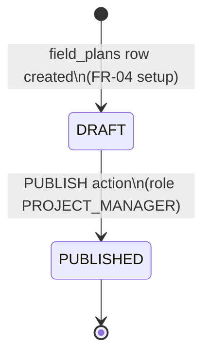
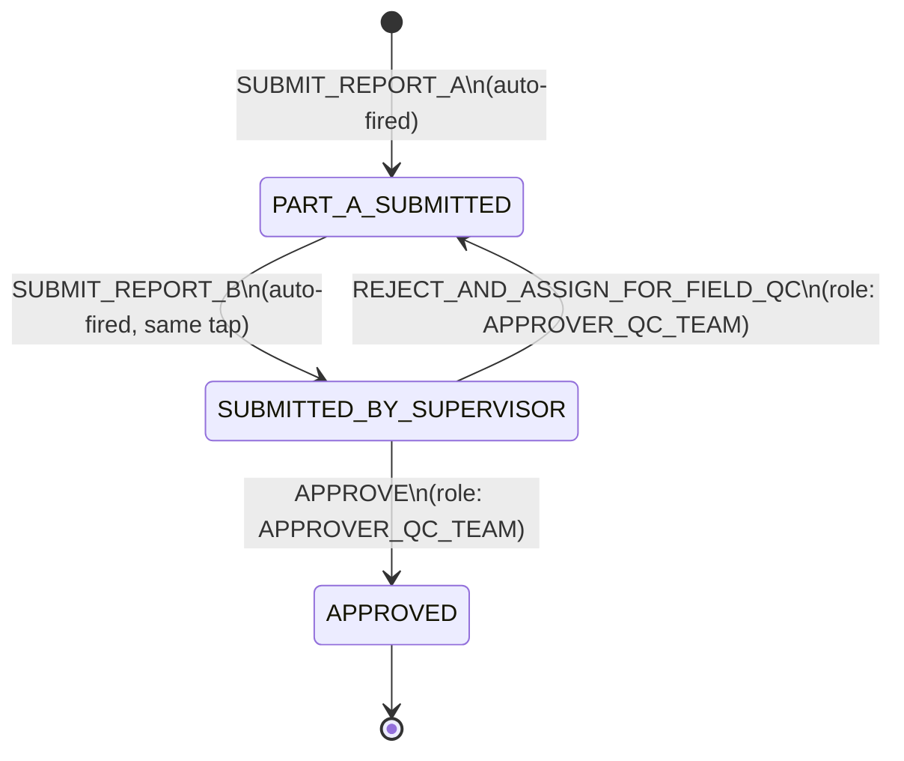

# Livelihood Installation App — Business Service Design

Companion doc to `Livelihood_Installation_LLD.md` (§3.7 "`egov-workflow-v2` — one new business service; IC Report review reuses an existing one"). This doc goes one level deeper than that section: it specifies the actual `BusinessService`/`State`/`Action` configuration — in the exact shape `egov-workflow-v2` expects — for both business services this feature touches, one **new** and one **existing/reused**.

**Scope:** workflow-engine configuration only (states, actions, roles, SLA, registration payloads) and the process-instance/notification wiring around it. Table schemas, Excel flows, and non-workflow services are covered in the LLD; this doc doesn't repeat them except where needed to explain a transition.

---

## 1. What a Business Service is, in this platform

`egov-workflow-v2` (generic DIGIT core service, reused as-is — see LLD §1.1) is a config-driven state machine. A **Business Service** is one registered state machine definition:

```
BusinessService
├── businessService   (string)  — unique name, e.g. "INSTALLATION_PLAN"
├── business           (string)  — owning microservice, e.g. "field-planner"
├── businessServiceSla (long?)   — overall SLA in ms across the whole flow, null if unused
└── states[]
    ├── state              (string?) — null only for the synthetic start state
    ├── applicationStatus  (string?) — the status value written back onto the owning entity
    ├── sla                (long?)   — per-state SLA in ms, null if unused
    ├── isStartState / isTerminateState / isStateUpdatable / docUploadRequired
    └── actions[]
        ├── action     (string) — e.g. "PUBLISH"
        ├── nextState  (string) — state this action transitions to
        └── roles[]    (string[]) — HRMS role codes allowed to fire this action
```

Every entity that goes through a workflow carries a `businessId` (the id of the row being tracked, e.g. `field_plans.id` or `bom.id`) plus the `businessService` name, and calls `POST /egov-workflow-v2/egov-wf/process/_transition` to move between states. This is the same mechanism `field-planner`/`field-planner-activity` already call today via `egov.workflow.transition.path` (`application.properties`, both services).

Field/model names above come directly from this repo's `egov-workflow-v2` models (`BusinessService.java`, `State.java`, `Action.java`) — the JSON blocks below are shaped to match those exactly, so they're directly usable as a `POST /egov-workflow-v2/egov-wf/businessservice/_create` payload (wrapped in a `RequestInfo` + `BusinessServices: [...]`, per the existing convention in `im-services`' `workflowConfig.json`).

Two business services are relevant to this feature (LLD §3.7):

| Business Service | Status | Owning table | Owning service |
|---|---|---|---|
| `INSTALLATION_PLAN` | **New** — must be registered | `field_plans` | `field-planner` |
| `FACILITY_INSTALLATION` | **Existing, already live** — reused as-is, no new registration | `bom` | `field-planner-activity` |

---

## 2. `INSTALLATION_PLAN` (new) — Installation Plan publish (FR-09)

> **PRD basis:** §7.3 FR-09 *"Publish Installation Plan"*; §12.1 Appendix Figure 3 (Project Manager workflow, step 8).

A deliberately minimal two-state machine: a Plan is a silent `DRAFT` the Project Manager alone can see and edit through every prior step (geography, Solution assignment, Vendor assignment, Template), and a single `PUBLISH` action makes it live — irreversible, per the PRD's Publish confirmation modal ("Once this Installation Plan is submitted, you won't be able to add any new end-user sites"). No intermediate states: the PRD's five-step sequence (setup → scope → vendor → template → publish) is enforced by **API-layer sequencing/validation** (LLD §3.2 draft-persistence note, PRD §7.3's Publish-validation checklist), not by separate workflow states — none of those intermediate steps are actor handoffs requiring role-gated transitions, they're all still the same Project Manager working through one form.

### 2.1 Registration payload

```json
{
  "BusinessServices": [
    {
      "tenantId": "in",
      "businessService": "INSTALLATION_PLAN",
      "business": "field-planner",
      "businessServiceSla": null,
      "states": [
        {
          "state": null,
          "applicationStatus": "DRAFT",
          "sla": null,
          "docUploadRequired": false,
          "isStartState": true,
          "isTerminateState": false,
          "isStateUpdatable": true,
          "actions": [
            {
              "action": "PUBLISH",
              "nextState": "PUBLISHED",
              "roles": ["PROJECT_MANAGER"]
            }
          ]
        },
        {
          "state": "PUBLISHED",
          "applicationStatus": "PUBLISHED",
          "sla": null,
          "docUploadRequired": false,
          "isStartState": false,
          "isTerminateState": true,
          "isStateUpdatable": false,
          "actions": []
        }
      ]
    }
  ]
}
```

### 2.2 State diagram



### 2.3 Wiring notes

- **`businessId` = `field_plans.id`.** Per LLD §3.0/§3.2, `field_plans.id` is repurposed to hold the human-readable Plan ID (`IP-2026-001`-style) rather than a random UUID — that's still the value the workflow process instance keys on, no change needed there.
- **`applicationStatus` mirrors `field_plans.status` directly** — LLD §3.2 already established that `field_plans.status` (existing column) is reused for `DRAFT`/`PUBLISHED` rather than adding a new column; this business service is what actually drives that column once wired through `egov-workflow-v2`, instead of the field being set by ad hoc application code.
- **`PUBLISH` is gated by the Publish-validation checklist** (PRD FR-09: every included site has a Solution, every expanded row has a Vendor + Vendor Email, every unique Solution has a filled template) — this check happens in `field-planner`'s service layer *before* calling `_transition`, not as a workflow precondition; `egov-workflow-v2` itself has no concept of "validate these three other tables are complete."
- **Side effects fired alongside the transition** (not modeled as further states): set `field_plans.published_time = now()`; dispatch tasks to vendors (tasks are really just the existing `bom` rows — per FR-07 they're already vendor-assigned, "dispatch" just means they become visible/actionable to the Field Technician, LLD §3.3); email every distinct assigned Vendor Organisation (LLD §3.9 row 5, via `im-services`' `LivelihoodEmailNotificationService`).
- **⚠️ Config correction needed before implementation:** `field-planner`'s `application.properties` currently sets `egov.workflow.business.service=FACILITY_INSTALLATION` (line 103) — this is almost certainly boilerplate copied from `field-planner-activity`'s identical property (line 121) rather than a real, in-use wiring, since nothing in `field-planner` today calls `egov-workflow-v2` for `field_plans` (LLD confirms `status` is currently set directly in application code). This property needs to be corrected to `INSTALLATION_PLAN` — or better, added as a separate, explicitly-named property (e.g. `egov.workflow.business.service.installation.plan=INSTALLATION_PLAN`) if `field-planner` ever needs to call more than one business service.
- **No SLA configured.** The PRD's two "breach" notifications (Planned Installation breached, <40% complete near end date) are date/completion-percentage checks run by a separate scheduled job (LLD §3.8, `amc-scheduler-service`), not a workflow-engine SLA/escalation — `businessServiceSla`/`state.sla` are left `null` here deliberately, to avoid two competing breach-detection mechanisms.

---

## 3. `FACILITY_INSTALLATION` (existing, reused) — IC Report review (FR-11/FR-12/FR-13)

> **PRD basis:** §7.4 FR-11 *"Installation Completion Report"*; §7.5 FR-12 *"Review Queue"* and FR-13 *"Approval & Rejection"*; confirmed by the PRD's own Reviewer-workflow figure, §12.3 Appendix Figure 5.

Unlike `INSTALLATION_PLAN`, this business service is **not being created** — it already exists and is live in production today, called from `field-planner-activity`'s `FacilityWorkflowService.transitionWorkflow` and consumed by `frontend/installation-ui`'s `qc`/`fa` modules right now (LLD §3.3). No `_create`/`_update` call against `egov-workflow-v2` is needed for this feature to use it.

**Its registered state/action/role definition is not present anywhere in this repo as a static file** — unlike `INSTALLATION_PLAN` above (which this doc originates) or the *dead* `asset-installation` service (which happens to have a JSON at `docs/asset-registry/workflows/AssetInstallationWorkflow.json`, not to be confused with this one — LLD §3.3), `FACILITY_INSTALLATION`'s definition was evidently registered directly against a running `egov-workflow-v2` instance (by API call, seed script, or a config repo outside this checkout) and is only visible here indirectly, through:

- `field-planner-activity`'s `application.properties`: `egov.workflow.business.service=FACILITY_INSTALLATION`
- `ActivityConstants.java`: role `INSTALLATION_REPORT_APPROVER_QC_TEAM`, status `SUBMITTED_BY_SUPERVISOR`
- `frontend/installation-ui`'s `fa`/`qc` modules: actions `SUBMIT_REPORT_A`, `SUBMIT_REPORT_B`, `APPROVE`, `REJECT_AND_ASSIGN_FOR_FIELD_QC`, `FLAG_FOR_QC` (`useActivityDetails.js`, `useFacilityDetails.js`, `QCActions.js`)

The reconstruction below is **inferred from that evidence, not copied from a live config export** — confirm the actual registered states/roles against the target environment's `egov-workflow-v2` (`GET /egov-workflow-v2/egov-wf/businessservice/_search?businessServices=FACILITY_INSTALLATION`) before relying on exact state names for anything beyond this design.

### 3.1 Reconstructed state machine (as it exists today, before this feature)

```json
{
  "BusinessServices": [
    {
      "tenantId": "in",
      "businessService": "FACILITY_INSTALLATION",
      "business": "field-planner-activity",
      "businessServiceSla": null,
      "states": [
        {
          "state": null,
          "applicationStatus": "DRAFT",
          "isStartState": true,
          "isTerminateState": false,
          "isStateUpdatable": true,
          "actions": [
            { "action": "SUBMIT_REPORT_A", "nextState": "PART_A_SUBMITTED", "roles": ["INSTALLATION_REPORT_PART_A_EDITOR"] }
          ]
        },
        {
          "state": "PART_A_SUBMITTED",
          "applicationStatus": "PART_A_SUBMITTED",
          "isStartState": false,
          "isTerminateState": false,
          "isStateUpdatable": true,
          "actions": [
            { "action": "SUBMIT_REPORT_B", "nextState": "SUBMITTED_BY_SUPERVISOR", "roles": ["INSTALLATION_REPORT_PART_B_EDITOR"] }
          ]
        },
        {
          "state": "SUBMITTED_BY_SUPERVISOR",
          "applicationStatus": "SUBMITTED_BY_SUPERVISOR",
          "isStartState": false,
          "isTerminateState": false,
          "isStateUpdatable": true,
          "actions": [
            { "action": "APPROVE",                        "nextState": "APPROVED",                 "roles": ["INSTALLATION_REPORT_APPROVER_QC_TEAM"] },
            { "action": "REJECT_AND_ASSIGN_FOR_FIELD_QC",  "nextState": "PART_A_SUBMITTED",          "roles": ["INSTALLATION_REPORT_APPROVER_QC_TEAM"] },
            { "action": "FLAG_FOR_QC",                     "nextState": "FLAGGED_FOR_QC",            "roles": ["INSTALLATION_REPORT_APPROVER_QC_TEAM"] }
          ]
        },
        {
          "state": "FLAGGED_FOR_QC",
          "applicationStatus": "FLAGGED_FOR_QC",
          "isStartState": false,
          "isTerminateState": false,
          "isStateUpdatable": true,
          "actions": [
            { "action": "SUBMIT_REPORT_A", "nextState": "PART_A_SUBMITTED", "roles": ["INSTALLATION_REPORT_PART_A_EDITOR"] }
          ]
        },
        {
          "state": "APPROVED",
          "applicationStatus": "APPROVED",
          "isStartState": false,
          "isTerminateState": true,
          "isStateUpdatable": false,
          "actions": []
        }
      ]
    }
  ]
}
```

*(`FLAGGED_FOR_QC`'s recovery action and the exact `nextState` values are the least-certain part of this reconstruction — they're not exercised by any code path this design has inspected. Treat this box as "shape confirmed, edges approximate.")*

### 3.2 How this feature drives it — per-`bom`-row instances

Per LLD §3.3, a `facility_activity` expands into up to two `bom` rows (`asset_type = MACHINE` / `SOLAR`), and **each gets its own `FACILITY_INSTALLATION` process instance** (`businessId = bom.id`, not `facility_activity.id`) — Machine and Solar progress and are reviewed completely independently, which is what lets FR-13's per-asset O&M eligibility (§3.5) and FR-07's per-asset-type vendor assignment actually work.



*One Field Technician's single in-app Submit tap fires `SUBMIT_REPORT_A` then `SUBMIT_REPORT_B` back-to-back server-side — see §3.3 below for why.*

### 3.3 ⚠️ Confirmed mismatch vs. the PRD's actual review model — resolve before implementation

The LLD flagged this as an open question (§3.3); having now read the full PRD (§7.5 FR-13, p.14–15, and Appendix §12.3/Figure 5), the mismatch is **confirmed, not hypothetical**:

- **Submission side:** the PRD describes exactly one actor and one action — "the technician taps Submit and the report goes directly to the Reviewer's queue" (FR-11). There is no Part A / Part B concept anywhere in the PRD. `FACILITY_INSTALLATION`'s real state machine, built for an earlier two-actor model, only exposes that as two chained actions. Auto-chaining `SUBMIT_REPORT_A` → `SUBMIT_REPORT_B` behind one Submit tap (as this doc's §3.2 diagram shows) is the way to reuse the existing engine without a visible two-step artifact — but it means the Field Technician is granted **both** `INSTALLATION_REPORT_PART_A_EDITOR` and `INSTALLATION_REPORT_PART_B_EDITOR` roles, which is a role-modeling compromise, not something the PRD asked for.
- **Review side:** the PRD is explicit and detailed here (p.14–15, Figure 5) — the Reviewer marks each **section** Approve/Reject, but the **report as a whole** has exactly one action button: it reads "Approve" while no section is rejected, and switches to "Reject" the moment any section is. There is no third outcome. `FACILITY_INSTALLATION` as reconstructed above has **three** terminal-ish actions off `SUBMITTED_BY_SUPERVISOR` (`APPROVE`, `REJECT_AND_ASSIGN_FOR_FIELD_QC`, `FLAG_FOR_QC`) — a leftover from the platform's prior QC-team model, not a distinction the PRD's Reviewer makes.

**Recommendation:** proceed with the reuse (rebuilding a parallel workflow to save one extra hop is a worse trade, per LLD §1.2's core reasoning), but narrow the *exposed* surface to match the PRD exactly:
1. Field Technician's app only ever calls one endpoint/button ("Submit") — the `SUBMIT_REPORT_A`→`SUBMIT_REPORT_B` chain is entirely server-side, never a UI concept.
2. Installation Reviewer's UI only ever calls `APPROVE` or `REJECT_AND_ASSIGN_FOR_FIELD_QC` — `FLAG_FOR_QC` stays registered (removing it would touch a shared, already-live business service used by other activity types too) but is **not surfaced** in this feature's Reviewer screen; §3.9's per-section rejection reasons (`bom_section_review`) are attached to the `REJECT_AND_ASSIGN_FOR_FIELD_QC` call's comment payload, matching this doc's §3.2 diagram (which already only shows these two Reviewer actions).

This is a UI/API-surface decision, not a workflow-config change — no alteration to the already-live `FACILITY_INSTALLATION` registration is needed or proposed.

### 3.4 Role mapping (PRD role → platform role code → workflow action)

| PRD role (§5 User Roles) | Platform HRMS role code | Action(s) it triggers | Notes |
|---|---|---|---|
| Field Technician | `INSTALLATION_REPORT_PART_A_EDITOR` + `INSTALLATION_REPORT_PART_B_EDITOR` | `SUBMIT_REPORT_A` then `SUBMIT_REPORT_B` (auto-chained, §3.3) | Confirmed = the pre-seeded `activities.required_roles` value `INSTALLATION_SPOC` (LLD §3.3) — same actor, not a separate assignment mechanism. Assigned per-vendor-per-facility via `bom.vendor_org_id` → `eg_org_user`, not a plan-level `activity_assignments` row. |
| Installation Reviewer | `INSTALLATION_REPORT_APPROVER_QC_TEAM` | `APPROVE`, `REJECT_AND_ASSIGN_FOR_FIELD_QC` (both surfaced); `FLAG_FOR_QC` (registered, not surfaced — §3.3) | Assigned per-Plan via `activity_assignments` against the pre-seeded `INS` activity, role `INSTALLATION_REVIEWER` (LLD §3.2) — that HRMS role is what grants `INSTALLATION_REPORT_APPROVER_QC_TEAM` in practice. |
| Project Manager | `PROJECT_MANAGER` | `PUBLISH` (on `INSTALLATION_PLAN`, §2) | Does not participate in `FACILITY_INSTALLATION` at all — no PM-facing action in that business service. |

### 3.5 Notification hooks on state transitions

Cross-referenced from LLD §3.9 — listed here specifically by *which transition* fires them:

| Business Service | Transition | Notification fired | Recipient(s) |
|---|---|---|---|
| `INSTALLATION_PLAN` | (start) → `PUBLISHED` via `PUBLISH` | Email, once per distinct vendor | Every Vendor Organisation with ≥1 assigned task under the Plan (`bom.vendor_email`, de-duplicated) |
| `FACILITY_INSTALLATION` | (start) → `PART_A_SUBMITTED` → `SUBMITTED_BY_SUPERVISOR` via `SUBMIT_REPORT_B` | Email ×2, fired once per `bom` row's submission | Assigned Installation Reviewer for the Plan (via `activity_assignments`); Vendor (`bom.vendor_email`) |
| `FACILITY_INSTALLATION` | `SUBMITTED_BY_SUPERVISOR` → `APPROVED` via `APPROVE` | No new Email in §9's matrix — but triggers: `asset-registry` handoff (`source_bom_id`, `is_operational = true`), `installation_audit_trail` finalisation, and (once *all* `bom` rows for the parent `facility_activity` are `APPROVED`) `field_plan_facilities.lock_status = UNLOCKED` | — |

Both scheduled-job notifications (Planned Installation breach, <40% completion) are **not** transition-driven — they're periodic checks against `field_plans`/`bom` state, independent of any workflow action (LLD §3.8).

---

## 4. Summary table

| | `INSTALLATION_PLAN` | `FACILITY_INSTALLATION` |
|---|---|---|
| Status | New — must be registered | Existing, live — reused as-is |
| `business` | `field-planner` | `field-planner-activity` |
| `businessId` | `field_plans.id` | `bom.id` (one instance per asset type) |
| States | `DRAFT` → `PUBLISHED` (terminal) | `DRAFT` → `PART_A_SUBMITTED` → `SUBMITTED_BY_SUPERVISOR` → `APPROVED` (terminal), with a reject loop back to `PART_A_SUBMITTED` |
| New role codes needed | `PROJECT_MANAGER` (already exists, `ActivityConstants.PROJECT_MANAGER`) | None — all three roles already exist and are already assignable |
| Config change needed | Register business service (§2.1) + fix `field-planner`'s `application.properties` (§2.3) | None to the business service itself; UI/API surface narrowed per §3.3 |
| SLA | None configured (breach detection is a separate scheduled job, LLD §3.8) | Unchanged from today |
