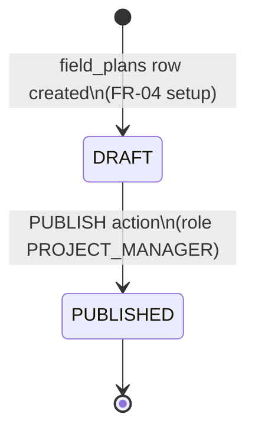
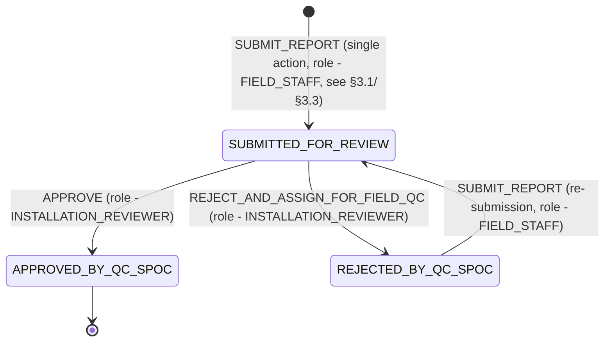

# Livelihood Installation App — Business Service Design

Companion doc to `Livelihood_Installation_LLD.md` (§3.7 "`egov-workflow-v2` — one new business service; IC Report review reuses an existing one"). This doc goes one level deeper than that section: it specifies the actual `BusinessService`/`State`/`Action` configuration — in the exact shape `egov-workflow-v2` expects — for both business services this feature touches, one **new** and one **existing/reused**.

**Scope:** workflow-engine configuration only (states, actions, roles, SLA, registration payloads) and the process-instance/notification wiring around it. Table schemas, Excel flows, and non-workflow services are covered in the LLD; this doc doesn't repeat them except where needed to explain a transition.

---

## 1. What a Business Service is, in this platform

`egov-workflow-v2` (generic DIGIT core service, reused as-is — see LLD §1.1) is a config-driven state machine. A **Business Service** is one registered state machine definition:

```
BusinessService
├── businessService   (string)  — unique name, e.g. "INSTALLATION_PLAN"
├── business           (string)  — owning microservice, e.g. "field-planner"
├── businessServiceSla (long?)   — overall SLA in ms across the whole flow, null if unused
└── states[]
    ├── state              (string?) — null only for the synthetic start state
    ├── applicationStatus  (string?) — the status value written back onto the owning entity
    ├── sla                (long?)   — per-state SLA in ms, null if unused
    ├── isStartState / isTerminateState / isStateUpdatable / docUploadRequired
    └── actions[]
        ├── action     (string) — e.g. "PUBLISH"
        ├── nextState  (string) — state this action transitions to
        └── roles[]    (string[]) — HRMS role codes allowed to fire this action
```

Every entity that goes through a workflow carries a `businessId` (the id of the row being tracked, e.g. `field_plans.id` or `bom.id`) plus the `businessService` name, and calls `POST /egov-workflow-v2/egov-wf/process/_transition` to move between states. This is the same mechanism `field-planner`/`field-planner-activity` already call today via `egov.workflow.transition.path` (`application.properties`, both services).

Field/model names above come directly from this repo's `egov-workflow-v2` models (`BusinessService.java`, `State.java`, `Action.java`) — the JSON blocks below are shaped to match those exactly, so they're directly usable as a `POST /egov-workflow-v2/egov-wf/businessservice/_create` payload (wrapped in a `RequestInfo` + `BusinessServices: [...]`, per the existing convention in `im-services`' `workflowConfig.json`).

Two business services are relevant to this feature (LLD §3.7):

| Business Service | Status | Owning table | Owning service |
|---|---|---|---|
| `INSTALLATION_PLAN` | **New** — must be registered | `field_plans` | `field-planner` |
| `FACILITY_INSTALLATION` | **Existing, already live** — reused as-is, no new registration | `bom` | `field-planner-activity` |

---

## 2. `INSTALLATION_PLAN` (new) — Installation Plan publish (FR-09)

> **PRD basis:** §7.3 FR-09 *"Publish Installation Plan"*; §12.1 Appendix Figure 3 (Project Manager workflow, step 8).

A deliberately minimal two-state machine: a Plan is a silent `DRAFT` the Project Manager alone can see and edit through every prior step (geography, Solution assignment, Vendor assignment, Template), and a single `PUBLISH` action makes it live — irreversible, per the PRD's Publish confirmation modal ("Once this Installation Plan is submitted, you won't be able to add any new end-user sites"). No intermediate states: the PRD's five-step sequence (setup → scope → vendor → template → publish) is enforced by **API-layer sequencing/validation** (LLD §3.2 draft-persistence note, PRD §7.3's Publish-validation checklist), not by separate workflow states — none of those intermediate steps are actor handoffs requiring role-gated transitions, they're all still the same Project Manager working through one form.

### 2.1 Registration payload

```json
{
  "BusinessServices": [
    {
      "tenantId": "in",
      "businessService": "INSTALLATION_PLAN",
      "business": "field-planner",
      "businessServiceSla": null,
      "states": [
        {
          "state": null,
          "applicationStatus": "DRAFT",
          "sla": null,
          "docUploadRequired": false,
          "isStartState": true,
          "isTerminateState": false,
          "isStateUpdatable": true,
          "actions": [
            {
              "action": "PUBLISH",
              "nextState": "PUBLISHED",
              "roles": ["PROJECT_MANAGER"]
            }
          ]
        },
        {
          "state": "PUBLISHED",
          "applicationStatus": "PUBLISHED",
          "sla": null,
          "docUploadRequired": false,
          "isStartState": false,
          "isTerminateState": true,
          "isStateUpdatable": false,
          "actions": []
        }
      ]
    }
  ]
}
```

### 2.2 State diagram



### 2.3 Wiring notes

- **`businessId` = `field_plans.id`.** Per LLD §3.0/§3.2, `field_plans.id` is repurposed to hold the human-readable Plan ID (`IP-2026-001`-style) rather than a random UUID — that's still the value the workflow process instance keys on, no change needed there.
- **`applicationStatus` mirrors `field_plans.status` directly** — LLD §3.2 already established that `field_plans.status` (existing column) is reused for `DRAFT`/`PUBLISHED` rather than adding a new column; this business service is what actually drives that column once wired through `egov-workflow-v2`, instead of the field being set by ad hoc application code.
- **`PUBLISH` is gated by the Publish-validation checklist** (PRD FR-09: every included site has a Solution, every expanded row has a Vendor + Vendor Email, every unique Solution has a filled template) — this check happens in `field-planner`'s service layer *before* calling `_transition`, not as a workflow precondition; `egov-workflow-v2` itself has no concept of "validate these three other tables are complete."
- **Side effects fired alongside the transition** (not modeled as further states): set `field_plans.published_time = now()`; dispatch tasks to vendors (tasks are really just the existing `bom` rows — per FR-07 they're already vendor-assigned, "dispatch" just means they become visible/actionable to the Field Technician, LLD §3.3); email every distinct assigned Vendor Organisation (LLD §3.9 row 5, via `im-services`' `LivelihoodEmailNotificationService`).
- **⚠️ Config correction needed before implementation:** `field-planner`'s `application.properties` currently sets `egov.workflow.business.service=FACILITY_INSTALLATION` (line 103) — this is almost certainly boilerplate copied from `field-planner-activity`'s identical property (line 121) rather than a real, in-use wiring, since nothing in `field-planner` today calls `egov-workflow-v2` for `field_plans` (LLD confirms `status` is currently set directly in application code). This property needs to be corrected to `INSTALLATION_PLAN` — or better, added as a separate, explicitly-named property (e.g. `egov.workflow.business.service.installation.plan=INSTALLATION_PLAN`) if `field-planner` ever needs to call more than one business service.
- **No SLA configured.** The PRD's two "breach" notifications (Planned Installation breached, <40% complete near end date) are date/completion-percentage checks run by a separate scheduled job (LLD §3.8, `amc-scheduler-service`), not a workflow-engine SLA/escalation — `businessServiceSla`/`state.sla` are left `null` here deliberately, to avoid two competing breach-detection mechanisms.

---

## 3. `FACILITY_INSTALLATION` (existing, reused) — IC Report review (FR-11/FR-12/FR-13)

> **PRD basis:** §7.4 FR-11 *"Installation Completion Report"*; §7.5 FR-12 *"Review Queue"* and FR-13 *"Approval & Rejection"*; confirmed by the PRD's own Reviewer-workflow figure, §12.3 Appendix Figure 5.

Unlike `INSTALLATION_PLAN`, this business service **already exists** — `field-planner-activity`'s `application.properties` names it, and `FacilityWorkflowService.transitionWorkflow` is a real, generic call-through to it. Its **review-side actions are confirmed live**: `frontend/installation-ui`'s `qc` module's `QCActions.js` actually fires `APPROVE`/`REJECT_AND_ASSIGN_FOR_FIELD_QC`/`FLAG_FOR_QC` today. Its **submission-side action is not confirmed live** — no current button or API call in this codebase fires an actual Submit action against this business service. So "reuse this business service" is on solid ground for the review half of this feature; the submission half is a single Submit action by role `FIELD_STAFF`, not yet confirmed against a live config — see §3.3 below. No `_create`/`_update` call against `egov-workflow-v2` is needed for this feature to use it either way.

**⚠️ Correction (2026-08-19):** the claim that this business service's definition is "not present anywhere in this repo as a static file" is **wrong** — `backend/e4h-services/im-services/src/main/resources/Selco.postman_collection.json` contains a saved "Business Service Create" request with the real registration payload, found by direct code trace. The reconstruction below has been replaced with that recovered definition. Original context, still accurate: this was evidently registered directly against a running `egov-workflow-v2` instance (by API call, seed script, or a config repo outside this checkout) and is only visible in this repo indirectly, through:

- `field-planner-activity`'s `application.properties`: `egov.workflow.business.service=FACILITY_INSTALLATION`
- `ActivityConstants.java`: role `INSTALLATION_REPORT_APPROVER_QC_TEAM` (existing constant — this design renames it to `INSTALLATION_REVIEWER`, see §3.1 below), status `SUBMITTED_BY_SUPERVISOR` (existing constant — this design renames it to `SUBMITTED_FOR_REVIEW`, see §3.1 below; there is no "Supervisor" role anywhere in this design, so the legacy name is not carried forward)
- `frontend/installation-ui`'s `qc` module: actions `APPROVE`, `REJECT_AND_ASSIGN_FOR_FIELD_QC`, `FLAG_FOR_QC` (`QCActions.js`)
- `Selco.postman_collection.json` (`im-services`): the actual "Business Service Create" registration payload (recovered, below)

### 3.1 Review-side state machine (confirmed live) plus this feature's single-action submission model

> The review-side states and actions below match the real registration recovered from `backend/e4h-services/im-services/src/main/resources/Selco.postman_collection.json` ("Business Service Create" saved request) — confirmed live, not a reconstruction — **except for two renames**: (1) the recovered payload's role is the existing `INSTALLATION_REPORT_APPROVER_QC_TEAM` constant, renamed below to `INSTALLATION_REVIEWER` so this business service uses the same role name as the Plan-level Reviewer assignment (LLD §3.2) instead of a second, differently-named role for the same actor; (2) the recovered payload's pending-review status is the existing `SUBMITTED_BY_SUPERVISOR` constant — a legacy name from a "Supervisor" concept that has no role anywhere in this design (roles are `FIELD_STAFF`, `INSTALLATION_REVIEWER`, `PROJECT_MANAGER` only) — renamed below to `SUBMITTED_FOR_REVIEW`. **This second rename is a real behavior change, not just a doc edit**: `frontend/installation-ui`'s `qc` module already queries/filters on the literal string `"SUBMITTED_BY_SUPERVISOR"` today (`FacilityTable.js`, `Activity.js`, `FacilityDetails.js`, `Summary.js`) — adopting `SUBMITTED_FOR_REVIEW` means those call sites need updating too, not just this business service's registration. The submission side (`ASSIGNED_TO_FIELD_STAFF` → `SUBMITTED_FOR_REVIEW`) is this feature's own target design, not a quote of that recovered payload: one role, `FIELD_STAFF`, fires one `SUBMIT_REPORT` action — see the note below the JSON for why this design doesn't reuse whatever pre-review chain the recovered payload's `businessService` actually has registered.

```json
{
  "BusinessServices": [
    {
      "tenantId": "in",
      "businessService": "FACILITY_INSTALLATION",
      "business": "field-planner-activity",
      "businessServiceSla": null,
      "states": [
        { "state": null, "applicationStatus": "ASSIGNED_TO_FIELD_STAFF", "isStartState": true, "isTerminateState": false, "isStateUpdatable": true,
          "actions": [ { "action": "SUBMIT_REPORT", "nextState": "SUBMITTED_FOR_REVIEW", "roles": ["FIELD_STAFF"] } ] },
        { "state": "SUBMITTED_FOR_REVIEW", "applicationStatus": "SUBMITTED_FOR_REVIEW", "isStartState": false, "isTerminateState": false, "isStateUpdatable": true,
          "actions": [
            { "action": "REJECT_AND_ASSIGN_FOR_FIELD_QC", "nextState": "REJECTED_BY_QC_SPOC", "roles": ["INSTALLATION_REVIEWER"] },
            { "action": "APPROVE", "nextState": "APPROVED_BY_QC_SPOC", "roles": ["INSTALLATION_REVIEWER"] }
          ] },
        { "state": "REJECTED_BY_QC_SPOC", "applicationStatus": "REJECTED_BY_QC_SPOC", "isStartState": false, "isTerminateState": false, "isStateUpdatable": true,
          "actions": [ { "action": "SUBMIT_REPORT", "nextState": "SUBMITTED_FOR_REVIEW", "roles": ["FIELD_STAFF"] } ] },
        { "state": "APPROVED_BY_QC_SPOC", "applicationStatus": "APPROVED_BY_QC_SPOC", "isStartState": false, "isTerminateState": true, "isStateUpdatable": false, "actions": [] }
      ]
    }
  ]
}
```

**This feature's design collapses whatever multi-step, multi-role submission chain the live `FACILITY_INSTALLATION` registration actually has today into the single `ASSIGNED_TO_FIELD_STAFF --SUBMIT_REPORT--> SUBMITTED_FOR_REVIEW` transition above** (and the same single `SUBMIT_REPORT` action re-firing from `REJECTED_BY_QC_SPOC` on re-submission) — one role, `FIELD_STAFF`, one action, matching the PRD's own one-actor, one-action submission model (FR-11). `SUBMIT_REPORT`, the `ASSIGNED_TO_FIELD_STAFF` start state, and the `SUBMITTED_FOR_REVIEW` status (renamed from the live `SUBMITTED_BY_SUPERVISOR`, see the note above) are this design's names, not a literal quote of a live registration — see §3.3. Whether `FACILITY_INSTALLATION`'s actual pre-review states can be driven this simply, or need a smaller, purpose-built single-action business service instead, should be confirmed against a running `egov-workflow-v2` instance before implementation (`GET /egov-workflow-v2/egov-wf/businessservice/_search?businessServices=FACILITY_INSTALLATION`).

**⚠️ `FLAG_FOR_QC` does not appear anywhere in the confirmed-live review states above**, and there is no `FLAGGED_FOR_QC`/`PENDING_APPROVAL_FLAGGED_FOR_QC` state either — yet `QCActions.js` fires `FLAG_FOR_QC` and `FacilityTable.js` filters on a `PENDING_APPROVAL_FLAGGED_FOR_QC` status. Either the live `egov-workflow-v2` environment has since diverged from what was recovered from `Selco.postman_collection.json` (plausible — seeds are often re-applied/edited outside this checkout), or that button currently fails when clicked. Not resolvable without querying a live instance (`GET /egov-workflow-v2/egov-wf/businessservice/_search?businessServices=FACILITY_INSTALLATION`) — confirm before this feature's Reviewer screen relies on `FLAG_FOR_QC` staying registered (§3.9 below still recommends not surfacing it either way).

### 3.2 How this feature drives it — per-component `facility_activities` instances

> **📌 Superseded (2026-08-19):** an earlier draft of this section keyed each process instance on `bom.id` (`businessId = bom.id`), requiring a new workflow-integration layer to be built for `bom` from scratch — confirmed in code that `BOMApiController`/`BomService` make zero workflow calls today. Revised: `facility_activities` itself is now split into one row per vendor-assignable component (§3.3's superseded-design note in the LLD; migration `V20260819120000__facility_activity_component_type_add_ddl.sql`), and each split row keeps using the **existing, unchanged** keying — `businessId = facility_activities.id` — that this business service already uses today (`FacilityWorkflowService.transitionWorkflow`, confirmed in code). No new workflow-integration layer is needed at all.

Per the LLD's revised §3.3, a site's installation expands into exactly two `facility_activities` rows (`component_type = SOLAR` / `MACHINE` — a Solution's multiple individual machines, if any, stay bundled into the one `MACHINE` row, not split further), each 1:1 with its own `bom` row (the IC Report) and **its own `FACILITY_INSTALLATION` process instance** (`businessId = facility_activities.id`) — Machine and Solar progress and are reviewed completely independently, which is what lets FR-13's per-asset O&M eligibility (§3.5) and FR-07's per-asset-type vendor assignment actually work. Confirmed in code: the asset-approval side effect (`ActivityService.updateAssetsForFacility`) already scopes by `activityFacilityID`, not the physical facility — so this isolation was already correct for the existing single-row-per-site case, and stays correct once split.



*This design models Field Technician submission as a single action by a single role, `FIELD_STAFF` — see §3.1/§3.3. The terminal review states (`APPROVED_BY_QC_SPOC`, `REJECTED_BY_QC_SPOC`) and actions (`APPROVE`, `REJECT_AND_ASSIGN_FOR_FIELD_QC`) match the confirmed-live `Selco.postman_collection.json` registration (§3.1); the pending-review status is renamed to `SUBMITTED_FOR_REVIEW`, replacing the legacy `SUBMITTED_BY_SUPERVISOR` name (§3.1) — no "Supervisor" role exists in this design.*

### 3.3 Submission is a single action by a single role — and the review-side mismatch stands

Reading the full PRD (§7.5 FR-13, p.14–15, and Appendix §12.3/Figure 5) confirmed the PRD's own submission model, and code exploration found no evidence of any multi-step submission chain being functionally exercised anywhere in this codebase today:

- **Submission side — one actor, one action.** The PRD describes exactly one actor and one action — "the technician taps Submit and the report goes directly to the Reviewer's queue" (FR-11). No current UI or backend code path in this repo fires any multi-step submission chain against `FACILITY_INSTALLATION`, and there is no version-controlled config for this business service anywhere in this repo to confirm one is even a real, currently-used registration rather than a leftover. This design models Field Technician submission as a **single** action, fired by role `FIELD_STAFF` (§3.1/§3.2's diagram), pending confirmation of the actual registered action name.
- **Review side:** the PRD is explicit and detailed here (p.14–15, Figure 5) — the Reviewer marks each **section** Approve/Reject, but the **report as a whole** has exactly one action button: it reads "Approve" while no section is rejected, and switches to "Reject" the moment any section is. There is no third outcome. The platform's actual live `FACILITY_INSTALLATION` registration has **three** terminal-ish actions off its pending-review status (`SUBMITTED_BY_SUPERVISOR`, renamed `SUBMITTED_FOR_REVIEW` in this design, §3.1): `APPROVE`, `REJECT_AND_ASSIGN_FOR_FIELD_QC`, `FLAG_FOR_QC` — a leftover from the platform's prior QC-team model, not a distinction the PRD's Reviewer makes. Unlike the submission side, this half genuinely is confirmed live (`QCActions.js`), so reuse here is on much firmer ground.

**Recommendation:**
1. **Field Technician's app calls one endpoint/button ("Submit")**, firing a single `SUBMIT_REPORT`-style action by role `FIELD_STAFF` — regardless of which business service ends up backing it. Confirm `FACILITY_INSTALLATION`'s actual registered config against a running `egov-workflow-v2` instance (`GET /egov-workflow-v2/egov-wf/businessservice/_search?businessServices=FACILITY_INSTALLATION`) before implementation; if reuse doesn't cleanly support a single-action submission, register a smaller, purpose-built single-action business service instead.
2. **Installation Reviewer's UI only ever calls `APPROVE` or `REJECT_AND_ASSIGN_FOR_FIELD_QC`** — unaffected by the submission-side question. `FLAG_FOR_QC` stays registered (removing it would touch a shared business service used by other activity types too) but is **not surfaced** in this feature's Reviewer screen; §3.9's per-section rejection reasons are attached to the `REJECT_AND_ASSIGN_FOR_FIELD_QC` call's existing `activity_facility_transaction_comment` payload (no new `bom_section_review` table — superseded, see the LLD's §3.3 note), matching this doc's §3.2 diagram.

**Submit is additionally gated by a compulsory Purchase/Work Order No. check** (LLD §3.3): `field-planner-activity`'s service layer reads `installation_template.purchase_order_number` for this `bom` row's `(field_plan_id, solution_id)`, falling back to a technician-entered override on `bom.data` if the template's value is blank — if both are empty, the call is rejected before the transition is attempted, same as the pre-existing OTP-verification gate at this same Submit action. Like the `PUBLISH` gate above, this is a plain service-layer precondition, not something `egov-workflow-v2` itself enforces. `tender_number` has no equivalent check anywhere in this business service — it's optional end to end.

### 3.4 Role mapping (PRD role → platform role code → workflow action)

| PRD role (§5 User Roles) | Platform HRMS role code | Action(s) it triggers | Notes |
|---|---|---|---|
| Field Technician | `FIELD_STAFF` — new role, not yet defined in `ActivityConstants.java` (§4); does the same actions as `INSTALLATION_SPOC`, not a separate role | A single Submit action (exact name TBD, §3.1/§3.3) | Confirmed = the pre-seeded `activities.required_roles` value `INSTALLATION_SPOC` (LLD §3.3) — same actor, not a separate assignment mechanism. Assigned per-vendor-per-facility via `bom.vendor_org_id` → `eg_org_user`, not a plan-level `activity_assignments` row. |
| Installation Reviewer | `INSTALLATION_REVIEWER` (renamed from the existing `INSTALLATION_REPORT_APPROVER_QC_TEAM` constant — §3.1) | `APPROVE`, `REJECT_AND_ASSIGN_FOR_FIELD_QC` (both surfaced); `FLAG_FOR_QC` (registered, not surfaced — §3.3) | Assigned per-Plan via `activity_assignments` against the pre-seeded `INS` activity, role `INSTALLATION_REVIEWER` (LLD §3.2) — the same role name is now used directly as this business service's review role too, no second role code needed. |
| Project Manager | `PROJECT_MANAGER` | `PUBLISH` (on `INSTALLATION_PLAN`, §2) | Does not participate in `FACILITY_INSTALLATION` at all — no PM-facing action in that business service. |

### 3.5 Notification hooks on state transitions

Cross-referenced from LLD §3.9 — listed here specifically by *which transition* fires them:

| Business Service | Transition | Notification fired | Recipient(s) |
|---|---|---|---|
| `INSTALLATION_PLAN` | (start) → `PUBLISHED` via `PUBLISH` | Email, once per distinct vendor | Every Vendor Organisation with ≥1 assigned task under the Plan (`bom.vendor_email`, de-duplicated) |
| `FACILITY_INSTALLATION` | (start) → `SUBMITTED_FOR_REVIEW` via Submit (single action, §3.3) | Email, fired once per component's (`facility_activities` row's) submission | Assigned Installation Reviewer for the Plan (via `activity_assignments`) only — the PRD's §9 Notification Matrix has exactly one recipient for "Installation Submitted for Review," not a second Vendor leg; correcting an earlier draft of this row |
| `FACILITY_INSTALLATION` | `SUBMITTED_FOR_REVIEW` → `APPROVED_BY_QC_SPOC` via `APPROVE` | No new Email in §9's matrix — but triggers: `asset-registry` handoff (`source_bom_id`, `is_onm_ready = true` — new column, distinct from the existing `is_operational`, scoped by `activityFacilityID` — this component's assets only), and (once *every* sibling `facility_activities` row sharing this `facility_id`+`field_plan_id` is `APPROVED_BY_QC_SPOC`) `field_plan_facilities.lock_status = UNLOCKED` | — |

The PRD's four remaining §9 Notification Matrix rows — Installation Plan Entering Final Week (7 days before planned end date), Installation Plan Ending in 3 Days, Installation Plan Overdue, and Weekly Installation Progress Update, all to the Program Manager (Overdue also to the Senior Programme Manager) — are **not** transition-driven either: they're periodic, date/completion-based checks against `field_plans`/`bom` state, independent of any workflow action (LLD §3.8, which needs reconciling against this exact four-row list rather than the older "breach"/"<40% completion" model it currently describes).

---

## 4. Summary table

| | `INSTALLATION_PLAN` | `FACILITY_INSTALLATION` |
|---|---|---|
| Status | New — must be registered | Existing; review-side actions confirmed live, submission-side single-action shape (role `FIELD_STAFF`) not yet confirmed against a live config (§3.1/§3.3) |
| `business` | `field-planner` | `field-planner-activity` |
| `businessId` | `field_plans.id` | `facility_activities.id` (one instance per component — Solar, each Machine; existing keying, unchanged code, §3.2) |
| States | `DRAFT` → `PUBLISHED` (terminal) | `ASSIGNED_TO_FIELD_STAFF` → `SUBMITTED_FOR_REVIEW` (single `SUBMIT_REPORT` action, role `FIELD_STAFF`, §3.1/§3.3; renamed from the legacy `SUBMITTED_BY_SUPERVISOR`, no "Supervisor" role in this design) → `APPROVED_BY_QC_SPOC` (terminal), with `REJECT_AND_ASSIGN_FOR_FIELD_QC` looping back to `REJECTED_BY_QC_SPOC` → `SUBMITTED_FOR_REVIEW` again via the same `SUBMIT_REPORT` action — full state machine in §3.1 |
| New role codes needed | `PROJECT_MANAGER` (already exists, `ActivityConstants.PROJECT_MANAGER`) | `FIELD_STAFF` — new, not yet defined in `ActivityConstants.java`; review role renamed from the existing `INSTALLATION_REPORT_APPROVER_QC_TEAM` constant to `INSTALLATION_REVIEWER` (§3.1) |
| Config change needed | Register business service (§2.1) + fix `field-planner`'s `application.properties` (§2.3) | Review side: no workflow-config change — only `field-planner`'s `facility_activities` schema (new `component_type` column + extended unique index, migration `V20260819120000`) and its facility-activity creation loop (§3.2). Submission side: add `FIELD_STAFF` HRMS role code, and confirm live config first — may need none (if single-action reuse holds) or a new, simpler single-action business service (§3.3) |
| SLA | None configured (breach detection is a separate scheduled job, LLD §3.8) | Unchanged from today |
