# Livelihood Installation App — Flow Diagrams (API / Table / Data level)

Companion to `Livelihood_Installation_LLD.md`. That document's old §5.1 ("System / service interaction overview") drew one dense flowchart of every service-to-service arrow at once, which made it hard to follow any single actor's journey step by step. This file replaces §5.1 with **one small web sequence diagram per individual step**, grouped under each actor's flow (Project Manager, Field Technician, Installation Reviewer, plus the scheduled-notification jobs) — each diagram is immediately followed by the API path, owning service, Kafka involvement, table(s) written, and sample request/response/error objects for that one step.

Nothing here changes the design — every step is a direct restatement of `Livelihood_Installation_LLD.md` §3 (Schema Design) and §5.2–§5.4 (per-actor flowcharts), cross-checked against `Livelihood_API_Doc.md` for the concrete API paths and sample payloads. Read this file for "who calls what API, over what protocol, and what lands in the DB, one step at a time"; read the LLD's §5.2–§5.4 flowcharts (still in place) for the decision/branch logic (validation failures, retry loops) — the two are complementary, not duplicates.

**Services appearing below**, matched to `Livelihood_Installation_LLD.md` §1.1/§6:

| Short name | Full service | Role here |
|---|---|---|
| `project` | `project` service | Project entity, Project ID |
| `ingestion-service` | `ingestion-service` (Python) | All Excel download/upload round-trips |
| `field-planner` | `field-planner` service | Installation Plan, site scope, Reviewer assignment |
| `field-planner-activity` | `field-planner-activity` service | Vendor assignment, Installation Template, IC Report (`bom`), review |
| `egov-mdms-service-v2` | MDMS | Solution Repository |
| `egov-workflow-v2` | Workflow engine | `INSTALLATION_PLAN` + `FACILITY_INSTALLATION` business services |
| `vendor-registry` | `vendor-registry` | Vendor org + jurisdiction |
| `egov-otp` | External OTP service | OTP `_create`/`_validate` |
| `egov-notification-sms` | SMS gateway | OTP code delivery |
| `im-services` | `im-services` | Email notifications (`LivelihoodEmailNotificationService`), ticket-raising gate |
| `asset-registry` | `asset-registry` | Asset handoff, `is_operational` |
| `amc-scheduler-service` | Scheduler | Weekly-summary breach/completion jobs |
| `health-facility-registry` | `health-facility-registry` | Canonical `facility` table |
| `egov-filestore` | `egov-filestore` | Photo/video/PDF storage |

**Conventions used in the per-step detail blocks below** (see `Livelihood_API_Doc.md` §1 and §11 for the source of each claim):

- **API Path** and **Service** are always listed separately, even when a step's arrow crosses more than one API call — every call in the sequence is listed with its own path + owning service.
- **Kafka** is marked `Yes` where either (a) `Livelihood_API_Doc.md` explicitly confirms an async/Kafka-backed path (the `field_plan_facilities` bulk-assign, §5.5; OTP-code **delivery** via `egov-notification-sms`; all `im-services` Email notifications — API Doc §11), or (b) **direct code investigation of this repo confirms it** — cited inline as `Producer.java`/`*Service.java` file:line + the matching `*-persister.yml`/`application.properties` topic name. Every write path actually audited in `project`, `field-planner`, `field-planner-activity`, `egov-workflow-v2`, and `asset-registry` calls `producer.push(topic, entity)` (via `GenericRepository.save()` or a direct `Producer` field) with **zero** `INSERT`/`UPDATE`/`jdbcTemplate.update(...)` calls found in any create/update path across those five services — reads (`_search`) are the only place those services touch the DB directly, via `JdbcTemplate` queries. Two of those services (`field-planner`, `field-planner-activity`) have a bundled `FieldPlanner-persister.yml` that is a **stale, unmodified copy** of `project-persister.yml` with no mapping for the topics they actually publish to — the Kafka *producer* call is confirmed in code, but the downstream persister config that consumes it isn't present in this checkout, so those entries are flagged "producer confirmed, persister config not found in repo" rather than fully confirmed like `project`/`egov-workflow-v2`/`asset-registry` (whose bundled persister YAMLs do match their topics). A handful of API-Doc-listed 🆕 endpoints (`bom.otp_uuid` send/verify, `installation_template`, `bom_section_review`, `installation_audit_trail`) were confirmed **absent from the codebase entirely** (repo-wide search, zero hits) — for these, Kafka involvement can't be confirmed either way; they're marked "not yet implemented," with a logical inference (not a fact) about which pattern they'd likely follow once built, based on the architecture used by every sibling entity in the same service. `No` is used only for calls confirmed as direct synchronous REST/JDBC (e.g. `egov-otp`'s `_create`/`_validate` per API Doc §11; all `_search` reads, confirmed via `JdbcTemplate` in code).
- **DB Write** is `Yes` with the concrete table name(s), or `No (read-only)` with the table(s) read instead.
- **Sample Request / Response / Error** are taken verbatim from `Livelihood_API_Doc.md` wherever that doc gives a concrete example for the call. Where the API Doc doesn't give one (mostly: internal side-effect calls, or error paths it doesn't spell out), a sample is constructed following the same DIGIT envelope / `ingestion-service` annotated-workbook convention (API Doc §1) and is marked **(illustrative — not in API Doc)**.

---

## 1. Project Manager flow

**PRD basis:** same as LLD §5.2 — §10.1, §12.1 Fig. 3, FR-01–FR-09. Each step below is one node (or tight group of nodes) from the LLD's §5.2 flowchart, drawn as its own sequence diagram with the schema detail attached.

### Step 1 — Create Project

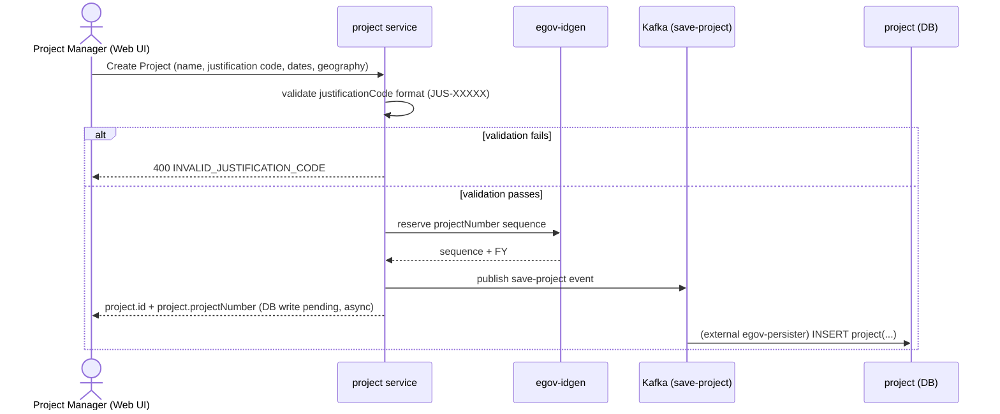

- **API Path:** `POST /project/v1/_create`
- **Service:** `project`
- **Kafka:** **Yes** — confirmed in code: `ProjectService.java:135-136` calls `producer.push(getSaveProjectTopic(), projectRequest)` → topic `save-project` (`application.properties:127`); matches `project-persister.yml:185` (`INSERT INTO project(...)`), consumed by an external generic `egov-persister` (not vendored in this repo). The idgen call itself (`IDGEN`) is synchronous REST — only the row write is async.
- **DB Write:** Yes — `project` (`additionalDetails.justificationCode`, `projectNumber`) — written asynchronously via the Kafka persister, not in the request thread
- **Data generated:** new `project` row; `projectNumber` reserved via `egov-idgen` (format `PROJ-<code>-<FY>-<seq>`, §3.1)

**Sample Request** (`Livelihood_API_Doc.md` §4.1)
```json
{
  "Projects": [
    {
      "tenantId": "in",
      "name": "Karnataka Agri Livelihood Q3 2026",
      "startDate": 1721606400000,
      "endDate": 1729382400000,
      "additionalDetails": {
        "justificationCode": "JUS-00120",
        "geography": { "states": ["KA"], "districts": ["Tumkur"], "blocks": [] }
      }
    }
  ]
}
```

**Sample Response** (§4.1)
```json
{
  "Project": [
    {
      "id": "proj-uuid-1",
      "projectNumber": "PROJ-00120-2627-001",
      "additionalDetails": { "justificationCode": "JUS-00120" },
      "auditDetails": { "createdTime": 1721654400000 }
    }
  ]
}
```

**Sample Error** (illustrative — not in API Doc; `justificationCode` is regex-validated per §4.1)
```json
{
  "ResponseInfo": { "status": "failed" },
  "Errors": [
    { "code": "INVALID_JUSTIFICATION_CODE", "message": "additionalDetails.justificationCode must match format JUS-XXXXX" }
  ]
}
```

### Step 2 — Download End User Site Excel

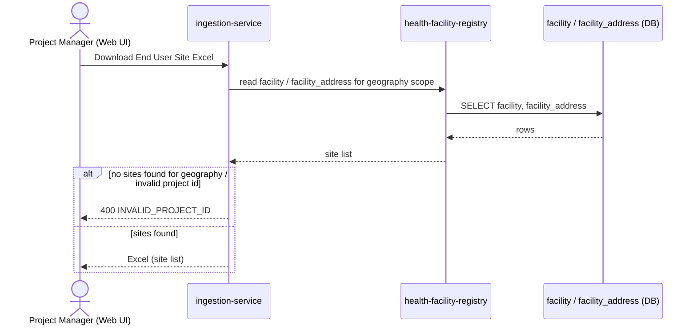

- **API Path:** `POST /ingestion-service/template/facilitySelection`
- **Service:** `ingestion-service` (reads `health-facility-registry`'s data internally)
- **Kafka:** No — synchronous template-generation request/response
- **DB Write:** No (read-only) — reads `facility`, `facility_address` (health-facility-registry)
- **Data generated:** Excel file only — no DB write

**Sample Request** (§4.2, multipart form)
```
parent_project_id: proj-uuid-1
boundary_codes: KA.TUMKUR.SIRA
request_info: {"apiId":"installation-app", "authToken":"..."}
```

**Sample Response** (§4.2)
```
200 OK
Content-Type: application/vnd.openxmlformats-officedocument.spreadsheetml.sheet
columns: Site Name (readonly), Village, State, District, Block, Sector, Include (Yes/No)
```

**Sample Error** (illustrative — not in API Doc)
```json
{
  "ResponseInfo": { "status": "failed" },
  "Errors": [ { "code": "INVALID_PROJECT_ID", "message": "No project found for id proj-uuid-1" } ]
}
```

### Step 3 — Mark Include Yes/No, upload

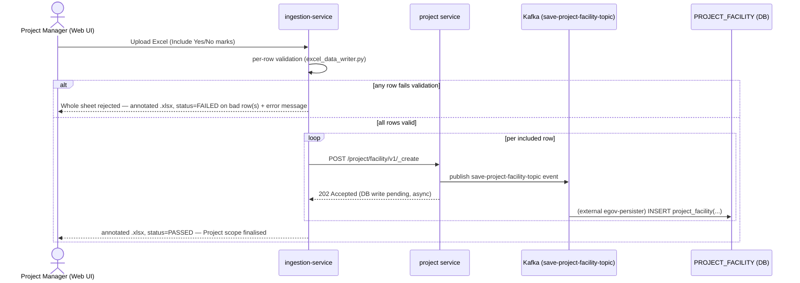

- **API Path:** `POST /ingestion-service/ingest/facilitySelection` (internally calls `project` service's `POST /project/facility/v1/_create` per row, confirmed at `project_service_client.py:225-226`)
- **Service:** `ingestion-service` → `project`
- **Kafka:** **Yes** — confirmed in code: `ProjectFacilityService.java:138` calls `projectFacilityRepository.save(entities, getCreateProjectFacilityTopic())` → topic `save-project-facility-topic`; matches `project-persister.yml:588-626` (`INSERT INTO project_facility(...)`). Controller returns HTTP `202 Accepted` (`ProjectApiController.java:172-234`), consistent with a fire-and-forget async write.
- **DB Write:** Yes — `PROJECT_FACILITY` (written asynchronously via the Kafka persister, one row per included site)
- **Data generated:** Project-level site scope rows; **Project ID finalised**

**Sample Request** (§4.3, multipart form)
```
project_id: proj-uuid-1
facility_selection_file: <Sheet0-Completed.xlsx>
request_info: {...}
```

**Sample Response** (§4.3 — annotated workbook, not JSON; per §1 conventions there is no separate JSON error body)
```
200 OK — same .xlsx returned with per-row status/error columns filled in, e.g.:
row 14 → status=FAILED, error="Include marked Yes but row is outside selected geography"
all other rows → status=PASSED, error=""
```

**Sample Error** (this endpoint's failure mode is per-row, embedded in the returned workbook — §4.3)
```
row-level: status=FAILED, error="Include marked Yes but row is outside selected geography"
```

### Step 4 — Create Installation Plan

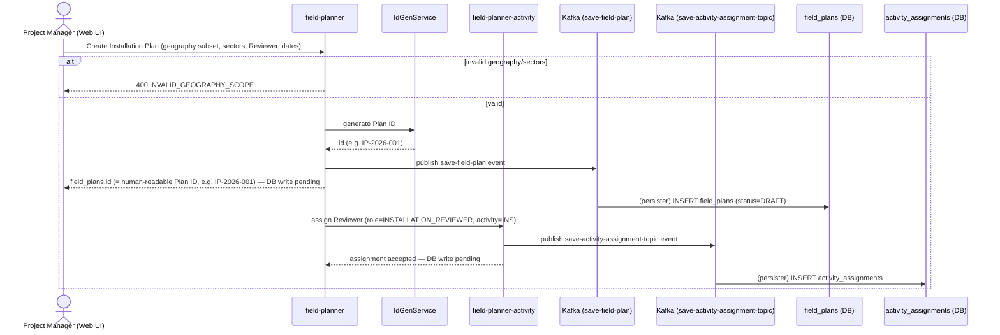

- **API Path(s) / Service(s)** (two distinct calls per `Livelihood_API_Doc.md` §5.1/§5.2, drawn above as one actor-facing step):
  1. `POST /v1/field-plans/_create` — **field-planner** (creates `field_plans`, status `DRAFT`)
  2. `POST /v1/activities/_assign-activity` — **field-planner-activity** (creates `activity_assignments` row against the pre-seeded `INS` activity)
- **Kafka:** **Yes** for both calls, confirmed in code: `FieldPlannerService.java:103` pushes to topic `save-field-plan`; `ActivityService.java:171-187` pushes to topic `save-activity-assignment-topic` (`ActivityAssignmentRepository` is never called for writes — the service pushes to Kafka directly, bypassing the repository entirely). **Caveat:** unlike `project`/`egov-workflow-v2`/`asset-registry`, the persister YAML that would consume these two topics was **not found in this repo** — `field-planner`'s bundled `FieldPlanner-persister.yml` is a byte-for-byte stale copy of `project-persister.yml` with no mapping for either topic. The producer call is unambiguous; the downstream persister config lives outside this checkout.
- **DB Write:** Yes — `field_plans` (+ `sectors`, `senior_contact_*` cols, §3.2), `activity_assignments` (role `INSTALLATION_REVIEWER` against pre-seeded `INS` activity) — both written asynchronously via Kafka
- **Data generated:** new `field_plans` row, `status='DRAFT'`; `id` generated via `IdGenService` as the Plan ID (e.g. `IP-2026-001`, §3.0/§3.2)

**Sample Request** (call 1 — §5.1)
```json
{
  "FieldPlans": [
    {
      "tenantId": "in",
      "name": "Sira Block Installation Plan 1",
      "projectId": "proj-uuid-1",
      "geographyScope": { "districts": ["Tumkur"], "blocks": ["Sira"] },
      "sectors": ["Agriculture"],
      "startDate": 1721606400000,
      "endDate": 1724198400000,
      "additionalDetails": {
        "seniorContactName": "Ravi Kumar", "seniorContactEmail": "ravi.kumar@selco.example", "seniorContactPhone": "9900012345"
      }
    }
  ]
}
```

**Sample Response** (call 1 — §5.1)
```json
{ "FieldPlan": [ { "id": "IP-2026-001", "uuid": "8f2c1e40-...-internal", "status": "DRAFT" } ] }
```

**Sample Request** (call 2 — §5.2)
```json
{
  "ActivityAssignments": [
    { "tenantId": "in", "fieldPlanId": "IP-2026-001", "activityId": "activity-ins-uuid",
      "assignedTo": "hrms-reviewer-uuid", "role": { "code": "INSTALLATION_REVIEWER" }, "pocNumber": "9900012399" }
  ]
}
```

**Sample Response** (call 2 — §5.2)
```json
{ "ActivityAssignment": [ { "id": "assign-uuid-1", "status": "ACTIVE" } ] }
```

**Sample Error** (illustrative — not in API Doc)
```json
{
  "ResponseInfo": { "status": "failed" },
  "Errors": [ { "code": "INVALID_GEOGRAPHY_SCOPE", "message": "geographyScope.districts/blocks must be non-empty" } ]
}
```

### Step 5 — Download Installation Scope Excel (Sheet 1)

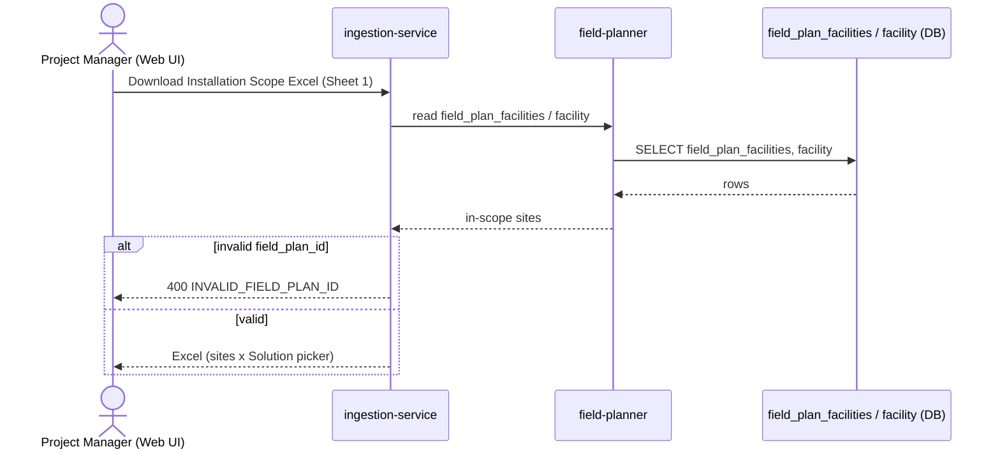

- **API Path:** `POST /ingestion-service/template/fieldplanFacilityIngestionTemplate`
- **Service:** `ingestion-service` (reads `field-planner`'s data internally)
- **Kafka:** No
- **DB Write:** No (read-only) — reads `field_plan_facilities`, `facility`
- **Data generated:** Excel: one row per in-scope site

**Sample Request** (§5.3, multipart form)
```
field_plan_id: IP-2026-001
request_info: {...}
```

**Sample Response** (§5.3)
```
200 OK — .xlsx, columns: Site Name (readonly), Village, State, District, Block, Sector (readonly),
Include (Yes/No), Solution (dropdown, filtered), Lock Status (readonly)
```

**Sample Error** (illustrative — not in API Doc)
```json
{
  "ResponseInfo": { "status": "failed" },
  "Errors": [ { "code": "INVALID_FIELD_PLAN_ID", "message": "No field plan found for id IP-2026-001" } ]
}
```

### Step 6 — Mark Include + pick Solution per site, upload

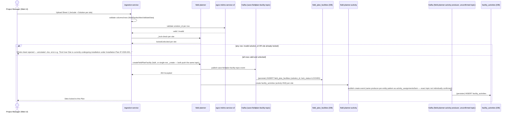

- **API Path(s) / Service(s)** (per §5.4/§5.5/§5.6/§3.1, this actor-facing step fans out to five calls):
  1. `POST /ingestion-service/ingest/fieldPlanfacilitiesValidateData` — **ingestion-service** (row validation against MDMS `data-ingestion.FieldPlanFacilityIngestionSchema`)
  2. `POST /mdms-v2/v1/_search` — **egov-mdms-service-v2** (validates each row's `solution_id`)
  3. `POST /v1/field-plans/facility/_lock-check` — **field-planner** (FR-06 lock check, invoked from call 4's row loop)
  4. `POST /ingestion-service/ingest/createFieldPlanFacility` — **ingestion-service** (actual create/link/unlink, calls `FieldPlanServiceClient`)
  5. `POST /v1/field-plans/facility/bulk/_create` — **field-planner** (bulk-assigns `solutionId`/`lockStatus`)
- **Kafka:** **Yes** for call 5, confirmed two ways: API Doc §5.5 documents `202 Accepted (async, existing Kafka-backed pattern)`, and code confirms `FieldPlannerFacilityService.java:83` pushes to topic `save-fieldplan-facility-topic` — and, per code investigation, the **single**-row `/facility/_create` endpoint (`FieldPlannerApiController.java:100-107`) pushes to the exact same topic via the same service method, so single vs. bulk is not an architectural distinction, just an extra internal Kafka hop for the bulk case (`FieldPlanFacilityConsumer.java:33-43` re-lands on the identical `producer.push()` call). Calls 1–3 are synchronous reads/validation (no write). `facility_activities` creation (triggered off call 4/5, but owned by `field-planner-activity`) was **not individually verified** in code — however, every other `field-planner-activity` write path checked (`activity_assignments`, `bom`) uses the identical Kafka-producer-per-entity architecture with zero direct JDBC writes found anywhere in that service, so it's very likely this table follows the same pattern; just not confirmed topic-by-topic.
- **DB Write:** Yes — `field_plan_facilities` (`solution_id`, `lock_status='LOCKED'`, written asynchronously via call 5's Kafka persister); `facility_activities` row (activity=`INS`) created per included site (field-planner-activity, likely also Kafka-backed per the architecture note above)
- **Data generated:** sites locked to this Plan; per-site `facility_activities` execution instance created

**Sample Request** (call 1, §5.4 — validate step, multipart form)
```
field_plan_id: IP-2026-001
scope_file: <Sheet1-Completed.xlsx>
request_info: {...}
```

**Sample Response** (call 1, §5.4 — annotated workbook)
```
200 OK — same .xlsx returned with status/error columns filled in per row
```

**Sample Error** (call 1, §5.4 — locked site)
```
row-level: status=FAILED, error="End User Site \"ABC Farmer Group\" is currently undergoing installation under
Installation Plan \"IP-2026-001\". The site can be included in another Installation Plan only after all
installation reports are approved."
```

**Sample Request** (call 5, §5.5)
```json
{
  "FieldPlanFacilities": [
    { "tenantId": "in", "fieldPlanId": "IP-2026-001", "facilityId": "site-uuid-42", "solutionId": "SOL-PULVERIZER-001" }
  ]
}
```

**Sample Response** (call 5, §5.5)
```json
{ "ResponseInfo": { "status": "successful" } }
```
*(HTTP `202 Accepted` — the row is not guaranteed persisted yet at response time; it lands via the Kafka-backed persister.)*

**Sample Error** (call 3, §5.6 lock-check — this one returns a normal 200 with per-facility locked flags, not an error envelope)
```json
{
  "lockStatuses": [
    { "facilityId": "site-uuid-42", "locked": false },
    { "facilityId": "site-uuid-58", "locked": true, "lockingPlanId": "plan-uuid-9", "lockingPlanNumber": "IP-2026-004" }
  ]
}
```

### Step 7 — Assign Vendor + Vendor Email per row (Web UI)

> **⚠️ Design change:** this step was originally modeled as an Excel download/upload round-trip through `ingestion-service` (the old "Sheet 2"), matching the PRD's literal FR-07 text. It has since been moved to a direct Project Manager Web UI screen instead — `ingestion-service` is no longer involved in Vendor Assignment at all (LLD §1.1/§5.2). The sequence below reflects the current, Web-UI-based design.

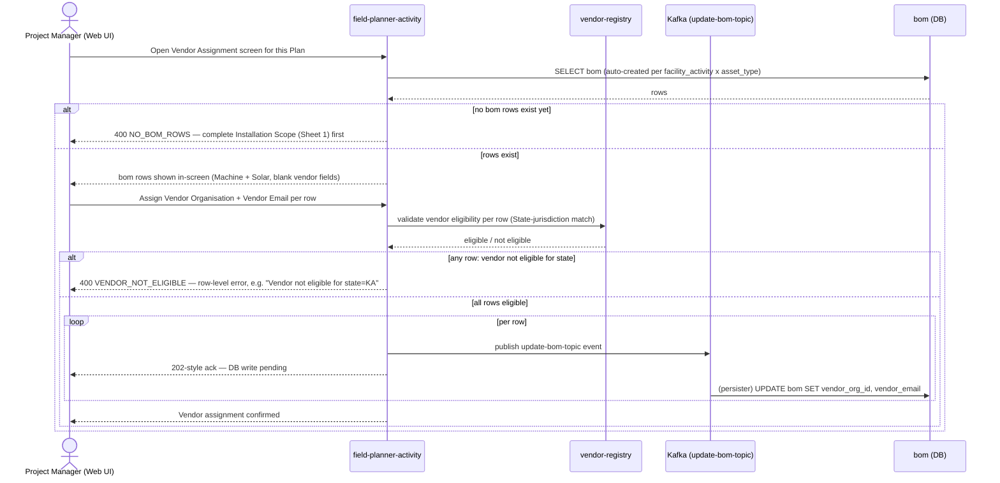

- **API Path(s) / Service(s)** (illustrative — no `ingestion-service` involvement to cite here; API Doc's §6.1–§6.3 still describe the old Excel-based endpoints and haven't been updated for this design change):
  1. `POST /v1/bom/_search` — **field-planner-activity** (fetch bom rows for this Plan, to populate the Web UI grid)
  2. `POST /organisation/v1/_search` — **vendor-registry** (jurisdiction/State eligibility check, reads `eg_org_jurisdiction`)
  3. `POST /v1/bom/_update` — **field-planner-activity** (per-row write)
- **Kafka:** Call 3 — **Yes**, confirmed in code: `BomService.java:197` calls `producer.push(getUpdateBOMTopic(), request)` → topic `update-bom-topic`; no JDBC write exists anywhere in `BomRepository.java` (only `_search` uses `JdbcTemplate`). Same persister-config-not-found caveat as Step 4 applies (topic not mapped in the local, stale `FieldPlanner-persister.yml`). Calls 1/2 — read-only, direct synchronous REST.
- **DB Write:** Yes — `bom.vendor_org_id`, `bom.vendor_email` (written asynchronously via call 3's Kafka producer)
- **Data generated:** Vendor assigned per asset row

**Sample Request** (call 1, illustrative, consistent with §6.3's model)
```json
{ "criteria": { "tenantId": "in", "fieldPlanId": "IP-2026-001" } }
```

**Sample Response** (call 1, illustrative)
```json
{
  "BillOfMaterial": [
    { "id": "bom-uuid-1", "activityFacilityId": "fac-act-uuid-42", "assetType": "MACHINE", "vendorOrgId": null, "vendorEmail": null }
  ],
  "totalCount": 1
}
```

**Sample Error** (illustrative — no bom rows yet)
```json
{
  "ResponseInfo": { "status": "failed" },
  "Errors": [ { "code": "NO_BOM_ROWS", "message": "No Machine/Solar rows exist yet — complete Installation Scope (Sheet 1) first" } ]
}
```

**Sample Request** (call 2, §3.2)
```json
{
  "orgSearchCriteria": {
    "tenantId": "in",
    "orgType": "VENDOR",
    "orgSubType": "INSTALLATION_VENDOR",
    "jurisdiction": ["KA"]
  }
}
```

**Sample Response** (call 2, §3.2)
```json
{
  "organisations": [
    { "id": "org-uuid-1", "name": "SunTech Installers Pvt Ltd", "orgType": "VENDOR", "orgSubType": "INSTALLATION_VENDOR",
      "orgPocEmail": "ops@suntech.example", "orgPocPhone": "9900011122", "isActive": true }
  ],
  "totalCount": 1
}
```

**Sample Request** (call 3, illustrative, extract)
```json
{ "BillOfMaterials": [ { "id": "bom-uuid-1", "tenantId": "in", "vendorOrgId": "org-uuid-1", "vendorEmail": "ops@suntech.example" } ] }
```

**Sample Error** (call 3, illustrative — vendor not eligible for this row's state)
```json
{
  "ResponseInfo": { "status": "failed" },
  "Errors": [ { "code": "VENDOR_NOT_ELIGIBLE", "message": "Vendor not eligible for state=KA" } ]
}
```

### Step 8 — Download prepopulated Installation Template

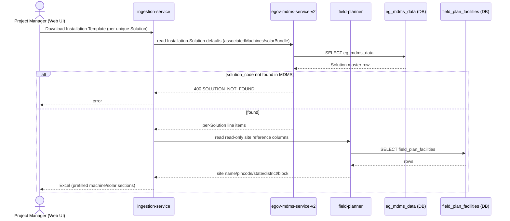

- **API Path(s) / Service(s)** (§6.4, §3.1):
  1. `POST /ingestion-service/template/installationTemplate` — **ingestion-service**
  2. `POST /mdms-v2/v1/_search` — **egov-mdms-service-v2** (reads `Installation.Solution` defaults, called internally by call 1)
- **Kafka:** No
- **DB Write:** No (read-only) — reads `egov-mdms-service-v2`'s `eg_mdms_data` (`associatedMachines`/`solarBundle`); reads `field_plan_facilities` read-only site columns
- **Data generated:** Excel: prefilled `machine_section`/`solar_section` + site reference columns

**Sample Request** (call 1, §6.4, multipart form)
```
field_plan_id: IP-2026-001
solution_code: SOL-PULVERIZER-001
request_info: {...}
```

**Sample Response** (call 1, §6.4)
```
200 OK — .xlsx, sections "Machine" and "Solar", columns: Installation Component, Quantity, Make, Model,
Capacity, Technical Specifications
```

**Sample Request** (call 2, §3.1)
```json
{
  "MdmsCriteria": {
    "tenantId": "in",
    "moduleDetails": [
      { "moduleName": "Installation", "masterDetails": [ { "name": "Solution", "filter": "[?(@.code=='SOL-PULVERIZER-001')]" } ] }
    ]
  }
}
```

**Sample Response** (call 2, §3.1)
```json
{
  "MdmsRes": {
    "Installation": {
      "Solution": [
        {
          "code": "SOL-PULVERIZER-001", "name": "Pulverizer", "sector": "Agriculture",
          "machineSpecs": { "type": "Pulverizer", "capacityRange": "5-10kg/hr" },
          "solarBundle": [ { "component": "Panel", "specDefault": "200W" } ]
        }
      ]
    }
  }
}
```

**Sample Error** (illustrative — not in API Doc)
```json
{
  "ResponseInfo": { "status": "failed" },
  "Errors": [ { "code": "SOLUTION_NOT_FOUND", "message": "No MDMS Solution master found for code SOL-PULVERIZER-001" } ]
}
```

### Step 9 — Adjust Template + Tender Number / Purchase Order No., upload

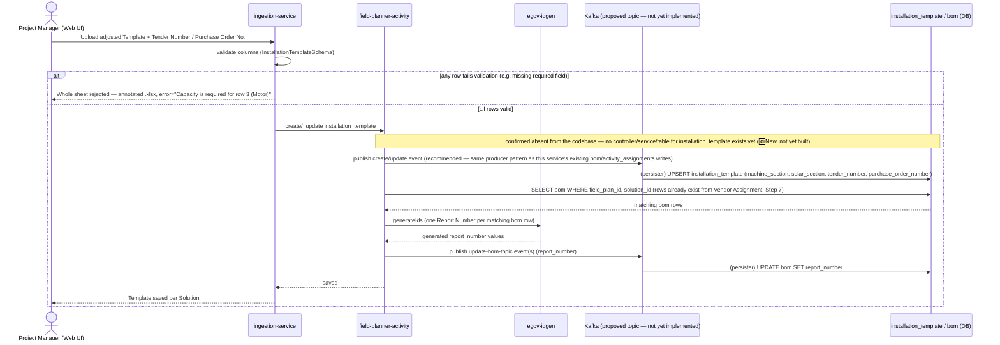

Note: `tender_number` may be left blank in this upload (optional). `purchase_order_number` may also be left blank here — it isn't validated at this step or at Publish (PM flow Step 10 below) — but is compulsory by the time the Field Technician submits the IC Report (Field Technician flow, Step 10), at which point it must be present either from this template upload or from the technician's own in-app entry. Unlike either of those, `report_number` is never entered by the PM or the Field Technician — it's generated automatically, right here, for every `bom` row already scoped to this `(field_plan_id, solution_id)`, the moment this upload succeeds (LLD §3.3). By the time a Field Technician opens their assigned task (Field Technician flow, Step 1), `report_number` is already populated on that row.

- **API Path(s) / Service(s)** (§6.5, §6.6):
  1. `POST /ingestion-service/ingest/installationTemplate` — **ingestion-service** (row validation against `data-ingestion.InstallationTemplateSchema`)
  2. `POST /v1/installation-templates/_create` / `_update` — **field-planner-activity** (called from call 1's row loop)
  3. `POST /egov-idgen/id/_generate` — **egov-idgen** (external, one Report Number per matching `bom` row — 🆕 new usage of this existing DIGIT service, same pattern as Project ID/Plan ID generation, LLD §3.1/§3.2)
  4. `POST /v1/bom/_update` — **field-planner-activity** (writes the generated `report_number` back onto each matching `bom` row)
- **Kafka:** **Not yet implemented — confirmed absent from the codebase.** Repo-wide search found zero controller, service, repository, model, or DB migration referencing `installation_template`/`InstallationTemplate` anywhere; `field-planner-activity`'s only controllers are `HealthApiController`, `ActivityApiController`, `BOMApiController`. Since this is a 🆕 New endpoint (API Doc), that's expected rather than a gap. **Logical inference, not a confirmed fact:** every existing write path in this same service (`activity_assignments`, `bom` create/update) uses `producer.push(topic, entity)` with zero direct JDBC writes found anywhere in the service — so once built, `installation_template` would very likely follow the identical Kafka-producer pattern for consistency. Call 4's own `bom.report_number` write would follow the confirmed `update-bom-topic` producer pattern already used for `bom.otp_uuid` (Field Technician flow, Step 8).
- **DB Write:** Not yet implemented — `installation_template` table itself was not found in this repo's migrations. `bom.report_number` is a new column on an existing table (§3.3), also not yet implemented.
- **Data generated:** one `installation_template` row per `(field_plan_id, solution_id)`; one `report_number` per matching `bom` row

**Sample Request** (call 1, §6.5, multipart form)
```
field_plan_id: IP-2026-001
solution_code: SOL-PULVERIZER-001
template_file: <InstallationTemplate-Completed.xlsx>
request_info: {...}
```

**Sample Response** (call 1, §6.5 — annotated workbook)
```
200 OK — same .xlsx returned with status/error columns filled in
```

**Sample Error** (call 1, §6.5)
```
row-level: status=FAILED, error="Capacity is required for row 3 (Motor)"
```

**Sample Request** (call 2, §6.6)
```json
{
  "InstallationTemplates": [
    {
      "tenantId": "in", "fieldPlanId": "IP-2026-001", "solutionId": "SOL-PULVERIZER-001",
      "machineSection": { "components": [ { "name": "Motor", "quantity": 1, "make": "Crompton", "model": "CG-5HP", "capacity": "5HP" } ] },
      "solarSection": { "components": [ { "name": "Panel", "quantity": 4, "make": "Waaree", "model": "WS-200", "capacity": "200W" } ] },
      "tenderNumber": null,
      "purchaseOrderNumber": "PO-2026-00417"
    }
  ]
}
```
*(`tenderNumber` shown here as `null` to illustrate that it's optional — a PM can also leave `purchaseOrderNumber` `null` at this step and have the Field Technician fill it in later, per the note above.)*

**Sample Response** (call 2, §6.6)
```json
{ "InstallationTemplate": [ { "id": "tmpl-uuid-1" } ] }
```

**Sample Request** (call 3, illustrative — same shape as this repo's other `egov-idgen` usage, LLD §3.1)
```json
{ "idRequests": [ { "idName": "bom.report.number", "tenantId": "in", "format": "IC-[fy:yyyy-yy]-[SEQ_IC_REPORT]" } ] }
```

**Sample Response** (call 3, illustrative)
```json
{ "idResponses": [ { "idName": "bom.report.number", "id": "IC-2026-27-00842" } ] }
```

**Sample Request** (call 4, illustrative, extract)
```json
{ "BillOfMaterials": [ { "id": "bom-uuid-1", "tenantId": "in", "reportNumber": "IC-2026-27-00842" } ] }
```

### Step 10 — Run Publish validation

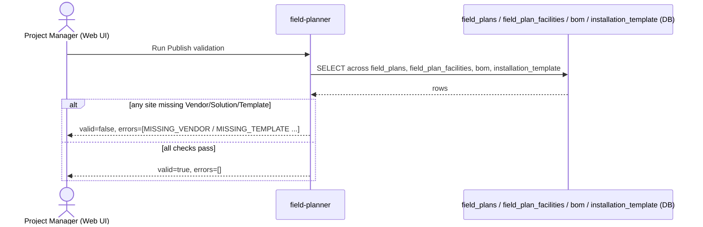

- **API Path:** `POST /v1/field-plans/{id}/_publish-validate`
- **Service:** `field-planner`
- **Kafka:** No
- **DB Write:** No (read-only) — reads across `field_plans`, `field_plan_facilities`, `bom`, `installation_template`
- **Data generated:** pass/fail validation result

**Sample Request** (§7.1)
```
POST /v1/field-plans/IP-2026-001/_publish-validate   (empty body besides RequestInfo)
```

**Sample Response — passes** (§7.1)
```json
{ "valid": true, "errors": [] }
```

**Sample Error / Response — fails** (§7.1)
```json
{
  "valid": false,
  "errors": [
    { "type": "MISSING_VENDOR", "siteName": "Doddaballapur SHG", "assetType": "SOLAR" },
    { "type": "MISSING_TEMPLATE", "solutionCode": "SOL-GRINDER-002" }
  ]
}
```

### Step 11 — Confirm & Submit (Publish)

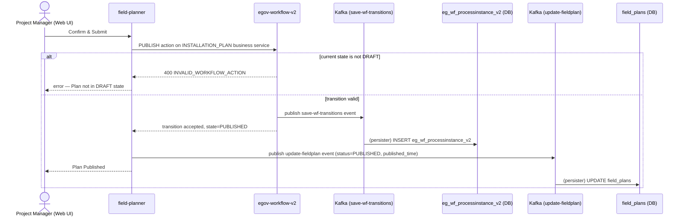

- **API Path:** `POST /egov-wf/process/_transition` (`action: "PUBLISH"`, `businessService: "INSTALLATION_PLAN"`)
- **Service:** `egov-workflow-v2` (called by `field-planner`)
- **Kafka:** **Yes**, confirmed for both writes: `StatusUpdateService.java:35-48` pushes to topic `save-wf-transitions` — no JDBC call in that class at all — matching `egov-workflow-v2-persister.yml:6` (`INSERT INTO eg_wf_processinstance_v2(...)`), a clean, fully-confirmed persister pairing. `field-planner`'s own `field_plans.status`/`published_time` update reuses the same `update-fieldplan` producer confirmed for Step 4 (`FieldPlannerService.java:517`) — same persister-config-not-found-in-repo caveat applies there.
- **DB Write:** Yes — `field_plans.status='PUBLISHED'`, `field_plans.published_time` (field-planner, async via Kafka); workflow's own `eg_wf_processinstance_v2` transition row (egov-workflow-v2, async via Kafka, confirmed persister)
- **Data generated:** Plan transitions `DRAFT → PUBLISHED` (terminal); tasks dispatched to Vendors

**Sample Request** (§7.2)
```json
{
  "ProcessInstances": [
    { "tenantId": "in", "businessService": "INSTALLATION_PLAN", "businessId": "IP-2026-001",
      "action": "PUBLISH", "comment": "All checks passed, dispatching to vendors" }
  ]
}
```

**Sample Response** (§7.2)
```json
{ "ProcessInstances": [ { "id": "pi-uuid-1", "state": { "state": "PUBLISHED" }, "businessId": "IP-2026-001" } ] }
```

**Sample Error** (illustrative — not in API Doc; e.g. re-publishing an already-published Plan)
```json
{
  "ResponseInfo": { "status": "failed" },
  "Errors": [ { "code": "INVALID_WORKFLOW_ACTION", "message": "Action PUBLISH is not valid for current state PUBLISHED" } ]
}
```

### Step 12 — (system) Publish notification to Vendors

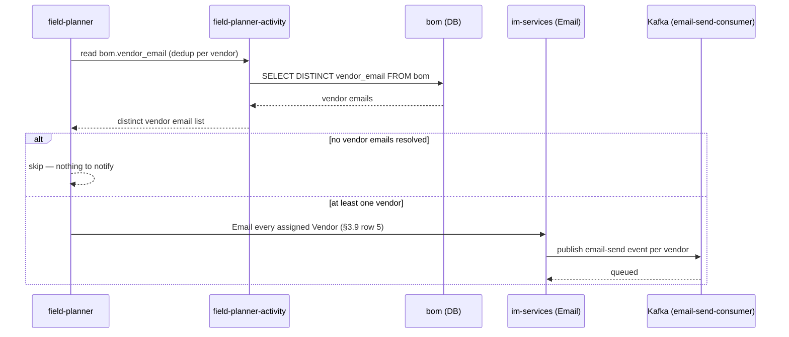

- **API Path:** internal side effect of Step 11's `PUBLISH` transition — not separately itemized in the API Doc (§7.2 note, §11: "not itemized as a separate API since it's an internal side effect of this same transition"). Underlying mechanism: `field-planner-activity`'s `bom.vendor_email` is read directly (no itemized search path given); the email call itself goes through `im-services`' `LivelihoodEmailNotificationService`.
- **Service:** `field-planner` (reads `bom.vendor_email` from `field-planner-activity`) → `im-services`
- **Kafka:** **Yes** — `im-services`' Email notification path publishes to a Kafka topic consumed by an email consumer (API Doc §11)
- **DB Write:** No new table — reads `bom`
- **Data generated:** Email sent once per distinct Vendor (§3.9 row 5)

**Sample Request** (illustrative — not in API Doc; Kafka message published by `im-services`)
```json
{
  "topic": "email-send-consumer",
  "value": {
    "tenantId": "in",
    "emailType": "INSTALLATION_PLAN_PUBLISHED",
    "recipientEmail": "ops@suntech.example",
    "templateParams": { "planId": "IP-2026-001", "planName": "Sira Block Installation Plan 1" }
  }
}
```

**Sample Response** — none (fire-and-forget publish; no synchronous response contract documented)

**Sample Error** (illustrative — not in API Doc)
```json
{ "error": "EMAIL_DISPATCH_FAILED", "message": "SMTP relay unreachable — message requeued for retry" }
```

---

## 2. Field Technician flow

**PRD basis:** same as LLD §5.3 — §10.2, §12.2 Fig. 4, FR-10/FR-11. **Run once per `bom` row** (Machine and Solar progress independently — see LLD §5.3's note); each diagram below is one node from that single-row flow.

### Step 1 — Open assigned task

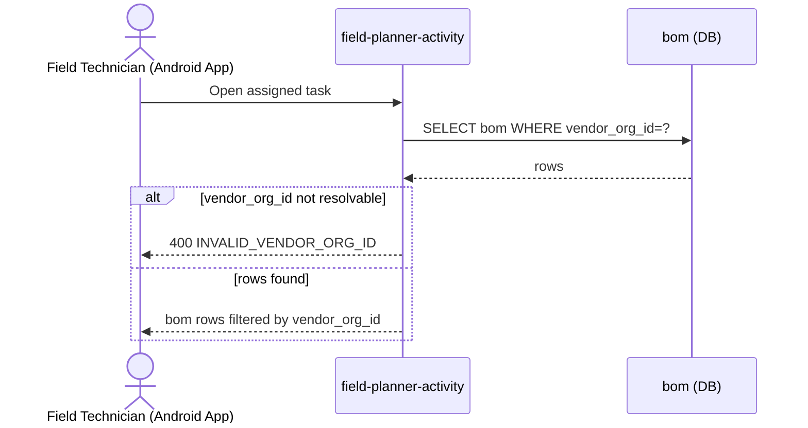

- **API Path:** `POST /v1/bom/_search`
- **Service:** `field-planner-activity`
- **Kafka:** No
- **DB Write:** No (read-only) — reads `bom`
- **Data generated:** task list (0/1/2 entries depending on Machine/Solar assignment)

**Sample Request** (§6.3/§8.1, filtered by `vendorOrgId`)
```json
{ "criteria": { "tenantId": "in", "vendorOrgId": "org-uuid-1" } }
```

**Sample Response** (§6.3)
```json
{
  "BillOfMaterial": [
    { "id": "bom-uuid-1", "activityFacilityId": "fac-act-uuid-42", "assetType": "MACHINE", "vendorOrgId": "org-uuid-1", "reportNumber": "IC-2026-27-00842", "data": {} }
  ],
  "totalCount": 1
}
```
*(`reportNumber` arrives already populated — it was system-generated back at the Project Manager's Installation Template upload, Project Manager flow Step 9, not something this screen or the technician generates.)*

**Sample Error** (illustrative — not in API Doc)
```json
{
  "ResponseInfo": { "status": "failed" },
  "Errors": [ { "code": "INVALID_VENDOR_ORG_ID", "message": "No vendor organisation found for org-uuid-1" } ]
}
```

### Step 2 — Review pre-filled site + template data

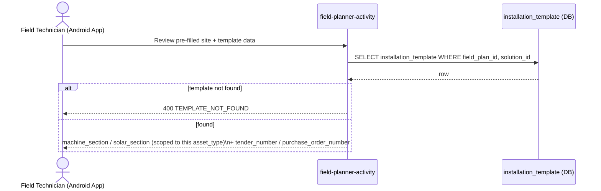

- **API Path:** `POST /v1/installation-templates/_search`
- **Service:** `field-planner-activity`
- **Kafka:** No
- **DB Write:** No (read-only) — reads `installation_template.machine_section` / `solar_section` (scoped to this row's `asset_type`), plus `tender_number` / `purchase_order_number`
- **Data generated:** template line items shown in-app, plus whichever of Tender Number / Purchase Order No. the PM already filled in (either may arrive blank — see Step 4 below for what the app does then)

**Sample Request** (illustrative shape, consistent with §6.6's model — API Doc doesn't itemize a `_search` sample for this)
```json
{ "criteria": { "tenantId": "in", "fieldPlanId": "IP-2026-001", "solutionId": "SOL-PULVERIZER-001" } }
```

**Sample Response** (fields per §6.6)
```json
{
  "InstallationTemplate": [
    {
      "id": "tmpl-uuid-1", "fieldPlanId": "IP-2026-001", "solutionId": "SOL-PULVERIZER-001",
      "machineSection": { "components": [ { "name": "Motor", "quantity": 1, "make": "Crompton", "model": "CG-5HP", "capacity": "5HP" } ] },
      "solarSection": { "components": [ { "name": "Panel", "quantity": 4, "make": "Waaree", "model": "WS-200", "capacity": "200W" } ] },
      "tenderNumber": null,
      "purchaseOrderNumber": "PO-2026-00417"
    }
  ]
}
```

**Sample Error** (illustrative — not in API Doc)
```json
{
  "ResponseInfo": { "status": "failed" },
  "Errors": [ { "code": "TEMPLATE_NOT_FOUND", "message": "No installation_template found for this field plan / solution" } ]
}
```

### Step 3 — Perform installation on-site

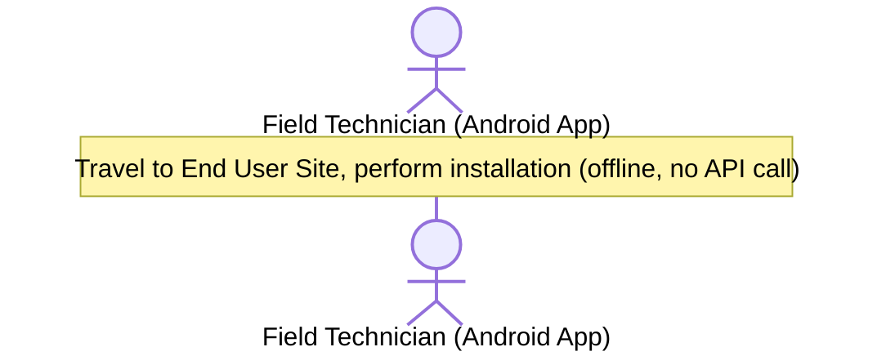

- **API Path:** none
- **Service:** none
- **Kafka:** N/A
- **DB Write:** No — none
- **Data generated:** none yet — physical installation only

### Step 4 — Fill IC Report in app

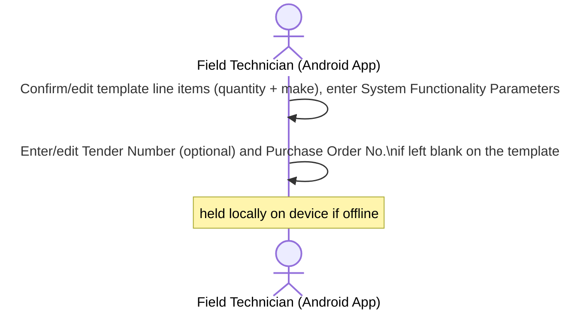

- **API Path:** none yet (form filled client-side; only persisted server-side at Step 10)
- **Service:** none
- **Kafka:** N/A
- **DB Write:** No — none yet, destined for `bom.data`
- **Data generated:** report field values held on-device, plus a `tenderNumber`/`purchaseOrderNumber` override if the technician filled in a value the template (fetched at Step 2) left blank. Purchase Order No. is compulsory — since the app already has the template's own value from Step 2, it can warn locally if neither the template nor this entry has one filled in, though the authoritative check that actually blocks Submit is server-side, at Step 10.

### Step 5 — Capture Photos / Video

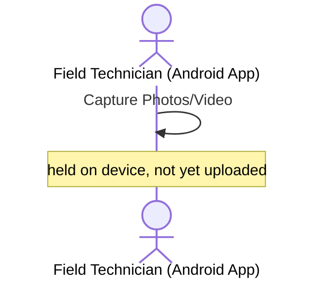

- **API Path:** none yet (device camera only)
- **Service:** none
- **Kafka:** N/A
- **DB Write:** No — none yet, destined for `bom_document`
- **Data generated:** media files held on-device

### Step 6 — Offline: save locally

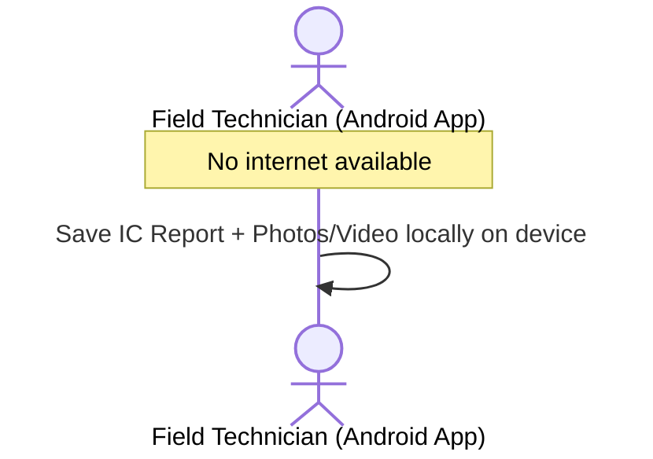

- **API Path:** none
- **Service:** none
- **Kafka:** N/A
- **DB Write:** No — none server-side; local device storage only

### Step 7 — Tap Sync when back online

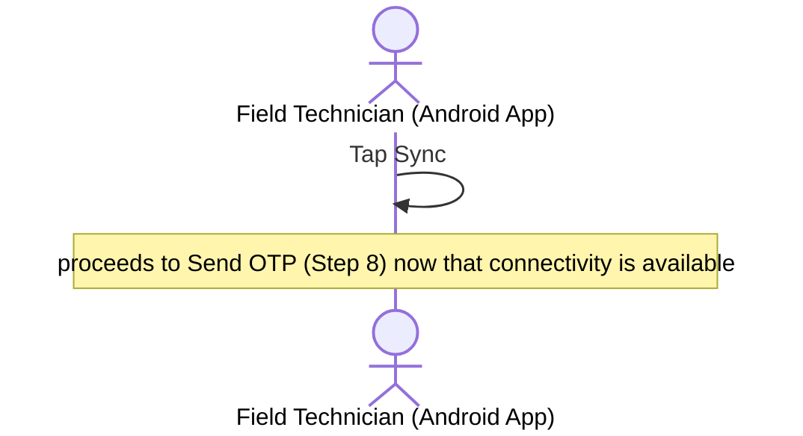

- **API Path:** none by itself — this is the trigger for Step 8 to actually fire
- **Service:** none
- **Kafka:** N/A
- **DB Write:** No — a state transition on-device only

### Step 8 — Send OTP

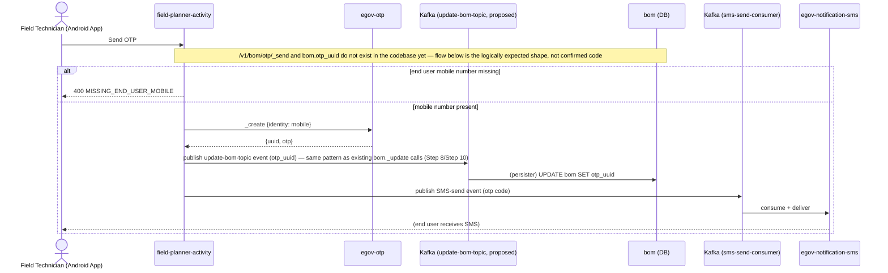

- **API Path(s) / Service(s)** (§8.2, §11):
  1. `POST /v1/bom/otp/_send` — **field-planner-activity** (thin wrapper)
  2. `POST /otp/v1/_create` — **egov-otp** (external, synchronous REST — called internally by call 1)
  3. SMS delivery — **egov-notification-sms** (reached only via Kafka topic, not a direct call)
- **Kafka:** Call 3 (SMS delivery) — **Yes**, API Doc §11 explicitly confirms Kafka-topic-based, in contrast to the `egov-otp` `_create` call which is direct synchronous REST (`No`). Call 1's own DB write (`bom.otp_uuid`) — **not yet implemented, confirmed absent from the codebase**: repo-wide search for `otp_uuid` returns zero hits, and `BOMApiController.java` has no `_send`/`_verify` endpoints at all (only `_create`, `_update`, `_search`, `_generate_pdf`, `_save_pdf`). **Logical inference, not a confirmed fact:** since `otp_uuid` would be a plain field on the existing `bom` entity, it would most naturally be written through the same confirmed `update-bom-topic` Kafka producer every other `bom` field update already uses (Step 8's vendor assignment, Step 10's report submission) — that's the recommended pattern, not code that exists today.
- **DB Write:** Not yet implemented — `bom.otp_uuid` column/write path was not found in this repo
- **Data generated:** OTP `uuid` stored; SMS code delivered to end user

**Sample Request** (call 1, §8.2)
```json
{ "tenantId": "in", "bomId": "bom-uuid-1", "endUserMobileNumber": "9876543210" }
```

**egov-otp `_create` call** (call 2, internal, §8.2)
```json
{ "otp": { "tenantId": "in", "identity": "9876543210" } }
```

**Sample Response** (call 1, §8.2)
```json
{ "otpUuid": "b3f1c2d4-...-otp-ref" }
```

**Sample Error** (illustrative — not in API Doc; e.g. mobile number missing on the facility record)
```json
{
  "ResponseInfo": { "status": "failed" },
  "Errors": [ { "code": "MISSING_END_USER_MOBILE", "message": "No mobile number on file for this facility's end user" } ]
}
```

### Step 9 — Enter & validate OTP

```mermaid
sequenceDiagram
    actor FT as Field Technician (Android App)
    participant FPA as field-planner-activity
    participant OTP as egov-otp

    FT->>FPA: Enter OTP shared by end user
    FPA->>OTP: _validate {uuid, identity, otp}
    alt otp mismatch or expired
        OTP-->>FPA: isValidationSuccessful=false
        FPA-->>FT: OTP invalid — re-enter or resend
    else otp valid
        OTP-->>FPA: isValidationSuccessful=true
        FPA-->>FT: OTP verified — proceed to Submit
    end
```

- **API Path(s) / Service(s)** (§8.3, §11):
  1. `POST /v1/bom/otp/_verify` — **field-planner-activity** (thin wrapper)
  2. `POST /otp/v1/_validate` — **egov-otp** (external, called internally by call 1)
- **Kafka:** No — API Doc §11 explicitly states OTP validation is a direct synchronous REST call, not Kafka-routed
- **DB Write:** No — no local `otp_verified` flag stored (the workflow transition at Step 10 is itself the durable record, §3.3)
- **Data generated:** validation result only

**Sample Request** (call 1, §8.3)
```json
{ "tenantId": "in", "bomId": "bom-uuid-1", "otp": "482913" }
```

**egov-otp `_validate` call** (call 2, internal, §8.3)
```json
{ "otp": { "tenantId": "in", "identity": "9876543210", "uuid": "b3f1c2d4-...-otp-ref", "otp": "482913" } }
```

**Sample Response — success** (§8.3)
```json
{ "otpVerified": true }
```

**Sample Error / Response — mismatch/expired** (§8.3, as returned by `egov-otp`)
```json
{ "otpVerified": false }
```

### Step 10 — Upload media + Submit report

```mermaid
sequenceDiagram
    actor FT as Field Technician (Android App)
    participant FPA as field-planner-activity
    participant FS as egov-filestore
    participant WF as egov-workflow-v2
    participant KAFKA1 as Kafka (update-bom-topic)
    participant DB1 as bom / bom_document (DB)
    participant KAFKA2 as Kafka (save-wf-transitions)
    participant DB2 as eg_wf_processinstance_v2 (DB)

    FPA->>FS: Upload Photos/Video
    FS-->>FPA: filestoreId(s)
    FPA->>KAFKA1: publish update-bom-topic event (documents[] + data)
    FPA-->>FPA: DB write pending, async
    KAFKA1->>DB1: (persister) INSERT bom_document (PHOTO/VIDEO), UPDATE bom.data
    alt Purchase/Work Order No. missing (neither installation_template nor bom.data has one)
        FPA-->>FT: 400 PURCHASE_ORDER_NUMBER_REQUIRED — cannot submit
    else OTP not verified for this bom row
        FPA-->>FT: 400 OTP_NOT_VERIFIED — cannot submit
    else Purchase/Work Order No. present and OTP verified
        FPA->>WF: SUBMIT_REPORT_A
        WF->>KAFKA2: publish save-wf-transitions event
        WF-->>FPA: transitioned
        FPA->>WF: SUBMIT_REPORT_B (auto-chained)
        WF->>KAFKA2: publish save-wf-transitions event
        WF-->>FPA: state=SUBMITTED_BY_SUPERVISOR
        KAFKA2->>DB2: (persister) INSERT eg_wf_processinstance_v2 (x2 transitions)
        FPA-->>FT: report enters Reviewer queue
    end
```

- **API Path(s) / Service(s)** (§8.4, §8.4b, §8.5):
  1. `POST /filestore/v1/files` — **egov-filestore** (photo/video upload)
  2. `POST /v1/bom/_update` — **field-planner-activity** (writes `bom_document` rows via `documents[]`, and `bom.data`)
  3. `POST /egov-wf/process/_transition` — **egov-workflow-v2**, called **twice**: `action: "SUBMIT_REPORT_A"` then `action: "SUBMIT_REPORT_B"` (`businessService: "FACILITY_INSTALLATION"`)
- **Kafka:** Call 2 — **Yes**, confirmed in code: `BomService.java:197` pushes to `update-bom-topic`, and `BillOfMaterial.java:48-49`'s nested `documents` field means `bom_document` rows travel in the same payload/topic as `bom.data` (no separate topic). Call 3 — **Yes**, confirmed: `StatusUpdateService.java:48` pushes both `SUBMIT_REPORT_A` and `SUBMIT_REPORT_B` transitions to `save-wf-transitions`, matching `egov-workflow-v2-persister.yml:6`. Call 1 (filestore upload) — Not specified in docs; `egov-filestore` was out of scope for this code investigation and is plain file storage, with no clear reason to expect a Kafka hop.
- **DB Write:** Yes — `bom_document` (`documenttype='PHOTO'/'VIDEO'`), `bom.data` (async via `update-bom-topic`, including any `tenderNumber`/`purchaseOrderNumber` override entered at Step 4); `eg_wf_processinstance_v2` (2 transitions, async via `save-wf-transitions`)
- **Data generated:** report content persisted; workflow state → `SUBMITTED_BY_SUPERVISOR`; enters Reviewer queue
- **Compulsory-field check:** before either workflow transition fires, `field-planner-activity` reads `purchase_order_number` off `installation_template` (joined via this `bom` row's `solution_id`/`field_plan_id`) and, if still blank, off this `bom.data`'s own override — if both are empty, the call is rejected with `PURCHASE_ORDER_NUMBER_REQUIRED` before `SUBMIT_REPORT_A` is ever attempted. This is a plain service-layer check, not a call to any other service (unlike the OTP gate, which does call out to `egov-otp`) — see LLD §3.3.

**Sample Request** (call 1, §8.4, multipart)
```
file: panel_install.jpg
tenantId: in
module: installation
```

**Sample Response** (call 1, §8.4)
```json
{ "files": [ { "id": "doc-uuid-1", "fileStoreId": "fs-uuid-1", "fileName": "panel_install.jpg" } ] }
```

**Sample Request** (call 2, §8.4b + §8.5, extract)
```json
{
  "BillOfMaterials": [
    { "id": "bom-uuid-1", "tenantId": "in",
      "documents": [ { "documentType": "PHOTO", "fileStoreId": "fs-uuid-1" } ],
      "data": { "components": [ { "name": "Motor", "quantity": 1, "make": "Crompton", "model": "CG-5HP", "installedCapacity": "5HP" } ],
                "systemFunctionalityParameters": { "arraySizeKwp": 5.2, "noOfModules": 20 },
                "purchaseOrderNumber": "PO-2026-00418" } }
  ]
}
```
*(`purchaseOrderNumber` appears in `bom.data` here because the technician filled it in — `installation_template` had left it blank for this Solution; if the template already had a value, this key would be omitted and the template's value would satisfy the compulsory check below.)*

**Sample Request** (call 3, §8.5 — fired twice, `action` is the only field that changes)
```json
{
  "ProcessInstances": [
    { "tenantId": "in", "businessService": "FACILITY_INSTALLATION", "businessId": "bom-uuid-1", "action": "SUBMIT_REPORT_A" }
  ]
}
```

**Sample Response** (final, after both transitions, §8.5)
```json
{ "ProcessInstances": [ { "id": "pi-uuid-3", "state": { "state": "SUBMITTED_BY_SUPERVISOR" }, "businessId": "bom-uuid-1" } ] }
```

**Sample Error** (illustrative — not in API Doc; e.g. attempting Submit before OTP verification)
```json
{
  "ResponseInfo": { "status": "failed" },
  "Errors": [ { "code": "OTP_NOT_VERIFIED", "message": "End-user OTP must be verified before SUBMIT_REPORT_A" } ]
}
```

**Sample Error** (illustrative — not in API Doc; e.g. attempting Submit with no Purchase/Work Order No. from either the template or this technician's own entry)
```json
{
  "ResponseInfo": { "status": "failed" },
  "Errors": [ { "code": "PURCHASE_ORDER_NUMBER_REQUIRED", "message": "Purchase/Work Order No. must be entered before this report can be submitted" } ]
}
```

### Step 11 — (system) Submission notification

```mermaid
sequenceDiagram
    participant FPA as field-planner-activity
    participant DB as activity_assignments / bom (DB)
    participant IM as im-services (Email)
    participant KAFKA as Kafka (email-send-consumer)

    FPA->>DB: SELECT activity_assignments (role=INSTALLATION_REVIEWER)
    DB-->>FPA: reviewer email
    FPA->>DB: SELECT bom.vendor_email
    DB-->>FPA: vendor email
    alt reviewer email not resolvable
        FPA-->>FPA: log EMAIL_DISPATCH_FAILED, skip reviewer email
    else resolved
        FPA->>IM: Email Assigned Reviewer + Email Vendor (§3.9 rows 1-2)
        IM->>KAFKA: publish email-send events
    end
```

- **API Path:** internal side effect of Step 10's `SUBMIT_REPORT_B` transition — not separately itemized in the API Doc (same pattern as PM-flow Step 12). Underlying call: `im-services`' `LivelihoodEmailNotificationService`.
- **Service:** `field-planner-activity` (reads `activity_assignments`, `bom.vendor_email`) → `im-services`
- **Kafka:** **Yes** — Email notification path is Kafka-topic-based (API Doc §11)
- **DB Write:** No new table — reads `activity_assignments` (role `INSTALLATION_REVIEWER`) for reviewer email; reads `bom.vendor_email` direct
- **Data generated:** email sent to Reviewer + Vendor (§3.9 rows 1–2)

**Sample Request** (illustrative — not in API Doc; Kafka message published by `im-services`, one per recipient)
```json
{
  "topic": "email-send-consumer",
  "value": {
    "tenantId": "in",
    "emailType": "IC_REPORT_SUBMITTED",
    "recipientEmail": "priya.reviewer@selco.example",
    "templateParams": { "bomId": "bom-uuid-1", "siteName": "ABC Farmer Group", "assetType": "MACHINE" }
  }
}
```

**Sample Response** — none (fire-and-forget publish)

**Sample Error** (illustrative — not in API Doc)
```json
{ "error": "EMAIL_DISPATCH_FAILED", "message": "Reviewer email address not resolvable via activity_assignments" }
```

---

## 3. Installation Reviewer flow

**PRD basis:** same as LLD §5.4 — §10.3, §12.3 Fig. 5, FR-12/FR-13/FR-14. **Run once per `bom` row** — Machine and Solar reports for a site are reviewed as separate queue entries (LLD §5.4's note).

### Step 1 — Open Review Queue

```mermaid
sequenceDiagram
    actor RV as Installation Reviewer (Web UI)
    participant FPA as field-planner-activity
    participant DB as bom / activity_assignments (DB)

    RV->>FPA: Open Review Queue
    FPA->>DB: SELECT activity_assignments WHERE assignedTo=RV
    DB-->>FPA: assigned field_plan_ids
    FPA->>DB: SELECT bom WHERE fieldPlanId IN (...) AND state=SUBMITTED_BY_SUPERVISOR
    DB-->>FPA: rows
    alt reviewer has no activity_assignments
        FPA-->>RV: 400 REVIEWER_NOT_ASSIGNED
    else assignments found
        FPA-->>RV: queue list
    end
```

- **API Path:** `POST /v1/bom/_search`
- **Service:** `field-planner-activity`
- **Kafka:** No
- **DB Write:** No (read-only) — reads `bom`, `activity_assignments`, `eg_wf_processinstance_v2`
- **Data generated:** queue list (state `SUBMITTED_BY_SUPERVISOR`)

**Sample Request** (§9.1, scoped by assigned Plans + workflow state)
```json
{ "criteria": { "tenantId": "in", "fieldPlanIds": ["IP-2026-001"], "wfState": "SUBMITTED_BY_SUPERVISOR" } }
```

**Sample Response** (shape per §6.3)
```json
{
  "BillOfMaterial": [
    { "id": "bom-uuid-1", "activityFacilityId": "fac-act-uuid-42", "assetType": "MACHINE", "vendorOrgId": "org-uuid-1" }
  ],
  "totalCount": 1
}
```

**Sample Error** (illustrative — not in API Doc)
```json
{
  "ResponseInfo": { "status": "failed" },
  "Errors": [ { "code": "REVIEWER_NOT_ASSIGNED", "message": "Logged-in user has no activity_assignments as INSTALLATION_REVIEWER" } ]
}
```

### Step 2 — Open a bom row's report

```mermaid
sequenceDiagram
    actor RV as Installation Reviewer (Web UI)
    participant FPA as field-planner-activity
    participant DB as bom / bom_document (DB)

    RV->>FPA: Open a bom row's report
    FPA->>DB: SELECT bom.data, bom_document WHERE bom.id=?
    DB-->>FPA: rows
    alt bom id not found
        FPA-->>RV: 400 BOM_NOT_FOUND
    else found
        FPA-->>RV: bom.data + bom_document (Specs/Photos/Video/Handover Letter)
    end
```

- **API Path:** `POST /v1/bom/_search` (by `id`)
- **Service:** `field-planner-activity`
- **Kafka:** No
- **DB Write:** No (read-only) — reads `bom.data`, `bom_document`
- **Data generated:** full report + attachments rendered

**Sample Request** (illustrative — same endpoint as §6.3, filtered by id)
```json
{ "criteria": { "tenantId": "in", "ids": ["bom-uuid-1"] } }
```

**Sample Response** (illustrative, combining `bom.data`/`bom_document` per §8.4b/§8.5)
```json
{
  "BillOfMaterial": [
    {
      "id": "bom-uuid-1",
      "data": { "components": [ { "name": "Motor", "quantity": 1, "make": "Crompton", "model": "CG-5HP", "installedCapacity": "5HP" } ] },
      "documents": [ { "documentType": "PHOTO", "fileStoreId": "fs-uuid-1" }, { "documentType": "HANDOVER_LETTER", "fileStoreId": "fs-uuid-handover-1" } ]
    }
  ]
}
```

**Sample Error** (illustrative — not in API Doc)
```json
{
  "ResponseInfo": { "status": "failed" },
  "Errors": [ { "code": "BOM_NOT_FOUND", "message": "No bom row found for id bom-uuid-1" } ]
}
```

### Step 3 — Mark each section Approve/Reject + reason

```mermaid
sequenceDiagram
    actor RV as Installation Reviewer (Web UI)
    participant FPA as field-planner-activity
    participant KAFKA as Kafka (proposed topic — not yet implemented)
    participant DB as bom_section_review (DB)

    loop per section (Specs, Photos, Video, Handover Letter)
        RV->>FPA: Mark section Approve/Reject + reason
        Note over FPA,DB: confirmed absent from the codebase — no controller/service/table for bom_section_review exists yet (🆕 New, not yet built)
        alt decision=REJECT and reason missing
            FPA-->>RV: 400 REASON_REQUIRED
        else valid
            FPA->>KAFKA: publish create event (recommended — same producer pattern as this service's existing bom/activity_assignments writes)
            KAFKA->>DB: (persister) INSERT bom_section_review
        end
    end
```

- **API Path:** `POST /v1/bom/section-review/_create`
- **Service:** `field-planner-activity`
- **Kafka:** **Not yet implemented — confirmed absent from the codebase.** Repo-wide search found zero references to `SectionReview`/`section-review`/`bom_section_review` anywhere. As with `installation_template`, this is a 🆕 New endpoint, so absence is expected. **Logical inference, not a confirmed fact:** would very likely follow the same Kafka-producer pattern as `activity_assignments`/`bom` (the only two comparable writes actually confirmed in this service).
- **DB Write:** Not yet implemented — `bom_section_review` table itself was not found in this repo's migrations
- **Data generated:** one row per section (Specs/Photos/Video/Handover Letter)

**Sample Request** (§9.2)
```json
{
  "BomSectionReviews": [
    { "tenantId": "in", "bomId": "bom-uuid-1", "sectionName": "SPECS", "decision": "APPROVE" },
    { "tenantId": "in", "bomId": "bom-uuid-1", "sectionName": "PHOTOS", "decision": "REJECT", "reason": "Panel photo is blurry, retake in daylight" },
    { "tenantId": "in", "bomId": "bom-uuid-1", "sectionName": "VIDEO", "decision": "APPROVE" },
    { "tenantId": "in", "bomId": "bom-uuid-1", "sectionName": "HANDOVER_LETTER", "decision": "APPROVE" }
  ]
}
```

**Sample Response** (§9.2)
```json
{ "BomSectionReview": [ { "id": "rev-1" }, { "id": "rev-2" }, { "id": "rev-3" }, { "id": "rev-4" } ], "workflowActionTriggered": "REJECT_AND_ASSIGN_FOR_FIELD_QC" }
```

**Sample Error** (illustrative — not in API Doc; e.g. missing reason on a rejected section)
```json
{
  "ResponseInfo": { "status": "failed" },
  "Errors": [ { "code": "REASON_REQUIRED", "message": "reason is required when decision=REJECT (section=PHOTOS)" } ]
}
```

### Step 4A — Submit decision: any section Rejected

```mermaid
sequenceDiagram
    actor RV as Installation Reviewer (Web UI)
    participant FPA as field-planner-activity
    participant WF as egov-workflow-v2
    participant KAFKA as Kafka (save-wf-transitions)
    participant DB as eg_wf_processinstance_v2 (DB)

    RV->>FPA: Submit decision (at least one section Rejected)
    FPA->>WF: REJECT_AND_ASSIGN_FOR_FIELD_QC (rejected sections + reasons attached)
    alt current bom state does not allow this action
        WF-->>FPA: 400 INVALID_WORKFLOW_ACTION
        FPA-->>RV: error
    else valid transition
        WF->>KAFKA: publish save-wf-transitions event
        WF-->>FPA: bom loops back to technician
        KAFKA->>DB: (persister) INSERT eg_wf_processinstance_v2 transition
        Note over FPA,DB: activity_facility_transaction_comment write path not individually verified — likely field-planner-activity's own Kafka producer, same architecture as bom/activity_assignments
    end
```

- **API Path:** `POST /egov-wf/process/_transition` (`action: "REJECT_AND_ASSIGN_FOR_FIELD_QC"`, `businessService: "FACILITY_INSTALLATION"`) — triggered internally as a side effect of Step 3's §9.2 call
- **Service:** `egov-workflow-v2` (called from `field-planner-activity`)
- **Kafka:** **Yes** for the `eg_wf_processinstance_v2` transition, confirmed in code: `StatusUpdateService.java:35-48` pushes to `save-wf-transitions`, matching `egov-workflow-v2-persister.yml:6` — no JDBC write anywhere in that class. The `activity_facility_transaction_comment` write (a bespoke `field-planner-activity` table, separate from the workflow engine's own tables) was **not individually verified** in code — not investigated as part of this pass.
- **DB Write:** Yes — `eg_wf_processinstance_v2` transition (confirmed async via Kafka) + `activity_facility_transaction_comment` (write path not independently confirmed)
- **Data generated:** `bom` loops back to Field Technician for re-submission (see Field Technician flow, Step 4 onward)

**Sample Request** (§9.3)
```json
{
  "ProcessInstances": [
    { "tenantId": "in", "businessService": "FACILITY_INSTALLATION", "businessId": "bom-uuid-1", "action": "REJECT_AND_ASSIGN_FOR_FIELD_QC",
      "comment": "PHOTOS section rejected: blurry panel photo" }
  ]
}
```

**Sample Response** (§9.3)
```json
{ "ProcessInstances": [ { "id": "pi-uuid-2", "state": { "state": "PENDING_PART_A" }, "businessId": "bom-uuid-1" } ] }
```
*(Exact state name to confirm against the live `FACILITY_INSTALLATION` config — API Doc §9.3/§11 caveat.)*

**Sample Error** (illustrative — not in API Doc; e.g. transition attempted from a non-pending state)
```json
{
  "ResponseInfo": { "status": "failed" },
  "Errors": [ { "code": "INVALID_WORKFLOW_ACTION", "message": "Action REJECT_AND_ASSIGN_FOR_FIELD_QC is not valid for current state APPROVE" } ]
}
```

### Step 4B — Submit decision: all sections Approved

```mermaid
sequenceDiagram
    actor RV as Installation Reviewer (Web UI)
    participant FPA as field-planner-activity
    participant WF as egov-workflow-v2
    participant KAFKA as Kafka (save-wf-transitions)
    participant DB as eg_wf_processinstance_v2 (DB)

    RV->>FPA: Submit decision (all sections Approved)
    FPA->>WF: APPROVE (terminal)
    alt bom already in terminal state
        WF-->>FPA: 400 INVALID_WORKFLOW_ACTION
        FPA-->>RV: error
    else valid transition
        WF->>KAFKA: publish save-wf-transitions event
        WF-->>FPA: bom.status = APPROVE
        KAFKA->>DB: (persister) INSERT eg_wf_processinstance_v2 transition (state=APPROVE)
    end
```

- **API Path:** `POST /egov-wf/process/_transition` (`action: "APPROVE"`, `businessService: "FACILITY_INSTALLATION"`) — same endpoint as Step 4A, different action (§9.3)
- **Service:** `egov-workflow-v2` (called from `field-planner-activity`)
- **Kafka:** **Yes** — same confirmed path as Step 4A: `StatusUpdateService.java:48` → topic `save-wf-transitions` → `egov-workflow-v2-persister.yml:6`, no JDBC write in this class.
- **DB Write:** Yes — `eg_wf_processinstance_v2` transition, written asynchronously via Kafka
- **Data generated:** `bom` reaches terminal `APPROVE` state

**Sample Request** (analogous to §9.3, `action` swapped)
```json
{
  "ProcessInstances": [
    { "tenantId": "in", "businessService": "FACILITY_INSTALLATION", "businessId": "bom-uuid-1", "action": "APPROVE",
      "comment": "All sections approved" }
  ]
}
```

**Sample Response** (analogous to §9.3)
```json
{ "ProcessInstances": [ { "id": "pi-uuid-4", "state": { "state": "APPROVE" }, "businessId": "bom-uuid-1" } ] }
```

**Sample Error** (illustrative — not in API Doc)
```json
{
  "ResponseInfo": { "status": "failed" },
  "Errors": [ { "code": "INVALID_WORKFLOW_ACTION", "message": "Action APPROVE is not valid for current state APPROVE" } ]
}
```

### Step 5 — (system) Asset handoff

```mermaid
sequenceDiagram
    participant FPA as field-planner-activity
    participant AR as asset-registry
    participant KAFKA as Kafka (save-asset / update-asset)
    participant DB as asset (DB)

    FPA->>AR: create/update asset (source_bom_id)
    alt duplicate serial number
        AR-->>FPA: 400 DUPLICATE_SERIAL_NUMBER
    else valid
        AR->>KAFKA: publish save-asset (create) or update-asset (update) event
        AR-->>FPA: asset accepted — DB write pending
        KAFKA->>DB: (persister) UPSERT asset (source_bom_id, is_operational=true)
    end
```

- **API Path:** `POST /v1/asset/_create` or `POST /v1/asset/_update?assetID=` — triggered from `field-planner-activity`'s `triggerInstallationCompletionSideEffects()`/`updateAssetOperationalStatus()`, as a side effect of Step 4B's `APPROVE` transition
- **Service:** `asset-registry` (called by `field-planner-activity`)
- **Kafka:** **Yes**, confirmed in code and one of the cleanest examples found: `AssetRepository.java` has **no JDBC dependency at all** — its constructor only takes a `Producer` — `pushCreateAsset()` (line 23-29) pushes to topic `save-asset`, `pushUpdateAsset()` (line 31-37) pushes to `update-asset` (`application.properties:111-112`). Matches `asset-persister.yml:6` (`INSERT INTO asset(...)`) and `:67` (`UPDATE asset SET ... is_operational = ?, wf_status = ? ...`) — directly covering the `is_operational`/handoff fields this step exists for. `asset-registry`'s own `@KafkaListener` is commented out (`Consumer.java:16-21`), confirming the service never self-consumes — the write is 100% delegated to the external persister.
- **DB Write:** Yes — `asset.source_bom_id` (`additionalDetails.sourceBomId`), `asset.is_operational=true`, written asynchronously via Kafka
- **Data generated:** asset row created/updated; that specific asset becomes O&M-eligible (§3.4/§3.5)

**Sample Request** (§10.1)
```json
{
  "assetDetail": {
    "asset": {
      "tenantId": "in", "system": "Livelihood", "facilityID": "site-uuid-42", "assetTypeID": "SOL-PULVERIZER-001-MACHINE",
      "serialNumber": "CG5HP-88213", "vendorId": "org-uuid-1", "isOperational": true,
      "additionalDetails": { "sourceBomId": "bom-uuid-1" }
    }
  }
}
```

**Sample Response** (§10.1)
```json
{ "assetDetail": { "asset": { "assetId": "asset-uuid-1", "wfStatus": "ACTIVE", "isOperational": true } } }
```

**Sample Error** (illustrative — not in API Doc)
```json
{
  "ResponseInfo": { "status": "failed" },
  "Errors": [ { "code": "DUPLICATE_SERIAL_NUMBER", "message": "Asset with serialNumber CG5HP-88213 already exists" } ]
}
```

### Step 6 — (system) Audit trail

```mermaid
sequenceDiagram
    participant FPA as field-planner-activity
    participant KAFKA as Kafka (proposed topic — not yet implemented)
    participant DB as installation_audit_trail (DB)

    FPA->>FPA: compute before/after diff
    Note over FPA,DB: confirmed absent from the codebase — no AuditTrail class or installation_audit_trail table exists anywhere in this repo
    FPA->>KAFKA: publish audit-trail event (recommended — same producer pattern as this service's existing bom/activity_assignments writes)
    KAFKA->>DB: (persister) INSERT installation_audit_trail (entity_type=BOM)
```

- **API Path:** internal write — the API Doc itemizes only `POST /v1/audit-trail/_search` (§10.2) for reading this data back; the corresponding create is not separately itemized (it's an internal write inside `field-planner-activity`'s side-effect handler, same trigger point as Step 5)
- **Service:** `field-planner-activity`
- **Kafka:** **Not yet implemented — confirmed absent from the codebase.** Repo-wide search found zero references to `AuditTrail`/`installation_audit_trail` anywhere. (Don't confuse this with the unrelated, existing `persister.kafka.create.topic=process-audit-records` property consumed by `ActivityAssignmentConsumer.java:47-71` — that's an internal trigger that cascades an activity-facility workflow status change, not a write to any audit-trail table.) **Logical inference, not a confirmed fact:** would likely follow the same producer pattern as this service's other confirmed writes once built.
- **DB Write:** Not yet implemented — `installation_audit_trail` table itself was not found in this repo's migrations
- **Data generated:** field-level before/after diff recorded

**Sample Request** (read-back shape, §10.2 — the write itself has no documented request sample)
```json
{ "criteria": { "tenantId": "in", "entityType": "BOM", "entityId": "bom-uuid-1" } }
```

**Sample Response** (§10.2)
```json
{
  "auditTrail": [
    { "action": "APPROVE_SECTION", "actorId": "hrms-reviewer-uuid", "createdTime": 1721659000000,
      "beforeState": { "status": "PENDING_PART_A" }, "afterState": { "status": "APPROVED" } }
  ]
}
```

**Sample Error** (illustrative — not in API Doc)
```json
{
  "ResponseInfo": { "status": "failed" },
  "Errors": [ { "code": "ENTITY_NOT_FOUND", "message": "No audit trail found for entityType=BOM entityId=bom-uuid-1" } ]
}
```

### Step 7 — (system) Site unlock check

```mermaid
sequenceDiagram
    participant FPA as field-planner-activity
    participant FP as field-planner
    participant KAFKA as Kafka (delete-fieldplan-facility-topic)
    participant DB as field_plan_facilities (DB)

    FPA->>FPA: check all bom rows for this facility_activity — all APPROVE?
    alt all bom rows APPROVE
        FPA->>FP: /facility/_unassign — releases this Plan's lock claim on the site
        FP->>KAFKA: publish delete-fieldplan-facility-topic event
        FP-->>FPA: accepted — DB write pending
        KAFKA->>DB: (persister) update field_plan_facilities lock state
    else at least one bom row still pending
        Note over FPA: site remains locked
    end
```

- **API Path:** the design doc's abstract "update `lock_status`=UNLOCKED" doesn't map to a dedicated field-update endpoint in the real code — the closest match found is `POST /v1/field-plans/facility/_unassign` (single) or its bulk-triggered equivalent, which release the Plan's claim on a site rather than flipping a status column. This nuance isn't captured by the API Doc, which only itemizes the lock-side bulk `_create` (§5.5).
- **Service:** `field-planner` (called by `field-planner-activity` after the all-`bom`-rows-approved check)
- **Kafka:** **Yes**, confirmed in code: `FieldPlannerFacilityService.java:136` pushes to topic `delete-fieldplan-facility-topic` for both the single `_unassign` endpoint (`FieldPlannerApiController.java:144-153`, called in-thread) and its bulk counterpart (`FieldPlanFacilityConsumer.java:45-55`, which lands on the identical push) — same single-vs-bulk equivalence found for the lock side in PM-flow Step 6. No JDBC write exists in this path.
- **DB Write:** Yes — `field_plan_facilities` lock state (only if every `bom` row for that site is Approved), written asynchronously via Kafka; same persister-config-not-found-in-repo caveat as Step 4/6/8 applies
- **Data generated:** site becomes available for future Plans, or remains locked if the other asset type is still pending

**Sample Request** (illustrative, same shape as §5.5 with `lockStatus`)
```json
{
  "FieldPlanFacilities": [
    { "tenantId": "in", "fieldPlanId": "IP-2026-001", "facilityId": "site-uuid-42", "lockStatus": "UNLOCKED" }
  ]
}
```

**Sample Response** (per §5.5's async convention)
```json
{ "ResponseInfo": { "status": "successful" } }
```

**Sample Error** (illustrative — not in API Doc)
```json
{
  "ResponseInfo": { "status": "failed" },
  "Errors": [ { "code": "SITE_STILL_LOCKED", "message": "Not all bom rows for this facility_activity are APPROVE; site remains locked" } ]
}
```

---

## 4. Scheduled notification jobs (no human actor)

**PRD basis:** LLD §3.8/§3.9, §9 *Notification Matrix* (updated). These two jobs run daily but are gated to a weekly cadence per Plan — included here because §5.1 previously carried this interaction and it has no other home now that §5.1 is gone. **Neither job is itemized in the API Summary table of `Livelihood_API_Doc.md`** — both are internal scheduled-job reads/writes across `field-planner`/`field-planner-activity`'s existing search/update endpoints, not new controllers of their own.

### Job 1 — "Planned Installation breached" weekly summary

```mermaid
sequenceDiagram
    participant SCH as amc-scheduler-service
    participant FP as field-planner
    participant FPA as field-planner-activity
    participant DB as field_plans / facility_activities / bom (DB)
    participant IM as im-services (Email)
    participant KAFKA1 as Kafka (email-send-consumer)
    participant KAFKA2 as Kafka (update-fieldplan)

    loop Daily
        SCH->>FP: read field_plans (status=PUBLISHED, end_date < now)
        FP->>DB: SELECT field_plans
        DB-->>FP: rows
        FP-->>SCH: candidate plans
        SCH->>FPA: read facility_activities / bom completeness per plan
        FPA->>DB: SELECT facility_activities, bom
        DB-->>FPA: rows
        FPA-->>SCH: completeness per plan
        alt breach found AND installation_breach_last_notified_time > 7 days ago
            SCH->>IM: Email Senior Programme Manager (field_plans.senior_contact_email)
            IM->>KAFKA1: publish email-send event
            SCH->>FP: update field_plans.installation_breach_last_notified_time
            FP->>KAFKA2: publish update-fieldplan event
            KAFKA2->>DB: (persister) UPDATE field_plans
        else no breach OR already notified within 7 days
            Note over SCH: skip — no notification this run
        end
    end
```

- **API Path(s) / Service(s)** (not itemized as new APIs — reuses existing search/update endpoints per API Doc's scope):
  1. `POST /v1/field-plans/_search` (implied, existing `field-planner` search) — reads `field_plans` (`status`, `end_date`)
  2. `POST /v1/bom/_search` (§6.3, existing) — reads `facility_activities`/`bom` completeness
  3. `im-services`' `LivelihoodEmailNotificationService` — Email to Senior Programme Manager
  4. `POST /v1/field-plans/_update` (implied, existing `field-planner` update) — writes `installation_breach_last_notified_time`
- **Kafka:** **Yes** for call 3 (Email via Kafka topic, API Doc §11) **and** call 4 — confirmed in code, same producer as PM-flow Step 4/11: `FieldPlannerService.java:517` pushes every `field_plans` update to topic `update-fieldplan` (persister config for this topic not found in repo, same caveat as elsewhere). Calls 1/2 are reads (confirmed direct `JdbcTemplate` queries, no Kafka).
- **DB Write:** Yes — `field_plans.installation_breach_last_notified_time`, written asynchronously via Kafka; reads `field_plans` (`status`, `end_date`), `facility_activities`, `bom` (approval completeness)
- **Data generated:** weekly-gated Email to `senior_contact_email` via `im-services`

**Sample Request** (call 1, illustrative — not in API Doc)
```json
{ "criteria": { "tenantId": "in", "status": "PUBLISHED", "endDateBefore": 1724198400000 } }
```

**Sample Response** (call 1, illustrative)
```json
{ "FieldPlan": [ { "id": "IP-2026-001", "status": "PUBLISHED", "endDate": 1724198400000, "additionalDetails": { "seniorContactEmail": "ravi.kumar@selco.example" } } ] }
```

**Sample Request** (call 3, illustrative — Kafka message)
```json
{
  "topic": "email-send-consumer",
  "value": { "tenantId": "in", "emailType": "INSTALLATION_BREACH_WEEKLY_SUMMARY", "recipientEmail": "ravi.kumar@selco.example",
    "templateParams": { "planId": "IP-2026-001", "pendingSites": 4 } }
}
```

**Sample Error** (illustrative — not in API Doc)
```json
{ "error": "EMAIL_DISPATCH_FAILED", "message": "senior_contact_email is empty on field_plans row IP-2026-001" }
```

### Job 2 — "<40% complete, 10 days prior to end date" weekly summary

```mermaid
sequenceDiagram
    participant SCH as amc-scheduler-service
    participant FP as field-planner
    participant FPA as field-planner-activity
    participant HRMS as egov-hrms
    participant DB as field_plans / facility_activities / bom (DB)
    participant IM as im-services (Email)
    participant KAFKA1 as Kafka (email-send-consumer)
    participant KAFKA2 as Kafka (update-fieldplan)

    loop Daily
        SCH->>FP: read field_plans (status=PUBLISHED, end_date - now <= 10 days)
        FP->>DB: SELECT field_plans
        DB-->>FP: rows
        FP-->>SCH: candidate plans
        SCH->>FPA: read completion % (approved bom / total facility_activities)
        FPA->>DB: SELECT facility_activities, bom
        DB-->>FPA: rows
        FPA-->>SCH: completion % per plan
        alt completion < 40% AND low_completion_last_notified_time > 7 days ago
            SCH->>HRMS: resolve field_plans.createdby to Program POC email
            HRMS-->>SCH: poc email
            alt POC not resolvable in HRMS
                Note over SCH: log POC_RESOLUTION_FAILED, skip
            else resolved
                SCH->>IM: Email Program POC
                IM->>KAFKA1: publish email-send event
                SCH->>FP: update field_plans.low_completion_last_notified_time
                FP->>KAFKA2: publish update-fieldplan event
                KAFKA2->>DB: (persister) UPDATE field_plans
            end
        else completion >= 40% OR already notified within 7 days
            Note over SCH: skip — no notification this run
        end
    end
```

- **API Path(s) / Service(s)** (not itemized as new APIs — same reasoning as Job 1):
  1. `POST /v1/field-plans/_search` (implied, existing) — reads `field_plans` (`status`, `end_date`, `createdby`)
  2. `POST /v1/bom/_search` (§6.3, existing) — reads completion % (approved `bom` / total `facility_activities`)
  3. `egov-hrms` employee lookup (implied) — resolves `field_plans.createdby` to a Program POC email
  4. `im-services`' `LivelihoodEmailNotificationService` — Email to Program POC
  5. `POST /v1/field-plans/_update` (implied, existing) — writes `low_completion_last_notified_time`
- **Kafka:** **Yes** for call 4 (Email via Kafka topic, API Doc §11) **and** call 5 — confirmed in code, same `update-fieldplan` producer as Job 1 (`FieldPlannerService.java:517`). Calls 1/2 are confirmed direct-JDBC reads; call 3 (HRMS lookup) not investigated.
- **DB Write:** Yes — `field_plans.low_completion_last_notified_time`, written asynchronously via Kafka; reads `field_plans` (`status`, `end_date`, `createdby`), `facility_activities`, `bom`
- **Data generated:** weekly-gated Email to Program POC (Plan creator) via `im-services`

**Sample Request** (call 2, illustrative — not in API Doc)
```json
{ "criteria": { "tenantId": "in", "fieldPlanId": "IP-2026-001" } }
```

**Sample Response** (call 2, illustrative)
```json
{ "totalFacilityActivities": 20, "approvedBom": 6, "completionPercent": 30 }
```

**Sample Request** (call 4, illustrative — Kafka message)
```json
{
  "topic": "email-send-consumer",
  "value": { "tenantId": "in", "emailType": "LOW_COMPLETION_WEEKLY_SUMMARY", "recipientEmail": "pm.creator@selco.example",
    "templateParams": { "planId": "IP-2026-001", "completionPercent": 30 } }
}
```

**Sample Error** (illustrative — not in API Doc)
```json
{ "error": "POC_RESOLUTION_FAILED", "message": "createdby uuid on field_plans row IP-2026-001 not found in HRMS" }
```

---

## 5. Cross-reference to the LLD

- Table/column definitions for everything above: `Livelihood_Installation_LLD.md` §3 (Schema Design).
- API path / request / response detail for everything above: `Livelihood_API_Doc.md` (see the § references cited inline per step above).
- Branch/validation logic (what happens on a failed check, retry loops): `Livelihood_Installation_LLD.md` §5.2–§5.4 (the per-actor flowcharts, unchanged).
- Full notification matrix: `Livelihood_Installation_LLD.md` §3.9.
- End-to-end state lifecycle: `Livelihood_Installation_LLD.md` §5.5 (unchanged).
