# Livelihood Installation App — Flow Diagrams (API / Table / Data level)

Companion to `Livelihood_Installation_LLD.md`. This file contains **one small web sequence diagram per individual step**, grouped under each actor's flow (Project Manager, Field Technician, Installation Reviewer, plus the scheduled-notification jobs) — each diagram is immediately followed by the API path, owning service, Kafka involvement, table(s) written, and sample request/response/error objects for that one step.

Nothing here changes the design — every step is a direct restatement of `Livelihood_Installation_LLD.md` §3 (Schema Design) and §5.2–§5.4 (per-actor flowcharts), cross-checked against `Livelihood_API_Doc.md` for the concrete API paths and sample payloads. Read this file for "who calls what API, over what protocol, and what lands in the DB, one step at a time"; read the LLD's §5.2–§5.4 flowcharts (still in place) for the decision/branch logic (validation failures, retry loops) — the two are complementary, not duplicates.

**Services appearing below**, matched to `Livelihood_Installation_LLD.md` §1.1/§6:

| Short name | Full service | Role here |
|---|---|---|
| `project` | `project` service | Project entity, Project ID |
| `ingestion-service` | `ingestion-service` (Python) | All Excel download/upload round-trips |
| `field-planner` | `field-planner` service | Installation Plan, site scope, Reviewer assignment |
| `field-planner-activity` | `field-planner-activity` service | Vendor assignment, Installation Template, IC Report (`bom`), review |
| `egov-mdms-service-v2` | MDMS | Solution Repository |
| `egov-workflow-v2` | Workflow engine | `INSTALLATION_PLAN` + `FACILITY_INSTALLATION` business services |
| `vendor-registry` | `vendor-registry` | Vendor org + jurisdiction |
| `egov-otp` | External OTP service | OTP `_create`/`_validate` |
| `egov-notification-sms` | SMS gateway | OTP code delivery |
| `im-services` | `im-services` | Email notifications (`LivelihoodEmailNotificationService`), ticket-raising gate |
| `asset-registry` | `asset-registry` | Asset handoff, `is_onm_ready` (O&M eligibility gate) |
| `amc-scheduler-service` | Scheduler | Weekly-summary breach/completion jobs |
| `health-facility-registry` | `health-facility-registry` | Canonical `facility` table |
| `egov-filestore` | `egov-filestore` | Photo/video/PDF storage |

**Conventions used in the per-step detail blocks below** (see `Livelihood_API_Doc.md` §1 and §11 for the source of each claim):

- **API Path** and **Service** are always listed separately, even when a step's arrow crosses more than one API call — every call in the sequence is listed with its own path + owning service.
- **Kafka** is marked `Yes` where either (a) `Livelihood_API_Doc.md` explicitly confirms an async/Kafka-backed path (the `field_plan_facilities` bulk-assign, §5.5; OTP-code **delivery** via `egov-notification-sms`; all `im-services` Email notifications — API Doc §11), or (b) **direct code investigation of this repo confirms it** — cited inline as `Producer.java`/`*Service.java` file:line + the matching `*-persister.yml`/`application.properties` topic name. Every write path actually audited in `project`, `field-planner`, `field-planner-activity`, `egov-workflow-v2`, and `asset-registry` calls `producer.push(topic, entity)` (via `GenericRepository.save()` or a direct `Producer` field) with **zero** `INSERT`/`UPDATE`/`jdbcTemplate.update(...)` calls found in any create/update path across those five services — reads (`_search`) are the only place those services touch the DB directly, via `JdbcTemplate` queries. Two of those services (`field-planner`, `field-planner-activity`) have a bundled `FieldPlanner-persister.yml` that is a **stale, unmodified copy** of `project-persister.yml` with no mapping for the topics they actually publish to — the Kafka *producer* call is confirmed in code, but the downstream persister config that consumes it isn't present in this checkout, so those entries are flagged "producer confirmed, persister config not found in repo" rather than fully confirmed like `project`/`egov-workflow-v2`/`asset-registry` (whose bundled persister YAMLs do match their topics). A handful of API-Doc-listed 🆕 endpoints (`bom.otp_uuid` send/verify, `installation_template`, `bom_section_review`) were confirmed **absent from the codebase entirely** (repo-wide search, zero hits) — for these, Kafka involvement can't be confirmed either way; they're marked "not yet implemented," with a logical inference (not a fact) about which pattern they'd likely follow once built, based on the architecture used by every sibling entity in the same service. `No` is used only for calls confirmed as direct synchronous REST/JDBC (e.g. `egov-otp`'s `_create`/`_validate` per API Doc §11; all `_search` reads, confirmed via `JdbcTemplate` in code).
- **DB Write** is `Yes` with the concrete table name(s), or `No (read-only)` with the table(s) read instead.
- **Sample Request / Response / Error** are taken verbatim from `Livelihood_API_Doc.md` wherever that doc gives a concrete example for the call. Where the API Doc doesn't give one (mostly: internal side-effect calls, or error paths it doesn't spell out), a sample is constructed following the same DIGIT envelope / `ingestion-service` annotated-workbook convention (API Doc §1) and is marked **(illustrative — not in API Doc)**.

---

## 1. Project Manager flow

**PRD basis:** same as LLD §5.2 — §10.1, §12.1 Fig. 3, FR-01–FR-09. Each step below is one node (or tight group of nodes) from the LLD's §5.2 flowchart, drawn as its own sequence diagram with the schema detail attached.

### Step 1 — Create Project

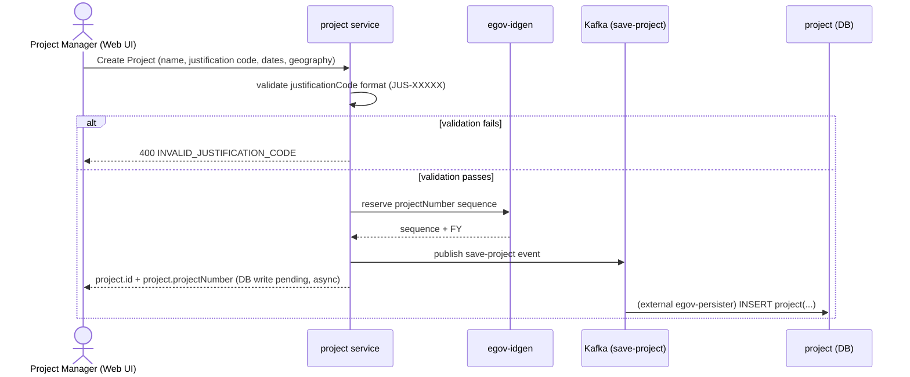

- **API Path:** `POST /project/v1/_create`
- **Service:** `project`
- **Kafka:** **Yes** — confirmed in code: `ProjectService.java:135-136` calls `producer.push(getSaveProjectTopic(), projectRequest)` → topic `save-project` (`application.properties:127`); matches `project-persister.yml:185` (`INSERT INTO project(...)`), consumed by an external generic `egov-persister` (not vendored in this repo). The idgen call itself (`IDGEN`) is synchronous REST — only the row write is async.
- **DB Write:** Yes — `project` (`additionalDetails.justificationCode`, `projectNumber`) — written asynchronously via the Kafka persister, not in the request thread
- **Data generated:** new `project` row; `projectNumber` reserved via `egov-idgen` (format `PROJ-<code>-<FY>-<seq>`, §3.1)

**Sample Request** (`Livelihood_API_Doc.md` §4.1)
```json
{
  "Projects": [
    {
      "tenantId": "in",
      "name": "Karnataka Agri Livelihood Q3 2026",
      "startDate": 1721606400000,
      "endDate": 1729382400000,
      "additionalDetails": {
        "justificationCode": "JUS-00120",
        "geography": { "states": ["KA"], "districts": ["Tumkur"], "blocks": [] }
      }
    }
  ]
}
```

**Sample Response** (§4.1)
```json
{
  "Project": [
    {
      "id": "proj-uuid-1",
      "projectNumber": "PROJ-00120-2627-001",
      "additionalDetails": { "justificationCode": "JUS-00120" },
      "auditDetails": { "createdTime": 1721654400000 }
    }
  ]
}
```

**Sample Error** (illustrative — not in API Doc; `justificationCode` is regex-validated per §4.1)
```json
{
  "ResponseInfo": { "status": "failed" },
  "Errors": [
    { "code": "INVALID_JUSTIFICATION_CODE", "message": "additionalDetails.justificationCode must match format JUS-XXXXX" }
  ]
}
```

### Step 2 — Download End User Site Excel

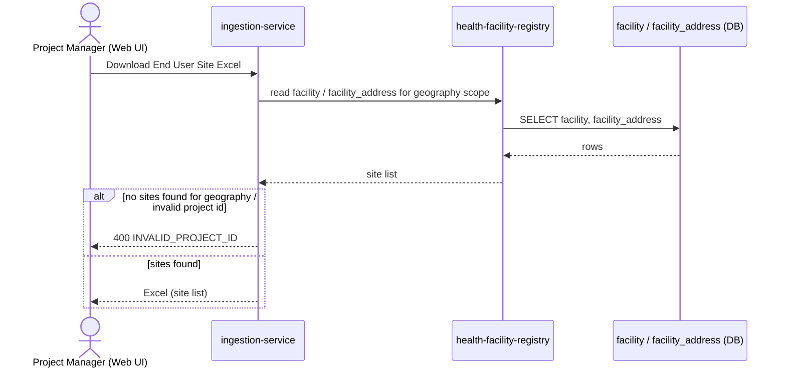

- **API Path:** `POST /ingestion-service/template/facilitySelection`
- **Service:** `ingestion-service` (reads `health-facility-registry`'s data internally)
- **Kafka:** No — synchronous template-generation request/response
- **DB Write:** No (read-only) — reads `facility`, `facility_address` (health-facility-registry)
- **Data generated:** Excel file only — no DB write

**Sample Request** (§4.2, multipart form)
```
parent_project_id: proj-uuid-1
boundary_codes: KA.TUMKUR.SIRA
request_info: {"apiId":"installation-app", "authToken":"..."}
```

**Sample Response** (§4.2)
```
200 OK
Content-Type: application/vnd.openxmlformats-officedocument.spreadsheetml.sheet
columns: Site Name (readonly), Village, State, District, Block, Sector, Include (Yes/No)
```

**Sample Error** (illustrative — not in API Doc)
```json
{
  "ResponseInfo": { "status": "failed" },
  "Errors": [ { "code": "INVALID_PROJECT_ID", "message": "No project found for id proj-uuid-1" } ]
}
```

### Step 3 — Mark Include Yes/No, upload

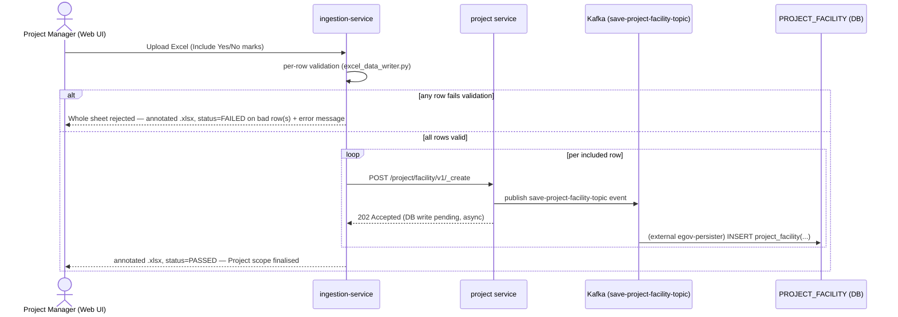

- **API Path:** `POST /ingestion-service/ingest/facilitySelection` (internally calls `project` service's `POST /project/facility/v1/_create` per row, confirmed at `project_service_client.py:225-226`)
- **Service:** `ingestion-service` → `project`
- **Kafka:** **Yes** — confirmed in code: `ProjectFacilityService.java:138` calls `projectFacilityRepository.save(entities, getCreateProjectFacilityTopic())` → topic `save-project-facility-topic`; matches `project-persister.yml:588-626` (`INSERT INTO project_facility(...)`). Controller returns HTTP `202 Accepted` (`ProjectApiController.java:172-234`), consistent with a fire-and-forget async write.
- **DB Write:** Yes — `PROJECT_FACILITY` (written asynchronously via the Kafka persister, one row per included site)
- **Data generated:** Project-level site scope rows; **Project ID finalised**

**Sample Request** (§4.3, multipart form)
```
project_id: proj-uuid-1
facility_selection_file: <Sheet0-Completed.xlsx>
request_info: {...}
```

**Sample Response** (§4.3 — annotated workbook, not JSON; per §1 conventions there is no separate JSON error body)
```
200 OK — same .xlsx returned with per-row status/error columns filled in, e.g.:
row 14 → status=FAILED, error="Include marked Yes but row is outside selected geography"
all other rows → status=PASSED, error=""
```

**Sample Error** (this endpoint's failure mode is per-row, embedded in the returned workbook — §4.3)
```
row-level: status=FAILED, error="Include marked Yes but row is outside selected geography"
```

### Step 4 — Create Installation Plan

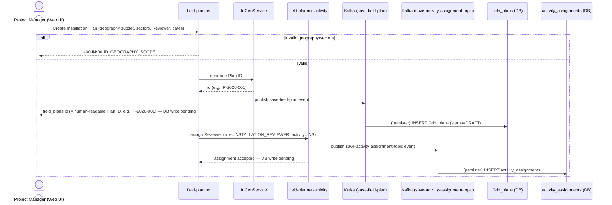

- **API Path(s) / Service(s)** (two distinct calls per `Livelihood_API_Doc.md` §5.1/§5.2, drawn above as one actor-facing step):
  1. `POST /v1/field-plans/_create` — **field-planner** (creates `field_plans`, status `DRAFT`)
  2. `POST /v1/activities/_assign-activity` — **field-planner-activity** (creates `activity_assignments` row against the pre-seeded `INS` activity)
- **Kafka:** **Yes** for both calls, confirmed in code: `FieldPlannerService.java:103` pushes to topic `save-field-plan`; `ActivityService.java:171-187` pushes to topic `save-activity-assignment-topic` (`ActivityAssignmentRepository` is never called for writes — the service pushes to Kafka directly, bypassing the repository entirely). **Caveat:** unlike `project`/`egov-workflow-v2`/`asset-registry`, the persister YAML that would consume these two topics was **not found in this repo** — `field-planner`'s bundled `FieldPlanner-persister.yml` is a byte-for-byte stale copy of `project-persister.yml` with no mapping for either topic. The producer call is unambiguous; the downstream persister config lives outside this checkout.
- **DB Write:** Yes — `field_plans` (+ `sectors`, `senior_contact_*` cols, §3.2), `activity_assignments` (role `INSTALLATION_REVIEWER` against pre-seeded `INS` activity) — both written asynchronously via Kafka
- **Data generated:** new `field_plans` row, `status='DRAFT'`; `id` generated via `IdGenService` as the Plan ID (e.g. `IP-2026-001`, §3.0/§3.2)

**Sample Request** (call 1 — §5.1)
```json
{
  "FieldPlans": [
    {
      "tenantId": "in",
      "name": "Sira Block Installation Plan 1",
      "projectId": "proj-uuid-1",
      "geographyScope": { "districts": ["Tumkur"], "blocks": ["Sira"] },
      "sectors": ["Agriculture"],
      "startDate": 1721606400000,
      "endDate": 1724198400000,
      "additionalDetails": {
        "seniorContactName": "Ravi Kumar", "seniorContactEmail": "ravi.kumar@selco.example", "seniorContactPhone": "9900012345"
      }
    }
  ]
}
```

**Sample Response** (call 1 — §5.1)
```json
{ "FieldPlan": [ { "id": "IP-2026-001", "uuid": "8f2c1e40-...-internal", "status": "DRAFT" } ] }
```

**Sample Request** (call 2 — §5.2)
```json
{
  "ActivityAssignments": [
    { "tenantId": "in", "fieldPlanId": "IP-2026-001", "activityId": "activity-ins-uuid",
      "assignedTo": "hrms-reviewer-uuid", "role": { "code": "INSTALLATION_REVIEWER" }, "pocNumber": "9900012399" }
  ]
}
```

**Sample Response** (call 2 — §5.2)
```json
{ "ActivityAssignment": [ { "id": "assign-uuid-1", "status": "ACTIVE" } ] }
```

**Sample Error** (illustrative — not in API Doc)
```json
{
  "ResponseInfo": { "status": "failed" },
  "Errors": [ { "code": "INVALID_GEOGRAPHY_SCOPE", "message": "geographyScope.districts/blocks must be non-empty" } ]
}
```

### Step 5 — Download Installation Scope Excel (Sheet 1)

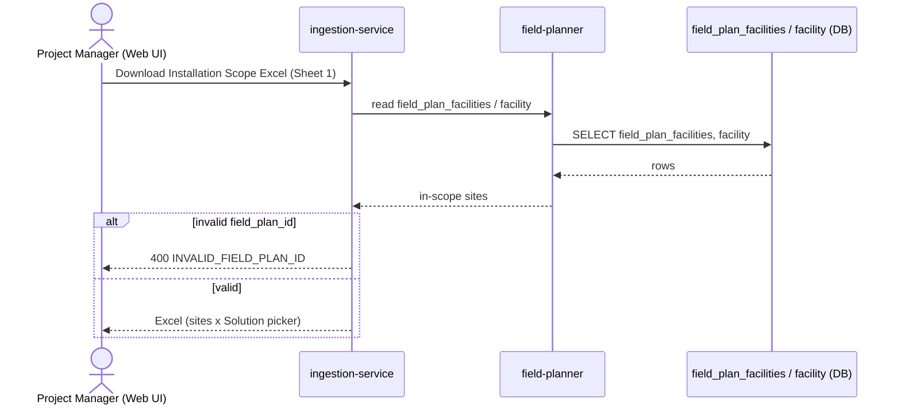

- **API Path:** `POST /ingestion-service/template/fieldplanFacilityIngestionTemplate`
- **Service:** `ingestion-service` (reads `field-planner`'s data internally)
- **Kafka:** No
- **DB Write:** No (read-only) — reads `field_plan_facilities`, `facility`
- **Data generated:** Excel: one row per in-scope site

**Sample Request** (§5.3, multipart form)
```
field_plan_id: IP-2026-001
request_info: {...}
```

**Sample Response** (§5.3)
```
200 OK — .xlsx, columns: Site Name (readonly), Village, State, District, Block, Sector (readonly),
Include (Yes/No), Solution (dropdown, filtered), Lock Status (readonly)
```

**Sample Error** (illustrative — not in API Doc)
```json
{
  "ResponseInfo": { "status": "failed" },
  "Errors": [ { "code": "INVALID_FIELD_PLAN_ID", "message": "No field plan found for id IP-2026-001" } ]
}
```

### Step 6 — Mark Include + pick Solution per site, upload

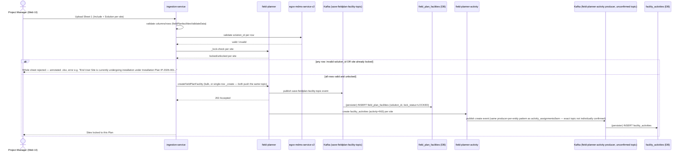

- **API Path(s) / Service(s)** (per §5.4/§5.5/§5.6/§3.1, this actor-facing step fans out to five calls):
  1. `POST /ingestion-service/ingest/fieldPlanfacilitiesValidateData` — **ingestion-service** (row validation against MDMS `data-ingestion.FieldPlanFacilityIngestionSchema`)
  2. `POST /mdms-v2/v1/_search` — **egov-mdms-service-v2** (validates each row's `solution_id`)
  3. `POST /v1/field-plans/facility/_lock-check` — **field-planner** (FR-06 lock check, invoked from call 4's row loop)
  4. `POST /ingestion-service/ingest/createFieldPlanFacility` — **ingestion-service** (actual create/link/unlink, calls `FieldPlanServiceClient`)
  5. `POST /v1/field-plans/facility/bulk/_create` — **field-planner** (bulk-assigns `solutionId`/`lockStatus`)
- **Kafka:** **Yes** for call 5, confirmed two ways: API Doc §5.5 documents `202 Accepted (async, existing Kafka-backed pattern)`, and code confirms `FieldPlannerFacilityService.java:83` pushes to topic `save-fieldplan-facility-topic` — and, per code investigation, the **single**-row `/facility/_create` endpoint (`FieldPlannerApiController.java:100-107`) pushes to the exact same topic via the same service method, so single vs. bulk is not an architectural distinction, just an extra internal Kafka hop for the bulk case (`FieldPlanFacilityConsumer.java:33-43` re-lands on the identical `producer.push()` call). Calls 1–3 are synchronous reads/validation (no write). `facility_activities` creation (triggered off call 4/5, but owned by `field-planner-activity`) was **not individually verified** in code — however, every other `field-planner-activity` write path checked (`activity_assignments`, `bom`) uses the identical Kafka-producer-per-entity architecture with zero direct JDBC writes found anywhere in that service, so it's very likely this table follows the same pattern; just not confirmed topic-by-topic.
- **DB Write:** Yes — `field_plan_facilities` (`solution_id`, `lock_status='LOCKED'`, written asynchronously via call 5's Kafka persister); `facility_activities` row (activity=`INS`) created per included site (field-planner-activity, likely also Kafka-backed per the architecture note above)
- **Data generated:** sites locked to this Plan; per-site `facility_activities` execution instance created

**Sample Request** (call 1, §5.4 — validate step, multipart form)
```
field_plan_id: IP-2026-001
scope_file: <Sheet1-Completed.xlsx>
request_info: {...}
```

**Sample Response** (call 1, §5.4 — annotated workbook)
```
200 OK — same .xlsx returned with status/error columns filled in per row
```

**Sample Error** (call 1, §5.4 — locked site)
```
row-level: status=FAILED, error="End User Site \"ABC Farmer Group\" is currently undergoing installation under
Installation Plan \"IP-2026-001\". The site can be included in another Installation Plan only after all
installation reports are approved."
```

**Sample Request** (call 5, §5.5)
```json
{
  "FieldPlanFacilities": [
    { "tenantId": "in", "fieldPlanId": "IP-2026-001", "facilityId": "site-uuid-42", "solutionId": "SOL-PULVERIZER-001" }
  ]
}
```

**Sample Response** (call 5, §5.5)
```json
{ "ResponseInfo": { "status": "successful" } }
```
*(HTTP `202 Accepted` — the row is not guaranteed persisted yet at response time; it lands via the Kafka-backed persister.)*

**Sample Error** (call 3, §5.6 lock-check — this one returns a normal 200 with per-facility locked flags, not an error envelope)
```json
{
  "lockStatuses": [
    { "facilityId": "site-uuid-42", "locked": false },
    { "facilityId": "site-uuid-58", "locked": true, "lockingPlanId": "plan-uuid-9", "lockingPlanNumber": "IP-2026-004" }
  ]
}
```

### Step 7 — Assign Vendor + Vendor Email per row (Web UI)

> **Design note:** the PRD's literal FR-07 text describes this step as an Excel download/upload round-trip through `ingestion-service` (the old "Sheet 2"). This design instead uses a direct Project Manager Web UI screen — `ingestion-service` is not involved in Vendor Assignment at all (LLD §1.1/§5.2).

> **📌 Where display-name caching happens (for Field Technician flow Step 1):** the `bom` rows this screen operates on are already auto-created per `facility_activity` × `asset_type` by the time this screen opens (exact trigger point not individually confirmed elsewhere in this doc — likely a side effect of Step 6's `facility_activities` creation, following the same Kafka-producer-per-entity pattern already confirmed for `activity_assignments`/`bom`). **This creation point — `BomEnrichment.enrichBomOnCreate`, the one confirmed hook every `bom` row passes through on create — is where the one-time `health-facility-registry` (`POST /v2/facility/search`, resolving this row's `facility_id` to a name + `facility_address`) and `egov-mdms-service-v2` (`POST /mdms-v2/v1/_search`, resolving this row's `solution_id` to a Solution name + `associatedMachines`) lookups should run**, writing their result into `bom.additionalDetails` (`siteName`/`sitePincode`/`siteState`/`siteDistrict`/`siteBlock`/`solutionName`/`machineNames`) once per row. Doing it here — rather than on every Field Technician `_search` — is safe because `ActivityServiceUtil.mergeBOMAdditionalDetails` deep-merges `additionalDetails` on every subsequent `_update` (Field Technician flow Step 5's combined report update, Step 7's OTP write), so it won't be overwritten later; and a site's name/location and a Solution's identity are effectively immutable for the life of one installation task, so staleness risk is low. Not yet implemented — flagging as the intended hook point for whoever builds this.

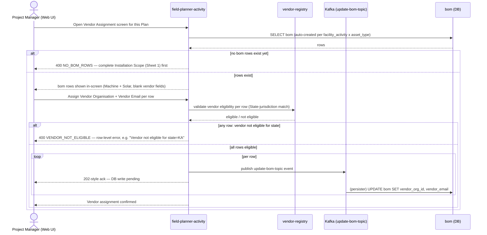

- **API Path(s) / Service(s)** (illustrative — no `ingestion-service` involvement to cite here; API Doc's §6.1–§6.3 still describe the old Excel-based endpoints and haven't been updated for this design change):
  1. `POST /v1/bom/_search` — **field-planner-activity** (fetch bom rows for this Plan, to populate the Web UI grid)
  2. `POST /organisation/v1/_search` — **vendor-registry** (jurisdiction/State eligibility check, reads `eg_org_jurisdiction`)
  3. `POST /v1/bom/_update` — **field-planner-activity** (per-row write)
- **Kafka:** Call 3 — **Yes**, confirmed in code: `BomService.java:197` calls `producer.push(getUpdateBOMTopic(), request)` → topic `update-bom-topic`; no JDBC write exists anywhere in `BomRepository.java` (only `_search` uses `JdbcTemplate`). Same persister-config-not-found caveat as Step 4 applies (topic not mapped in the local, stale `FieldPlanner-persister.yml`). Calls 1/2 — read-only, direct synchronous REST.
- **DB Write:** Yes — `bom.vendor_org_id`, `bom.vendor_email` (written asynchronously via call 3's Kafka producer)
- **Data generated:** Vendor assigned per asset row

**Sample Request** (call 1, illustrative, consistent with §6.3's model)
```json
{ "criteria": { "tenantId": "in", "fieldPlanId": "IP-2026-001" } }
```

**Sample Response** (call 1, illustrative)
```json
{
  "BillOfMaterial": [
    { "id": "bom-uuid-1", "activityFacilityId": "fac-act-uuid-42", "assetType": "MACHINE", "vendorOrgId": null, "vendorEmail": null }
  ],
  "totalCount": 1
}
```

**Sample Error** (illustrative — no bom rows yet)
```json
{
  "ResponseInfo": { "status": "failed" },
  "Errors": [ { "code": "NO_BOM_ROWS", "message": "No Machine/Solar rows exist yet — complete Installation Scope (Sheet 1) first" } ]
}
```

**Sample Request** (call 2, §3.2)
```json
{
  "orgSearchCriteria": {
    "tenantId": "in",
    "orgType": "VENDOR",
    "orgSubType": "INSTALLATION_VENDOR",
    "jurisdiction": ["KA"]
  }
}
```

**Sample Response** (call 2, §3.2)
```json
{
  "organisations": [
    { "id": "org-uuid-1", "name": "SunTech Installers Pvt Ltd", "orgType": "VENDOR", "orgSubType": "INSTALLATION_VENDOR",
      "orgPocEmail": "ops@suntech.example", "orgPocPhone": "9900011122", "isActive": true }
  ],
  "totalCount": 1
}
```

**Sample Request** (call 3, illustrative, extract)
```json
{ "BillOfMaterials": [ { "id": "bom-uuid-1", "tenantId": "in", "vendorOrgId": "org-uuid-1", "vendorEmail": "ops@suntech.example" } ] }
```

**Sample Error** (call 3, illustrative — vendor not eligible for this row's state)
```json
{
  "ResponseInfo": { "status": "failed" },
  "Errors": [ { "code": "VENDOR_NOT_ELIGIBLE", "message": "Vendor not eligible for state=KA" } ]
}
```

### Step 8 — Download prepopulated Installation Template

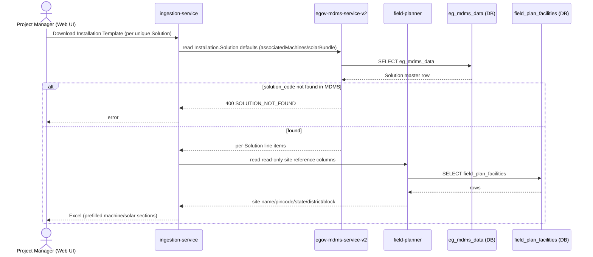

- **API Path(s) / Service(s)** (§6.4, §3.1):
  1. `POST /ingestion-service/template/installationTemplate` — **ingestion-service**
  2. `POST /mdms-v2/v1/_search` — **egov-mdms-service-v2** (reads `Installation.Solution` defaults, called internally by call 1)
- **Kafka:** No
- **DB Write:** No (read-only) — reads `egov-mdms-service-v2`'s `eg_mdms_data` (`associatedMachines`/`solarBundle`); reads `field_plan_facilities` read-only site columns
- **Data generated:** Excel: prefilled `machine_section`/`solar_section` + site reference columns

**Sample Request** (call 1, §6.4, multipart form)
```
field_plan_id: IP-2026-001
solution_code: SOL-PULVERIZER-001
request_info: {...}
```

**Sample Response** (call 1, §6.4)
```
200 OK — .xlsx, sections "Machine" and "Solar", columns: Installation Component, Quantity, Make, Model,
Capacity, Technical Specifications
```

**Sample Request** (call 2, §3.1)
```json
{
  "MdmsCriteria": {
    "tenantId": "in",
    "moduleDetails": [
      { "moduleName": "Installation", "masterDetails": [ { "name": "Solution", "filter": "[?(@.code=='SOL-PULVERIZER-001')]" } ] }
    ]
  }
}
```

**Sample Response** (call 2, §3.1)
```json
{
  "MdmsRes": {
    "Installation": {
      "Solution": [
        {
          "code": "SOL-PULVERIZER-001", "name": "Pulverizer", "sector": "Agriculture",
          "machineSpecs": { "type": "Pulverizer", "capacityRange": "5-10kg/hr" },
          "solarBundle": [ { "component": "Panel", "specDefault": "200W" } ]
        }
      ]
    }
  }
}
```

**Sample Error** (illustrative — not in API Doc)
```json
{
  "ResponseInfo": { "status": "failed" },
  "Errors": [ { "code": "SOLUTION_NOT_FOUND", "message": "No MDMS Solution master found for code SOL-PULVERIZER-001" } ]
}
```

### Step 9 — Adjust Template + Tender Number / Purchase Order No., upload

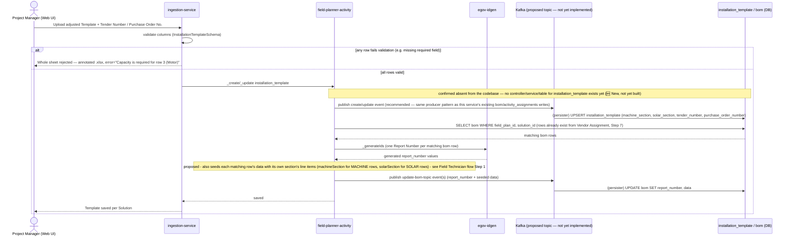

Note: `tender_number` may be left blank in this upload (optional). `purchase_order_number` may also be left blank here — it isn't validated at this step or at Publish (PM flow Step 10 below) — but is compulsory by the time the Field Technician submits the IC Report (Field Technician flow, Step 9), at which point it must be present either from this template upload or from the technician's own in-app entry. Unlike either of those, `report_number` is never entered by the PM or the Field Technician — it's generated automatically, right here, for every `bom` row already scoped to this `(field_plan_id, solution_id)`, the moment this upload succeeds (LLD §3.3). By the time a Field Technician opens their assigned task (Field Technician flow, Step 1), `report_number` is already populated on that row.

**📌 `bom.data` is also seeded here, not left empty until the technician submits.** LLD §3.3 states `bom.data`'s shape "mirrors `installation_template.machine_section`/`solar_section`... **seeded from the template on task load**." This upload is the first moment a `bom` row's matching section (machine or solar) actually exists as parsed data, and it's already looping over every matching `bom` row for `report_number` (above) — so the same loop should also copy that row's `asset_type`-matching section (`machineSection` for `MACHINE` rows, `solarSection` for `SOLAR` rows) into `bom.data`, in the same `_update` call. This means a Field Technician opening their task (Field Technician flow, Step 1) already sees the Project Manager's uploaded product/capacity/quantity defaults pre-filled — not a blank form — with only `make` (and any quantity the PM left blank) still open for the technician to confirm on-site, per LLD §3.3's Make/Quantity note. See Field Technician flow Step 1 for what this looks like using real values from `ICC_Report_Format_by_Solutionv1.xlsx`'s "Pulverizer" sheet. 🆕 Proposed, not yet implemented — `bom.data`'s seeding trigger isn't built any more than `installation_template` itself is.

- **API Path(s) / Service(s)** (§6.5, §6.6):
  1. `POST /ingestion-service/ingest/installationTemplate` — **ingestion-service** (row validation against `data-ingestion.InstallationTemplateSchema`)
  2. `POST /v1/installation-templates/_create` / `_update` — **field-planner-activity** (called from call 1's row loop)
  3. `POST /egov-idgen/id/_generate` — **egov-idgen** (external, one Report Number per matching `bom` row — 🆕 new usage of this existing DIGIT service, same pattern as Project ID/Plan ID generation, LLD §3.1/§3.2)
  4. `POST /v1/bom/_update` — **field-planner-activity** (writes the generated `report_number` **and** the seeded `data` back onto each matching `bom` row, one call per row, same as today's `report_number`-only write)
- **Kafka:** **Not yet implemented — confirmed absent from the codebase.** Repo-wide search found zero controller, service, repository, model, or DB migration referencing `installation_template`/`InstallationTemplate` anywhere; `field-planner-activity`'s only controllers are `HealthApiController`, `ActivityApiController`, `BOMApiController`. Since this is a 🆕 New endpoint (API Doc), that's expected rather than a gap. **Logical inference, not a confirmed fact:** every existing write path in this same service (`activity_assignments`, `bom` create/update) uses `producer.push(topic, entity)` with zero direct JDBC writes found anywhere in the service — so once built, `installation_template` would very likely follow the identical Kafka-producer pattern for consistency. Call 4's own `bom.report_number`/`bom.data` write would follow the confirmed `update-bom-topic` producer pattern already used for `bom.otp_uuid` (Field Technician flow, Step 7) — and since `ActivityServiceUtil`'s merge helper for `bom` only covers `additionalDetails` (not `data`), a plain `data` field on this same `_update` call replaces the whole map, which is fine here since this is the row's *first* `data` write, before the technician has touched it.
- **DB Write:** Not yet implemented — `installation_template` table itself was not found in this repo's migrations. `bom.report_number` is a new column on an existing table (§3.3), also not yet implemented; the proposed `bom.data` seeding write uses the existing `data` column, no schema change needed there.
- **Data generated:** one `installation_template` row per `(field_plan_id, solution_id)`; one `report_number` per matching `bom` row; that same `bom` row's `data` seeded with its section's line items (🆕 proposed)

**Sample Request** (call 1, §6.5, multipart form)
```
field_plan_id: IP-2026-001
solution_code: SOL-PULVERIZER-001
template_file: <InstallationTemplate-Completed.xlsx>
request_info: {...}
```

**Sample Response** (call 1, §6.5 — annotated workbook)
```
200 OK — same .xlsx returned with status/error columns filled in
```

**Sample Error** (call 1, §6.5)
```
row-level: status=FAILED, error="Capacity is required for row 3 (Motor)"
```

**Sample Request** (call 2, §6.6)
```json
{
  "InstallationTemplates": [
    {
      "tenantId": "in", "fieldPlanId": "IP-2026-001", "solutionId": "SOL-PULVERIZER-001",
      "machineSection": { "components": [ { "name": "Motor", "quantity": 1, "make": "Crompton", "model": "CG-5HP", "capacity": "5HP" } ] },
      "solarSection": { "components": [ { "name": "Panel", "quantity": 4, "make": "Waaree", "model": "WS-200", "capacity": "200W" } ] },
      "tenderNumber": null,
      "purchaseOrderNumber": "PO-2026-00417"
    }
  ]
}
```
*(`tenderNumber` shown here as `null` to illustrate that it's optional — a PM can also leave `purchaseOrderNumber` `null` at this step and have the Field Technician fill it in later, per the note above.)*

**Sample Response** (call 2, §6.6)
```json
{ "InstallationTemplate": [ { "id": "tmpl-uuid-1" } ] }
```

**Sample Request** (call 3, illustrative — same shape as this repo's other `egov-idgen` usage, LLD §3.1)
```json
{ "idRequests": [ { "idName": "bom.report.number", "tenantId": "in", "format": "IC-[fy:yyyy-yy]-[SEQ_IC_REPORT]" } ] }
```

**Sample Response** (call 3, illustrative)
```json
{ "idResponses": [ { "idName": "bom.report.number", "id": "IC-2026-27-00842" } ] }
```

**Sample Request** (call 4, illustrative, extract — MACHINE row, seeded `data` using real values from `ICC_Report_Format_by_Solutionv1.xlsx`'s "Pulverizer" sheet, Associated Machines section)
```json
{
  "BillOfMaterials": [
    {
      "id": "bom-uuid-1", "tenantId": "in", "reportNumber": "IC-2026-27-00842",
      "data": {
        "components": [
          { "slNo": 1, "product": "Blade Type-3-HP-AC-25-kgs/hr", "itemCode": "202526CHSF0000143", "make": null, "capacity": "1", "quantity": 2 }
        ]
      }
    }
  ]
}
```
*(`make` arrives `null` — blank in the source sheet for every line item, Machine and Solar alike, left for the Field Technician to fill in on-site per LLD §3.3's Make/Quantity note. `capacity`'s raw value is literally `"1"` in the source file — the real spec ("3 HP", "25 kgs/hr") is embedded in the `product` text itself rather than broken out into its own field; this is a quirk of how the real sheet is authored, not a display bug, and worth resolving in the actual `InstallationTemplateSchema` before implementation. `itemCode` is the machine's own code prefix parsed off the `product` cell — a field not yet named anywhere in the LLD's schema, flagging as an open question: keep it folded into `product` as in the source, or split it out into its own column.)*

**Sample Request** (call 4, illustrative, extract — SOLAR row for the same facility, seeded `data` using real values from the same sheet's Bill Of Material section, truncated to 4 of 36 line items for brevity)
```json
{
  "BillOfMaterials": [
    {
      "id": "bom-uuid-3", "tenantId": "in", "reportNumber": "IC-2026-27-00844",
      "data": {
        "bundleItemCode": "202526PASF0000379",
        "components": [
          { "category": "Solar Panel", "slNo": 1, "product": "Solar Panel-N-Type TOPCon-525-Wp-24V", "make": null, "capacity": "N-Type TOPCon | 525 | 24", "quantity": 8 },
          { "category": "Battery", "slNo": 2, "product": "Solar Battery-Flooded Tall Tubular Lead Acid-150-Ah-12V-c10", "make": null, "capacity": "Tall Tubular | 150 | 12", "quantity": 10 },
          { "category": "Inverter / PCU", "slNo": 3, "product": "Solar Inverter/PCU-MPPT-120V-10-kVA-SINGLE PHASE", "make": null, "capacity": "MPPT | 10 | 120", "quantity": 1 },
          { "category": "Mounting Structure", "slNo": 4, "product": "Module Mounting Structure -N-Type TOPCon-Customized-GI", "make": null, "capacity": "1", "quantity": 1 }
        ]
      }
    }
  ]
}
```
*(Full sheet has 36 line items across 14 categories — Solar Panel, Battery, Inverter/PCU, Mounting Structure, Rack/Enclosure, Junction/Protection Box, Cable, Switch/Socket/MCB, Lighting/Fan, Lightning Protection, Earthing, Safety/Docs, Fire Extinguisher, Consumables — matching LLD §3.3's category list; only 4 are shown here. `capacity`'s pipe-delimited values (e.g. `"N-Type TOPCon | 525 | 24"`) are single free-text cells in the source sheet, not 3 separate columns — same open question as the Machine row above. `bundleItemCode` (from the sheet's "Bundle / Item Code" field, row 13) is solar-bundle-level, one per `bom` row, distinct from each individual line item — also not yet named in the LLD's schema.)*

### Step 10 — Run Publish validation

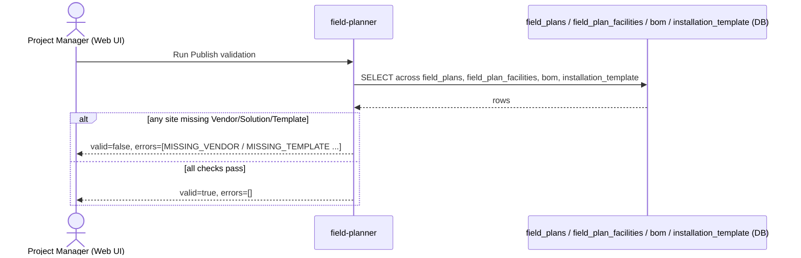

- **API Path:** `POST /v1/field-plans/{id}/_publish-validate`
- **Service:** `field-planner`
- **Kafka:** No
- **DB Write:** No (read-only) — reads across `field_plans`, `field_plan_facilities`, `bom`, `installation_template`
- **Data generated:** pass/fail validation result

**Sample Request** (§7.1)
```
POST /v1/field-plans/IP-2026-001/_publish-validate   (empty body besides RequestInfo)
```

**Sample Response — passes** (§7.1)
```json
{ "valid": true, "errors": [] }
```

**Sample Error / Response — fails** (§7.1)
```json
{
  "valid": false,
  "errors": [
    { "type": "MISSING_VENDOR", "siteName": "Doddaballapur SHG", "assetType": "SOLAR" },
    { "type": "MISSING_TEMPLATE", "solutionCode": "SOL-GRINDER-002" }
  ]
}
```

### Step 11 — Confirm & Submit (Publish)

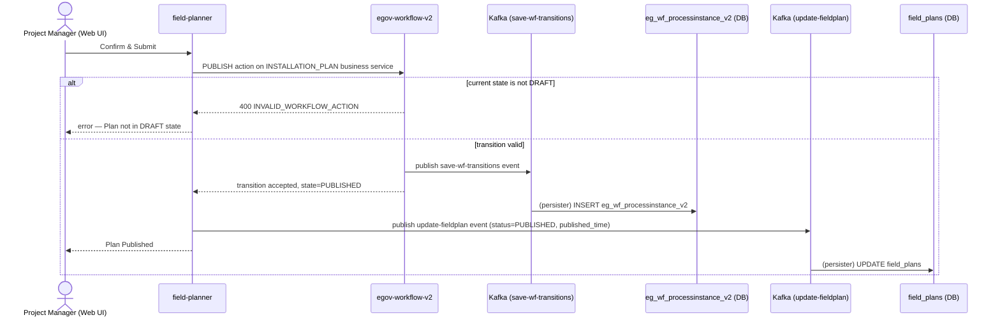

- **API Path:** `POST /egov-wf/process/_transition` (`action: "PUBLISH"`, `businessService: "INSTALLATION_PLAN"`)
- **Service:** `egov-workflow-v2` (called by `field-planner`)
- **Kafka:** **Yes**, confirmed for both writes: `StatusUpdateService.java:35-48` pushes to topic `save-wf-transitions` — no JDBC call in that class at all — matching `egov-workflow-v2-persister.yml:6` (`INSERT INTO eg_wf_processinstance_v2(...)`), a clean, fully-confirmed persister pairing. `field-planner`'s own `field_plans.status`/`published_time` update reuses the same `update-fieldplan` producer confirmed for Step 4 (`FieldPlannerService.java:517`) — same persister-config-not-found-in-repo caveat applies there.
- **DB Write:** Yes — `field_plans.status='PUBLISHED'`, `field_plans.published_time` (field-planner, async via Kafka); workflow's own `eg_wf_processinstance_v2` transition row (egov-workflow-v2, async via Kafka, confirmed persister)
- **Data generated:** Plan transitions `DRAFT → PUBLISHED` (terminal); tasks dispatched to Vendors

**Sample Request** (§7.2)
```json
{
  "ProcessInstances": [
    { "tenantId": "in", "businessService": "INSTALLATION_PLAN", "businessId": "IP-2026-001",
      "action": "PUBLISH", "comment": "All checks passed, dispatching to vendors" }
  ]
}
```

**Sample Response** (§7.2)
```json
{ "ProcessInstances": [ { "id": "pi-uuid-1", "state": { "state": "PUBLISHED" }, "businessId": "IP-2026-001" } ] }
```

**Sample Error** (illustrative — not in API Doc; e.g. re-publishing an already-published Plan)
```json
{
  "ResponseInfo": { "status": "failed" },
  "Errors": [ { "code": "INVALID_WORKFLOW_ACTION", "message": "Action PUBLISH is not valid for current state PUBLISHED" } ]
}
```

### Step 12 — (system) Publish notification to Vendors

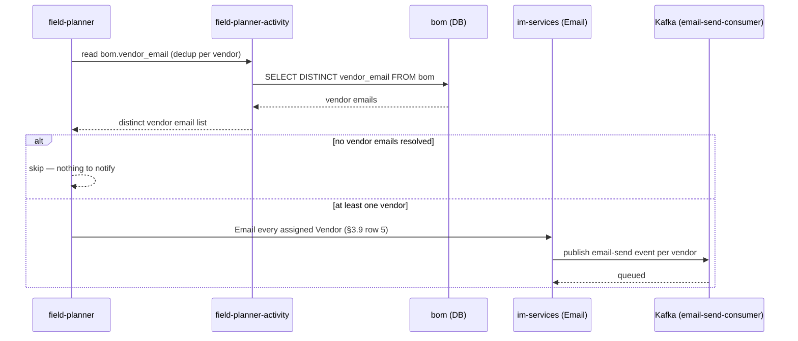

- **API Path:** internal side effect of Step 11's `PUBLISH` transition — not separately itemized in the API Doc (§7.2 note, §11: "not itemized as a separate API since it's an internal side effect of this same transition"). Underlying mechanism: `field-planner-activity`'s `bom.vendor_email` is read directly (no itemized search path given); the email call itself goes through `im-services`' `LivelihoodEmailNotificationService`.
- **Service:** `field-planner` (reads `bom.vendor_email` from `field-planner-activity`) → `im-services`
- **Kafka:** **Yes** — `im-services`' Email notification path publishes to a Kafka topic consumed by an email consumer (API Doc §11)
- **DB Write:** No new table — reads `bom`
- **Data generated:** Email sent once per distinct Vendor (§3.9 row 5)

**Sample Request** (illustrative — not in API Doc; Kafka message published by `im-services`)
```json
{
  "topic": "email-send-consumer",
  "value": {
    "tenantId": "in",
    "emailType": "INSTALLATION_PLAN_PUBLISHED",
    "recipientEmail": "ops@suntech.example",
    "templateParams": { "planId": "IP-2026-001", "planName": "Sira Block Installation Plan 1" }
  }
}
```

**Sample Response** — none (fire-and-forget publish; no synchronous response contract documented)

**Sample Error** (illustrative — not in API Doc)
```json
{ "error": "EMAIL_DISPATCH_FAILED", "message": "SMTP relay unreachable — message requeued for retry" }
```

---

## 2. Field Technician flow

**PRD basis:** same as LLD §5.3 — §10.2, §12.2 Fig. 4, FR-10/FR-11. **Run once per `bom` row** (Machine and Solar progress independently — see LLD §5.3's note); each diagram below is one node from that single-row flow.

### Step 1 — Open assigned task


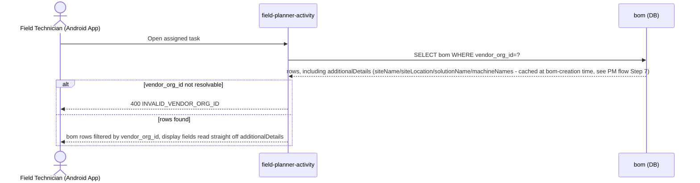

- **API Path:** `POST /v1/bom/_search` — **field-planner-activity** (unchanged from the confirmed, existing endpoint — no internal fan-out calls needed at read time)
- **Kafka:** No
- **DB Write:** No (read-only) — reads `bom`, including its `additionalDetails` column
- **Data generated:** task list — one entry per `bom` row assigned to this vendor. No longer a flat "0/1/2 entries" cap: a `SOLAR` row is always exactly one per facility (the solar bundle is captured as a single BoM), but `MACHINE` is now **one `bom` row per individual machine**, not one row per facility — so a facility on a multi-machine Solution (e.g. "Oil Mill" = 2 machines, LLD §3.6) contributes 2 separate `MACHINE` rows, each independently vendor-assigned and independently progressing through its own workflow instance, plus 1 `SOLAR` row = 3 `bom` rows total for that one facility. Each entry carries cached site name/location + asset display name + Solution name straight from `additionalDetails` — no `health-facility-registry`/MDMS calls at this step.

**Sample Request** (§6.3/§8.1, filtered by `vendorOrgId`)
```json
{ "criteria": { "tenantId": "in", "vendorOrgId": "org-uuid-1" } }
```

**Sample Response** (§6.3, enriched via cached `additionalDetails` — 🆕 proposed shape, see PM flow Step 7 for how these keys get written)
```json
{
  "BillOfMaterial": [
    {
      "id": "bom-uuid-1",
      "activityFacilityId": "fac-act-uuid-42",
      "assetType": "MACHINE",
      "vendorOrgId": "org-uuid-1",
      "reportNumber": "IC-2026-27-00842",
      "solutionId": "SOL-PULVERIZER-001",
      "additionalDetails": {
        "solutionName": "Pulverizer",
        "machineName": "Pulverizer_PQ234",
        "siteName": "ABC Farmer Producer Group",
        "sitePincode": "560001",
        "siteState": "Karnataka",
        "siteDistrict": "Bengaluru Urban",
        "siteBlock": "Yelahanka"
      },
      "data": {
        "components": [
          { "slNo": 1, "product": "Blade Type-3-HP-AC-25-kgs/hr", "itemCode": "202526CHSF0000143", "make": null, "capacity": "1", "quantity": 2 }
        ]
      }
    }
  ],
  "totalCount": 1
}
```
*(`reportNumber` arrives already populated — it was system-generated back at the Project Manager's Installation Template upload, Project Manager flow Step 9, not something this screen or the technician generates. Every `additionalDetails.*` key here was written once, at `bom`-creation time — see PM flow Step 7's note — not resolved live on this call. `machineName` is a single value, not an array — per the design revision, a Solution that lists more than one machine (e.g. "Oil Mill" = 2 machines, LLD §3.6) now gets one distinct `bom` row per machine instead of one row holding an array of machine names, so each row's `machineName` names exactly the one machine that row is for. `data` is likewise not empty — it's seeded from the Project Manager's uploaded Installation Template at PM flow Step 9 (same moment `reportNumber` is assigned), so the technician opens the task already seeing this row's product/quantity pre-filled and only `make` (blank here, per the real source sheet — see PM flow Step 9's note) left to confirm on-site. Values are taken directly from `ICC_Report_Format_by_Solutionv1.xlsx`'s "Pulverizer" sheet, Associated Machines section.)*

**Sample Response — a `SOLAR` row for the same facility** (same endpoint, same shape — asset type is the only structural difference)
```json
{
  "BillOfMaterial": [
    {
      "id": "bom-uuid-3",
      "activityFacilityId": "fac-act-uuid-42",
      "assetType": "SOLAR",
      "vendorOrgId": "org-uuid-5",
      "reportNumber": "IC-2026-27-00844",
      "solutionId": "SOL-PULVERIZER-001",
      "additionalDetails": {
        "solutionName": "Pulverizer",
        "siteName": "ABC Farmer Producer Group",
        "sitePincode": "560001",
        "siteState": "Karnataka",
        "siteDistrict": "Bengaluru Urban",
        "siteBlock": "Yelahanka"
      },
      "data": {
        "bundleItemCode": "202526PASF0000379",
        "components": [
          { "category": "Solar Panel", "slNo": 1, "product": "Solar Panel-N-Type TOPCon-525-Wp-24V", "make": null, "capacity": "N-Type TOPCon | 525 | 24", "quantity": 8 },
          { "category": "Battery", "slNo": 2, "product": "Solar Battery-Flooded Tall Tubular Lead Acid-150-Ah-12V-c10", "make": null, "capacity": "Tall Tubular | 150 | 12", "quantity": 10 },
          { "category": "Inverter / PCU", "slNo": 3, "product": "Solar Inverter/PCU-MPPT-120V-10-kVA-SINGLE PHASE", "make": null, "capacity": "MPPT | 10 | 120", "quantity": 1 },
          { "category": "Mounting Structure", "slNo": 4, "product": "Module Mounting Structure -N-Type TOPCon-Customized-GI", "make": null, "capacity": "1", "quantity": 1 }
        ]
      }
    }
  ],
  "totalCount": 1
}
```
*(Same `activityFacilityId`/`solutionId`/site fields as the `MACHINE` row above — it's the same facility and the same Solution, so those resolve identically. Three things differ: `assetType: "SOLAR"`, a different `vendorOrgId` (Solar vendors are frequently a different Vendor Organisation than the Machine vendor for the same site, per FR-07), and no `machineName` key at all — FR-10 shows the literal string "Solar" as the asset-type label for these rows, not a component name, so there's nothing to cache there. Shown as a separate response here purely for illustration; in practice a single `_search` filtered by `vendorOrgId` only ever returns the rows assigned to that one vendor — a Solar vendor's own call would never see this facility's `MACHINE` row(s) at all, and vice versa, which is what satisfies "Machine vendors don't see the Solar scope; Solar vendors don't see the Machine scope" from FR-10's acceptance criteria. `data` is truncated to 4 of the real sheet's 36 line items for brevity — see PM flow Step 9's note for the full category list and the same values' source.)*

**Sample Error** (illustrative — not in API Doc)
```json
{
  "ResponseInfo": { "status": "failed" },
  "Errors": [ { "code": "INVALID_VENDOR_ORG_ID", "message": "No vendor organisation found for org-uuid-1" } ]
}
```

**Sample — degraded row** (illustrative; not in API Doc — only relevant at `bom`-creation time, per PM flow Step 7, since this step no longer calls out to anything live)
```json
{
  "BillOfMaterial": [
    { "id": "bom-uuid-1", "activityFacilityId": "fac-act-uuid-42", "assetType": "MACHINE", "vendorOrgId": "org-uuid-1", "additionalDetails": {} }
  ]
}
```
*(if the one-time enrichment lookup failed at creation time — e.g. `health-facility-registry`/MDMS unreachable at that moment — `additionalDetails` simply lacks these keys here; there is no retry built into this read path, so a failed creation-time lookup needs its own remediation, e.g. a retry job or PM-visible warning on the Vendor Assignment screen. Not a confirmed design decision, flagging for review.)*

### Step 2 — Review pre-filled site + template data

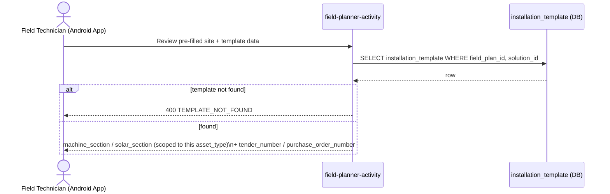

- **API Path:** `POST /v1/installation-templates/_search`
- **Service:** `field-planner-activity`
- **Kafka:** No
- **DB Write:** No (read-only) — reads `installation_template.machine_section` / `solar_section` (scoped to this row's `asset_type`), plus `tender_number` / `purchase_order_number`
- **Data generated:** template line items shown in-app, plus whichever of Tender Number / Purchase Order No. the PM already filled in (either may arrive blank — see Step 4 below for what the app does then)

**Sample Request** (illustrative shape, consistent with §6.6's model — API Doc doesn't itemize a `_search` sample for this)
```json
{ "criteria": { "tenantId": "in", "fieldPlanId": "IP-2026-001", "solutionId": "SOL-PULVERIZER-001" } }
```

**Sample Response** (fields per §6.6)
```json
{
  "InstallationTemplate": [
    {
      "id": "tmpl-uuid-1", "fieldPlanId": "IP-2026-001", "solutionId": "SOL-PULVERIZER-001",
      "machineSection": { "components": [ { "name": "Motor", "quantity": 1, "make": "Crompton", "model": "CG-5HP", "capacity": "5HP" } ] },
      "solarSection": { "components": [ { "name": "Panel", "quantity": 4, "make": "Waaree", "model": "WS-200", "capacity": "200W" } ] },
      "tenderNumber": null,
      "purchaseOrderNumber": "PO-2026-00417"
    }
  ]
}
```

**Sample Error** (illustrative — not in API Doc)
```json
{
  "ResponseInfo": { "status": "failed" },
  "Errors": [ { "code": "TEMPLATE_NOT_FOUND", "message": "No installation_template found for this field plan / solution" } ]
}
```

### Step 3 — Perform installation on-site

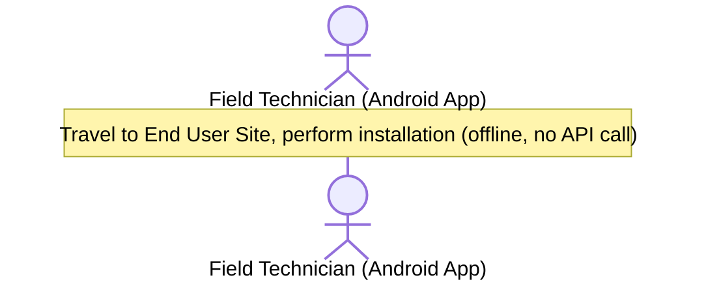

- **API Path:** none
- **Service:** none
- **Kafka:** N/A
- **DB Write:** No — none
- **Data generated:** none yet — physical installation only

### Step 4 — Fill IC Report in app

> **Design decision:** this step is purely client-side, no API call — the technician's edits are held in local app state only. Nothing is sent to the backend until the end of Step 5, where this data and the captured media's `fileStoreId`s are merged into **one combined** `POST /v1/bom/_update` call — fill data → capture/upload media → send everything together once.

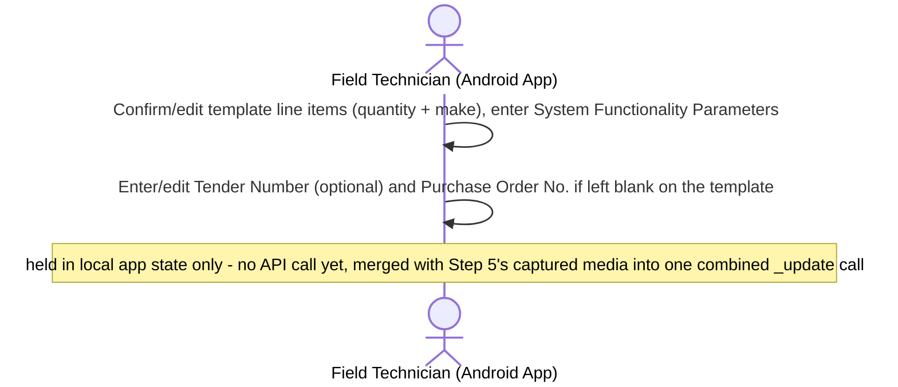

- **API Path:** none (client-side only; this step's data is sent later, combined with Step 5's `documents[]`, in a single `POST /v1/bom/_update` call — see Step 5)
- **Service:** none
- **Kafka:** N/A
- **DB Write:** No — none yet
- **Data generated:** report field values held in local app state, plus a `tenderNumber`/`purchaseOrderNumber` override if the technician filled in a value the template (fetched at Step 2) left blank. Purchase Order No. is compulsory — since the app already has the template's own value from Step 2, it can warn locally if neither the template nor this entry has one filled in, though the authoritative check that actually blocks Submit is server-side, at Step 9.

### Step 5 — Capture Photos / Video, upload, and save the combined IC Report

> **📌 Design decision:** photos/video are captured and uploaded to `egov-filestore` **first** — one multipart call per file, client-direct, not proxied through `field-planner-activity` — collecting a `fileStoreId` per file. Once all captures for this session are uploaded, the app builds **one** payload combining Step 4's `data` with this step's `documents[]` (each entry carrying its `fileStoreId`) and sends it in a **single** `POST /v1/bom/_update` call. This is the same endpoint used elsewhere in this flow, called once per save here — not once for data and once per photo.
>
> **🔍 Code-explored — confirmed absent, independent of this design:** no capture or upload UI exists anywhere in `installation-ui`'s `fa`/`qc` modules — `Filestore.js` in both only exposes a **read-only** `fetchDocumentFromFilestore` GET wrapper, used by the Reviewer's `QCActions.js` to *display* documents already attached to a `bom` row, never to capture or upload new ones. On the backend, `bom_document` has a real table, `Document` model, and read paths (`BomRepository.getDocumentsBasedOnBomIds`) — but **zero INSERT/persister config exists anywhere in the repo** (checked `FieldPlanner-persister.yml` and the full source tree). So sending `documents[]` on `_update` today would pass validation and land on `update-bom-topic`, but nothing consumes it into `bom_document` — a real gap independent of this design choice. `im-services`' `StorageController.java` (`POST /v2/video/upload`) → `StorageService.saveOriginalFileToS3` is a real, working "upload → `fileStoreId`" flow already in production elsewhere — a closer precedent to build this step's upload leg on than an unexplored bare `egov-filestore` call, though it isn't wired to `bom` today either.

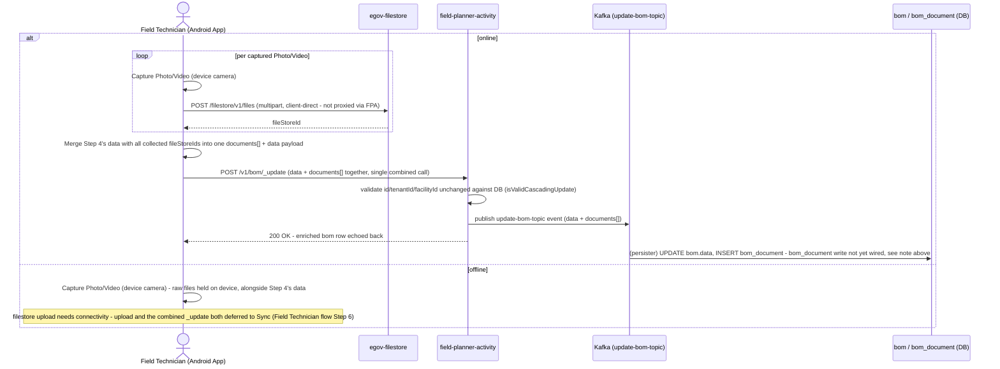

- **API Path(s):**
  1. `POST /filestore/v1/files` — **egov-filestore**, called directly by the Android app (multipart), once per captured photo/video
  2. `POST /v1/bom/_update` — **field-planner-activity** — called **once**, after all files for this session are uploaded, carrying **both** `data` (from Step 4) and `documents[]` (from this step) together
- **Service:** `egov-filestore` (call 1, N times), `field-planner-activity` (call 2, once)
- **Kafka:** Call 2 — **Yes**, confirmed: `BomService.java:197` pushes every update to `update-bom-topic`, `data` and `documents[]` alike, in the same message (`BillOfMaterial.java`'s `documents` field travels on the same object as `data` — no separate topic). Call 1 — not confirmed either way; plain filestore upload, no clear reason to expect a Kafka hop.
- **DB Write:** `bom.data` — yes, async via the persister. `bom_document` — intended, **not actually wired**: no INSERT/persister mapping exists anywhere in the repo today (see note above), so this call would accept the request and push to Kafka, but the `bom_document` rows it implies would not actually land in the table until that gap is closed.
- **Data generated:** `bom.data` populated with the technician's confirmed/edited line items, System Functionality Parameters, and any `tenderNumber`/`purchaseOrderNumber` override; one `bom_document` row intended per captured file, referencing its `fileStoreId` (pending the persister gap above)

**Sample Request** (call 1, multipart — repeated once per file)
```
file: panel_install.jpg
tenantId: in
module: installation
```

**Sample Response** (call 1)
```json
{ "files": [ { "id": "doc-uuid-1", "fileStoreId": "fs-uuid-1", "fileName": "panel_install.jpg" } ] }
```

**Sample Request** (call 2, illustrative, extract — combined `data` + `documents[]`, sent once; `id`/`tenantId`/`facilityId` must match this `bom` row exactly, per `isValidCascadingUpdate`)
```json
{
  "RequestInfo": { "apiId": "installation-app", "authToken": "..." },
  "BillOfMaterials": [
    {
      "id": "bom-uuid-1",
      "tenantId": "in",
      "facilityId": "fac-uuid-9",
      "documents": [
        { "id": "doc-uuid-99", "documentType": "PHOTO", "fileStoreId": "fs-uuid-1" },
        { "id": "doc-uuid-100", "documentType": "VIDEO", "fileStoreId": "fs-uuid-2" }
      ],
      "data": {
        "components": [
          { "slNo": 1, "product": "Blade Type-3-HP-AC-25-kgs/hr", "itemCode": "202526CHSF0000143", "make": "Crompton", "capacity": "1", "quantity": 2 }
        ],
        "systemFunctionalityParameters": { "arraySizeKwp": 5.2, "noOfModules": 20, "noOfStrings": 2 },
        "purchaseOrderNumber": "PO-2026-00418"
      }
    }
  ]
}
```
*(`id`/`tenantId`/`facilityId` must match this `bom` row's current DB values exactly — `isValidCascadingUpdate` rejects the call otherwise; only `data`, `documents`, and `additionalDetails` are free to differ. `make` is now `"Crompton"`, filled in by the technician at Step 4 — it arrived `null` from the Project Manager's template upload, per Field Technician flow Step 1's seeded sample. `documents[].id` is client-generated — a fresh UUID minted by the app for each new document — since `enrichFieldPlanRequestOnUpdate` never assigns document IDs on update the way create does. `purchaseOrderNumber` is included here because the template left it blank; if the template already had a value, this key would be omitted.)*

**Sample Response** (call 2, 200 OK — `BOMApiController.updateBillOfMaterials` echoes back the enriched request, it does not re-read the DB)
```json
{
  "ResponseInfo": { "status": "successful" },
  "BillOfMaterials": [
    {
      "id": "bom-uuid-1",
      "tenantId": "in",
      "facilityId": "fac-uuid-9",
      "documents": [
        { "id": "doc-uuid-99", "documentType": "PHOTO", "fileStoreId": "fs-uuid-1" },
        { "id": "doc-uuid-100", "documentType": "VIDEO", "fileStoreId": "fs-uuid-2" }
      ],
      "data": {
        "components": [
          { "slNo": 1, "product": "Blade Type-3-HP-AC-25-kgs/hr", "itemCode": "202526CHSF0000143", "make": "Crompton", "capacity": "1", "quantity": 2 }
        ],
        "systemFunctionalityParameters": { "arraySizeKwp": 5.2, "noOfModules": 20, "noOfStrings": 2 },
        "purchaseOrderNumber": "PO-2026-00418"
      },
      "auditDetails": { "lastModifiedBy": "user-uuid-ft1", "lastModifiedTime": 1755612345000 }
    }
  ]
}
```
*(This is the enriched request echoed back synchronously — updated `auditDetails`, `data`/`documents` as sent — not a fresh read of the row post-persist. The actual `bom.data` write happens moments later, asynchronously, once the persister consumes the `update-bom-topic` event; the `bom_document` rows implied by `documents[]` don't actually get written at all today, per the persister gap noted above.)*

**Sample Error** (illustrative — not in API Doc; e.g. stale/mismatched row identity)
```json
{
  "ResponseInfo": { "status": "failed" },
  "Errors": [ { "code": "ACTIVITY_CASCADE_UPDATE_ERROR", "message": "Can only update Activity facility dates, geographyDetails and additional details if cascade FieldPlan date update true" } ]
}
```
*(This is the actual exception message `BomService.handleUpdateBOM` throws today when `isValidCascadingUpdate` fails — its wording is a carryover from a different, older use of this same validator and reads oddly for this feature's context, but it's the real error a mismatched `id`/`tenantId`/`facilityId` produces as of now.)*

### Step 6 — Tap Sync when back online (offline path only)

> **📌 Note:** this step only runs if Step 5 took its offline branch — the technician had no connectivity when they finished capturing media, so the upload-to-`egov-filestore` and combined `_update` call from Step 5 never fired. There's no separate "save locally" step: Step 5's own offline branch already covers holding the IC Report data and raw media files on-device, so nothing further happens until the technician taps Sync here. If Step 5 already completed online, this step is skipped entirely and the flow goes straight to Step 7.

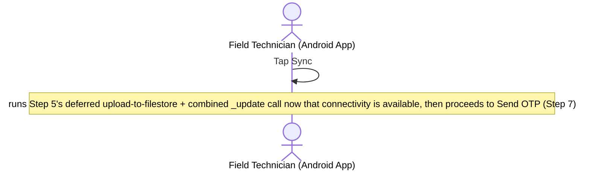

- **API Path:** none by itself — this is the trigger that fires Step 5's `POST /filestore/v1/files` + `POST /v1/bom/_update` calls (deferred from when the technician was offline), then proceeds to Step 7
- **Service:** none
- **Kafka:** N/A
- **DB Write:** No — a state transition on-device only; the actual writes happen once Step 5's deferred calls fire

### Step 7 — Send OTP

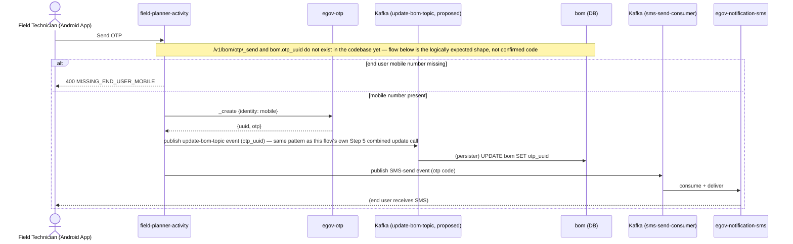

- **API Path(s) / Service(s)** (§8.2, §11):
  1. `POST /v1/bom/otp/_send` — **field-planner-activity** (thin wrapper)
  2. `POST /otp/v1/_create` — **egov-otp** (external, synchronous REST — called internally by call 1)
  3. SMS delivery — **egov-notification-sms** (reached only via Kafka topic, not a direct call)
- **Kafka:** Call 3 (SMS delivery) — **Yes**, API Doc §11 explicitly confirms Kafka-topic-based, in contrast to the `egov-otp` `_create` call which is direct synchronous REST (`No`). Call 1's own DB write (`bom.otp_uuid`) — **not yet implemented, confirmed absent from the codebase**: repo-wide search for `otp_uuid` returns zero hits, and `BOMApiController.java` has no `_send`/`_verify` endpoints at all (only `_create`, `_update`, `_search`, `_generate_pdf`, `_save_pdf`). **Logical inference, not a confirmed fact:** since `otp_uuid` would be a plain field on the existing `bom` entity, it would most naturally be written through the same confirmed `update-bom-topic` Kafka producer every other `bom` field update already uses (Project Manager flow Step 7's vendor assignment, this flow's own Step 5 combined `data`+`documents` update) — that's the recommended pattern, not code that exists today.
- **DB Write:** Not yet implemented — `bom.otp_uuid` column/write path was not found in this repo
- **Data generated:** OTP `uuid` stored; SMS code delivered to end user

**Sample Request** (call 1, §8.2)
```json
{ "tenantId": "in", "bomId": "bom-uuid-1", "endUserMobileNumber": "9876543210" }
```

**egov-otp `_create` call** (call 2, internal, §8.2)
```json
{ "otp": { "tenantId": "in", "identity": "9876543210" } }
```

**Sample Response** (call 1, §8.2)
```json
{ "otpUuid": "b3f1c2d4-...-otp-ref" }
```

**Sample Error** (illustrative — not in API Doc; e.g. mobile number missing on the facility record)
```json
{
  "ResponseInfo": { "status": "failed" },
  "Errors": [ { "code": "MISSING_END_USER_MOBILE", "message": "No mobile number on file for this facility's end user" } ]
}
```

### Step 8 — Enter & validate OTP

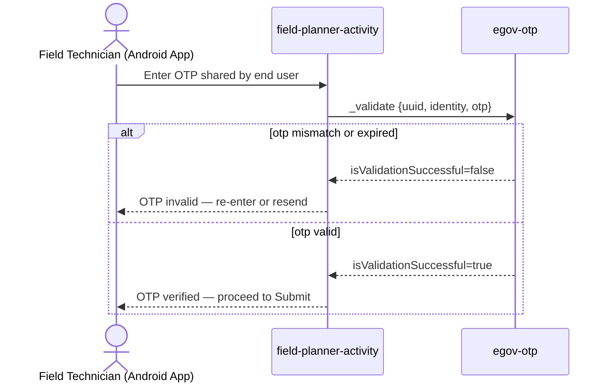

- **API Path(s) / Service(s)** (§8.3, §11):
  1. `POST /v1/bom/otp/_verify` — **field-planner-activity** (thin wrapper)
  2. `POST /otp/v1/_validate` — **egov-otp** (external, called internally by call 1)
- **Kafka:** No — API Doc §11 explicitly states OTP validation is a direct synchronous REST call, not Kafka-routed
- **DB Write:** No — no local `otp_verified` flag stored (the workflow transition at Step 9 is itself the durable record, §3.3)
- **Data generated:** validation result only

**Sample Request** (call 1, §8.3)
```json
{ "tenantId": "in", "bomId": "bom-uuid-1", "otp": "482913" }
```

**egov-otp `_validate` call** (call 2, internal, §8.3)
```json
{ "otp": { "tenantId": "in", "identity": "9876543210", "uuid": "b3f1c2d4-...-otp-ref", "otp": "482913" } }
```

**Sample Response — success** (§8.3)
```json
{ "otpVerified": true }
```

**Sample Error / Response — mismatch/expired** (§8.3, as returned by `egov-otp`)
```json
{ "otpVerified": false }
```

### Step 9 — Submit report

> **📌 Design note:** this step no longer uploads media or calls `_update` — that already happened at Step 5 (or Step 6, for a deferred offline sync). By the time the technician reaches Submit, `bom.data` and `bom.documents` are already saved (async, via the persister — see Step 5's/Step 6's caveats on the `bom_document` persister gap). Submit is purely the OTP-gated workflow transition, modeled below as a **single** `SUBMIT_REPORT` action, keyed on `activityFacilityId` (this component's split `facility_activities` row — see `Livelihood_Installation_Business_Service.md` §3.2 and this doc's Installation Reviewer flow §3). One side benefit of splitting Submit from the data/media save: the compulsory Purchase/Work Order No. check below now reads genuinely persisted `bom.data`/`installation_template` state, rather than needing to inspect a request payload still in flight.
>
> **On `SUBMIT_REPORT_A`/`SUBMIT_REPORT_B`:** there is no version-controlled config for `FACILITY_INSTALLATION` anywhere in this repo, no current frontend code fires either action (they only appear inside a hardcoded array in `fa`/`qc`'s document-display filters, never behind a Submit button), and no code path confirms a two-action Kafka push exists in this codebase. There is no evidence a two-action split is functionally necessary for this feature, and the PRD (FR-11) itself describes exactly one actor and one action. This design treats Submit as a single action; if `FACILITY_INSTALLATION` is still the chosen business service at implementation time and its real, verified config turns out to genuinely require two chained actions, that chaining should happen invisibly server-side (never as two Android-app calls) — but confirm this against the actual running `egov-workflow-v2` config first, rather than assuming it.
>
> **Asset creation.** Direct code trace found that **no call anywhere in this codebase ever creates an `asset` row for the Installation flow** — `ActivityService.updateAssetsForFacility` (Reviewer flow §3 Step 5) only searches for assets already tagged with `activityFacilityID` and updates them; nothing populates that tag in the first place. Without a fix, Approval's asset-handoff side effect would find zero rows and silently no-op. The fix belongs **here**, not earlier at Vendor Assignment — `serialNumber` (a required `Asset` field) is only known once the technician records it on-site (per the PRD's FR-11a note on scanned serial numbers for the Annexure), which happens as part of filling in the IC Report (Step 4), not at Vendor Assignment time. This reuses the **existing, already-implemented** `POST /v1/asset/_create` endpoint (`asset-registry`'s `V1ApiController`/`AssetService.createAsset`) — no new endpoint — just a new caller and a populated request.

```mermaid
sequenceDiagram
    actor FT as Field Technician (Android App)
    participant FPA as field-planner-activity
    participant AR as asset-registry
    participant WF as egov-workflow-v2
    participant KAFKA1 as Kafka (save-asset)
    participant KAFKA2 as Kafka (save-wf-transitions)
    participant DB as asset / eg_wf_processinstance_v2 (DB)

    FT->>FPA: Submit report
    alt Purchase/Work Order No. missing (neither installation_template nor bom.data has one)
        FPA-->>FT: 400 PURCHASE_ORDER_NUMBER_REQUIRED — cannot submit
    else OTP not verified for this bom row
        FPA-->>FT: 400 OTP_NOT_VERIFIED — cannot submit
    else Purchase/Work Order No. present and OTP verified
        FPA->>AR: POST /v1/asset/_create — one call per serial-numbered item in bom.data,\nactivityFacilityID + additionalDetails.sourceBomId set, isOperational=false
        AR->>KAFKA1: publish save-asset event
        AR-->>FPA: asset accepted — DB write pending
        KAFKA1->>DB: (persister) INSERT asset (activity_facility_id, source_bom_id, is_operational=false)
        FPA->>WF: SUBMIT_REPORT (single action - exact action/business-service name TBD, see note above), businessId=activityFacilityId
        WF->>KAFKA2: publish save-wf-transitions event
        WF-->>FPA: state=SUBMITTED_BY_SUPERVISOR
        KAFKA2->>DB: (persister) INSERT eg_wf_processinstance_v2
        FPA-->>FT: report enters Reviewer queue
    end
```

- **API Path:** `POST /v1/asset/_create` (**existing, live endpoint** — `asset-registry`, new call site) then `POST /egov-wf/process/_transition` — **egov-workflow-v2**, called **once** via `field-planner-activity` (`businessService`/`action` name TBD — see note above; shown here as `SUBMIT_REPORT` against `FACILITY_INSTALLATION` purely as a placeholder), `businessId = activityFacilityId`
- **Service:** `field-planner-activity` → `asset-registry`, then `field-planner-activity` → `egov-workflow-v2`
- **Kafka:** Asset creation — confirmed pattern, `AssetRepository.pushCreateAsset()` → topic `save-asset` (existing code path, just not currently called from this flow). Workflow transition — expected yes, by analogy with `egov-workflow-v2-persister.yml:6`'s generic transition-persistence mapping — **not independently confirmed for a single-action shape**, since no such action is registered or exercised in this codebase today.
- **DB Write:** Yes — `asset` (new rows: `activity_facility_id`, `additional_details.sourceBomId`, `is_operational=false` — see the ⚠️ open question below on exactly which line items become individual asset rows) + `eg_wf_processinstance_v2` (1 transition, async via `save-wf-transitions`); no `bom` columns are touched here, that already happened at Step 5/6
- **Data generated:** one or more `asset` rows created (not yet operational); workflow state → `SUBMITTED_BY_SUPERVISOR`; enters Reviewer queue
- **Compulsory-field check:** before the workflow transition fires, `field-planner-activity` reads `purchase_order_number` off `installation_template` (joined via this `bom` row's `solution_id`/`field_plan_id`) and, if still blank, off this `bom.data`'s own override — if both are empty, the call is rejected with `PURCHASE_ORDER_NUMBER_REQUIRED` before the transition is ever attempted. This is a plain service-layer check, not a call to any other service (unlike the OTP gate, which does call out to `egov-otp`) — see LLD §3.3.
- **⚠️ Open question, not resolved by this design:** exactly which line items in `bom.data.components` become individual `asset` rows is not specified anywhere in the current design docs. A `MACHINE` row for a multi-machine Solution (e.g. Oil Mill = press + pounding machine) plausibly needs 2 asset rows, both tagged with the same `activityFacilityID`, so both flip `isOnmReady=true` together when that component is approved (Step 5) — but whether every Solar bundle line item (up to 36 for some Solutions) also becomes its own tracked `asset`, or only a subset (e.g. the inverter, the battery bank), isn't defined. Confirm against `asset-registry`'s actual `assetTypeID` taxonomy before implementation — this doc models the mechanism, not the exact line-item selection rule.

**Sample Request** (asset creation — new call site, illustrative payload shape per the existing `AssetCreateRequest` model)
```json
{
  "assetDetail": {
    "asset": {
      "tenantId": "in", "system": "Livelihood", "facilityID": "site-uuid-42", "activityFacilityID": "fac-act-uuid-42",
      "assetTypeID": "SOL-PULVERIZER-001-MACHINE", "serialNumber": "CG5HP-88213", "vendorId": "org-uuid-1",
      "isOperational": false, "additionalDetails": { "sourceBomId": "bom-uuid-1" }
    }
  }
}
```
**Sample Response** (asset creation)
```json
{ "assetDetail": { "asset": { "assetId": "asset-uuid-1", "wfStatus": "ACTIVE", "isOperational": false } } }
```

**Sample Request** (workflow transition — `businessId` corrected to this component's `facility_activities` row)
```json
{
  "ProcessInstances": [
    { "tenantId": "in", "businessService": "FACILITY_INSTALLATION", "businessId": "fac-act-uuid-42", "action": "SUBMIT_REPORT" }
  ]
}
```

**Sample Response** (illustrative)
```json
{ "ProcessInstances": [ { "id": "pi-uuid-3", "state": { "state": "SUBMITTED_BY_SUPERVISOR" }, "businessId": "fac-act-uuid-42" } ] }
```

**Sample Error** (illustrative — not in API Doc; e.g. attempting Submit before OTP verification)
```json
{
  "ResponseInfo": { "status": "failed" },
  "Errors": [ { "code": "OTP_NOT_VERIFIED", "message": "End-user OTP must be verified before Submit" } ]
}
```

**Sample Error** (illustrative — not in API Doc; e.g. attempting Submit with no Purchase/Work Order No. from either the template or this technician's own entry)
```json
{
  "ResponseInfo": { "status": "failed" },
  "Errors": [ { "code": "PURCHASE_ORDER_NUMBER_REQUIRED", "message": "Purchase/Work Order No. must be entered before this report can be submitted" } ]
}
```

### Step 10 — (system) Submission notification

```mermaid
sequenceDiagram
    participant FPA as field-planner-activity
    participant DB as activity_assignments / bom (DB)
    participant IM as im-services (Email)
    participant KAFKA as Kafka (email-send-consumer)

    FPA->>DB: SELECT activity_assignments (role=INSTALLATION_REVIEWER)
    DB-->>FPA: reviewer email
    FPA->>DB: SELECT bom.vendor_email
    DB-->>FPA: vendor email
    alt reviewer email not resolvable
        FPA-->>FPA: log EMAIL_DISPATCH_FAILED, skip reviewer email
    else resolved
        FPA->>IM: Email Assigned Reviewer + Email Vendor (§3.9 rows 1-2)
        IM->>KAFKA: publish email-send events
    end
```

- **API Path:** internal side effect of Step 9's Submit transition — not separately itemized in the API Doc (same pattern as PM-flow Step 12). Underlying call: `im-services`' `LivelihoodEmailNotificationService`.
- **Service:** `field-planner-activity` (reads `activity_assignments`, `bom.vendor_email`) → `im-services`
- **Kafka:** **Yes** — Email notification path is Kafka-topic-based (API Doc §11)
- **DB Write:** No new table — reads `activity_assignments` (role `INSTALLATION_REVIEWER`) for reviewer email; reads `bom.vendor_email` direct
- **Data generated:** email sent to Reviewer + Vendor (§3.9 rows 1–2)

**Sample Request** (illustrative — not in API Doc; Kafka message published by `im-services`, one per recipient)
```json
{
  "topic": "email-send-consumer",
  "value": {
    "tenantId": "in",
    "emailType": "IC_REPORT_SUBMITTED",
    "recipientEmail": "priya.reviewer@selco.example",
    "templateParams": { "bomId": "bom-uuid-1", "siteName": "ABC Farmer Group", "assetType": "MACHINE" }
  }
}
```

**Sample Response** — none (fire-and-forget publish)

**Sample Error** (illustrative — not in API Doc)
```json
{ "error": "EMAIL_DISPATCH_FAILED", "message": "Reviewer email address not resolvable via activity_assignments" }
```

---

## 3. Installation Reviewer flow

**PRD basis:** same as LLD §5.4 — §10.3, §12.3 Fig. 5, FR-12/FR-13/FR-14.

> **Design rationale:** independent Machine/Solar review could be modeled as a new `bom_section_review` table plus re-keying the `FACILITY_INSTALLATION` workflow onto `bom.id` (one process instance per `bom` row). Direct code verification found that path would require building an entire new workflow-integration layer for `bom` from scratch — `BOMApiController`/`BomService` make **zero** workflow calls today — and would need asset-approval scoping retrofitted onto a key (`bom_id`) assets aren't currently tagged with. Meanwhile the *already-live* review mechanism (`QCActions.js` → `ActivityService.updateFacilityWorkflow` → `FacilityWorkflowService.transitionWorkflow`, keyed on `facility_activities.id`) already does everything this feature needs — collect per-section rejection reasons client-side, bundle into one whole-row Approve/Reject call — and its asset-approval side effect (`updateAssetsForFacility`) is already scoped by `activityFacilityID`, not the physical facility, so it already isolates one component's assets from a sibling's. **Design: split `facility_activities` itself into exactly two rows per site — one `SOLAR`, one `MACHINE`** — rather than per bom row, and reuse the existing mechanism completely unchanged for each row independently. A Solution with multiple individual machines (e.g. Oil Mill = press + pounding machine) still gets only one `MACHINE` row — those machines stay bundled together in that row's `bom.data` array, matching FR-07's "two rows per facility, Machine + Solar" model rather than splitting per individual machine. This needed one schema change — `facility_activities` gained `component_type` (`SOLAR` | `MACHINE`) and `solution_id` (denormalized from `field_plan_facilities.solution_id`) columns, and its unique index was extended to `(tenant_id, facility_id, activity_id, field_plan_id, component_type)` (migration `V20260819120000__facility_activity_component_type_add_ddl.sql`) — everything else below reuses existing, already-shipped code paths. **Run once per `facility_activities` row** (one per component) — Machine and Solar reports for a site are reviewed as separate queue entries.

### Step 1 — Open Review Queue

```mermaid
sequenceDiagram
    actor RV as Installation Reviewer (Web UI)
    participant FPA as field-planner-activity
    participant DB as facility_activities / activity_assignments (DB)

    RV->>FPA: Open Review Queue
    FPA->>DB: SELECT activity_assignments WHERE assignedTo=RV
    DB-->>FPA: assigned field_plan_ids
    FPA->>DB: SELECT facility_activities WHERE fieldPlanId IN (...) AND status='SUBMITTED_BY_SUPERVISOR'
    DB-->>FPA: rows — one per component (Solar / Machine) awaiting review
    alt reviewer has no activity_assignments
        FPA-->>RV: 400 REVIEWER_NOT_ASSIGNED
    else assignments found
        FPA-->>RV: queue list
    end
```

- **API Path:** `POST /activity/v1/activities/_search` — **existing, live endpoint** (`ActivityApiController.searchActivityFacility`). `field_plan_id` and `status` are native columns on `facility_activities` today — no join needed at all.
- **Service:** `field-planner-activity`
- **Kafka:** No
- **DB Write:** No (read-only) — reads `facility_activities`, `activity_assignments`
- **Data generated:** queue list (status `SUBMITTED_BY_SUPERVISOR`), one entry per component
- **🔧 Still needed (extension, not new build):** `ActivitySearchCriteria` needs a `fieldPlanIds` filter if it doesn't already expose one (not confirmed either way against current code — verify before assuming). And per the FR-12 queue story's scoping requirement, this filter must be **server-enforced** against the caller's own `activity_assignments`, not just accepted as a client-supplied list — same principle already used correctly elsewhere in this service (`ActivityAssignmentQueryBuilder`'s non-`PROJECT_MANAGER` auto-restriction to `assigned_to = callingUser`).

**Sample Request** (scoped by assigned Plans + status — same envelope shape as the existing `_search`, extended with `fieldPlanIds`)
```json
{ "criteria": { "tenantId": "in", "fieldPlanIds": ["IP-2026-001"], "status": "SUBMITTED_BY_SUPERVISOR" } }
```

**Sample Response** (existing `ActivityFacility` model, `componentType` is the one new field)
```json
{
  "ActivityFacilities": [
    { "id": "fac-act-uuid-42", "facilityId": "site-uuid-42", "fieldPlanId": "IP-2026-001", "componentType": "MACHINE", "solutionId": "SOL-PULVERIZER-001", "status": "SUBMITTED_BY_SUPERVISOR" },
    { "id": "fac-act-uuid-43", "facilityId": "site-uuid-42", "fieldPlanId": "IP-2026-001", "componentType": "SOLAR", "status": "SCHEDULED" }
  ],
  "totalCount": 1
}
```
*(Two rows shown for the same site to illustrate independence — only the `MACHINE` row is in this Reviewer's queue right now, since `SOLAR` hasn't been submitted yet.)*

**Sample Error** (illustrative — not in API Doc)
```json
{
  "ResponseInfo": { "status": "failed" },
  "Errors": [ { "code": "REVIEWER_NOT_ASSIGNED", "message": "Logged-in user has no activity_assignments as INSTALLATION_REVIEWER" } ]
}
```

### Step 2 — Open a component's report

```mermaid
sequenceDiagram
    actor RV as Installation Reviewer (Web UI)
    participant FPA as field-planner-activity
    participant DB as facility_activities / bom / bom_document / activity_facility_transaction(_comment) (DB)

    RV->>FPA: Open a facility_activity row's report
    FPA->>DB: SELECT facility_activities WHERE id=?
    FPA->>DB: SELECT bom (1:1 via activity_facility_id), bom_document WHERE bom.activityFacilityId=?
    FPA->>DB: SELECT activity_facility_transaction(_comment) WHERE activity_facility_id=? (prior rejection history, if any)
    DB-->>FPA: rows
    alt facility_activity id not found
        FPA-->>RV: 400 ACTIVITY_FACILITY_NOT_FOUND
    else found
        FPA-->>RV: bom.data + bom_document (Specs/Photos/Video/Handover Letter) + prior transaction/comment history
    end
```

- **API Path:** `POST /activity/v1/activities/_search` (by `id`) — **existing, live endpoint**, already confirmed to hydrate `transactions`/`comments` on the response (`ActivityApiController.searchActivityFacility`). `bom` (1:1 with this row via `activity_facility_id`, since each component now has exactly one bom row instead of up to two) and its `bom_document`s are fetched the same way today's code already does for the current per-asset QC screen — the fetch mechanism is unchanged, only the granularity of what one "row" represents changes (one component, not one whole site).
- **Service:** `field-planner-activity`
- **Kafka:** No
- **DB Write:** No (read-only) — reads `facility_activities`, `bom.data`, `bom_document`, `activity_facility_transaction`, `activity_facility_transaction_comment`
- **Data generated:** full report + attachments + prior review history rendered

**Sample Request** (existing endpoint, filtered by id)
```json
{ "criteria": { "tenantId": "in", "ids": ["fac-act-uuid-42"] } }
```

**Sample Response** (illustrative — `bom` embedding shown here for convenience; whether the backend nests it on this response or the frontend issues a second `bom`-by-`activityFacilityId` call is an implementation choice, not yet decided)
```json
{
  "ActivityFacilities": [
    {
      "id": "fac-act-uuid-42", "componentType": "MACHINE", "status": "SUBMITTED_BY_SUPERVISOR",
      "bom": {
        "id": "bom-uuid-1",
        "data": { "components": [ { "name": "Motor", "quantity": 1, "make": "Crompton", "model": "CG-5HP", "installedCapacity": "5HP" } ] },
        "documents": [ { "documentType": "PHOTO", "fileStoreId": "fs-uuid-1" }, { "documentType": "HANDOVER_LETTER", "fileStoreId": "fs-uuid-handover-1" } ]
      },
      "transactions": []
    }
  ]
}
```

**Sample Error** (illustrative — not in API Doc)
```json
{
  "ResponseInfo": { "status": "failed" },
  "Errors": [ { "code": "ACTIVITY_FACILITY_NOT_FOUND", "message": "No facility_activity row found for id fac-act-uuid-42" } ]
}
```

### Step 3 — Mark each section Approve/Reject + reason (client-side only — no API call yet)

> **📌 No new table, no new endpoint.** This step reuses the frontend mechanism that already exists in `frontend/installation-ui`'s `qc` module today, unchanged: `Summary` component (one per section) + `AddRejectionReasonModal.js` (MDMS-driven reason dropdown + free-text comment), writing into Redux keyed by section name via `setRejectionReasons(section, ...)`. The only change from current behavior is *what* the sections are labeled — today they're per-asset (e.g. Panel/Battery/Inverter, one asset-type per Solar/Machine component that used to share one `facility_activity` row); under the split-`facility_activity` design each component (Solar, or one specific Machine) is reviewed on its own screen, so its sections become the PRD's fixed four: **Specs, Photos, Video, Handover Letter**. Nothing is persisted to the backend at this step — all four sections' decisions accumulate client-side until Step 4 fires the one real API call.

```mermaid
sequenceDiagram
    actor RV as Installation Reviewer (Web UI)
    participant REDUX as Client-side state (Redux)

    loop per section (Specs, Photos, Video, Handover Letter)
        RV->>REDUX: No action needed if section is fine
        opt something is wrong with this section
            RV->>REDUX: Add Rejection Reason (dropdown reason code + free-text comment)
        end
    end
    Note over REDUX: overall action button reads "Approve" while no section has a reason,\nswitches to "Reject" the moment any section does (existing showRejectActions logic in QCActions.js)
```

- **API Path:** none — this is local UI state only, same as today's code.
- **Service:** frontend only (`frontend/installation-ui`, `qc` module)
- **Kafka:** n/a
- **DB Write:** No — nothing is written until Step 4's single bundled call
- **Reason-required enforcement:** ⚠️ **not yet confirmed** whether `AddRejectionReasonModal.js` currently enforces the reason field as mandatory before allowing a section to be marked rejected client-side — verify before assuming this AC is already met; if it isn't enforced today, add client-side validation here (and a server-side check in Step 4's handler as the authoritative guard, e.g. a `400 REASON_REQUIRED` response, attached to the existing workflow-update call instead of a new endpoint).

**Illustrative client-side state after marking (not a wire payload — this shape is what Step 4 will serialize into the existing `transactions[0].comments` array)**
```json
{
  "SPECS": null,
  "PHOTOS": { "reasonCode": "BLURRY_PHOTO", "comment": "Panel photo is blurry, retake in daylight" },
  "VIDEO": null,
  "HANDOVER_LETTER": null
}
```

### Step 4A — Submit decision: any section Rejected

> **One overall action, one existing API call — reused exactly as-is from today's live QC screen**, just keyed on this component's own `facility_activities.id` instead of a whole-site row. No new endpoint, no bom-level workflow keying.
>
> **No new audit-trail write needed here.** `egov-workflow-v2`'s own `eg_wf_processinstance_v2` already retains one row per transition (`action`, `status`, `previousStatus`, `comment`, `assigner`, `assignee`) — that, plus the existing `activity_facility_transaction_comment` (which already captures the rejection reason text), is treated as sufficient audit trail coverage for this Reject transition; no `installation_audit_trail` table is added (see LLD §3.3).
>
> **"IC Report Returned for Correction" → Vendor Contact → Email + SMS.** Per the PRD's actual updated §9 Notification Matrix. Both legs reuse existing, already-working mechanisms in `field-planner-activity` — no new cross-service integration needed:
> - **Email:** `ActivityServiceUtil.sendEmailViaKafka(...)` — **existing, already-implemented method** (`ActivityServiceUtil.java:140-168`), already used elsewhere in this service (the activity-assignment flow) to publish onto the generic DIGIT core topic `egov.core.notification.email` (`application.properties:46`). Reused as-is here, just a new call site with this notification's content.
> - **SMS:** 🆕 new call, but a trivial one — `field-planner-activity` currently has zero SMS capability, but the target topic (`egov.core.notification.sms`) is the same standard DIGIT core topic already configured identically in four sibling services in this repo (`vendor-registry`, `amc-scheduler-service`, `asset-registry`, `egov-hrms` — all via `kafka.topics.notification.sms=egov.core.notification.sms`). The simplest working reference is `egov-hrms`'s `NotificationService.java:83-84`: build an `SMSRequest{mobileNumber, message}` and call `producer.push(tenantId, smsTopic, smsRequest)` — two lines, no new client, no call to `im-services`. `field-planner-activity` needs the same `kafka.topics.notification.sms` property added to its `application.properties` plus one small SMS-sending method mirroring the existing email one.
> - **Vendor phone number:** needs a new `bom.vendor_phone` column, cached at Vendor Assignment time (PM flow Step 7) alongside the already-proposed `bom.vendor_email` — both come back in the *same* `vendor-registry` org-search response (`orgPocEmail`/`orgPocPhone`, confirmed real, populated, encrypted columns on `eg_org`), so this is one extra field cached from a call already being made, not a new lookup.

```mermaid
sequenceDiagram
    actor RV as Installation Reviewer (Web UI)
    participant FPA as field-planner-activity
    participant WF as egov-workflow-v2
    participant KAFKA1 as Kafka (facility-transaction-create / facility-comment-create)
    participant KAFKA2 as Kafka (save-wf-transitions)
    participant KAFKA4 as Kafka (egov.core.notification.email / egov.core.notification.sms)
    participant DB as activity_facility_transaction(_comment) / eg_wf_processinstance_v2 (DB)

    RV->>FPA: Reject (button reads "Reject" — at least one section has a reason)
    FPA->>FPA: ActivityService.updateFacilityWorkflow(activityFacilityId, action=REJECT_AND_ASSIGN_FOR_FIELD_QC, transactions=[bundled per-section reasons])
    FPA->>WF: FacilityWorkflowService.transitionWorkflow (businessId=activityFacility.id, businessService=FACILITY_INSTALLATION)
    alt current facility_activity state does not allow this action
        WF-->>FPA: 400 INVALID_WORKFLOW_ACTION
        FPA-->>RV: error
    else valid transition
        WF->>KAFKA2: publish save-wf-transitions event
        WF-->>FPA: facility_activity loops back to technician
        FPA->>KAFKA1: handleTransactionsAndComment — publish transaction + per-section comment events
        KAFKA1->>DB: (persister/consumer — see caveat) INSERT activity_facility_transaction(_comment)
        KAFKA2->>DB: (persister) INSERT eg_wf_processinstance_v2 transition
        FPA->>KAFKA4: sendEmailViaKafka (existing) to bom.vendor_email + new SMSRequest push to bom.vendor_phone
    end
```

- **API Path:** `POST /activity/v1/activities/workflow/update` — **existing, live endpoint**, exactly the one `QCActions.js`'s `handleReject` already calls today. `activityFacilityId` now identifies one component (Solar or a specific Machine) instead of a whole site's installation, but the request/response shape and backend method (`ActivityApiController.updateProjectWorkflow` → `ActivityService.updateFacilityWorkflow` → `FacilityWorkflowService.transitionWorkflow`) are unchanged. The vendor Email+SMS notification is an addition inside this same handler, not a separate call the Reviewer's client makes.
- **Service:** `field-planner-activity` (which in turn calls `egov-workflow-v2`'s `POST /egov-wf/process/_transition`, `businessService: FACILITY_INSTALLATION`, `businessId: activityFacility.getId()` — confirmed in code, `FacilityWorkflowService.java:33-42`)
- **Kafka:** Confirmed — `StatusUpdateService`'s generic transition-persistence path for the workflow row, plus this service's own `handleTransactionsAndComment` → `facility-transaction-create`/`facility-comment-create` topics (`ActivityService.java:435-463`, `application.properties:147-148`) for the rejection reasons. ⚠️ **Known gap, pre-existing and unrelated to this design change:** no `@KafkaListener`/persister config for those two topics was found anywhere in this repo — the producer side is wired, the consumer isn't visible in this checkout. Worth resolving regardless of this feature. The Email notification reuses the existing, confirmed-working `egov.core.notification.email` producer path; the SMS notification (🆕) needs the standard `egov.core.notification.sms` topic added to this service's config, matching four sibling services that already use it identically.
- **DB Write:** Yes — `facility_activities.status` (via the standard workflow-driven update) and `activity_facility_transaction`/`activity_facility_transaction_comment` (one comment per rejected section, tagged by section name instead of `assetType`). No DB write for the notification itself — both legs are fire-and-forget Kafka publishes.
- **Data generated:** this component's `facility_activities` row loops back to the Field Technician for re-submission (Field Technician flow, Step 4 onward) — the *sibling* component (e.g. Solar, if this was the Machine row) is completely untouched, since it's a separate row with its own status; the assigned Vendor Contact is notified by Email and SMS

**Sample SMS push** (new — mirrors `egov-hrms`'s `NotificationService.java:83-84` exactly, same shared topic)
```json
{ "mobileNumber": "9900011122", "message": "Your IC Report for Doddaballapur SHG has been returned for correction. Please log in to the Installation App to view rejection comments and resubmit." }
```
*(Pushed via `producer.push(tenantId, "egov.core.notification.sms", smsRequest)` — same topic already configured in `vendor-registry`/`amc-scheduler-service`/`asset-registry`/`egov-hrms`.)*

**Sample Request** (existing payload shape, `QCActions.js`'s `formatRejectionReasons()` pattern — `assetType` tag repurposed to carry the section name)
```json
{
  "activityFacilityId": "fac-act-uuid-42",
  "workflow": { "action": "REJECT_AND_ASSIGN_FOR_FIELD_QC", "comment": "Rejected by Installation Reviewer" },
  "transactions": [
    { "comments": [
      { "commentMessage": "{\"reasonCode\":\"BLURRY_PHOTO\",\"comment\":\"Panel photo is blurry, retake in daylight\"}", "assetType": "PHOTOS" }
    ] }
  ]
}
```

**Sample Response** (existing `ActivityFacility` shape)
```json
{ "ActivityFacility": { "id": "fac-act-uuid-42", "status": "PENDING_RESUBMISSION", "componentType": "MACHINE" } }
```
*(Exact status-value name to confirm against the live `FACILITY_INSTALLATION` config — the real registered chain, recovered from `im-services`' `Selco.postman_collection.json`, uses `REJECTED_BY_QC_SPOC`.)*

**Sample Error** (illustrative — not in API Doc; e.g. transition attempted from a non-pending state)
```json
{
  "ResponseInfo": { "status": "failed" },
  "Errors": [ { "code": "INVALID_WORKFLOW_ACTION", "message": "Action REJECT_AND_ASSIGN_FOR_FIELD_QC is not valid for current state APPROVED_BY_QC_SPOC" } ]
}
```

### Step 4B — Submit decision: all sections Approved

> Same reused endpoint as Step 4A, `action: "APPROVE"` — this is also where the **confirmation modal's O&M-eligibility copy variant** is decided, client-side, *before* this call fires.
>
> **Two fixes needed here, both inside `ActivityService.updateFacilityWorkflow`'s existing `action=="APPROVE"` branch:**
> 1. **`completed_at` bug fix.** Direct code trace found `facility_activities.completed_at` is currently stamped to `System.currentTimeMillis()` on **every** workflow transition (submit, reject, approve alike) — it lives in the generic part of the method, not gated inside this `APPROVE`-only branch. A reject-then-resubmit cycle keeps overwriting it, so it currently behaves as a second `last_modified_time`, not a genuine "this installation was marked Completed at..." timestamp. Fix: move the `completedAt` assignment into this branch so it's only ever set once, at Approve.
>
> No new audit-trail write is needed for this transition — `egov-workflow-v2`'s own `eg_wf_processinstance_v2` already logs it (`action=APPROVE`, `previousStatus=SUBMITTED_BY_SUPERVISOR`, `status=APPROVED_BY_QC_SPOC`, `assigner=<reviewer>`); no `installation_audit_trail` table is added (see LLD §3.3).

```mermaid
sequenceDiagram
    actor RV as Installation Reviewer (Web UI)
    participant AR as asset-registry
    participant FPA as field-planner-activity
    participant WF as egov-workflow-v2
    participant KAFKA1 as Kafka (save-wf-transitions)
    participant DB as eg_wf_processinstance_v2 (DB)

    RV->>AR: POST /v1/asset/_search filtered by physical facilityID (existing API #30)
    AR-->>RV: sibling assets at this site + their isOnmReady flags
    RV->>RV: any sibling asset already isOnmReady=true? → pick modal copy variant (first-asset vs subsequent-asset)
    RV->>RV: Confirm in modal
    RV->>FPA: Approve (button reads "Approve" — no section has a reason)
    FPA->>WF: FacilityWorkflowService.transitionWorkflow (action=APPROVE, businessId=activityFacility.id)
    alt facility_activity already in terminal state
        WF-->>FPA: 400 INVALID_WORKFLOW_ACTION
        FPA-->>RV: error
    else valid transition
        WF->>KAFKA1: publish save-wf-transitions event
        WF-->>FPA: facility_activity reaches terminal state
        KAFKA1->>DB: (persister) INSERT eg_wf_processinstance_v2 transition
        Note over FPA: on success, ActivityService.updateFacilityWorkflow's existing action=="APPROVE" branch fires:\ncompletedAt now set ONLY here (fix #1 above),\nupdateAssetsForFacility (scoped by activityFacilityID — only this component's assets, see Step 5),\ntriggerInstallationCompletionSideEffects, markFacilityOnmReady\n(pre-existing, unchanged aside from the completedAt fix)
    end
```

- **API Path:** `POST /activity/v1/activities/workflow/update` — same existing endpoint as Step 4A, `action: "APPROVE"`. The **new** call site is `POST /v1/asset/_search` (asset-registry, existing API #30) fired just before showing the confirmation modal — not documented anywhere in the API doc's Reviewer-flow section previously, since API #30 was only wired up for the Setu4Livelihoods ticket gate and WhatsApp chatbot's asset picker. Reusing it here for the modal-copy decision is new plumbing but zero new backend code — it's a read-only search already exposed today.
- **Service:** `field-planner-activity` (workflow transition) + `asset-registry` (modal-copy check, read-only)
- **Kafka:** Confirmed for the transition itself — same `save-wf-transitions` path as every other transition in this doc.
- **DB Write:** Yes — `facility_activities.status` reaches terminal state + `completed_at` (fixed to be APPROVE-only, see above), async via Kafka. No write from the asset-registry modal-copy check (read-only).
- **Data generated:** this component's `facility_activities` row reaches terminal `APPROVED_BY_QC_SPOC` (registered state name, per `Selco.postman_collection.json`) — this is the "installation marked Completed" the O&M-eligibility story's first AC asks for

**Sample Request** (modal-copy check, existing API #30)
```json
{ "assetSearchCriteria": { "tenantId": "in", "facilityID": "site-uuid-42" } }
```
**Sample Response** (empty or all `isOnmReady: false` → first-asset-at-site modal copy; any `true` → subsequent-asset copy)
```json
{ "asset": [] }
```

**Sample Request** (approve, existing payload shape)
```json
{
  "activityFacilityId": "fac-act-uuid-42",
  "workflow": { "action": "APPROVE", "comment": "Approved by Installation Reviewer" }
}
```

**Sample Response**
```json
{ "ActivityFacility": { "id": "fac-act-uuid-42", "status": "APPROVED_BY_QC_SPOC", "componentType": "MACHINE" } }
```

**Sample Error** (illustrative — not in API Doc)
```json
{
  "ResponseInfo": { "status": "failed" },
  "Errors": [ { "code": "INVALID_WORKFLOW_ACTION", "message": "Action APPROVE is not valid for current state APPROVED_BY_QC_SPOC" } ]
}
```

### Step 5 — (system) Asset handoff

> **The search+update mechanism itself is pre-existing, already-live code, confirmed unaffected by the split.** But it's only reachable at all once Field Technician flow Step 9's new asset-creation call (§2 above) is in place — without upstream rows tagged with `activityFacilityID`, this step's search finds zero assets and silently no-ops. **This step's existing `_update` call gains one new field, `isOnmReady=true`** — the actual per-asset O&M-eligibility gate (§3.4/§3.5); `isOperational` is a separate, pre-existing flag this call already set before this feature existed, not the same thing, and is left untouched.

```mermaid
sequenceDiagram
    participant FPA as field-planner-activity
    participant AR as asset-registry
    participant KAFKA1 as Kafka (save-asset / update-asset)
    participant DB as asset (DB)

    Note over FPA: ActivityService.updateFacilityWorkflow's action=="APPROVE" branch (existing, unchanged)
    FPA->>AR: updateAssetsForFacility — POST /asset-registry/v1/asset/_search filtered by activityFacilityID=fac-act-uuid-42 (this component only)
    AR-->>FPA: assets tagged with this specific facility_activity row —\nrequires Field Technician flow Step 9's new _create call to have run first (§2 above), or this returns zero rows
    FPA->>AR: updateAssetOperationalStatus — POST /asset-registry/v1/asset/_update per asset,\nisOperational=true (existing, unrelated flag, untouched) + isOnmReady=true (new O&M-eligibility gate, §3.4/§3.5)
    alt duplicate serial number
        AR-->>FPA: 400 DUPLICATE_SERIAL_NUMBER
    else valid
        AR->>KAFKA1: publish update-asset event
        AR-->>FPA: asset accepted — DB write pending
        KAFKA1->>DB: (persister) UPDATE asset SET is_operational=true, is_onm_ready=true WHERE activity_facility_id='fac-act-uuid-42'
    end
```

- **API Path:** `POST /asset-registry/v1/asset/_search` then `POST /asset-registry/v1/asset/_update` — **existing, live code**, `ActivityService.updateAssetsForFacility`/`updateAssetOperationalStatus` (`application.properties:136-138`), triggered as a side effect of Step 4B's `APPROVE` transition. **Confirmed by direct code trace: the search is filtered by `activityFacilityID` (this specific component's `facility_activities.id`), never the physical `facilityID`.** This is exactly the isolation the split design depends on — approving the Machine row's `facility_activities` id only ever touches assets tagged with that same id, never a still-pending Solar row's assets at the same site. No retrofit needed to the search/update calls themselves; this already worked this way before this feature existed. The update payload gains one new field, `isOnmReady=true` — `isOperational` is a separate, pre-existing flag this call already set before this feature existed, and is left untouched (see LLD §3.4/§3.5 — the two are not the same thing).
- **Service:** `asset-registry` (called by `field-planner-activity`)
- **Kafka:** **Yes**, confirmed: `AssetRepository`'s `pushUpdateAsset()` → topic `update-asset`, matching `asset-persister.yml`'s `UPDATE asset SET ...` mapping — extended (migration `V20260824120000`) to also map `is_onm_ready`.
- **DB Write:** Yes — `asset.is_operational=true` (existing, unrelated) and `asset.is_onm_ready=true` (the actual O&M-eligibility gate) for exactly the assets tagged with this `facility_activities.id`, written asynchronously via Kafka. No `installation_audit_trail` write — `eg_wf_processinstance_v2` (Step 4B) already covers this track's audit trail, see LLD §3.3.
- **Data generated:** this component's assets become O&M-eligible (§3.4/§3.5) — the sibling component's assets, if not yet approved, are untouched — and this is independently repeatable per component, satisfying "a site with multiple assets becomes fully O&M-eligible across multiple independent approval events, not all at once"
- **Provenance:** `asset` rows are tagged with the specific component's `facility_activities.id` at creation time — Field Technician flow Step 9's new `_create` call (§2 above), not this step. This step's search only ever finds what that earlier step created.

**Sample Request** (search, existing)
```json
{ "assetSearchCriteria": { "tenantId": "in", "activityFacilityID": "fac-act-uuid-42" } }
```
**Sample Request** (update — `isOnmReady` field added)
```json
{ "assetDetail": { "asset": { "assetId": "asset-uuid-1", "activityFacilityID": "fac-act-uuid-42", "isOperational": true, "isOnmReady": true } } }
```

**Sample Response**
```json
{ "assetDetail": { "asset": { "assetId": "asset-uuid-1", "wfStatus": "ACTIVE", "isOperational": true, "isOnmReady": true } } }
```

**Sample Error** (illustrative — not in API Doc)
```json
{
  "ResponseInfo": { "status": "failed" },
  "Errors": [ { "code": "DUPLICATE_SERIAL_NUMBER", "message": "Asset with serialNumber CG5HP-88213 already exists" } ]
}
```

### Step 6 — (system) Audit trail

> **No new table, no new endpoint.** `egov-workflow-v2`'s own `eg_wf_processinstance_v2` already retains one row per transition (`action`, `status`, `previousStatus`, `comment`, `assigner`, `assignee`, searchable with `history=true`) for this track's workflow-driven state changes (Step 4A/4B), and the existing `activity_facility_transaction`/`activity_facility_transaction_comment` tables already attach rejection reason/comment text per transition — this is exactly what `frontend/installation-ui`'s `AuditTrail.js` already renders today. No `installation_audit_trail` table, and no new `/v1/audit-trail/_search` endpoint, is added (see LLD §3.3). The asset `is_onm_ready` flip (Step 5) and the site-lock release (Step 7) get no dedicated audit-trail entry of their own — reading their own tables (`asset`, `field_plan_facilities`) directly is sufficient.

### Step 7 — (system) Site unlock check

> **Rollup query simplified by the split design.** The LLD's original version of this check needed a join out to `bom`'s workflow state, since one `facility_activity` row per site couldn't otherwise tell you whether *both* asset types were done. With `facility_activities` itself split per component, this becomes a direct, single-table query: fetch every `facility_activities` row sharing this `(facility_id, field_plan_id)` pair (now legitimately more than one) and check whether every row's `status` is terminal-approved.

```mermaid
sequenceDiagram
    participant FPA as field-planner-activity
    participant FP as field-planner
    participant KAFKA1 as Kafka (delete-fieldplan-facility-topic)
    participant DB as facility_activities / field_plan_facilities (DB)

    FPA->>DB: SELECT facility_activities WHERE facility_id=? AND field_plan_id=? (all sibling components)
    DB-->>FPA: rows
    alt every row's status is a terminal-approved state
        FPA->>FP: /facility/_unassign — releases this Plan's lock claim on the site
        FP->>KAFKA1: publish delete-fieldplan-facility-topic event
        FP-->>FPA: accepted — DB write pending
        KAFKA1->>DB: (persister) update field_plan_facilities lock state
    else at least one sibling component still pending
        Note over FPA: site remains locked
    end
```

- **API Path:** same as before — `POST /v1/field-plans/facility/_unassign` (single) or its bulk-triggered equivalent; only the *upstream check* (what "all done" means) changes, not this call itself.
- **Service:** `field-planner` (called by `field-planner-activity` after the all-siblings-approved check)
- **Kafka:** **Yes**, confirmed in code: `FieldPlannerFacilityService.java:136` pushes to topic `delete-fieldplan-facility-topic` for both the single `_unassign` endpoint and its bulk counterpart — unchanged by this design update.
- **DB Write:** Yes — `field_plan_facilities` lock state (only if every sibling `facility_activities` row for that site+plan has reached a terminal-approved status), written asynchronously via Kafka.
- **Data generated:** site becomes available for future Plans, or remains locked if another component is still pending — this is the FR-06 lock release the O&M-eligibility story's last AC asks for.

**Sample Request** (illustrative, same shape as PM-flow Step 6 with `lockStatus`)
```json
{
  "FieldPlanFacilities": [
    { "tenantId": "in", "fieldPlanId": "IP-2026-001", "facilityId": "site-uuid-42", "lockStatus": "UNLOCKED" }
  ]
}
```

**Sample Response** (async convention)
```json
{ "ResponseInfo": { "status": "successful" } }
```

**Sample Error** (illustrative — not in API Doc)
```json
{
  "ResponseInfo": { "status": "failed" },
  "Errors": [ { "code": "SITE_STILL_LOCKED", "message": "Not every facility_activities row for facility_id=site-uuid-42, field_plan_id=IP-2026-001 has reached a terminal-approved status; site remains locked" } ]
}
```

---

## 4. Scheduled notification jobs (no human actor)

**PRD basis:** LLD §3.8/§3.9, §9 *Notification Matrix* (updated). These two jobs run daily but are gated to a weekly cadence per Plan. **Neither job is itemized in the API Summary table of `Livelihood_API_Doc.md`** — both are internal scheduled-job reads/writes across `field-planner`/`field-planner-activity`'s existing search/update endpoints, not new controllers of their own.

### Job 1 — "Planned Installation breached" weekly summary

```mermaid
sequenceDiagram
    participant SCH as amc-scheduler-service
    participant FP as field-planner
    participant FPA as field-planner-activity
    participant DB as field_plans / facility_activities / bom (DB)
    participant IM as im-services (Email)
    participant KAFKA1 as Kafka (email-send-consumer)
    participant KAFKA2 as Kafka (update-fieldplan)

    loop Daily
        SCH->>FP: read field_plans (status=PUBLISHED, end_date < now)
        FP->>DB: SELECT field_plans
        DB-->>FP: rows
        FP-->>SCH: candidate plans
        SCH->>FPA: read facility_activities / bom completeness per plan
        FPA->>DB: SELECT facility_activities, bom
        DB-->>FPA: rows
        FPA-->>SCH: completeness per plan
        alt breach found AND installation_breach_last_notified_time > 7 days ago
            SCH->>IM: Email Senior Programme Manager (field_plans.senior_contact_email)
            IM->>KAFKA1: publish email-send event
            SCH->>FP: update field_plans.installation_breach_last_notified_time
            FP->>KAFKA2: publish update-fieldplan event
            KAFKA2->>DB: (persister) UPDATE field_plans
        else no breach OR already notified within 7 days
            Note over SCH: skip — no notification this run
        end
    end
```

- **API Path(s) / Service(s)** (not itemized as new APIs — reuses existing search/update endpoints per API Doc's scope):
  1. `POST /v1/field-plans/_search` (implied, existing `field-planner` search) — reads `field_plans` (`status`, `end_date`)
  2. `POST /v1/bom/_search` (§6.3, existing) — reads `facility_activities`/`bom` completeness
  3. `im-services`' `LivelihoodEmailNotificationService` — Email to Senior Programme Manager
  4. `POST /v1/field-plans/_update` (implied, existing `field-planner` update) — writes `installation_breach_last_notified_time`
- **Kafka:** **Yes** for call 3 (Email via Kafka topic, API Doc §11) **and** call 4 — confirmed in code, same producer as PM-flow Step 4/11: `FieldPlannerService.java:517` pushes every `field_plans` update to topic `update-fieldplan` (persister config for this topic not found in repo, same caveat as elsewhere). Calls 1/2 are reads (confirmed direct `JdbcTemplate` queries, no Kafka).
- **DB Write:** Yes — `field_plans.installation_breach_last_notified_time`, written asynchronously via Kafka; reads `field_plans` (`status`, `end_date`), `facility_activities`, `bom` (approval completeness)
- **Data generated:** weekly-gated Email to `senior_contact_email` via `im-services`

**Sample Request** (call 1, illustrative — not in API Doc)
```json
{ "criteria": { "tenantId": "in", "status": "PUBLISHED", "endDateBefore": 1724198400000 } }
```

**Sample Response** (call 1, illustrative)
```json
{ "FieldPlan": [ { "id": "IP-2026-001", "status": "PUBLISHED", "endDate": 1724198400000, "additionalDetails": { "seniorContactEmail": "ravi.kumar@selco.example" } } ] }
```

**Sample Request** (call 3, illustrative — Kafka message)
```json
{
  "topic": "email-send-consumer",
  "value": { "tenantId": "in", "emailType": "INSTALLATION_BREACH_WEEKLY_SUMMARY", "recipientEmail": "ravi.kumar@selco.example",
    "templateParams": { "planId": "IP-2026-001", "pendingSites": 4 } }
}
```

**Sample Error** (illustrative — not in API Doc)
```json
{ "error": "EMAIL_DISPATCH_FAILED", "message": "senior_contact_email is empty on field_plans row IP-2026-001" }
```

### Job 2 — "<40% complete, 10 days prior to end date" weekly summary

```mermaid
sequenceDiagram
    participant SCH as amc-scheduler-service
    participant FP as field-planner
    participant FPA as field-planner-activity
    participant HRMS as egov-hrms
    participant DB as field_plans / facility_activities / bom (DB)
    participant IM as im-services (Email)
    participant KAFKA1 as Kafka (email-send-consumer)
    participant KAFKA2 as Kafka (update-fieldplan)

    loop Daily
        SCH->>FP: read field_plans (status=PUBLISHED, end_date - now <= 10 days)
        FP->>DB: SELECT field_plans
        DB-->>FP: rows
        FP-->>SCH: candidate plans
        SCH->>FPA: read completion % (approved bom / total facility_activities)
        FPA->>DB: SELECT facility_activities, bom
        DB-->>FPA: rows
        FPA-->>SCH: completion % per plan
        alt completion < 40% AND low_completion_last_notified_time > 7 days ago
            SCH->>HRMS: resolve field_plans.createdby to Program POC email
            HRMS-->>SCH: poc email
            alt POC not resolvable in HRMS
                Note over SCH: log POC_RESOLUTION_FAILED, skip
            else resolved
                SCH->>IM: Email Program POC
                IM->>KAFKA1: publish email-send event
                SCH->>FP: update field_plans.low_completion_last_notified_time
                FP->>KAFKA2: publish update-fieldplan event
                KAFKA2->>DB: (persister) UPDATE field_plans
            end
        else completion >= 40% OR already notified within 7 days
            Note over SCH: skip — no notification this run
        end
    end
```

- **API Path(s) / Service(s)** (not itemized as new APIs — same reasoning as Job 1):
  1. `POST /v1/field-plans/_search` (implied, existing) — reads `field_plans` (`status`, `end_date`, `createdby`)
  2. `POST /v1/bom/_search` (§6.3, existing) — reads completion % (approved `bom` / total `facility_activities`)
  3. `egov-hrms` employee lookup (implied) — resolves `field_plans.createdby` to a Program POC email
  4. `im-services`' `LivelihoodEmailNotificationService` — Email to Program POC
  5. `POST /v1/field-plans/_update` (implied, existing) — writes `low_completion_last_notified_time`
- **Kafka:** **Yes** for call 4 (Email via Kafka topic, API Doc §11) **and** call 5 — confirmed in code, same `update-fieldplan` producer as Job 1 (`FieldPlannerService.java:517`). Calls 1/2 are confirmed direct-JDBC reads; call 3 (HRMS lookup) not investigated.
- **DB Write:** Yes — `field_plans.low_completion_last_notified_time`, written asynchronously via Kafka; reads `field_plans` (`status`, `end_date`, `createdby`), `facility_activities`, `bom`
- **Data generated:** weekly-gated Email to Program POC (Plan creator) via `im-services`

**Sample Request** (call 2, illustrative — not in API Doc)
```json
{ "criteria": { "tenantId": "in", "fieldPlanId": "IP-2026-001" } }
```

**Sample Response** (call 2, illustrative)
```json
{ "totalFacilityActivities": 20, "approvedBom": 6, "completionPercent": 30 }
```

**Sample Request** (call 4, illustrative — Kafka message)
```json
{
  "topic": "email-send-consumer",
  "value": { "tenantId": "in", "emailType": "LOW_COMPLETION_WEEKLY_SUMMARY", "recipientEmail": "pm.creator@selco.example",
    "templateParams": { "planId": "IP-2026-001", "completionPercent": 30 } }
}
```

**Sample Error** (illustrative — not in API Doc)
```json
{ "error": "POC_RESOLUTION_FAILED", "message": "createdby uuid on field_plans row IP-2026-001 not found in HRMS" }
```

---

## 5. Cross-reference to the LLD

- Table/column definitions for everything above: `Livelihood_Installation_LLD.md` §3 (Schema Design).
- API path / request / response detail for everything above: `Livelihood_API_Doc.md` (see the § references cited inline per step above).
- Branch/validation logic (what happens on a failed check, retry loops): `Livelihood_Installation_LLD.md` §5.2–§5.4 (the per-actor flowcharts, unchanged).
- Full notification matrix: `Livelihood_Installation_LLD.md` §3.9.
- End-to-end state lifecycle: `Livelihood_Installation_LLD.md` §5.5 (unchanged).
