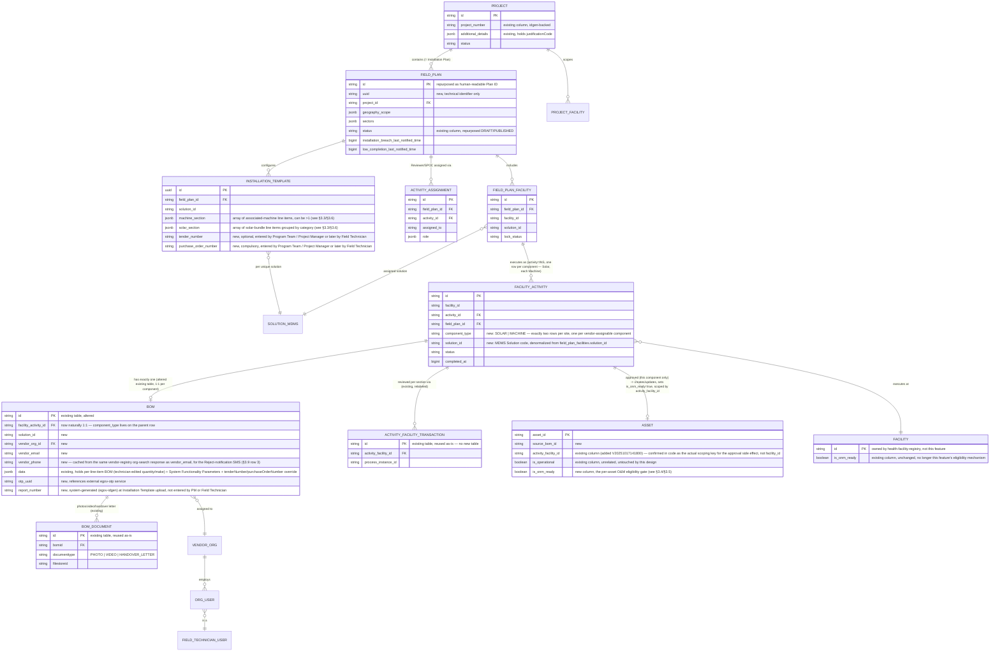
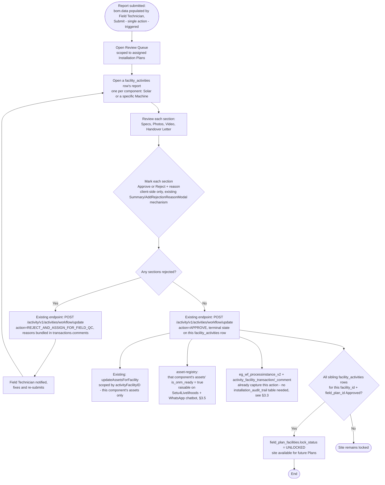
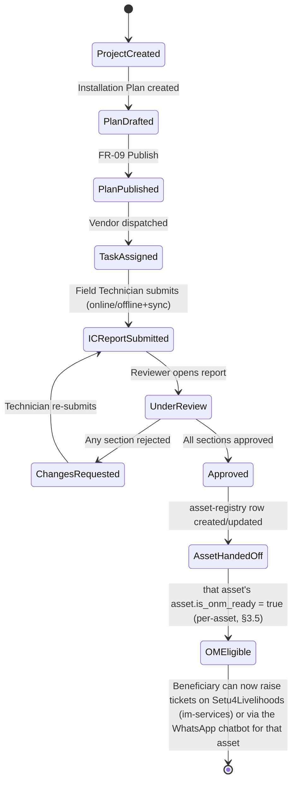

# Livelihood Installation App — Low-Level Design

Companion engineering doc to `Livelihood_Installation_App_PRD.pdf`. Covers: feature breakdown, service architecture decision (reuse vs. new service), table schemas (new tables + alterations to existing tables), and flow diagrams.

**Scope:** backend schema, service ownership, and API-level design only. PRD FR-16's Android offline-storage/sync architecture and the Project Manager/Installation Reviewer web app's frontend stack are intentionally out of scope here and need a separate frontend/mobile design doc.

---

## 1. Service Architecture Decision

> **PRD basis:** §4.1 *Scope (In Scope Phase 1)* and §6 *Core Data Entities* — this section is an engineering decision derived from what the PRD requires the system to do, not a direct citation of one PRD requirement.

### 1.1 Existing Code supported features

> **PRD basis:** §6 *Core Data Entities* (each row below is checked against the entities that table defines: Project, Installation Plan, Solution, Machine/Asset, Vendor Organisation, Installation Template, IC Report, Handover Letter).

| Existing service               | What it already has                                                                                                                                                                                                                                                                                                                                                                                                                                                                                                                                                                                                                                                                                                                                                                                                                                                                                                                                                                                                                                                                                                                                                                                                                                                                                                                                                                                                                                                                               | Relevance                                                                                                                                                                                                                                                                                                                                                                                                                                                                                                        |
| ------------------------------ | ------------------------------------------------------------------------------------------------------------------------------------------------------------------------------------------------------------------------------------------------------------------------------------------------------------------------------------------------------------------------------------------------------------------------------------------------------------------------------------------------------------------------------------------------------------------------------------------------------------------------------------------------------------------------------------------------------------------------------------------------------------------------------------------------------------------------------------------------------------------------------------------------------------------------------------------------------------------------------------------------------------------------------------------------------------------------------------------------------------------------------------------------------------------------------------------------------------------------------------------------------------------------------------------------------------------------------------------------------------------------------------------------------------------------------------------------------------------------------------------------- | ---------------------------------------------------------------------------------------------------------------------------------------------------------------------------------------------------------------------------------------------------------------------------------------------------------------------------------------------------------------------------------------------------------------------------------------------------------------------------------------------------------------- |
| `project`                    | `project` table (name, dates, `additionalDetails` JSONB, `status` + workflow via `ProjectWorkflowService`), `PROJECT_FACILITY` join table, `project_document`, `project_target`                                                                                                                                                                                                                                                                                                                                                                                                                                                                                                                                                                                                                                                                                                                                                                                                                                                                                                                                                                                                                                                                                                                                                                                                                                                                                                     | Matches PRD**Project** entity almost exactly. `field_plans.project_id` already soft-references it — this is the platform's designated system-of-record for "Project."                                                                                                                                                                                                                                                                                                                                   |
| `field-planner`              | `field_plans` (project_id, geography_scope JSONB, dates, status), `field_plan_facilities` (plan × facility join), `activities` master table, `activity_assignments` (plan × activity × assignee × role)                                                                                                                                                                                                                                                                                                                                                                                                                                                                                                                                                                                                                                                                                                                                                                                                                                                                                                                                                                                                                                                                                                                                                                                                                                                                               | **`field_plans` IS the Installation Plan** — same entity, not an analogue. `activities` already has a seeded row for `code='INS', name='Installation'` with `required_roles = [INSTALLATION_SPOC, INSTALLATION_REVIEWER]` (migration `V20260331120000`), and `field_plan_facilities` already is the plan × site inclusion table FR-05/FR-06 need. The platform has already built the planning-layer scaffolding for this exact feature — it just needs a few added columns, not new tables. |
| `field-planner-activity`     | `facility_activities` (facility × activity × plan, workflow-driven `status`, `completed_at`), `bom` (freeform JSONB `data`, no uniqueness constraint on `activity_facility_id` — multiple rows per facility already schema-legal), `bom_document` (filestore attachments), PDF generation via `egov-pdf-service`, and an installation-report review/approval system: business service `FACILITY_INSTALLATION` (config `egov.workflow.business.service`), roles `FIELD_TECHNICIAN` (submission) and `INSTALLATION_REVIEWER` (review) — renamed from the platform's existing `INSTALLATION_REPORT_APPROVER_QC_TEAM` constant to match the same `INSTALLATION_REVIEWER` role name already used for Plan-level Reviewer assignment (§3.2), so one role name now covers both. Its **review-side** actions — `APPROVE`, `REJECT_AND_ASSIGN_FOR_FIELD_QC`, `FLAG_FOR_QC` — are confirmed actively called today, from `frontend/installation-ui`'s `qc` module (`QCActions.js`). Its **submission-side** action is **not** confirmed actively called by anything today — deeper code exploration found no current button or API call firing a submission action against this business service; see §3.3's role-mapping note below. There's also no version-controlled config for this business service anywhere in this repo — its state machine is inferred, not confirmed, see `Livelihood_Installation_Business_Service.md` §3. | This**is** the IC Report system, not an analogue — `bom` is the per-report record, its workflow already implements submit→review→approve. §3.3 extends `bom` directly with asset-type/vendor/OTP columns. (A separate `docs/asset-registry/workflows/AssetInstallationWorkflow.json` business service, `asset-installation`, also exists but is **dead** — no code references it; don't confuse the two.)                                                                               |
| `ingestion-service` (Python) | Working Excel**template generation** (`template_generation.py`) + **upload parsing** with per-row `INVALID_TEMPLATE` errors (`excel_data_writer.py`) for facility/boundary/asset/staff templates                                                                                                                                                                                                                                                                                                                                                                                                                                                                                                                                                                                                                                                                                                                                                                                                                                                                                                                                                                                                                                                                                                                                                                                                                                                                                | This is the*only* real Excel round-trip engine in the repo (no Java/POI implementation exists anywhere). PRD leans heavily on Excel (FR-03, FR-05, FR-08) — directly reusable by adding new template types. FR-07 (Vendor Assignment) is the one exception — implemented as a direct Web UI screen instead, not an Excel round-trip (§5.2/§3.3), so it does not use this service.                                                                                                                          |
| `vendor-registry`            | `eg_org` (+ `org_subtype` already migrated `AMC_VENDOR → INSTALLATION_VENDOR`), `eg_org_user` (org ↔ HRMS user link, no type differentiation), `eg_org_jurisdiction` (already holds a vendor's assigned states)                                                                                                                                                                                                                                                                                                                                                                                                                                                                                                                                                                                                                                                                                                                                                                                                                                                                                                                                                                                                                                                                                                                                                                                                                                                                       | **Vendor Organisation** entity already fully modeled for this feature — `eg_org_jurisdiction` covers "assigned states," and no asset-type eligibility concept is needed: confirmed there's no vendor-side Machine/Solar restriction, any vendor can be assigned to either asset type. No schema change needed here. Field Technicians are just HRMS users linked via `eg_org_user` with a new `FIELD_TECHNICIAN` role.                                                                              |
| `asset-registry`             | `asset` table with `wf_status`, warranty fields, vendor/item-code/boundary-code columns already added                                                                                                                                                                                                                                                                                                                                                                                                                                                                                                                                                                                                                                                                                                                                                                                                                                                                                                                                                                                                                                                                                                                                                                                                                                                                                                                                                                                         | Correct handoff target for**Machine/Asset** (PRD FR-14) — no need to duplicate asset storage.                                                                                                                                                                                                                                                                                                                                                                                                             |
| `amc-scheduler-service`      | Existing e4h-service that already runs periodic/scheduled jobs (today for AMC visit scheduling)                                                                                                                                                                                                                                                                                                                                                                                                                                                                                                                                                                                                                                                                                                                                                                                                                                                                                                                                                                                                                                                                                                                                                                                                                                                                                                                                                                                                   | Reusable as the runner for both of §9*Notification Matrix*'s weekly-summary checks ("Planned Installation breached" and "<40% complete near end date") — no need to build a new cron/scheduler component, see §3.8.                                                                                                                                                                                                                                                                                         |
| `egov-mdms-service-v2`       | Generic relational master-data engine: one JSON-schema row + N`eg_mdms_data` JSONB rows                                                                                                                                                                                                                                                                                                                                                                                                                                                                                                                                                                                                                                                                                                                                                                                                                                                                                                                                                                                                                                                                                                                                                                                                                                                                                                                                                                                                         | Exact fit for the**Solution Repository** (~500 solutions tagged by sector/sunshine-hours) — no dedicated table needed.                                                                                                                                                                                                                                                                                                                                                                                    |
| `egov-workflow-v2`           | Generic business-service state machine, config-driven (`workflowConfig.json` pattern from `im-services`); already backs a **live** `FACILITY_INSTALLATION` business service in `field-planner-activity`                                                                                                                                                                                                                                                                                                                                                                                                                                                                                                                                                                                                                                                                                                                                                                                                                                                                                                                                                                                                                                                                                                                                                                                                                                                                             | **IC Report review reuses `FACILITY_INSTALLATION` directly** — it's not a new business service, it already exists and is called today. Only **Installation Plan publish** (FR-09) needs a genuinely new business service.                                                                                                                                                                                                                                                                         |
| `im-services`                | Ticket creation,`Incident.assetId` / `warrantyStatus` already present                                                                                                                                                                                                                                                                                                                                                                                                                                                                                                                                                                                                                                                                                                                                                                                                                                                                                                                                                                                                                                                                                                                                                                                                                                                                                                                                                                                                                         | Owns the check that gates whether an end user can raise a ticket — the**O&M eligibility** flag itself is per-asset, see `asset-registry` below and §3.5.                                                                                                                                                                                                                                                                                                                                               |
| `health-facility-registry`   | Owns the canonical`facility` table (every other service already references it by id only); already has `facility.is_onm_ready` (`BOOLEAN`, migration `V20251030113000`) — writable via existing `/v2/facility/update`, searchable via `/v2/facility/search`, and **already the flag Setu4Livelihoods' own ticket-raising inbox filters on today** (`InboxFilter.tsx`/`useFacility` in `frontend/livelihood-ui`)                                                                                                                                                                                                                                                                                                                                                                                                                                                                                                                                                                                                                                                                                                                                                                                                                                                                                                                                                                                                                                                          | Site-level only — insufficient on its own once O&M eligibility must be tracked per-asset (updated FR-13). This design adds a new, asset-level`asset.is_onm_ready` column instead (§3.4/§3.5) — the existing `asset.is_operational` column is a different, unrelated flag, not reused for this; `facility.is_onm_ready` is left untouched but is no longer this feature's eligibility mechanism.                                                                                                        |
| `egov-notification-sms`      | Generic DIGIT core service for sending SMS; already wrapped by`im-services`' `LivelihoodSmsNotificationService` for ticket notifications                                                                                                                                                                                                                                                                                                                                                                                                                                                                                                                                                                                                                                                                                                                                                                                                                                                                                                                                                                                                                                                                                                                                                                                                                                                                                                                                                      | Reused directly for delivering the**OTP code** (FR-11) once `egov-otp` (below) generates it — this service is only the SMS transport, it doesn't generate or validate anything itself.                                                                                                                                                                                                                                                                                                                  |
| `egov-otp`                   | External DIGIT OTP service (`_create`/`_validate`, not vendored in this repo — deployed separately, k8s hostname `egov-otp`); `amc-scheduler-service` already has a full working client for it (`ScheduledVisitService.createOTP()`/`validateOTP()`, models `Otp`/`OtpRequest`/`OtpResponse`)                                                                                                                                                                                                                                                                                                                                                                                                                                                                                                                                                                                                                                                                                                                                                                                                                                                                                                                                                                                                                                                                                                                                                                                  | Reused directly for**OTP generation/validation** (FR-11) — `field-planner-activity` follows the same client pattern rather than reimplementing hash/expiry/matching itself; only stores the returned reference (`bom.otp_uuid`).                                                                                                                                                                                                                                                                      |

### 1.2 Decision: **No new microservice.**

> **PRD basis:** §4.1 *Scope* (defines what must be built) read against §6 *Core Data Entities* (defines what each new piece of data is) — no single FR mandates this decision, it follows from mapping the two.

Every entity in the PRD maps onto an existing service's domain, and the two services most relevant (`field-planner`, `field-planner-activity`) already contain purpose-built (if generic) scaffolding — including a pre-seeded "Installation" activity — that a from-scratch service would just reinvent. Building a new service would mean re-implementing project/geography-scope handling, workflow integration, PDF generation, and facility linkage that already exist and are proven.

However, the PRD's data shape (two asset rows — Machine + Solar — per site, each independently vendor-assigned, each with its own IC Report and **per-section** approval) is materially more structured than the generic `bom.data` JSONB blob or single-status `facility_activities` row can express cleanly. Rather than force-fitting this onto the generic `bom.data` blob (which must stay generic for *other* activity types like Survey), a small number of purpose-built child tables are added — but the planning layer (Plan, Site scope, Reviewer/SPOC assignment) is **not duplicated**, it directly reuses what already exists:

- **`field-planner`**: `field_plans` **is** the Installation Plan (altered with a few extra columns, not replaced); `field_plan_facilities` **is** the per-site inclusion + Solution-assignment table (altered); Installation Reviewer/SPOC assignment reuses the existing `activity_assignments` table against the pre-seeded `INS` activity — **no new tables in this service at all**.
- **`field-planner`**: `facility_activities` (existing) gains one new `component_type` discriminator column and an extended unique index, splitting one row per site into one row per vendor-assignable component (Solar, each Machine) — see §3.3's superseded-design note. This is what lets the existing, already-live `FACILITY_INSTALLATION` review workflow (keyed on `facility_activities.id`, unchanged) handle independent per-component approval with no new workflow layer.
- **`field-planner-activity`**: `bom` (existing) is altered directly to carry vendor assignment (captured directly in a Project Manager Web UI screen, not an Excel round-trip — see §5.2/§3.3) + OTP + Excel-upload tracking (Installation Template), now naturally 1:1 with its (split) parent `facility_activities` row, and its existing, already-live `FACILITY_INSTALLATION` review/approval workflow is reused as-is (not a new business service, and no re-keying needed). Per-section review reuses the already-existing `activity_facility_transaction_comment` table (relabeled section names), not a new `bom_section_review` table. Only `installation_template` (new, see §3.3) is added — audit trail needs no new table at all, `egov-workflow-v2`'s existing `eg_wf_processinstance_v2` already covers it (see §3.3).
- **`project`** gets two typed columns added (not a new table).
- **`asset-registry`** gets two new columns added: a handoff-linkage FK (`source_bom_id`) plus a new per-asset O&M-eligibility flag, `is_onm_ready` — distinct from the existing `asset.is_operational` column (§3.4).
- **O&M eligibility** needs a new column, but not a new table — the PRD requires per-asset (not per-site) eligibility, so this design adds a new `asset.is_onm_ready` column rather than reusing `asset.is_operational` (a different, existing, unrelated flag) or `health-facility-registry`'s site-level `facility.is_onm_ready` (see §3.4/§3.5). This same flag also now feeds a WhatsApp chatbot asset picker, not just Setu4Livelihoods' ticket-raising inbox.
- **`ingestion-service`** gets new template types added to its existing Excel engine.
- **Solution Repository** lives in **MDMS**, not a bespoke table.
- **Installation Plan publish** and **IC Report review** states are registered as new `egov-workflow-v2` business services.
- **Handover Letter** reuses the `egov-pdf-service` integration already proven in `BomService`.
- **OTP generation/validation** (FR-11) reuses the external DIGIT `egov-otp` service directly, via the same client pattern `amc-scheduler-service` already implements (`ScheduledVisitService.createOTP()`/`validateOTP()`) — `field-planner-activity` doesn't reimplement hash/expiry/matching logic itself, it only stores the returned reference (`bom.otp_uuid`). `egov-notification-sms` remains just the delivery channel for the code once `egov-otp` generates it.
- **Email notifications** (§9 *Notification Matrix*) reuse the generic, shared DIGIT core Kafka topic `egov.core.notification.email` directly — every service that needs to send an email (`field-planner-activity`, `amc-scheduler-service`) publishes onto this topic itself (`field-planner-activity`'s existing `ActivityServiceUtil.sendEmailViaKafka`, confirmed already working code) rather than calling into `im-services`, which is Incident/ticket-domain-coupled and exposes no callable endpoint for this anyway (correction, 2026-08-20 — an earlier draft of this bullet described a call into `im-services` that isn't actually possible in code as written).
- **Planned Installation breach + <40%-completion notifications** (§9, updated) are handled by two new scheduled jobs in the existing `amc-scheduler-service`, not a new microservice; see §3.8. IC-Report-submission notifications (Reviewer, Vendor — same §9 update) are event-driven, not scheduled — they hook into `field-planner-activity`'s existing submit path directly; see §3.3/§3.9.

---

## 2. Feature Breakdown (mapped to PRD Functional Requirements)

> **PRD basis:** §7 *Functional Requirements* (FR-01–FR-16) and the closing paragraph of §7.6 *Post-Installation*. The **PRD ref** column below cites the specific FR (or PRD section) for each row.

| #  | Feature                                                                                                                                                                                                                                                                                                | PRD ref                            | Owning service (new/altered)                                                                                                                                                                                                                    |
| -- | ------------------------------------------------------------------------------------------------------------------------------------------------------------------------------------------------------------------------------------------------------------------------------------------------------ | ---------------------------------- | ----------------------------------------------------------------------------------------------------------------------------------------------------------------------------------------------------------------------------------------------- |
| 1  | Sector-to-Solution mapping & filtering                                                                                                                                                                                                                                                                 | FR-01                              | MDMS (Solution Repository)                                                                                                                                                                                                                      |
| 2  | Automatic Project ID generation                                                                                                                                                                                                                                                                        | FR-02                              | `project` (altered)                                                                                                                                                                                                                           |
| 3  | Project creation (details, geography, Excel site scoping)                                                                                                                                                                                                                                              | FR-03                              | `project` (altered) + `ingestion-service`                                                                                                                                                                                                   |
| 4  | Installation Plan setup                                                                                                                                                                                                                                                                                | FR-04                              | `field-planner` (`field_plans` altered)                                                                                                                                                                                                     |
| 5  | Installation scope & Solution assignment (Sheet 1)                                                                                                                                                                                                                                                     | FR-05                              | `field-planner` (`field_plan_facilities` altered) + `ingestion-service`                                                                                                                                                                   |
| 6  | End user site lock validation                                                                                                                                                                                                                                                                          | FR-06                              | `field-planner` (`field_plan_facilities` altered)                                                                                                                                                                                           |
| 7  | Vendor assignment (Web UI)                                                                                                                                                                                                                                                                             | FR-07                              | `field-planner-activity` (new tables) + `vendor-registry` (no schema change — filtered by State only, any vendor can handle either asset type)                                                                                             |
| 8  | Installation template configuration                                                                                                                                                                                                                                                                    | FR-08                              | `field-planner-activity` (new tables) + `ingestion-service`                                                                                                                                                                                 |
| 9  | Publish Installation Plan                                                                                                                                                                                                                                                                              | FR-09                              | `field-planner` + `egov-workflow-v2`                                                                                                                                                                                                        |
| 10 | Task assignment & visibility (Field Technician)                                                                                                                                                                                                                                                        | FR-10                              | `field-planner-activity` (new tables)                                                                                                                                                                                                         |
| 11 | IC Report capture, OTP, offline/online submission                                                                                                                                                                                                                                                      | FR-11                              | `field-planner-activity` (new tables)                                                                                                                                                                                                         |
| 12 | Reviewer queue                                                                                                                                                                                                                                                                                         | FR-12                              | `field-planner-activity` (existing `facility_activities`/`activity_assignments` search, extended)                                                                                                                                         |
| 13 | Per-section approval & rejection                                                                                                                                                                                                                                                                       | FR-13                              | `field-planner-activity` (existing `facility_activities` review mechanism, split per component — see §3.3) + `field-planner` (`facility_activities.component_type`, new column) + `egov-workflow-v2` (existing, unchanged)          |
| 14 | Asset Management handoff & audit trail                                                                                                                                                                                                                                                                 | FR-14                              | `asset-registry` (altered) — audit trail reuses `egov-workflow-v2`'s existing `eg_wf_processinstance_v2`, no new table                                                                                                                   |
| 15 | End user site data ingestion (from Admin module)                                                                                                                                                                                                                                                       | FR-15                              | Existing Admin/boundary/facility registry (no change)                                                                                                                                                                                           |
| 16 | Platform support (Android + Web)                                                                                                                                                                                                                                                                       | FR-16                              | **Out of scope for this LLD** — `installation-ui` (Android) is currently an empty scaffold; offline-storage schema, sync/conflict resolution, and the PM/Reviewer web app's frontend stack need a separate frontend/mobile design doc. |
| — | O&M eligibility gate for Setu4Livelihoods + WhatsApp chatbot                                                                                                                                                                                                                                           | §7.5 FR-13 (updated, asset-level) | `asset-registry` (new `asset.is_onm_ready` column, §3.4/§3.5)                                                                                                                                                                             |
| — | Notification Matrix (updated): IC Report submission → Reviewer + Vendor (Email); Planned Installation breach → Senior Programme Manager (Email, daily-run/weekly-gated); <40% complete near end date → Program POC (Email, daily-run/weekly-gated); Plan Published → every assigned Vendor (Email) | §9 "Notification Matrix" + FR-09  | `field-planner-activity` (submission notifications, §3.3) + `amc-scheduler-service` (two new scheduled jobs, §3.8) + `field-planner` (Publish-time vendor notification + reads `field_plans`) — see §3.9                            |

---

## 3. Schema Design

> **PRD basis:** §6 *Core Data Entities* (defines the shape of each entity) read together with §7 *Functional Requirements* (defines the field-level detail each entity must capture).

### 3.0 ID conventions

> **PRD basis:** §7.1 FR-02 *"Automatic Project ID Generation"* (only place the PRD mandates a specific ID format). The UUID-as-primary-key convention itself is an engineering decision not covered by the PRD.

- Every **new** table introduces a native `UUID` primary key (`DEFAULT gen_random_uuid()`), regardless of whether the PRD also calls for a human-readable business identifier.
- Where the PRD specifies a human-readable ID format, that's handled per-entity rather than by one fixed rule — see §3.1 (**Project ID**, FR-02: reuses `project`'s existing `projectNumber` column) and §3.2 (**Installation Plan ID**, implied by FR-06's example message `"IP-2026-001"` though the PRD does not fully specify its generation rule — confirm before implementation: `field_plans.id` itself is repurposed to hold this value, switching its generation from a random UUID to `IdGenService`, rather than adding a separate column).
- Columns that reference a **pre-existing** platform table (`project`, `asset`, `eg_org`, `field_plans`, `field_plan_facilities`, `facility_activities`, HRMS users, MDMS identifiers) keep the type that table already uses today — i.e. `VARCHAR(64)`, the DIGIT-wide convention. No existing production table's column type changes as part of this feature. Most are populated with UUID-formatted strings; **`field_plans.id` is the one exception** — per §3.2, its content switches from a random UUID to an `IdGenService`-formatted Plan ID, though its column type stays the same `VARCHAR`, so nothing referencing it needs to change.
- Columns that reference one of the **new** UUID-keyed tables introduced below use native `UUID` to match.

### 3.1 `project` service — no new columns; reuse existing `justificationCode` + `projectNumber` mechanisms

> **PRD basis:** §7.1 FR-02 *"Automatic Project ID Generation"*; §7.2 FR-03 *"Project Creation"* (Sub-step 1 — Project Name, Justification Code, dates); §6 *Core Data Entities* → "Project" row.

Both FR-02's requirements turn out to already have a home in `project` — no ALTER TABLE needed at all:

- **Justification Code**: already fully implemented, not something to add. `ProjectService.java`/`ProjectNameGenerationService.java` already read/write a `justificationCode` key inside `project.additionalDetails` (JSONB, existing column) — format `JUS-XXXXX(-X)` (regex-validated), enforced **read-only after creation** (`isValidAdditionalDetailsUpdate` rejects any change), and already used to build `project.name` (format `[STATE]-[FYTY]-[HF]-[JUST]`, e.g. `KA-2627-190-00120-1`). FR-03's Sub-step 1 "enter Justification Code" is this same field — reuse it as-is.
- **Financial Year**: not a separate stored input at all. FR-03's Sub-step 1 doesn't list "Financial Year" as something the Project Manager enters — it's derived at ID-generation time, the same way `egov-idgen`'s `[fy:...]` placeholder already derives a financial-year string from the current date for other DIGIT ID formats. No column needed.
- **Generated Project ID** (`PROJ-<code>-<FY>-<seq>`): reuse the existing `project.projectNumber` column, not a new `generated_project_id` column. It's already a mandatory, `egov-idgen`-backed field (config `egov.idgen.project.number.name=project.number` in `ProjectConfiguration.java`), already populated unconditionally on every create (`ProjectEnrichment.enrichProjectOnCreate` throws `PROJECT_NUMBER_NOT_GENERATED` if generation fails), and already a real, queried DB column distinct from `id` (`ProjectAddressRowMapper`, `ProjectValidator`). Making it actually produce the PRD's format is a matter of registering an `IdFormat` MDMS entry for idname `project.number` (data, not schema) — with one real implementation gap, see below.

**ID-generation-logic update:** `egov-idgen`'s format-string placeholders (`[seq...]`, `[fy:...]`, `[cy:...]`, `[city...]`, `[tenantid]`, or random) have no way to splice a caller-supplied value like `justificationCode` into the generated string, and its sequence counters aren't partitioned per arbitrary key — so FR-02's "sequence resets per unique Justification Code + Financial Year" can't come from idgen's format string alone. The precedent to follow is `ProjectNameGenerationService`, which already builds `project.name` in application code (idgen for the parts idgen can do, string composition for the rest) rather than relying purely on idgen substitution — `projectNumber` generation should follow the same pattern: call idgen for the `[fy:...]`/sequence portion, prepend the `additionalDetails.justificationCode` value in application code before persisting.

`PROJECT_FACILITY` (existing table) is reused as-is for Project-level end-user-site scope (FR-03's Include Yes/No Excel step writes rows here).

Project creation must also enforce FR-15's hard prerequisite: reject creation if the requested geography has zero ingested End User Sites (a synchronous validation check against the existing Admin/facility registry — no new column, this is an API-layer rule).

**Draft persistence across the multi-step Project creation wizard** — no new mechanism needed, `project`'s existing create/resume pattern already covers this: `ProjectValidator.validateProjectRequest` only mandates `tenantId`, so `ProjectService.createProject` persists a real `project` row immediately at Sub-step 1 (name, justification code, dates) — it doesn't wait for Sub-step 2 (geography) or Sub-step 3 (End User Site Excel) to be filled in. The frontend already relies on exactly this: `CreateProject.js` creates the row on step 1 (toast `PM_TOAST_DRAFT_PROJECT_CREATION_SUCCESS`), then re-enters that same in-progress project on every later step via `?projectId=...&key=...` and issues `_update` calls (toast `..._UPDATION_SUCCESS`) instead of re-creating it. There's no literal `DRAFT` status value to introduce here either — `ProjectService.isDraftProject()` already treats a `null` status as "Draft," so an in-progress Project is simply a persisted row that hasn't advanced past that implicit state. FR-03's multi-step wizard should be built on this existing eager-create-then-resume pattern, not by deferring the `project` row's creation until the whole wizard (through Sub-step 3) is complete — the same principle applies to Installation Plan setup below.

### 3.2 `field-planner` service — `field_plans` is the Installation Plan (alterations only)

> **PRD basis:** §7.3 FR-04 *"Installation Plan Setup"* (the `field_plans` alterations below); §7.3 FR-05 *"Installation Scope & Solution Assignment"* and FR-06 *"End User Site Lock Validation"* (the `field_plan_facilities` alterations below); §6 *Core Data Entities* → "Installation Plan", "End User Site".

`field_plans` already carries `id, tenant_id, name, project_id, geography_scope (jsonb), start_date, end_date, status, additional_details (jsonb)` — this is the Installation Plan record itself, not a separate entity. It needs a handful of added columns plus a proper FK:

```sql
ALTER TABLE field_plans
  ADD CONSTRAINT fk_field_plans_project FOREIGN KEY (project_id) REFERENCES project(id),
  ADD COLUMN uuid                 VARCHAR(64) UNIQUE DEFAULT gen_random_uuid()::text, -- new technical identifier, see note below
  ADD COLUMN sector               VARCHAR(256),        -- string of sector codes, plan can have only one sector
  ADD COLUMN senior_contact_user  INT, --FK escalation contact
  ADD COLUMN published_time       BIGINT,
  ADD COLUMN installation_breach_last_notified_time  BIGINT, -- replaces a one-shot `start_date_breach_notified` boolean: updated §9 makes this a recurring *weekly summary*, not a single notification, so a last-sent timestamp is needed instead of a fired-once flag — see §3.8
  ADD COLUMN low_completion_last_notified_time        BIGINT; -- same idempotency purpose, for the new "<40% complete, 10 days prior to end date" weekly job — see §3.8
```

Program POC resolution for the new low-completion notification (§3.8) needs no new column either: `field_plans` already carries the standard DIGIT `AuditDetails` columns (`createdby`/`createdtime`/`lastmodifiedby`/`lastmodifiedtime`) present on every table in this platform via the shared audit-details convention — "Program POC (person who made the field plan)" is simply `field_plans.createdby`, resolved to an email the same way any other service here resolves a user id to a contact address (existing HRMS/`egov-user` lookup, the same pattern `im-services`' notification services already use).

Losing a guaranteed-random `id` means something else needs to carry a genuine collision-proof technical identifier, so a new `uuid` column is added purely for that purpose (not the PK, not referenced by any FK — those all stay on `id`). This mirrors a real precedent elsewhere in this platform (`egov-hrms`'s `eg_hrms_employee`, which splits a sequence-like `id` from a separate `uuid` used for external reference) — though there `uuid` is the one FKs point to; here it's deliberately the opposite, kept purely internal, to avoid touching every existing FK column in this service.

No new publish-state column: `field_plans.status` (existing, `DEFAULT 'ACTIVE'`) is reused directly for the FR-09 Draft→Published lifecycle instead of adding a `publish_status` column. This does repurpose a column shared by every `field_plans` row regardless of activity type — application code creating an Installation Plan sets `status = 'DRAFT'` explicitly on create and `status = 'PUBLISHED'` on FR-09 publish, rather than relying on the table's generic `'ACTIVE'` default, which stays the right default for non-Installation plan types using this same table.

**Draft persistence across the multi-step Installation Plan setup wizard** — same principle as §3.1's Project creation note, and again no new column or table: `FieldPlannerEnrichment.enrichFieldPlanOnCreate` already sets `status = DRAFT_STATUS` on `_create`, so the `field_plans` row exists as soon as FR-04's first step (geography subset, sectors, Reviewer, dates) is submitted — before any of the Scope Excel (FR-05), Vendor Assignment (FR-07), or Installation Template Excel (FR-08) steps happen. Each of those is itself durably saved the moment it's submitted, into its own table — Scope Excel (Sheet 1) into `field_plan_facilities` (`solution_id`, `lock_status`), Vendor Assignment (a direct Web UI screen, not an Excel round-trip — §5.2) into `bom.vendor_org_id`/`vendor_email`, the Template into `installation_template` — so a Project Manager who leaves mid-wizard and returns loses nothing: resuming is just reading which of these rows already exist for this `field_plan_id`, not a separate wizard-progress tracker. See `Livelihood_Installation_Flow_Diagrams.md` §1 (Project Manager flow) for the exact step-by-step persistence points.

The Installation Reviewer assigned to a Plan (FR-04) does **not** need a new column — it's an `activity_assignments` row against the pre-seeded `INS` activity: `activity_assignments(field_plan_id, activity_id='INS', assigned_to=<reviewer HRMS user id>, role='INSTALLATION_REVIEWER')`. No schema change needed here; this table already supports plan × activity × assignee × role. The `INS` activity's other pre-seeded role, `INSTALLATION_SPOC`, does **not** get a matching `activity_assignments` row — confirmed to be the Field Technician (§3.3), whose assignment is inherently per-vendor-per-facility via `bom.vendor_org_id`/`eg_org_user`, not a single plan-level assignee the way the Reviewer is.

*(PRD basis for this table: §7.3 FR-05 "Installation Scope & Solution Assignment (Sheet 1)" and FR-06 "End User Site Lock Validation".)*

`field_plan_facilities` already is the plan × site inclusion table (FR-03/FR-05's Include Yes/No is naturally expressed by row presence). It needs Solution assignment and the FR-06 lock flag added:

```sql
ALTER TABLE field_plan_facilities
  ADD COLUMN solution_id  VARCHAR(64),                    -- MDMS Solution Repository identifier
  ADD COLUMN lock_status  VARCHAR(32) DEFAULT 'UNLOCKED';  -- UNLOCKED | LOCKED (FR-06)
```

FR-06's cross-plan lock check ("is this site already locked under *another* active plan") is a query across `field_plan_facilities` filtered by the child `bom`'s workflow state (any row not yet at the terminal `APPROVE` state, joins into `field-planner-activity` below), not a column on this table alone.

**Post-Publish Scope Edits** (PRD p.9): once `field_plans.status = 'PUBLISHED'`, edits to `field_plan_facilities` are asymmetric, not a free re-open of scope. `include = true → false` (removing a site) is allowed at any time — *unless* a `bom` row already exists for that site's `facility_activity` (i.e. installation work has already started), in which case the row is locked and the edit is rejected as a validation error. `include = false → true` (adding a new site to an already-Published Plan) is **never** allowed — a Project Manager needing this must create a new Installation Plan instead. Both directions are still submitted through the same Installation Scope Excel (FR-05), just re-downloaded and re-uploaded for this purpose.

### 3.3 `field-planner-activity` service — extend the existing `bom` / installation-report system (not new `installation_asset`/`ic_report` tables)

> **PRD basis:** §7.3 FR-07 *"Vendor Assignment (Sheet 2)"* and FR-08 *"Installation Template Configuration"* (→ `installation_template` below, and `bom` alterations); §7.4 FR-10 *"Task Assignment & Visibility"* and FR-11 *"Installation Completion Report"* (→ `bom` alterations); §7.5 FR-12 *"Review Queue"* and FR-13 *"Approval & Rejection"* (→ the split-`facility_activities` design + existing `activity_facility_transaction_comment`, not a new `bom_section_review` table — see the superseded-design note below); §7.6 FR-14 *"Asset Management Handoff & Audit Trail"* (→ audit trail reuses `egov-workflow-v2`'s existing `eg_wf_processinstance_v2`, no new table); §6 *Core Data Entities* → "Machine/Asset", "Installation Template", "IC Report", "Handover Letter".
>
> **Deviation from the PRD's literal FR-07 title:** this design implements Vendor Assignment as a direct Project Manager Web UI screen, not the PRD's "Sheet 2" Excel round-trip — confirmed, superseding that PRD text (see §5.2's flowchart and `Livelihood_Installation_Flow_Diagrams.md` §1 Step 7). FR-05's Scope Excel (Sheet 1) and FR-08's Installation Template Excel are unaffected by this change and remain Excel round-trips.

> **📌 Superseded (2026-08-19):** an earlier draft of this section kept `facility_activities` unchanged (one row per site) and instead modeled independent Machine/Solar review via a new `bom_section_review` table plus re-keying the `FACILITY_INSTALLATION` workflow onto `bom.id`. Direct code verification found that path would require building an entire new workflow-integration layer for `bom` from scratch (`BOMApiController`/`BomService` make zero workflow calls today) and retrofitting the asset-approval side effect onto a key (`bom_id`) assets aren't tagged with. The already-live review mechanism (`QCActions.js` → `FacilityWorkflowService.transitionWorkflow`, keyed on `facility_activities.id`) already does everything needed — including asset-approval scoping already correctly keyed on `activityFacilityID`, confirmed in code (`ActivityService.updateAssetsForFacility`). **Revised: `facility_activities` is now split into one row per vendor-assignable installation component — exactly two per site, `SOLAR` and `MACHINE`** — instead of one row per site, and the existing review mechanism is reused unchanged for each row independently. A Solution with multiple individual machines (e.g. Oil Mill = press + pounding machine) still gets only one `MACHINE` row — its machines stay bundled together in that row's `bom.data` array (matching `installation_template.machine_section`'s existing array shape, §3.6), not split further; FR-07's vendor assignment and this review split are both binary (Machine vs. Solar), not per-individual-machine. See `Livelihood_Installation_Flow_Diagrams.md` §3 for the full reviewer-flow rewrite this implies.

`facility_activities` (existing: `facility_id, activity_id, field_plan_id, status, scheduled_at, activated_at, completed_at`) gains one new column and an extended unique index:

```sql
ALTER TABLE facility_activities
  ADD COLUMN component_type VARCHAR(16), -- SOLAR | MACHINE — exactly two per site; a Solution's multiple individual
                                          -- machines (if any) stay bundled into the one MACHINE row's bom.data,
                                          -- not split further (see the superseded-design note above)
    ADD COLUMN component_name VARCHAR(16) -- name of the component (solar/pulverizer/printer)
  ADD COLUMN solution_id    VARCHAR(64); -- MDMS Solution code (e.g. SOL-PULVERIZER-001), denormalized from
                                          -- field_plan_facilities.solution_id (already known at creation time,
                                          -- FR-05 Scope stage) — same solution_id convention already used by
                                          -- field_plan_facilities/installation_template/bom; not part of the
                                          -- unique index below since it's identical across a site's MACHINE and
                                          -- SOLAR row

-- Both columns NULL for pre-existing rows and non-Installation activity types, which stay exactly one row per
-- (facility, activity, plan) as before (Postgres treats NULL as distinct in a unique index, so this is backward-compatible)

DROP INDEX IF EXISTS idx_facility_activities_composite;

CREATE UNIQUE INDEX idx_facility_activities_composite
  ON facility_activities (tenant_id, facility_id, activity_id, field_plan_id,component_name, component_type);
```

Migration: `V20260819120000__facility_activity_component_type_add_ddl.sql` (`field-planner`). The prior unique index (`(tenant_id, facility_id, activity_id, field_plan_id)`, added in the same initial PR that built this module, #1629 — not a targeted bugfix, per git history) is extended rather than dropped outright, preserving its anti-duplicate intent for every other activity type while allowing intentional splits for `INS`.

`FieldPlannerService.java`'s facility-activity creation loop (currently emits exactly one row per (facility, activity, plan)) needs to expand per site into exactly two rows — one `MACHINE`, one `SOLAR` — populated with the `solution_id` already known from `field_plan_facilities.solution_id` at that point in the pipeline (FR-05 Scope stage). Because `component_type` is now a fixed binary split rather than a per-Solution machine count, this loop no longer needs to call MDMS to count a Solution's `associatedMachines` — it's simply "always create both," not "create N." **🆕 Not yet implemented** — this is a real code change to `field-planner`, not yet built; flagged here as the concrete next step, not attempted in this pass.

`bom` is reused directly for IC Report tracking rather than modeled as a separate table. Under the split-`facility_activities` design above, each `bom` row is naturally 1:1 with its (now component-scoped) `activity_facility_id` — the earlier draft's reliance on `bom` having **no uniqueness constraint on `activity_facility_id`** (to allow 2 rows per then-unsplit `facility_activity`) is no longer the load-bearing reason; `bom` still needs no new uniqueness constraint, simply because each split `facility_activities` row now has exactly one `bom` row, the same 1:1 shape `bom`/`facility_activity` already had for every other activity type. A review/approval system already sits on top of it — business service `FACILITY_INSTALLATION` (config `egov.workflow.business.service` in this service's own `application.properties`, invoked via `FacilityWorkflowService.transitionWorkflow`), with roles `FIELD_TECHNICIAN` (submission) and `INSTALLATION_REVIEWER` (review) (`ActivityConstants.java` — note this file only actually defines a role constant named `INSTALLATION_REPORT_APPROVER_QC_TEAM`, not `INSTALLATION_REVIEWER`; neither `FIELD_TECHNICIAN` nor the renamed `INSTALLATION_REVIEWER` is confirmed as a constant in this file yet, though both are the confirmed role names per §3.3's role mapping — see the note there on renaming the review role to match the existing Plan-level `INSTALLATION_REVIEWER` assignment role, §3.2). Its review-side actions — `APPROVE`, `REJECT_AND_ASSIGN_FOR_FIELD_QC`, `FLAG_FOR_QC` — are confirmed already called today by `frontend/installation-ui`'s `qc` module (`QCActions.js` calling `ActivityService.updateActivityFacilityWorkflow`). Its submission-side action is **not confirmed to be called by anything** today — no current code path fires an actual Submit action against this business service; the exact action name is an open question (§3.3 below). Extending `bom` directly — two rows per facility (Machine + Solar), each independently vendor-assigned and independently progressing through the same review workflow — is still a smaller, more consistent change than standing up parallel tables and a parallel workflow, regardless of how the submission-side question resolves.

(A *different*, unrelated business service, `asset-installation`, is defined in `docs/asset-registry/workflows/AssetInstallationWorkflow.json` — that one is dead config, referenced by no code anywhere in this repo; not to be confused with the live `FACILITY_INSTALLATION` above.)

**Role mapping** (the PRD's 3 roles onto the live scheme, reconciled against the pre-seeded `activities.required_roles = [INSTALLATION_SPOC, INSTALLATION_REVIEWER]` on the `INS` activity — **confirmed: the Field Technician is the Installation SPOC**, so `INSTALLATION_SPOC` names the same actor, not a separate role or assignment mechanism):

| PRD role                                                                 | Role code                                                                                                                                              | Action it triggers                                                   |
| ------------------------------------------------------------------------ | ------------------------------------------------------------------------------------------------------------------------------------------------------ | -------------------------------------------------------------------- |
| Field Technician (= Installation SPOC, per`activities.required_roles`) | `FIELD_TECHNICIAN` — performs the installation and submits the report; does the same actions as `INSTALLATION_SPOC` earlier, not a separate role | A  Submit action for filled IC reports for`FACILITY_INSTALLATION` |
| Installation Reviewer                                                    | `INSTALLATION_REVIEWER` (renamed from `INSTALLATION_REPORT_APPROVER_QC_TEAM` — same role name as the Plan-level Reviewer assignment, §3.2)       | `APPROVE` / `REJECT_AND_ASSIGN_FOR_FIELD_QC` / `FLAG_FOR_QC`   |

(Project Manager still participates elsewhere — Installation Plan setup, Vendor Assignment, Installation Template configuration — just not in this specific submission step.)

**Submission is a single action, by a single actor.** The Field Technician fills in the whole IC Report and submits it in one action — matching the PRD (FR-11) exactly: *"The technician taps Submit and the report goes directly to the Reviewer's queue."* No version-controlled config for `FACILITY_INSTALLATION` exists anywhere in this repo (`Livelihood_Installation_Business_Service.md` §3), so if it's still the business service chosen at implementation time, confirm its actual registered config against a running `egov-workflow-v2` instance first (`GET /egov-workflow-v2/egov-wf/businessservice/_search?businessServices=FACILITY_INSTALLATION`) before wiring the Submit action to it. If no simple single-action fit is confirmed there, a smaller, purpose-built single-action business service is the more honest fit for this PRD's one-actor, one-action flow.

```sql
ALTER TABLE bom
  ADD COLUMN solution_id      VARCHAR(64),  -- MDMS Solution Repository identifier; ties this BOM back to its Installation Template
  ADD COLUMN vendor_org_id    VARCHAR(64),  -- FK by reference -> vendor-registry eg_org (existing assign_user is the individual technician; this is their employer org)
  ADD COLUMN vendor_email     VARCHAR(256),
  ADD COLUMN vendor_phone     VARCHAR(32),  -- 🆕 cached from the same vendor-registry org-search response as vendor_email (eg_org.org_poc_phone, confirmed real/populated/encrypted column) — needed for the "IC Report Returned for Correction" SMS notification, §3.9 row 3
  ADD COLUMN otp_uuid         VARCHAR(64),  -- reference id from the external egov-otp service's _create response; hash/expiry/matching all live there, not here
  ADD COLUMN report_number    VARCHAR(64);  -- unique IC Report number; system-generated (egov-idgen, same pattern as Project ID/Plan ID, §3.1/§3.2), not entered by PM or Field Technician — see note below
```

**No `asset_type` column and no `uq_bom_activity_facility_asset_type` constraint on `bom`** — superseded by the split-`facility_activities` design above. Which component this `bom` row belongs to (Solar vs. a specific Machine) is now the parent `facility_activities.component_type`'s job, reached via the existing `activity_facility_id` FK — no need to duplicate that discriminator onto `bom` itself, and no composite uniqueness constraint is needed since each split `facility_activities` row already has exactly one `bom` row by construction.

`bom.data` (existing, freeform `Map<String,Object>`/JSONB — confirmed no schema/type exists for it anywhere, including in the frontend) is reused as-is for the BOM confirmations + System Functionality Parameters the Field Technician enters directly in the Android app — no new `captured_data` column. Its shape mirrors `installation_template.machine_section`/`solar_section` (§3.3 below — one array entry per component line item), seeded from the template on task load and then overwritten per-field as the technician confirms or edits: each line item's `quantity` and `make` are technician-editable (not read-only confirmation), since actual installed quantity for some components is site-dependent and unknowable at template-authoring time (see the quantity/make note below); `product`/`capacity`/`category` are also editable if what was actually installed differs from the template, though quantity/make are the two fields the real ICC Report explicitly flags as site-determined. `bom_document` (existing) is reused as-is for photo/video/Handover-Letter attachments — its `documenttype` is already a free-text column; add the convention values `PHOTO`/`VIDEO`/`HANDOVER_LETTER`, no schema change. Since a site can now have 2+ `facility_activities` rows (Machine(s) + Solar, per the split design above), each gets its **own** `FACILITY_INSTALLATION` workflow process instance — `businessId = facility_activities.id`, the same keying this business service already uses today, unchanged — so Machine and Solar can progress and be reviewed independently, per FR-07's requirement that they can go to different vendors. (An earlier draft proposed re-keying onto `bom.id` instead; superseded — see the note at the top of this section.)

**📌 No new `bom_section_review` table — superseded.** The PRD's per-section (Specs/Photos/Video/Handover Letter) review granularity — the existing `APPROVE`/`REJECT_AND_ASSIGN_FOR_FIELD_QC` actions are whole-report accept/reject with no per-section reason — is instead covered by the **already-existing** `activity_facility_transaction`/`activity_facility_transaction_comment` tables (migration `V20251015163200__activity_facility_transaction_comment_create.sql`), which today's `qc` module already writes to on every Approve/Reject/Flag-for-QC action (`ActivityService.handleTransactionsAndComment`). That mechanism already stores one comment per named section (currently tagged by `assetType`, e.g. `PANEL`/`BATTERY`/`INVERTER`) alongside a `reason`/`comment` pair, bundled under one transaction per workflow action. Reusing this for the new feature is a relabeling of the section-name convention (`SPECS`/`PHOTOS`/`VIDEO`/`HANDOVER_LETTER` instead of per-asset-type names) plus confirming reason-required enforcement, not a new table or endpoint. See `Livelihood_Installation_Flow_Diagrams.md` §3 Steps 3-4A for the full mechanism.

Two tables are new — no existing equivalent was found for either:

```sql
CREATE TABLE installation_template (
  id                      UUID PRIMARY KEY DEFAULT gen_random_uuid(),
  tenant_id               VARCHAR(64) NOT NULL,
  facility_id             FK, VARCHAR(64) NOT NULL,
  field_plan_id           VARCHAR(64) NOT NULL REFERENCES field_plans(id), -- existing table, VARCHAR PK
  solution_id             VARCHAR(64) NOT NULL,  -- MDMS unique identifier, not a UUID we control
  machine_section         JSONB,   -- array of associated-machine line items ({slNo, product, make, capacity, quantity}) — an array, not a single object, because a Solution can have >1 associated machine (e.g. "Oil Mill" = Oil Mill press + Pounding Machine; "Multi-Stage Processing" = 2 machines) — see §3.6
  solar_section           JSONB,   -- array of solar-bundle line items grouped by category ({category, slNo, product, make, capacity, quantity} — categories per the real ICC Report: Solar Panel, Battery, Inverter/PCU, Mounting Structure, Rack/Enclosure, Junction/Protection Box, Cable, Switch/Socket/MCB, Lighting/Fan, Lightning Protection, Earthing, Safety/Docs, Fire Extinguisher, Consumables), not a flat component list — see §3.6
  tender_number           VARCHAR(128), -- optional; entered by Program Team / Project Manager on template download/upload, or later by the Field Technician on-site if left blank — see note below
  purchase_order_number   VARCHAR(128), -- compulsory; entered by Program Team / Project Manager on template download/upload, or later by the Field Technician on-site if left blank — see note below
  created_by              VARCHAR(64),
  created_time            BIGINT,
  last_modified_time      BIGINT,
  UNIQUE (field_plan_id, solution_id)
);
```

**Prepopulation, not blank** (overrides FR-08's literal "templates start blank" line — confirmed directly by stakeholder, superseding that PRD text): the downloaded Installation Template Excel is not empty. `ingestion-service`'s template-generation step pre-fills `machine_section`/`solar_section` from the selected Solution's MDMS defaults (`Installation.Solution.associatedMachines`/`solarBundle`, §3.6 — the full per-category, per-line-item component list/quantity, not a capacity-range summary), the same per-Solution defaults FR-01 already surfaces for filtering. This is what makes the per-Solution scoping concrete: since the template (and every downstream `bom` row referencing it via `solution_id`) is generated from *that Solution's own* `associatedMachines`/`solarBundle` array, a facility assigned "Pulverizer" only ever gets Pulverizer's ~36 line items, never Printer's or Sewing Machine's — confirmed against the real per-Solution sheets in `ICC_Report_Format_by_Solutionv1.xlsx` (line-item counts and associated-machine counts genuinely differ per Solution: Printer has 16 solar-bundle line items and 1 machine, Pulverizer has 36 and 1 machine, "Oil Mill" and "Multi-Stage Processing" each have 2 machines). The Project Manager downloads this prefilled sheet, adjusts values — including adding or removing line items and editing quantity — and re-uploads; `ingestion-service` parses the upload and writes the PM's final line-item array into `installation_template.machine_section`/`solar_section`, overwriting the MDMS-derived defaults rather than merging with them (no separate "defaults" vs. "final" storage needed).

**Quantity (and Make, where left blank) stays editable one level further down, by the Field Technician on-site — this is not just a PM-level default.** The real ICC Report format carries its own note to this effect on several Solution sheets (e.g. "Sewing Machine"): *"'Make' and any blank 'Quantity' cells (dependent on string configuration, cable run length, or site layout) are to be filled in by the installing engineer on site."* Some component quantities (cable runs, mounting hardware count) are genuinely unknowable until the technician sees the site, so the Installation Template's line-item quantity/make is a PM-set **default**, not a locked value — `bom.data` (below) stores the technician's own per-line-item quantity/make, which can differ from the template's, not merely a boolean "confirmed" flag against the template.

**Tender Number and Purchase/Work Order Number**: both entered into the same downloaded/uploaded Installation Template Excel, in fields alongside `machine_section`/`solar_section`, and parsed by `ingestion-service` into the new `tender_number`/`purchase_order_number` columns above on upload — same round-trip, same actor as the prepopulated spec values, not a separate flow. "Program Team" is not a role or HRMS group modeled anywhere in this platform today — the PRD's own §5 *User Roles* only defines Project Manager, Field Technician, and Installation Reviewer. Until a distinct Program Team role/group is confirmed, this design treats "Program Team / Project Manager" as one and the same actor for these fields: whoever holds upload permission on this template (i.e. the Project Manager role) can enter or edit `tender_number`/`purchase_order_number`, with no separate permission check. If Program Team is later confirmed to be a genuinely separate HRMS group, this becomes an added role check on the same upload API, not a schema change.

The two fields differ in whether they're required, and in who gets the last chance to fill them: **Tender Number is optional and can be left blank indefinitely** — nothing downstream depends on its presence. **Purchase/Work Order No. is compulsory**, but not necessarily known at template-upload time (a PM may not yet have a PO cut for every Solution when the Plan is assembled), so it isn't enforced at Publish (§2.3's Publish-validation checklist does not check it) — instead, whichever of the two is still blank when the Field Technician opens the IC Report in-app (§3.3 below) becomes editable there, as a per-`bom`-row override of the template default stored in `bom.data` (same pattern as the technician's per-line-item quantity/make override, see the quantity/make note below), and `purchase_order_number`'s presence (template value or technician-entered override) is checked as a service-layer precondition immediately before Submit is fired — a Field Technician cannot submit an IC Report for a `bom` row that has no Purchase/Work Order No. from either source. `tender_number` carries no such check and can remain blank all the way through Approval.

**`bom.report_number` (each `bom` row's Unique IC Report number) is not a manually-entered field at all — unlike both of the above.** Neither the Project Manager nor the Field Technician types it in; it's system-generated, `egov-idgen`-backed the same way Project ID/Plan ID are (§3.1/§3.2). It's also generated at a different point in the sequence than either the PM's or the technician's own edits to that `bom` row: the moment the PM's completed Installation Template Excel upload succeeds and `installation_template` is created/updated for that `(field_plan_id, solution_id)` (`Livelihood_Installation_Flow_Diagrams.md` §1 Step 9), `field-planner-activity` assigns a `report_number` to every existing `bom` row scoped to that same `field_plan_id`/`solution_id` (these rows already exist by this point — they're created earlier, at Vendor Assignment/FR-07 — a direct Web UI screen, per the draft-persistence note above) — not later, when the Field Technician opens or fills in that report. By the time a Field Technician opens their assigned task (§5.3 below), `report_number` is already populated; there's no in-app generation step and nothing for the technician to enter.

The same download also carries **read-only site-identification columns**, one row per facility in scope under that Solution for this Plan (`field_plan_facilities` filtered by `solution_id`), purely for the PM's reference — not stored back onto `installation_template`, since none of it is new data:

| Column                   | Source (existing, no new column)                                                                                                                                                                                                                                               |
| ------------------------ | ------------------------------------------------------------------------------------------------------------------------------------------------------------------------------------------------------------------------------------------------------------------------------ |
| Site Name                | `facility.facility_name` (health-facility-registry)                                                                                                                                                                                                                          |
| Pincode                  | `facility_address.pincode` (health-facility-registry)                                                                                                                                                                                                                        |
| State / District / Block | derived from`facility.boundary_code` at facility-creation time (`FacilityService.enrichAddressFromBlockBoundaryCode`) — not live DB columns, so `ingestion-service` reads the already-derived values off `facility`/`facility_address` rather than re-deriving them |

*(the PRD's "Taluk" is this platform's "Block" — same field, different label; there is no separate Taluk column anywhere on the platform.)*

**No new `installation_audit_trail` table — `egov-workflow-v2`'s existing `eg_wf_processinstance_v2` already handles audit trail.** See the note below (just before §3.4) for the full reasoning.

Handover Letter generation reuses the existing `BomService.generateAndSaveBOMPdfToFilestore` → `egov-pdf-service` integration unchanged; the resulting filestore reference is stored as a `bom_document` row with `documenttype = 'HANDOVER_LETTER'` — the exact same call this service already makes for its own PDF output, just a new `documenttype` value. Per §4.1's "generated from image" requirement: the mechanism is embedding — one of the technician's captured installation photos is placed into the generated PDF alongside the existing Handover Letter fields (end user details, asset details, date, signatures), the same way `egov-pdf-service`'s existing templates already support an image placeholder; no OCR or separate image-processing step is introduced.

OTP confirmation (FR-11) calls the external DIGIT `egov-otp` service — hash, expiry, and code-matching all live there, not in `field-planner-activity`. This isn't a new integration to build from scratch: `amc-scheduler-service` already has a working client for it (`ScheduledVisitService.createOTP()`/`validateOTP()`, models `Otp`/`OtpRequest`/`OtpResponse`, hitting `egov.otp.create.url`/`egov.otp.validate.url`), and `field-planner-activity` follows the same pattern.

**OTP is tied to the upload moment, not the fill-in moment.** Photos/video are captured on-device right after the IC Report fields are filled in, regardless of connectivity — but the OTP `_create` call and its SMS delivery need connectivity, so "Send OTP" only fires at whichever point the technician's report data and photos/video are actually being pushed to the backend: immediately on-site if the technician is online at capture time, or later at Sync if they captured everything offline. Either way, photos/video only become `bom_document` rows at that same upload point (the filestore push needs connectivity too) — while offline, they're just files held on the device, not yet rows in this table. On "Send OTP": call `_create` (returns `{ uuid, otp }`), store only the returned `uuid` in `bom.otp_uuid`, then deliver the `otp` code via the existing `egov-notification-sms` SMS mechanism (unchanged from before). When the technician enters the code, call `_validate` with `{ uuid: bom.otp_uuid, identity: endUserMobileNumber, otp: enteredCode }`; a successful `isValidationSuccessful` is the gate for triggering Submit — there's no local `otp_verified` flag to maintain, since the workflow transition having occurred is itself the durable record that OTP passed.

**IC Report data capture happens entirely in the Android app, by the Field Technician alone** — one actor, one submission, not split across a separate upload step. The field list matches the real, in-use IC Report format (a per-Solution workbook — Bill of Material/Associated Machines plus a "System Functionality Parameters" section of on-site electrical test measurements — confirmed against an actual sample file, `ICC_Report_Format_by_Solutionv1.xlsx`), but that format is only a reference for *what fields the app form must capture*, not a file the technician fills and hands off:

- **Field Technician (Android app)**: views the assigned task, performs the installation, confirms/edits the Installation-Template-prefilled machine/solar line items directly in the app — per line item, editing **quantity** and **make** where the actual install differs from the template default (the two fields the real ICC Report itself calls out as site-dependent) — enters the on-site System Functionality Parameters directly in the app, and captures photos/video on-device. The app also shows the Tender Number / Purchase Order No. carried over from `installation_template`: if either was already filled in by the Project Manager on upload, it displays read-only-by-default but still technician-editable (e.g. to correct it); if either is still blank, the technician can enter it here — **Purchase/Work Order No. must be filled before Submit will proceed (compulsory); Tender Number can be left blank.** If online at that point, the technician uploads immediately — photos/video are pushed to filestore as `bom_document` rows (`documenttype = 'PHOTO'`/`'VIDEO'`), the end-user OTP is sent and verified, and the technician taps Submit. If offline, the filled report fields and captured photos/video are held locally until the technician taps Sync once back online, at which point the same upload-then-OTP-then-Submit sequence runs. Submit writes the entered fields (including any technician-entered `tenderNumber`/`purchaseOrderNumber` override) into `bom.data`, and the service layer rejects the call with a compulsory-field error if `purchaseOrderNumber` is still empty at that point (from neither the template nor this override); once that check passes, Submit triggers a single workflow action (see §3.3 — submission is one action, by one actor, not a multi-part chain) — only then does the report enter the Installation Reviewer's queue (FR-12, the existing `SUBMITTED_BY_SUPERVISOR` state `frontend/installation-ui` already searches for).

**Submission notification (updated §9 Notification Matrix)**: the moment Submit fires and the report enters the Reviewer's queue is also the trigger point for two new Email notifications — no new column or table, just two calls into `im-services`' existing `LivelihoodEmailNotificationService` alongside the workflow transition:

- **Assigned Installation Reviewer for the Plan** — resolved via the existing `activity_assignments` row for this `bom`'s `field_plan_id` against the pre-seeded `INS` activity, role `INSTALLATION_REVIEWER` (§3.2), then to an email via the normal HRMS lookup.
- **Vendor** — `bom.vendor_email` (existing column added in this design, §3.3 above) — already captured at Vendor Assignment (FR-07), so no lookup is needed at all, just a direct read.

Both fire once per `bom` row's submission (i.e. once per asset type, same as the rest of this per-`bom`-row flow) — see §3.9 for the full notification-to-mechanism mapping.

This also confirms the relationship between FR-08's Installation Template and the FR-11 IC Report: the Template is the prepopulated-then-PM-adjusted baseline per Solution (`installation_template.machine_section`/`solar_section` — prefilled from MDMS Solution defaults, then edited by the Project Manager on upload, per the prepopulation note above); the Field Technician's in-app form starts from that baseline and is confirmed/edited on-site directly into `bom.data` — no intermediate file.

**Immutability after approval** (PRD §4.2 lists "modifications to already-approved installations" as explicitly out of scope): once a `bom` row's workflow reaches the terminal `APPROVE` state, the API layer must reject further edits to `bom.data`, its `bom_document` rows, or the row itself. No separate "locked" column is needed — it's an application-level check (current workflow state = approved → reject the `_update` call) enforced in the service layer.

**Asset handoff and O&M eligibility extend an existing side effect, they don't replace one.** `ActivityService.triggerInstallationCompletionSideEffects()` (existing, already runs on facility-activity approval today) already creates Asset AMC records (`createAssetAmcsForInstalledAssets()`) and marks assets operational (`updateAssetOperationalStatus()`, calling asset-registry's existing `_update` — this sets the existing, unrelated `is_operational` column, untouched by this design). FR-14's asset-registry handoff (§3.4) and the new O&M-eligibility flag (§3.5) hook into this same trigger point — once every `bom` row for a `facility_activity` reaches `APPROVE` — by adding a further `_update` call setting `is_onm_ready = true`, rather than introducing a second, separate completion event.

**Audit trail — no new table needed.** `egov-workflow-v2`'s own `eg_wf_processinstance_v2` already retains one row per transition (`action`, `status`, `previousStatus`, `comment`, `assigner`, `assignee`, searchable with `history=true`) for every workflow-backed entity in this design — `bom` via the existing `FACILITY_INSTALLATION` business service, and the Installation Plan via the new `INSTALLATION_PLAN` business service (§3.7). *In addition*, a bespoke pair of tables — `activity_facility_transaction`/`activity_facility_transaction_comment` (existing, `field-planner-activity`) — already attaches rejection reason/comment text per transition, keyed by `asset_type`; this is exactly what `frontend/installation-ui`'s `AuditTrail.js` already renders today. Together, this is treated as sufficient audit trail coverage for this feature — no `installation_audit_trail` table is added.

### 3.4 `asset-registry` service — alterations

> **PRD basis:** §7.6 FR-14 *"Asset Management Handoff & Audit Trail"* — "an approved installation... flows into the Asset Management module"; §7.5 FR-13 *"Approval & Rejection"* (updated) — O&M eligibility is asset-level, not site-level (see §3.5).

```sql
ALTER TABLE asset
  ADD COLUMN source_bom_id VARCHAR(64), -- references field-planner-activity.bom(id), existing table's VARCHAR PK
  ADD COLUMN is_onm_ready  BOOLEAN DEFAULT false; -- new, per-asset O&M-eligibility gate — distinct from the existing is_operational column, see §3.5
```

Migration: `V20260824120000__asset_isonmready_add_ddl.sql` (`asset-registry`).

`source_bom_id` is populated when a `bom` row reaches `APPROVE` — the handoff step creates (or updates) the corresponding `asset` row. **`asset.is_operational` (existing, added `V20250625141800__asset_column_add_ddl.sql`) is a separate, unrelated flag and is not reused for O&M readiness** — it's currently write-idle in application code (populated only by a one-off DB backfill, `V20260109141800__asset_isoperational_update_ddl.sql`, to `false`, and read only as a search filter in `AssetService.java`), and this design leaves it exactly as-is. O&M readiness gets its own new column instead, `is_onm_ready`, per §3.5 — the handoff step above sets `is_onm_ready = true` on that specific asset row, alongside `source_bom_id`.

### 3.5 O&M eligibility — asset-level, via new `asset.is_onm_ready` (not `asset.is_operational`, and not `health-facility-registry`'s `facility.is_onm_ready`)

> **PRD basis:** §7.5 FR-13 *"Approval & Rejection"* (updated) — "O&M eligibility is asset-level, not site-level: the specific asset just approved — Machine or Solar — is immediately marked as ready for O&M... regardless of whether the other asset at that site has been approved yet... This same asset list also drives the WhatsApp chatbot used for issue-raising: the moment an asset is approved, it becomes selectable in the chatbot's asset picker too." Supersedes the closing paragraph of §7.6 *Post-Installation* / §1 *Executive Summary*, which read as site-level before this update.

**Correction versus the original LLD draft**: `health-facility-registry`'s `facility.is_onm_ready` (`BOOLEAN`, migration `V20251030113000`) is a single flag per site — it cannot represent the PRD's worked example, where a site's Machine asset is approved and immediately raisable while its Solar asset is not yet approved and not raisable, independently. A site-level flag would make both assets appear eligible (or neither) the moment either one is approved. The gate moves to `asset`, per-asset, instead — but not via the existing `asset.is_operational` column: `is_operational` is a different, unrelated flag (§3.4), and this design does not overload it with O&M-eligibility semantics. A new column, `asset.is_onm_ready` (§3.4), is added purely for this — same name as `facility.is_onm_ready`, but a distinct column on a distinct, per-asset table; don't confuse the two. Set `true` on exactly the `asset` row created/updated by that `bom` row's approval, leaving every other asset at the same facility untouched.

**Consumers of this flag** (all keyed on `asset.is_onm_ready`, not `asset.is_operational` or `facility.is_onm_ready`):

- **Setu4Livelihoods ticket-raising** (`im-services`) — the existing gate (today implemented against `facility.is_onm_ready` via `InboxFilter.tsx`/`useFacility` in `frontend/livelihood-ui`) needs to move to a per-asset check against `asset-registry`'s `asset.is_onm_ready`, scoped to the specific asset the end user is raising a ticket against.
- **WhatsApp chatbot asset picker** (new, per the updated FR-13) — the chatbot's asset-selection step must query `asset-registry` for assets where `is_onm_ready = true` under the end user's facility, so an unapproved asset (e.g. Solar, while only Machine is approved) is never offered as a raisable option. No integration point for this chatbot exists elsewhere in this LLD — this is a new dependency from whatever service backs the chatbot onto `asset-registry`, not previously accounted for in `Livelihood_Installation_Flow_Diagrams.md`'s sequence diagrams.

`facility.is_onm_ready` itself is not otherwise touched by this design — it remains as-is in `health-facility-registry`, simply no longer the mechanism this feature uses for eligibility. `asset.is_operational` is likewise untouched — it remains its own separate, unrelated flag on `asset`.

### 3.6 MDMS — Solution Repository

> **PRD basis:** §7.1 FR-01 *"Sector-to-Solution Mapping & Solution Filtering"*; §6 *Core Data Entities* → "Solution".

One schema definition (`Installation.Solution`) + ~500 `eg_mdms_data` rows, each `data` JSONB shaped as:

```json
{
  "code": "SOL-PULVERIZER-001",
  "name": "Pulverizer",
  "sector": "Agriculture",
  "valueChain": "Post-harvest processing",
  "sunshineHoursMin": 4.5,
  "sunshineHoursMax": 6.0,
  "associatedMachines": [
    { "slNo": 1, "product": "Pulverizer-Blade Type-3-HP-AC-25-kgs/hr", "make": null, "capacity": "3 HP", "quantityDefault": 1 }
  ],
  "solarBundle": [
    { "category": "Solar Panel",      "slNo": 1,  "product": "Solar Panel-N-Type TOPCon-525-Wp-24V",                    "make": "N-Type TOPCon", "capacity": "525 Wp / 24V", "quantityDefault": 8 },
    { "category": "Battery",          "slNo": 2,  "product": "Solar Battery-Flooded Tall Tubular Lead Acid-150-Ah-12V", "make": "Tall Tubular",  "capacity": "150 Ah / 12V", "quantityDefault": 10 },
    { "category": "Cable",            "slNo": 9,  "product": "Cable-1 CORE-copper-6-SQMM-Flexible-RED",                "make": "Copper",        "capacity": "6 SQMM",      "quantityDefault": null }
  ]
}
```

Two corrections versus an earlier draft of this schema, made after inspecting the real `ICC_Report_Format_by_Solutionv1.xlsx` (14 Solution sheets) directly:

- **`associatedMachines` is an array, not a singular `machineSpecs` object.** Most Solutions have exactly one associated machine, but "Oil Mill" and "Multi-Stage Processing" each list **two** distinct machines (e.g. Oil Mill = Oil Mill press + Pounding Machine) with their own product/make/capacity/quantity — a singular object can't represent that.
- **`solarBundle` is a per-line-item array grouped by `category`, not a flat `{component, specDefault}` list**, matching the real report's structure: Solar Panel, Battery, Inverter/PCU, Mounting Structure, Rack/Enclosure, Junction/Protection Box, Cable, Switch/Socket/MCB, Lighting/Fan, Lightning Protection, Earthing, Safety/Docs, Fire Extinguisher, Consumables — each category can hold multiple line items (e.g. Pulverizer's Cable category alone has 13 line items; its full solar bundle is 36 line items across 14 categories). `quantityDefault` is nullable for items the real report itself marks as site-dependent (certain cable runs) rather than fixed per Solution — see §3.3's quantity/make note.

This is also what makes the per-Solution filtering concrete end-to-end: `installation_template.machine_section`/`solar_section` (§3.3) is generated from *this specific Solution's* `associatedMachines`/`solarBundle` arrays, and every `bom` row carries the `solution_id` that resolves back to exactly this record — so a Field Technician assigned to a Pulverizer facility only ever sees Pulverizer's line items, never another Solution's.

### 3.7 `egov-workflow-v2` — one new business service; IC Report review reuses an existing one

> **PRD basis:** §7.3 FR-09 *"Publish Installation Plan"* (→ `INSTALLATION_PLAN`, new); §7.5 FR-12 *"Review Queue"* and FR-13 *"Approval & Rejection"* (→ reuse of the existing `FACILITY_INSTALLATION` business service, per §3.3).

- `INSTALLATION_PLAN`: **new**. States `DRAFT --PUBLISH--> PUBLISHED` (terminal).
- **IC Report review needs no new business service at all, for its review side.** `FACILITY_INSTALLATION` already exists, and its review actions are confirmed live (§3.3): `APPROVE` (terminal) / `REJECT_AND_ASSIGN_FOR_FIELD_QC` (loop back for re-submission) / `FLAG_FOR_QC`. Its submission side is a single Submit action for this feature (§3.3 — one actor, one action, no multi-part chain). Each split `facility_activities` row (Solar or a specific Machine) gets its own process instance against this same business service, keyed on `facility_activities.id` — the same keying this business service already uses today, unchanged (superseding an earlier draft's `bom.id`-keyed proposal, §3.3). The per-section decisions are captured alongside the `REJECT_AND_ASSIGN_FOR_FIELD_QC`/`APPROVE` action's existing `activity_facility_transaction_comment` payload, not a new `bom_section_review` table; the workflow state itself only tracks the aggregate outcome.

### 3.8 `amc-scheduler-service` — two scheduled jobs (revised per updated §9 Notification Matrix)

> **PRD basis:** §9 *"Notification Matrix"* (as updated) — two of its triggers are periodic/weekly-summary in nature and land here; the other three (IC Report submission → Reviewer/Vendor, and Plan Publish → Vendor) are event-driven and are covered in §3.3/§3.9 instead.

This section supersedes the original single-job, SMS+Email, one-shot-notified design — the updated matrix changes both the trigger condition and the notification cadence, and adds a second, unrelated periodic trigger. No dedicated microservice or new table is needed for either; both live as new scheduled jobs on the existing `amc-scheduler-service` (already runs periodic jobs for AMC visit scheduling).

> **⚠️ Flagged (2026-08-20), not yet reconciled:** re-reading the PRD's actual "[UPDATED]" §9 Notification Matrix directly (p.20) found this section's two triggers ("Planned Installation breached," "<40% complete near end date," recipients Senior Programme Manager / Program POC) don't match what's actually printed there. The real matrix specifies **four** Plan-deadline rows instead — "Entering Final Week" (7 days before planned end), "Ending in 3 Days," "Overdue" (Program Manager + Senior Programme Manager), and a "Weekly Installation Progress Update" (Program Manager, single-plan or consolidated-across-plans summary) — uniformly recipient **Program Manager**, not "Program POC." This section was not rewritten to match in this pass (scope of a different story); treat the two jobs below as needing a full re-check against the real matrix before implementation, not just a copy-edit.

**Job 1 — "Planned Installation breached" weekly summary** (renamed from "Planned Start Date breached"; the trigger itself changed, not just the label):

- **Old trigger** (superseded): task *not started* by the Plan's start date — checked `start_date` and whether any `facility_activities` row had `activated_at` set.
- **New trigger**: task *not completed* by the Plan's end date — the job now checks `field_plans.status = 'PUBLISHED'`, `end_date < now()`, and at least one facility in scope not yet fully installed. "Fully installed" reuses the exact same completeness test §5.4 node O already applies at approval time (all `bom` rows for a `facility_activity` reached `APPROVE`) — not a new definition of "complete."
- **Channel**: Email only — the SMS leg is dropped (updated §9's Notes list only Email as the channel; `senior_contact_phone` is still captured per those Notes, but this job no longer sends to it).
- **Recipient**: the Plan's `senior_contact_email` (PRD now calls this role "Senior Programme Manager," same field as the previous "Senior Programme Contact").
- **Cadence**: a *weekly summary*, not a single fire-once notification — this is the reason the old `start_date_breach_notified BOOLEAN` had to be replaced (§3.2) with `installation_breach_last_notified_time BIGINT`: the job re-sends for as long as the breach persists, gated only by "has at least ~7 days passed since this Plan's last send" (an idempotency guard against the job re-running more than once in a week — not a "notify once" gate). **Confirmed: the underlying scheduled job itself runs daily** — the weekly cadence per Plan comes entirely from this 7-day gate, not from a weekly cron interval.

**Job 2 — "<40% installation complete, 10 days prior to end date" weekly summary** (new trigger, not present in the original matrix):

- **Trigger**: `field_plans.status = 'PUBLISHED'`, currently within 10 days of `end_date` (i.e. `end_date` is in the future but `end_date - now() <= 10 days`), and completion percentage across the Plan's facilities is below 40%. Completion percentage uses the same per-`facility_activity` completeness test as Job 1 and §5.4 node O (`completed facility_activities / total facility_activities in scope`).
- **Channel**: Email, weekly summary — same cadence pattern as Job 1, gated by `low_completion_last_notified_time` (§3.2). **Confirmed: this job also runs daily**, not on a literal weekly cron — a weekly cron risks missing or double-firing within the narrow 10-day pre-end-date window depending on which day of the week it lands on; a daily run gated by the 7-day `low_completion_last_notified_time` check is what actually produces the "weekly summary" cadence per Plan.
- **Recipient**: "Program POC (person who made the field plan)" — `field_plans.createdby` (existing standard DIGIT audit column, see §3.2 note), resolved to an email via the same HRMS/`egov-user` lookup pattern already used elsewhere in this design.

**Shared implementation note**: both jobs need a completion-count read against `field-planner-activity`'s `facility_activities`/`bom` data, scoped by `field_plan_id` — the same cross-service read the original Job 1 already required (checking `facility_activities.activated_at`), just against a different field (`bom` approval status instead of `activated_at`). No new cross-service dependency is introduced, only a different query against a dependency this design already has.

Both jobs call `im-services`' existing `LivelihoodEmailNotificationService` for delivery — no new sender is built, consistent with §1.2's decision to route all email through that one service.

### 3.9 Notification Matrix — implementation mapping (updated §9 + confirmed FR-09 vendor notification)

> **PRD basis:** §9 *"Notification Matrix"* (as updated), plus §7.3 FR-09 *"Publish Installation Plan"* — "Vendors receive notifications for their assigned tasks," confirmed as an actual (not open) requirement, resolving the doc's own internal "Q4" hedge in §9's Notes.

Consolidates §3.3's submission-time notifications, §3.8's two scheduled jobs, and FR-09's Publish-time vendor notification into one table:

| # | Trigger                                                            | Recipient                                                                | Channel               | Mechanism                                                                                                                                                                                                                                                                                                                                                                                                                                                                                                                                                                                               |
| - | ------------------------------------------------------------------ | ------------------------------------------------------------------------ | --------------------- | ------------------------------------------------------------------------------------------------------------------------------------------------------------------------------------------------------------------------------------------------------------------------------------------------------------------------------------------------------------------------------------------------------------------------------------------------------------------------------------------------------------------------------------------------------------------------------------------------------- |
| 1 | IC Report submitted by Field Technician (Submit fires)             | Assigned Installation Reviewer for the Plan                              | Email                 | `field-planner-activity`, on submission — resolves reviewer via `activity_assignments` (role `INSTALLATION_REVIEWER`) → HRMS email; see §3.3. Fires once per `facility_activities` row (per component — Solar, each Machine), never once per site, per the split design (§3.3's superseded-design note)                                                                                                                                                                                                                                                                                    |
| 2 | Same event — "IC report is filled by technician"                  | Vendor                                                                   | Email                 | ⚠️**Not present in the PRD's actual "[UPDATED]" §9 Notification Matrix (p.20)** — that table's rows are: Plan Published→Vendor, IC Report Submitted→Reviewer, IC Report Returned→Vendor, three Plan-deadline reminders→Program Manager, and a Weekly Progress Update→Program Manager. This row does not appear there. Confirm with product whether this is an intentional addition or a stale carryover before implementing it.                                                                                                                                                          |
| 3 | IC Report Returned for Correction (Reject fires)                   | Vendor Contact (Organisation Email + Phone)                              | Email + SMS           | 🆕`field-planner-activity`, on Reject — direct read of `bom.vendor_email`/`bom.vendor_phone` (both 🆕 columns, §3.3 below). Email reuses the existing `ActivityServiceUtil.sendEmailViaKafka` mechanism (confirmed already working code, `egov.core.notification.email` topic); SMS is a new but trivial addition — same standard `egov.core.notification.sms` topic already configured identically in `vendor-registry`/`amc-scheduler-service`/`asset-registry`/`egov-hrms` (none of which are `im-services`). See `Livelihood_Installation_Flow_Diagrams.md` §3 Step 4A. |
| 4 | Planned Installation breached (task not completed within end date) | Senior Programme Manager configured on the Plan                          | Email, weekly summary | `amc-scheduler-service` Job 1 (§3.8). ⚠️ Also doesn't match the PRD's actual updated matrix, which instead specifies four Plan-deadline triggers (7-day/3-day/Overdue reminders + a Weekly Progress Update) to the **Program Manager**, not this "breach"/Senior-Programme-Manager shape — see §3.8's own note.                                                                                                                                                                                                                                                                            |
| 5 | <40% installation complete, 10 days prior to end date              | Program POC (Plan creator)                                               | Email, weekly summary | `amc-scheduler-service` Job 2 (§3.8). Same PRD-mismatch caveat as row 4.                                                                                                                                                                                                                                                                                                                                                                                                                                                                                                                             |
| 6 | Installation Plan Published (FR-09)                                | Every Vendor Organisation with at least one assigned task under the Plan | Email                 | `field-planner`, on Publish — after `field_plans.status = 'PUBLISHED'` and tasks are dispatched, reads the Plan's `bom` rows (already vendor-assigned via FR-07, §3.3) from `field-planner-activity`, de-duplicates by `vendor_email`, and emails each distinct vendor once via the same `egov.core.notification.email` Kafka mechanism as rows 1/3 — **not** a call into `im-services`, correcting the line below (§1.2's summary bullet still needs the same correction)                                                                                                      |

**⚠️ Correction (2026-08-20) to "reuse `im-services`' `LivelihoodEmailNotificationService`":** direct code trace found `im-services`' email/SMS services are real but Incident/ticket-domain-coupled and expose **no HTTP endpoint** — nothing outside `im-services` can call them. What `field-planner-activity` actually does (and already has working, confirmed in code) is publish directly onto the generic, shared DIGIT core topic `egov.core.notification.email` via its own `ActivityServiceUtil.sendEmailViaKafka` — bypassing `im-services` entirely, not calling into it. The *outcome* the earlier phrasing described (reusing shared core notification infra rather than building a new sender) still holds; the *mechanism* description was wrong and is corrected here and in row 6 above.

Rows 1 and 2 are the same underlying event (IC Report submission) fanned out to two recipients, not two separate triggers to detect (contingent on row 2 being confirmed as intentional, per its caveat). Row 3 is a distinct, Reject-time trigger, not a submission-time one. Rows 4 and 5 are independent periodic checks against the same two tables (`field_plans`, `facility_activities`/`bom`), differing only in condition and recipient — though see their PRD-mismatch caveats above. Row 6 is a separate, Publish-time event, distinct from the submission/reject triggers, but reuses the same per-vendor email lookup on `bom`.

Both `im-services`' `LivelihoodEmailNotificationService` calls (rows 1–2 and 5, event-driven) and `amc-scheduler-service`'s calls into the same service (rows 3–4, scheduled) are the only Email integration point this design uses — no new notification sender is introduced anywhere in §9's scope. No SMS delivery is needed for any of these five rows (the only SMS use in this whole design remains OTP delivery, §3.3, which §9 does not cover). The PRD does not require notifying Field Technicians on Publish — they see newly assigned tasks simply by opening the app (FR-10), which needs no separate push/email mechanism.

---

## 4. Entity Relationship Diagram

> **PRD basis:** §6 *Core Data Entities* (visualizes the entities and relationships that table describes) combined with the schema in §3 of this LLD; not itself a diagram present in the PRD.



---

## 5. Flow Diagrams

> **PRD basis:** §3.3 *Proposed Workflow* (Figure 1), §10 *Workflows*, and §12 *Appendix: User Workflows* (Figures 3–5) — see per-subsection citation below for exact mapping.

> **Per-actor, API/table/data-level sequence diagrams** (Project Manager, Field Technician, Installation Reviewer, and the scheduled notification jobs) live in the companion doc `Livelihood_Installation_Flow_Diagrams.md` — that file supersedes what used to be §5.1 here (a single dense service-interaction flowchart) with one web sequence diagram per actor, each paired with a step table pinning down the exact API/service, table(s), and data generated per step. The decision/branch flowcharts below (§5.2–§5.4) are unchanged and remain the source for validation/retry logic.

### 5.2 Project Manager workflow

> **PRD basis:** §10.1 *"Project & Installation Plan Preparation (Project Manager)"* workflow table; §12.1 *Appendix* Figure 3 "Project Manager Workflow"; steps reference FR-01–FR-09 inline.

```mermaid
flowchart TD
    A([Start]) --> B[Create Project:\nname, justification code, dates]
    B --> C[project service reserves Project ID]
    C --> D[Define Project Geography\nstates/districts/blocks]
    D --> E[Download End User Site Excel\nvia ingestion-service]
    E --> F[Mark Include Yes/No, upload]
    F --> G{Validation passes?}
    G -- No --> E
    G -- Yes --> H[Project scope finalised,\nProject ID generated]
    H --> I[Create Installation Plan:\ngeography subset, sectors, Reviewer, dates]
    I --> J[Download Installation Scope Excel\nSheet 1]
    J --> K[Mark Include + pick Solution per site]
    K --> L{FR-06 lock check\n+ Solution validity pass?}
    L -- No --> J
    L -- Yes --> M[Sites locked to this Plan.]
    M --> O[Assign Vendor + Vendor Email per Machine/Solar row in Web-UI]
    O --> Q[Download prepopulated Installation Template\nper unique Solution - MDMS defaults\n+ read-only site reference columns]
    Q --> R[Adjust prefilled machine + solar sections\ne.g. add/remove quantity;\nenter Tender Number optional +\nPurchase/Work Order No. if known]
    R --> S{Template validation passes?}
    S -- No --> Q
    S -- Yes --> S2[installation_template saved;\nReport Number auto-generated\nfor every bom row under this Solution]
    S2 --> T[Run Publish validation]
    T --> U{All checks pass?}
    U -- No --> T
    U -- Yes --> V[Confirm & Submit]
    V --> W[field_plans.status = PUBLISHED\nTasks dispatched to Vendors]
    W --> W2[Email every assigned Vendor\nfor their tasks under this Plan, §3.9 row 5]
    W2 --> X([End])
```



### 5.3 Field Technician workflow

> **PRD basis:** §10.2 *"Installation Execution & IC Report Submission (Field Technician)"* workflow table; §12.2 *Appendix* Figure 4 "Field Technician Workflow"; §7.4 FR-10 and FR-11.

**This is a per-component flow, run independently for Solar and Machine.** Per §3.3, a site's installation expands into exactly two split `facility_activities` rows (`component_type = SOLAR` / `MACHINE`), each with its own 1:1 `bom` row (its IC Report) and its own workflow instance. Node A's "bom rows filtered by `vendor_org_id`" is exactly this split: it can surface 0, 1, or 2 task entries for a given technician, depending on which component(s) their vendor org was assigned (FR-07). If Machine and Solar go to different vendors, two different Field Technicians each run this flow once, against their own component's row, independently of each other; if the same vendor holds both, one technician sees two separate task entries and runs the flow twice. Nothing below this point (steps C–Q) is aware of the other component's report — each component's Submit, OTP, photos/video, and workflow transition are scoped to its own `facility_activities`/`bom` pair alone.

```mermaid
flowchart TD
    A([Task received]) --> B[Open assigned task\nbom rows filtered by vendor_org_id]
    B --> C[Review pre-filled site + template data\nMachine vendor sees machine section only,\nSolar vendor sees solar section only]
    C --> D[Travel to End User Site]
    D --> E[Perform installation on-site]
    E --> F[Fill IC Report in the app\n(Report Number already assigned, see PM flow):\nconfirm/edit template line items\nincl. quantity + make per component,\nenter System Functionality Parameters,\nenter Tender Number / Purchase Order No.\nif left blank by the PM]
    F --> G[Capture Photos / Video\nheld on device, not yet uploaded]
    G --> H{Internet available?}
    H -- No --> I[Save IC Report + Photos/Video\nlocally on device]
    I --> J[Tap Sync when back online]
    J --> K[Send OTP:\ncalls egov-otp _create,\nstores bom.otp_uuid,\nsends code via egov-notification-sms]
    H -- Yes --> K
    K --> L[End user shares OTP,\ntechnician enters it]
    L --> M{egov-otp _validate\nreturns isValidationSuccessful?}
    M -- No --> N[Technician re-enters OTP\nwith end user]
    N --> L
    M -- Yes --> M2{Purchase/Work Order No.\npresent - template or entered above?}
    M2 -- No --> F2[Enter Purchase/Work Order No.\ncompulsory, cannot Submit without it]
    F2 --> M2
    M2 -- Yes --> O[Photos/Video uploaded to filestore\nas bom_document rows;\nbom.data populated;\ntriggers Submit - single action, see note below]
    O --> P[Enters Installation Reviewer's queue]
    O --> P2[Email: Assigned Installation Reviewer\n+ Email: Vendor\nsee §3.9]
    P --> Q([End])
    P2 --> Q
```

*Note: for a given `bom` row (i.e. a given asset type's IC Report), the Field Technician fills and submits the entire report himself, in the app — one actor, one submission per report, not split across a separate upload step. The technician's Submit action triggers a single workflow transition for that row — there is no separate submission step or intermediate hand-off within a report (§3.3). This is independent of the Machine-vs-Solar split above — "one submission" means one technician submits their own row's report as a single action, not that Machine and Solar share a single submission.*

*Note on the Purchase/Work Order No. gate (node M2 above): unlike the OTP gate, this isn't an external service call — it's a plain non-empty check on `purchase_order_number`, read first off `installation_template` and then off this `bom` row's own `bom.data` override if the technician filled it in above. Tender Number has no equivalent gate anywhere in this flow and may stay blank all the way to Approval.*

### 5.4 Installation Reviewer workflow

> **PRD basis:** §10.3 *"Review, Approval & Post-Installation (Installation Reviewer)"* workflow table; §12.3 *Appendix* Figure 5 "Installation Reviewer Workflow"; §7.5 FR-12 and FR-13; §7.6 FR-14.

**Like §5.3, this is a per-component flow — but the component is now a split `facility_activities` row, not a `bom` row (§3.3's superseded-design note).** The Review Queue lists the Machine IC Report and Solar IC Report for a facility as separate entries (one `facility_activities` row per component, N per site for multi-machine Solutions), each with its own rejection-reason comments (existing `activity_facility_transaction_comment`, relabeled sections) and its own `APPROVE`/`REJECT_AND_ASSIGN_FOR_FIELD_QC` workflow instance, keyed on that row's own `id` — the Reviewer opens, reviews, and decides on each independently (node C onward runs once per `facility_activities` row). Node O's "All sibling components for this site Approved?" is exactly the join point: the site only unlocks once *every* component (Machine(s) and Solar, when present) has independently reached its terminal-approved state — one being approved while another is still rejected/pending keeps the site locked.



*Note: the earlier draft of this flow carried a "Notify Procurement Team" node here, sourced from FR-13's original text. The updated PRD's FR-13 and §9 Notification Matrix both no longer include this trigger, and the notification is confirmed not needed — the node has been removed.*

### 5.5 End-to-end lifecycle (Installation → O&M handoff)

> **PRD basis:** synthesizes §10.1–§10.3 *Workflows* end-to-end plus §7.6 *Post-Installation* (FR-14) and the O&M-eligibility closing paragraph of §1 *Executive Summary* / §7.6; not itself a single diagram in the PRD.



---

## 6. Summary of Changes by Service

> **PRD basis:** consolidates §3 *Schema Design* of this LLD, which already cites the specific FR(s) per service — see those subsections for exact PRD section/subsection references per row below.

| Service                      | Change type                                | Details                                                                                                                                                                                                                                                                                                                                                                                                                                                                                                                                                                                                                                                                                                                                                                                                                                                                                                                                                                                      |
| ---------------------------- | ------------------------------------------ | -------------------------------------------------------------------------------------------------------------------------------------------------------------------------------------------------------------------------------------------------------------------------------------------------------------------------------------------------------------------------------------------------------------------------------------------------------------------------------------------------------------------------------------------------------------------------------------------------------------------------------------------------------------------------------------------------------------------------------------------------------------------------------------------------------------------------------------------------------------------------------------------------------------------------------------------------------------------------------------------- |
| `project`                  | No schema change                           | Reuses existing`additionalDetails.justificationCode` and idgen-backed `projectNumber`; needs an `IdFormat` MDMS registration + application-code sequence logic, not a migration                                                                                                                                                                                                                                                                                                                                                                                                                                                                                                                                                                                                                                                                                                                                                                                                        |
| `field-planner`            | Alter tables (no new tables)               | `field_plans` (+7 columns incl. new `uuid`, `installation_breach_last_notified_time`, `low_completion_last_notified_time`; existing `status` reused for DRAFT/PUBLISHED, existing `id` repurposed as the human-readable Plan ID via `IdGenService` instead of random UUID, = Installation Plan), `field_plan_facilities` (+2 columns, = site inclusion/Solution assignment), `facility_activities` (+1 `component_type` column + extended unique index, migration `V20260819120000` — splits one row per site into one row per vendor-assignable component, §3.3); Reviewer/SPOC assignment reuses existing `activity_assignments` against the pre-seeded `INS` activity                                                                                                                                                                                                                                                                                         |
| `field-planner-activity`   | Alter existing`bom`; one new child table | `bom` (+5 columns: `solution_id`, `vendor_org_id`, `vendor_email`, `otp_uuid`, `report_number`; no `asset_type` column and no composite unique constraint needed — superseded by `facility_activities.component_type`, §3.3) carries per-row vendor assignment (Web UI, not Excel — see §5.2) and IC Report content, filled entirely by the Field Technician in-app, now naturally 1:1 with its split parent `facility_activities` row; on submission, also triggers the new Reviewer/Vendor Email notifications (§3.3/§3.9) — no schema needed for that, just an added side effect on the Submit transition; `bom_document` (existing) reused as-is for photos/video/Handover Letter; per-section review reuses the existing `activity_facility_transaction_comment` table (relabeled sections, no new table); `installation_template` is the one new table — audit trail reuses `egov-workflow-v2`'s existing `eg_wf_processinstance_v2`, no new table |
| `asset-registry`           | Alter table                                | +2 columns on`asset`: `source_bom_id` (FK) and new `is_onm_ready` (O&M eligibility gate, distinct from existing `is_operational`), migration `V20260824120000`                                                                                                                                                                                                                                                                                                                                                                                                                                                                                                                                                                                                                                                                                                                                                                                                                     |
| `im-services`              | No schema change                           | Ticket-creation gate calls`asset-registry`'s new `asset.is_onm_ready` column — per-asset, no local table                                                                                                                                                                                                                                                                                                                                                                                                                                                                                                                                                                                                                                                                                                                                                                                                                                                                                |
| `health-facility-registry` | No schema change                           | `facility.is_onm_ready` (existing column) is unchanged by this design and is no longer the O&M eligibility gate this feature uses — see §3.5                                                                                                                                                                                                                                                                                                                                                                                                                                                                                                                                                                                                                                                                                                                                                                                                                                             |
| `egov-mdms-service-v2`     | New master data                            | `Installation.Solution` schema + ~500 data rows                                                                                                                                                                                                                                                                                                                                                                                                                                                                                                                                                                                                                                                                                                                                                                                                                                                                                                                                            |
| `egov-workflow-v2`         | New config for one; reuse the other        | `INSTALLATION_PLAN` (new); IC Report review reuses the existing, already-live `FACILITY_INSTALLATION` business service — no new config                                                                                                                                                                                                                                                                                                                                                                                                                                                                                                                                                                                                                                                                                                                                                                                                                                                  |
| `ingestion-service`        | Extend                                     | New Excel template types: End User Site scope, Installation Scope (Sheet 1), Installation Template. Vendor Assignment (formerly "Sheet 2") is**not** an `ingestion-service` template — it's a direct Web UI screen against `field-planner-activity`, see §5.2/§3.3                                                                                                                                                                                                                                                                                                                                                                                                                                                                                                                                                                                                                                                                                                              |
| `vendor-registry`          | No schema change; role code only           | No asset-type eligibility table — confirmed any vendor can be assigned to either Machine or Solar; add`FIELD_TECHNICIAN` HRMS role code; use existing `eg_org_user` link and `eg_org_jurisdiction` (State only)                                                                                                                                                                                                                                                                                                                                                                                                                                                                                                                                                                                                                                                                                                                                                                       |
| `egov-pdf-service`         | No change                                  | Reused via existing`BomService`-style integration for Handover Letter                                                                                                                                                                                                                                                                                                                                                                                                                                                                                                                                                                                                                                                                                                                                                                                                                                                                                                                      |
| `amc-scheduler-service`    | Two new scheduled jobs                     | Weekly check for Planned Installation breach (not completed by end date) → Senior Programme Manager, and weekly check for <40% completion within 10 days of end date → Program POC (§3.8) — no new table                                                                                                                                                                                                                                                                                                                                                                                                                                                                                                                                                                                                                                                                                                                                                                                 |
| New microservice             | **Not required**                     | —                                                                                                                                                                                                                                                                                                                                                                                                                                                                                                                                                                                                                                                                                                                                                                                                                                                                                                                                                                                           |

---

## 7. Glossary

Terms used throughout this LLD that a reader unfamiliar with the PRD or the DIGIT/eGov platform conventions may not immediately recognize.

| Term                    | Meaning                                                                                                                                                                                                                                                                          |
| ----------------------- | -------------------------------------------------------------------------------------------------------------------------------------------------------------------------------------------------------------------------------------------------------------------------------- |
| **O&M**           | Operations & Maintenance — the post-installation support phase. Once an installation is approved, the end user site becomes "ready for O&M," meaning the beneficiary can raise maintenance tickets on Setu4Livelihoods and have them resolved by a vendor.                      |
| **MDMS**          | Master Data Management Service (`egov-mdms-service-v2`) — a generic DIGIT core service for storing configurable reference/master data as JSON records validated against a registered schema, rather than as bespoke relational tables. Used here for the Solution Repository. |
| **HRMS**          | Human Resource Management System (`egov-hrms`) — the DIGIT core service that stores employee/user records and their role assignments (e.g. `INSTALLATION_REVIEWER`, `FIELD_TECHNICIAN`).                                                                                  |
| **SPOC**          | Single Point of Contact — a designated person for a given scope (e.g. the vendor/site contact for an Installation activity, tracked via`activity_assignments.poc_number`).                                                                                                    |
| **BOM**           | Bill of Materials — an existing table in`field-planner-activity` that stores installed component/spec data as a freeform JSON blob; the closest existing analogue to (but not reused as) the new Installation Template/IC Report concept.                                     |
| **Filestore**     | `egov-filestore`, the DIGIT core service used to store uploaded files (photos, videos, generated PDFs) and hand back a reference id, rather than storing binary data directly in a table.                                                                                      |
| **IC Report**     | Installation Completion Report — the structured form a Field Technician fills on-site to document a completed installation.                                                                                                                                                     |
| **Solution**      | A pre-configured package of a machine plus its associated solar bundle, designed for a specific livelihood use case (e.g. Pulverizer, Grinder) and tagged by sector/sunshine-hours for filtering.                                                                                |
| **End User Site** | The physical installation location tied to a specific beneficiary — the unit that Projects and Installation Plans ultimately operate on.                                                                                                                                        |

---

## 8. Renaming / Repurposing Impact — Removing HEALTH and ANGANWADI Facility Categories & Related Code Updates

The facility registry (`health-facility-registry`) supports multiple `facility_category` values today: `HEALTH`, `ANGANWADI`, (already an existing constant), and `STORAGE`. Decision: remove `HEALTH` and `ANGANWADI`; everything consolidates under the single existing `LIVELIHOOD` category / "livelihood-facility" naming. `STORAGE` is unaffected. This section is an inventory of what needs to change, not a change itself.

`ANGANWADI` and `LIVELIHOOD` are already treated identically everywhere they're checked (both require `facilityPocUsername`, neither requires HFR/NIN) — merging them mostly means deleting the `ANGANWADI` branch/constant. `HEALTH` is the odd one out — the only category requiring HFR/NIN instead of POC username — so retiring it turns the HFR/NIN validation branches, the `HealthFacilityDetails` model, and the HFR/NIN-specific UI fields into dead code to remove, not rename.

### 8.1 `health-facility-registry` — category logic to update

| Location                                           | What changes                                                                                                                                                                                                                                   |
| -------------------------------------------------- | ---------------------------------------------------------------------------------------------------------------------------------------------------------------------------------------------------------------------------------------------- |
| `facility/service/FacilityService.java`          | `CATEGORY_HEALTH`, `CATEGORY_ANGANWADI` constants; `ERR_HFR_OR_NIN_REQUIRED_WHEN_HEALTH`; all HFR/NIN validation and POC-username-required branches keyed on these two categories collapse to "always POC username required, no HFR/NIN" |
| `facility/service/FacilityMdmsValidator.java`    | `validateAnganwadiRequiresPocUsername()`, `ERR_HFR_OR_NIN_REQUIRED_WHEN_HEALTH`, all `"HEALTH".equals(...)` / `"ANGANWADI".equals(...)` category filters                                                                               |
| `facility/web/models/HealthFacilityDetails.java` | Whole class (HFR ID / NIN ID fields) becomes dead once`HEALTH` is gone; referenced from `Facility.java`, `FacilityCreate.java`, `FacilityUpdateRequestFacilityUpdate.java`, `FacilityRowMapper(V2).java`, `HRMSService.java`       |

### 8.2 `ingestion-service` — category logic to update, plus a pre-existing inconsistency

`app/utils/facility_validator.py` (`is_health_facility_category`, `is_anganwadi_facility_category`, and their error constants/validators) and `app/utils/excel_utils.py` (Excel data-validation formulas keyed on `"HEALTH"`/`"ANGANWADI"`) both go away.

Note: today these Python checks special-case only `("HEALTH", "ANGANWADI")` for the `facility_type` dropdown filter / POC-username rule — `LIVELIHOOD` is missing from that tuple, even though the equivalent Java validator (`FacilityMdmsValidator.java`) already includes `CATEGORY_LIVELIHOOD` alongside HEALTH/ANGANWADI. Python and Java are already out of sync; retiring HEALTH/ANGANWADI resolves this by removing the special-casing entirely — once only `LIVELIHOOD` remains there's nothing left to special-case.

### 8.3 MDMS master data

`docs/facility-registry/master-data-schema/FacilityCategory.json` currently seeds only one row (`HEALTH`) — no `ANGANWADI` or `LIVELIHOOD` row exists yet. Per the decision above: deactivate the `HEALTH` row, add a `LIVELIHOOD` row. `docs/facility-registry/facility-v2-api.yaml` (`facility_category` examples: `STORAGE, HEALTH`) is already stale — doesn't even mention ANGANWADI/LIVELIHOOD — correct to `STORAGE, LIVELIHOOD` whenever this file is touched.

### 8.4 Frontend (`installation-ui`, `fa` module)

`FacilityForm.js` and `FacilityDetails.js` conditionals on `facilityCategory.code === "HEALTH"` (toggling the POC-username field vs. the HFR ID / NIN ID fields) become dead code once `HEALTH` no longer exists in MDMS. No `ANGANWADI`/`LIVELIHOOD` literals exist in the frontend today — the category dropdown is entirely MDMS-driven, so it adjusts automatically once the master data changes (§8.3); only the `HEALTH` conditionals need cleanup. Legacy `micro-ui`'s `AppModules.js` HEALTH-default fallback is the same category value but lower priority (legacy module).

### 8.5 Generic "health" naming leftovers (independent of the category retirement)

Separate from the category-value question above, plain wording/identifiers still say "health" where they mean "facility" generically and should read "livelihood": the microservice folder/artifact `health-facility-registry`, its CI workflow paths, the Elasticsearch index `health-facility-index-v0001`, the Kafka topic key `kafka.topics.health.facility.kibana`, the `healthFacilityNumber` / `healthFacilityName` / `healthFacilityCount` fields and DB column `health_facility_number` across `field-planner`, `field-planner-activity`, `project`, `im-services`, and `im-services-analytics`, the frontend localization keys `CS_HEALTH_FACILITY*` and CSS classes `.health-facility-table*`, and assorted OpenAPI/doc titles.
