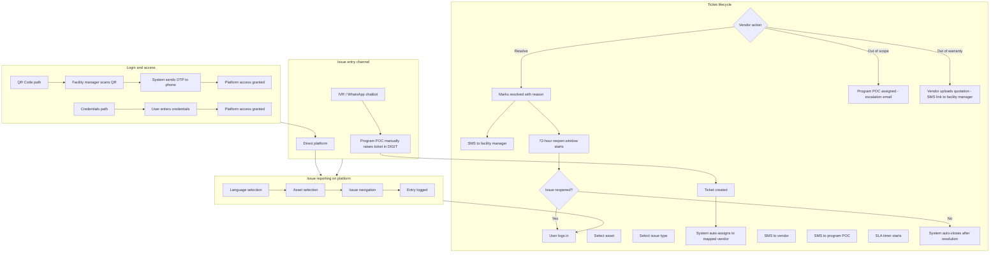
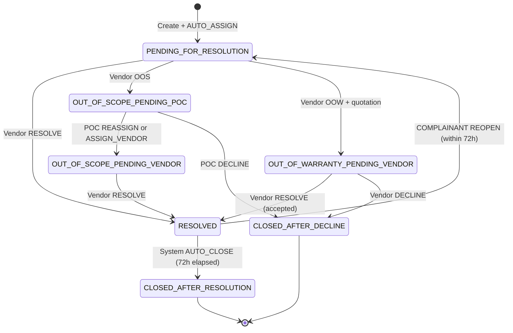
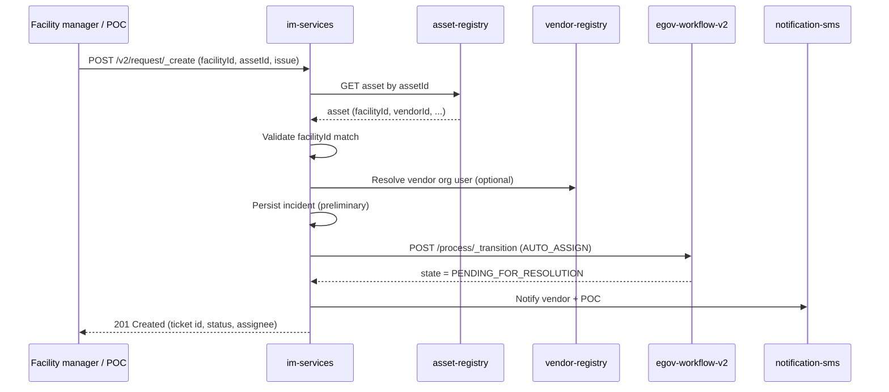
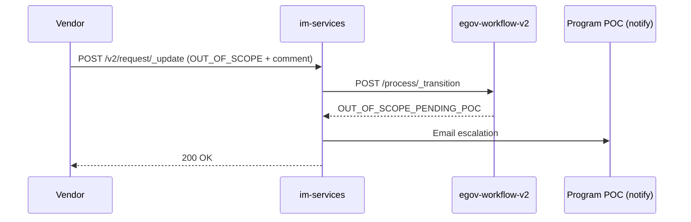
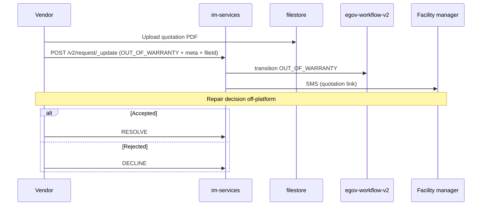
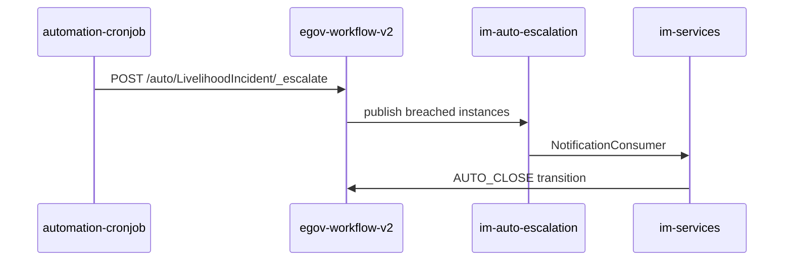

# Livelihood Platform — LLD: Workflow & SLA

**Document type:** Low Level Design (Workflow & SLA track)  
**Version:** v0.10 (Draft)  
**Parent:** [LIVELIHOOD_PLATFORM_CHANGES.md](./LIVELIHOOD_PLATFORM_CHANGES.md) (v2.0 — **facility under project**; **facility manager** = requirement “end user”; no end-user entity)  
**Flow diagram:** Product flow (Login, Issue Entry, Reporting, Ticket lifecycle) — source artifact provided by product; reproduced in §2.1 below.  
**Scope:** Issue / support track only (Saura eMitra extension). Installation workflow is out of scope for this document.  
**Excluded:** Database schema, table DDL, and Flyway migrations (deferred).

---

## 1. Purpose (Phase 1)

This document defines how Livelihood **support tickets** (incidents) move through the system: workflow states, role-based actions, SLA timers, auto-assignment, escalations, and integration with `im-services`, `egov-workflow-v2`, and scheduled jobs.

**Implementation annexes in this document:** §13 (class/package map), §14 (API contracts with OpenAPI snippets and JSON examples).

It is implementable without the DB annex; persistence is assumed to follow existing E4H IM + workflow patterns (`eg_incident_v2`, `egov_wf_process`_*, MDMS config).

---

## 2. References (Phase 1)

| Source                                                                    | Use in this LLD                                                                 |
| ------------------------------------------------------------------------- | ------------------------------------------------------------------------------- |
| Issue Creation Platform Requirements (PDF)                                | States, SLAs, vendor/POC actions, notifications                                 |
| `LIVELIHOOD_PLATFORM_CHANGES.md` §2.0–§2.2, §3.2–§3.3.1, §5.3, §12.8–12.9 | **Facility under project**; facility manager = PDF “end user”; Option 1 binding |
| E4H `im-services` + `egov-workflow-v2`                                    | Reuse patterns (transition API, auto-escalation cron)                           |
| `backend/docs/cron/cronJobAPIConfig.py`                                   | SLA escalation job pattern                                                      |
| Product flow diagram (SVG)                                                | End-to-end paths in §2.1–§2.5                                                   |

---

## 2.1 End-to-end flow overview (product diagram) (Phase 1)

The approved flow diagram groups behaviour into four pillars. This LLD maps each box to services, states, and notifications.

---

## 2.2 Login and access method (Phase 1)

Two mutually exclusive entry paths converge on the same platform session (DIGIT / Livelihood UI).

| Path            | Steps (diagram)                                                    | Implementation notes                                                                                                                                                        |
| --------------- | ------------------------------------------------------------------ | --------------------------------------------------------------------------------------------------------------------------------------------------------------------------- |
| **QR code**     | Facility manager scans QR → OTP to phone → platform access granted | `asset-registry` `qr/_resolve` → `facilityId` + `assetId`; OTP to manager **mobile** (`egov-otp`); session via `egov-user`; jurisdiction must match facility `boundaryCode` |
| **Credentials** | User enters credentials → platform access granted                  | `egov-user` login (username/password or mobile OTP); facility manager = HRMS user with `**COMPLAINANT`** + facility-boundary jurisdiction (Option 1)                        |
| **Mobile OTP**  | (same as QR after scan, or direct)                                 | `POST /user-otp/v1/_send` → manager mobile from facility/HRMS record; **1:1** facility scope after auth                                                                     |

After access, the user reaches issue reporting. Facility managers use asset-linked flows; POC users use state-scoped facility lists.

---

## 2.3 Issue entry channels (Phase 1)

Tickets enter the platform through one of three channels. All channels that create a ticket in DIGIT converge on the same downstream lifecycle (§2.5).

| Channel                       | Actor                                 | Diagram label                                 | Behaviour                                                                                  |
| ----------------------------- | ------------------------------------- | --------------------------------------------- | ------------------------------------------------------------------------------------------ |
| **IVR / WhatsApp chatbot**    | Facility manager (via channel) or POC | Pilot / alternate intake                      | Channel creates or hands off to POC; not fully automated in phase 1                        |
| **Program POC manual create** | Program POC                           | “Program POC manually raises ticket in DIGIT” | POC uses platform (or IM APIs) with `createdOnBehalf=true`; same validations as self-serve |
| **Direct platform**           | Facility manager (typical)            | “Direct platform”                             | Self-serve after login: language → asset → issue navigation → entry logged                 |

**Issue reporting steps (on platform, all channels):**

| Step | Diagram            | System behaviour                                                                                                  |
| ---- | ------------------ | ----------------------------------------------------------------------------------------------------------------- |
| 1    | Language selection | UI locale (EN / Kannada v1); persisted on session or incident metadata                                            |
| 2    | Asset selection    | `POST /asset-registry/v1/asset/_search` with `criteria.facilityID`; drives issue type MDMS and **vendor mapping** |
| 3    | Issue navigation   | Issue type / sub-type per asset category                                                                          |
| 4    | Entry logged       | Persist draft or final submit → triggers ticket create (§8)                                                       |

---

## 2.4 Ticket creation and assignment (diagram sequence) (Phase 1)

After entry is logged, the diagram shows this linear chain:

| Step                                 | Diagram                 | Workflow / system                                            |
| ------------------------------------ | ----------------------- | ------------------------------------------------------------ |
| User logs in                         | (context)               | Auth per §2.2                                                |
| Select asset                         | Reporting               | Validates `asset.facilityId`                                 |
| Select issue type                    | Reporting               | MDMS-driven types                                            |
| Ticket created                       | `im-services` `_create` | Persist `eg_incident_v2` + start workflow                    |
| System auto-assigns to mapped vendor | `AUTO_ASSIGN`           | Assignee = vendor on asset; state → `PENDING_FOR_RESOLUTION` |
| SMS to vendor                        | Notification            | `notification-sms`                                           |
| SMS to program POC                   | Notification            | Email and/or SMS per config                                  |
| SLA timer starts                     | Workflow + MDMS         | **7 days** on vendor-active states (see §7)                  |

**SLA breach branch (diagram):** “SLA breached?” → if **Yes**, escalation email to Program POC. If **No**, flow continues on vendor action. Implemented via `egov-workflow-v2` auto-escalate + `NotificationConsumer` (not E4H blind `CLOSE`).

---

## 2.5 Vendor action branches (diagram) (Phase 1)

From **Vendor action**, three branches:

### A. Resolve (happy path)

| Step                              | Detail                                                                            |
| --------------------------------- | --------------------------------------------------------------------------------- |
| Vendor marks resolved with reason | Mandatory comment; optional attachments                                           |
| SMS to facility manager           | Facility manager notified (requirement PDF: “end user”)                           |
| 72-hour reopen window starts      | State `RESOLVED`; timer for `AUTO_CLOSE`                                          |
| Issue reopened?                   | **Yes** → returns to vendor path (reopen → `PENDING_FOR_RESOLUTION`, new 7d SLA)  |
| Issue reopened?                   | **No** → system auto-closes after resolution → terminal `CLOSED_AFTER_RESOLUTION` |

Terminal outcomes (diagram pills): **End – Resolved** vs **End – Not Resolved** (decline / OOW reject paths).

### B. Out of scope

| Step                                                        | Detail                                                                                                                      |
| ----------------------------------------------------------- | --------------------------------------------------------------------------------------------------------------------------- |
| Vendor marks out of scope                                   | → `OUT_OF_SCOPE_PENDING_POC`                                                                                                |
| Program POC assigned                                        | Assignee / escalation queue for POC                                                                                         |
| Escalation email to Program POC                             | Email (3-day POC SLA starts)                                                                                                |
| POC reassigns same or new vendor **or** decline with reason | `REASSIGN` / `ASSIGN_VENDOR` → `OUT_OF_SCOPE_PENDING_VENDOR` (new 7d vendor SLA), or `DECLINE_POC` → `CLOSED_AFTER_DECLINE` |

Original vendor is not notified when POC reassigns (requirements).

### C. Out of warranty

| Step                                        | Detail                                                                          |
| ------------------------------------------- | ------------------------------------------------------------------------------- |
| Vendor uploads quotation                    | Mandatory quotation document (filestore)                                        |
| SMS with quotation link to facility manager | Link in SMS (filestore URL or deep link)                                        |
| Facility manager decision (off-platform)    | **Accepted** or **Rejected** — negotiated **out of platform**                   |
| Vendor resolves                             | After acceptance → `RESOLVE` → same as happy path                               |
| Vendor closes with reason                   | After rejection → `CLOSED_AFTER_DECLINE` (diagram: “Vendor closes with reason”) |

**OOW SLA reminders (diagram annotation):** Because there are **14 days** to respond, reminder SMS notifications go to **both facility manager and vendor** after **7 days**, and **again before 2 days** before SLA time.

**Quotation economics (diagram annotation):** Quoting of amount and acceptance, rejection, or negotiations happens **out of platform**; the platform records vendor resolve/decline after the fact.

---

## 3. Design decisions (workflow-specific) (Phase 1)

| #   | Decision                       | Proposed value                              | Notes                                                                                          |
| --- | ------------------------------ | ------------------------------------------- | ---------------------------------------------------------------------------------------------- |
| W1  | Workflow business service name | `LivelihoodIncident`                        | Alternative: priority variants like E4H `Incident_Low/Medium/High` — TBD                       |
| W2  | Initial state after create     | `PENDING_FOR_RESOLUTION`                    | Vendor already assigned; no CRM “pending assignment” queue for Livelihood                      |
| W3  | Auto-assign on create          | Yes, synchronous in `im-services` `_create` | Vendor from `assetId` → `vendorId`; then workflow transition `AUTO_ASSIGN`                     |
| W4  | Complainant                    | Facility manager (HRMS `COMPLAINANT`)       | PDF “end user”; **1:1** facility (not project); ticket carries `facilityId` + `assetId`        |
| W9  | Program scope                  | Facility **under project**                  | `ProjectFacility`; no end-user↔project entity; POC lists facilities via project APIs           |
| W8  | Facility manager binding       | Option 1 — facility boundary + HRMS         | No `manager/_link` API; reuse `createFacilityPOCUserIfNotExists` / HRMS create on facility ONM |
| W5  | POC scope                      | State-scoped (e.g. Karnataka)               | Search and “raise on behalf” filtered by facility state                                        |
| W6  | 72h auto-close                 | System transition after resolve             | If no reopen → `CLOSED_AFTER_RESOLUTION`                                                       |
| W7  | Pilot IVR/WhatsApp             | POC manual create                           | Same workflow after `_create`; no separate state machine                                       |

---

## 4. Actors and roles (Phase 1)

**Entity note (aligned with platform doc v2.0):** Requirement PDFs say “end user”; the platform implements that person only as the **facility manager** (HRMS `COMPLAINANT`, 1:1 with a **facility**). Program membership is **facility under project** (`ProjectFacility`)—there is no end-user registry or project↔user link. Tickets and assets always key off `facilityId` (+ `assetId`).

| Actor                | DIGIT user type       | Workflow role(s) (indicative)                                   | Capabilities                                                                                               |
| -------------------- | --------------------- | --------------------------------------------------------------- | ---------------------------------------------------------------------------------------------------------- |
| **Facility manager** | `EMPLOYEE` (HRMS)     | `COMPLAINANT` (+ `EMPLOYEE`); jurisdiction on facility boundary | Raise ticket for **their facility’s** assets, reopen within 72h, receive SMS; login via OTP/QR/credentials |
| **Vendor**           | `EMPLOYEE` (org user) | `COMPLAINT_RESOLVER` / `LIVELIHOOD_VENDOR`                      | Resolve, Out of Scope (OOS), Out of Warranty (OOW), Decline (post-quotation)                               |
| **Program POC**      | `EMPLOYEE`            | `LIVELIHOOD_POC` (replaces CRM for Livelihood)                  | State-scoped inbox; raise on behalf; OOS escalation; reassign / assign vendor / decline                    |
| **System**           | `SYSTEM` / cron user  | `AUTO_ESCALATE`                                                 | SLA breach escalation, 72h auto-close                                                                      |

E4H roles such as CRM manual assign, Tech POC, and RMS-specific states are **not** used for Livelihood tenant/module.

---

## 5. Ticket context model (workflow inputs) (Phase 1)

Every incident process instance is created with:

| Field                              | Source                                               | Workflow use                                                                               |
| ---------------------------------- | ---------------------------------------------------- | ------------------------------------------------------------------------------------------ |
| `tenantId`                         | Request                                              | Tenant isolation                                                                           |
| `facilityId`                       | Facility registry (+ **project** link for POC lists) | Complainant context; facility is under a **project** for install/program; POC state filter |
| `assetId`                          | Asset registry                                       | Issue type list, **vendor resolution**, auto-assign                                        |
| `incidentType` / `incidentSubType` | User selection (MDMS by asset type)                  | SLA variant if needed later                                                                |
| `assignedVendorUserId` / org       | Derived from asset                                   | Pre-filled on create; assignee on workflow                                                 |
| `businessService`                  | Constant                                             | `LivelihoodIncident`                                                                       |

**Validation (im-services, pre-workflow):**

1. Asset exists and `asset.facilityId` = incident `facilityId`.
2. Vendor mapping exists on asset.
3. Facility manager (if self-serve): user’s HRMS jurisdiction `boundary` matches incident `boundaryCode` / `facilityId` (**1:1**; Option 1).
4. POC (if on behalf): facilities in their **state** and typically in their **project** (`project/facility/v1/_search` by `projectId`).
5. Optional (install-aligned tenants): reject ticket if `facilityId` is not linked to an active Livelihood project when enforcement is enabled.

---

## 6. State machine (Phase 1)

### 6.1 Application statuses (user-facing)

Aligned with Issue Creation Platform requirements:

| Status                           | Meaning                                                             | Typical assignee            |
| -------------------------------- | ------------------------------------------------------------------- | --------------------------- |
| `PENDING_FOR_RESOLUTION`         | Vendor auto-assigned; awaiting vendor action                        | Vendor                      |
| `OUT_OF_WARRANTY_PENDING_VENDOR` | Quotation uploaded; awaiting facility manager decision off-platform | Vendor                      |
| `OUT_OF_SCOPE_PENDING_POC`       | Vendor marked OOS; POC must act                                     | Program POC                 |
| `OUT_OF_SCOPE_PENDING_VENDOR`    | POC reassigned; vendor working                                      | Vendor                      |
| `RESOLVED`                       | Vendor resolved; 72h reopen window open                             | — (awaiting citizen/system) |
| `CLOSED_AFTER_RESOLUTION`        | No reopen within 72h                                                | — (terminal)                |
| `CLOSED_AFTER_DECLINE`           | Quotation rejected or POC declined ticket                           | — (terminal)                |

### 6.2 State diagram

### 6.3 Workflow actions (technical)

Map UI “Take Action” to workflow `action` codes (configure in `egov-workflow-v2` business service):

| Action code       | Allowed roles    | From state(s)                                                                             | To state                         |
| ----------------- | ---------------- | ----------------------------------------------------------------------------------------- | -------------------------------- |
| `AUTO_ASSIGN`     | `SYSTEM`         | (start)                                                                                   | `PENDING_FOR_RESOLUTION`         |
| `RESOLVE`         | Vendor           | `PENDING_FOR_RESOLUTION`, `OUT_OF_SCOPE_PENDING_VENDOR`, `OUT_OF_WARRANTY_PENDING_VENDOR` | `RESOLVED`                       |
| `OUT_OF_SCOPE`    | Vendor           | `PENDING_FOR_RESOLUTION`                                                                  | `OUT_OF_SCOPE_PENDING_POC`       |
| `OUT_OF_WARRANTY` | Vendor           | `PENDING_FOR_RESOLUTION`                                                                  | `OUT_OF_WARRANTY_PENDING_VENDOR` |
| `DECLINE`         | Vendor           | `OUT_OF_WARRANTY_PENDING_VENDOR`                                                          | `CLOSED_AFTER_DECLINE`           |
| `REASSIGN`        | POC              | `OUT_OF_SCOPE_PENDING_POC`                                                                | `OUT_OF_SCOPE_PENDING_VENDOR`    |
| `ASSIGN_VENDOR`   | POC              | `OUT_OF_SCOPE_PENDING_POC`                                                                | `OUT_OF_SCOPE_PENDING_VENDOR`    |
| `DECLINE_POC`     | POC              | `OUT_OF_SCOPE_PENDING_POC`                                                                | `CLOSED_AFTER_DECLINE`           |
| `REOPEN`          | Facility manager | `RESOLVED`                                                                                | `PENDING_FOR_RESOLUTION`         |
| `AUTO_CLOSE`      | `SYSTEM`         | `RESOLVED`                                                                                | `CLOSED_AFTER_RESOLUTION`        |

**Note:** `ASSIGN_VENDOR` vs `REASSIGN` may share the same target state; distinguish by whether assignee changes to a different vendor mapped to the facility’s assets.

---

## 7. SLA matrix (Phase 1)

### 7.1 Timer definitions

| Situation                                        | Responsible party               | Duration                                   | Starts when                                       |
| ------------------------------------------------ | ------------------------------- | ------------------------------------------ | ------------------------------------------------- |
| New ticket / reopen / POC reassignment to vendor | Vendor                          | **7 days**                                 | Create, reopen, or POC `REASSIGN`/`ASSIGN_VENDOR` |
| Vendor marked Out of Scope                       | Program POC                     | **3 days**                                 | Vendor `OUT_OF_SCOPE`                             |
| Quotation uploaded (Out of Warranty)             | Vendor (+ reminders)            | **14 days**                                | Vendor `OUT_OF_WARRANTY` with document            |
| OOW reminder SMS (diagram)                       | Facility manager **and** vendor | At **day 7** and **2 days before** SLA end | While in `OUT_OF_WARRANTY_PENDING_VENDOR`         |
| Resolved → auto-close                            | System                          | **72 hours**                               | Vendor `RESOLVE`                                  |
| SLA breach (vendor idle)                         | Escalation to POC               | —                                          | 7-day vendor SLA expires (email)                  |
| POC action on OOS                                | Program POC                     | **3 days**                                 | Vendor `OUT_OF_SCOPE`                             |

All durations from Issue Creation Platform requirements and product flow diagram labels (**7 days**, **3 days**, **14 days**).

### 7.2 SLA storage and computation

| Concern                 | Owner                            | Mechanism                                                                                                                                                                           |
| ----------------------- | -------------------------------- | ----------------------------------------------------------------------------------------------------------------------------------------------------------------------------------- |
| Per-state SLA hours     | MDMS + workflow business service | State-level `sla` on `LivelihoodIncident` definition (E4H pattern)                                                                                                                  |
| Remaining SLA on search | `im-services` `SLAService`       | Reuse; extend state map for Livelihood statuses                                                                                                                                     |
| Breach detection        | `egov-workflow-v2`               | `POST /egov-wf/auto/LivelihoodIncident/_escalate`                                                                                                                                   |
| Breach side-effect      | `im-services` Kafka consumer     | Extend `NotificationConsumer` on topic `im-auto-escalation` (today E4H may use `CLOSE` — **Livelihood must use escalation/notify rules from MDMS AutoEscalation, not blind CLOSE**) |

### 7.3 MDMS AutoEscalation (configuration design)

Configure rows under `Workflow.AutoEscalation` for business service `LivelihoodIncident`, for example:

| status                           | businessSlaExceededBy / stateSlaExceededBy | action                       | topic                                 |
| -------------------------------- | ------------------------------------------ | ---------------------------- | ------------------------------------- |
| `PENDING_FOR_RESOLUTION`         | 7d                                         | `ESCALATE_TO_POC`            | `im-auto-escalation`                  |
| `OUT_OF_SCOPE_PENDING_POC`       | 3d                                         | `REMIND_POC`                 | `im-auto-escalation`                  |
| `OUT_OF_WARRANTY_PENDING_VENDOR` | 14d                                        | `REMIND_VENDOR`              | `im-auto-escalation`                  |
| `OUT_OF_WARRANTY_PENDING_VENDOR` | 7d elapsed                                 | `REMIND_END_USER_AND_VENDOR` | `im-auto-escalation` (custom handler) |
| `OUT_OF_WARRANTY_PENDING_VENDOR` | 12d elapsed (2d before 14d)                | `REMIND_END_USER_AND_VENDOR` | Second reminder per diagram           |
| `RESOLVED`                       | 72h                                        | `AUTO_CLOSE`                 | `im-auto-escalation`                  |

Exact MDMS JSON structure to match existing `EscalationService` / `NotificationConsumer` parsing in E4H (implementer to align with `V20251129153500__migrate_workflow_auto_escalation` pattern).

**Diagram alignment:** Vendor-path SLA breach triggers **escalation email to Program POC** (not auto-close). POC-path OOS uses **3-day** SLA. OOW uses **14-day** window with staged SMS reminders.

---

## 8. Auto-assignment on ticket create (Phase 1)

### 8.1 Behaviour

On `POST /im-services/v2/request/_create` (Livelihood module):

1. Validate `facilityId`, `assetId`, issue type, and user authorization.
2. Load asset from **asset-registry**; assert `asset.facilityId == request.facilityId`.
3. Read `vendorId` / org assignee from asset (or vendor-registry).
4. Build incident with assignee = vendor user (HRMS/org search if needed).
5. Start workflow: action `AUTO_ASSIGN` → state `PENDING_FOR_RESOLUTION`.
6. Start **7-day** vendor SLA timer.
7. Send notifications: SMS to vendor + email/SMS to POC (per matrix §10).

No CRM assignment step.

### 8.2 Sequence diagram

### 8.3 POC create on behalf

Same flow; `requestInfo.userInfo` = POC. Complainant on incident = selected facility manager (for SMS). Optional flag `createdOnBehalf=true`.

---

## 9. Vendor workflows (Phase 1)

### 9.1 Resolve

| Step         | Detail                                                                                 |
| ------------ | -------------------------------------------------------------------------------------- |
| Precondition | State `PENDING_FOR_RESOLUTION` or `OUT_OF_SCOPE_PENDING_VENDOR` or post-OOW acceptance |
| Input        | Mandatory comment; optional documents (filestore)                                      |
| Action       | `RESOLVE`                                                                              |
| Post         | State `RESOLVED`; SMS to facility manager; 72h reopen window; schedule `AUTO_CLOSE`    |

### 9.2 Out of Scope (OOS)

| Step         | Detail                                                                                                         |
| ------------ | -------------------------------------------------------------------------------------------------------------- |
| Precondition | State `PENDING_FOR_RESOLUTION`                                                                                 |
| Input        | Mandatory OOS reason + comment; optional documents                                                             |
| Action       | `OUT_OF_SCOPE`                                                                                                 |
| Post         | State `OUT_OF_SCOPE_PENDING_POC`; **3-day** POC SLA; email to POC; SMS to facility manager optional per matrix |

### 9.3 Out of Warranty (OOW)

| Step         | Detail                                                                                                          |
| ------------ | --------------------------------------------------------------------------------------------------------------- |
| Precondition | State `PENDING_FOR_RESOLUTION`                                                                                  |
| Input        | Observation, recommended solution, timeline, **quotation document** (mandatory)                                 |
| Action       | `OUT_OF_WARRANTY`                                                                                               |
| Post         | State `OUT_OF_WARRANTY_PENDING_VENDOR`; **14-day** SLA; SMS to facility manager with quotation link; notify POC |

**Off-platform decision (diagram):** Facility manager accepts or rejects quotation outside the platform. Vendor then records outcome in DIGIT:

| Facility manager decision (off-platform) | Vendor action in platform               | Result state                                    |
| ---------------------------------------- | --------------------------------------- | ----------------------------------------------- |
| Accepted                                 | `RESOLVE`                               | `RESOLVED` → 72h reopen window                  |
| Rejected                                 | Close with reason (diagram) / `DECLINE` | `CLOSED_AFTER_DECLINE` → **End – Not Resolved** |

UI may expose “Close with reason” as distinct from OOS decline; workflow action can remain `DECLINE` with `closureReason=OOW_REJECTED`.

---

## 10. Program POC workflows (Phase 1)

### 10.1 State-scoped access

| Operation       | Filter rule                                           |
| --------------- | ----------------------------------------------------- |
| `_search`       | Incidents where facility.state ∈ POC’s assigned state |
| Raise on behalf | Facility dropdown = facilities in POC state only      |

Implementation: **POC** — state/district HRMS jurisdiction (E4H employee login). **Facility manager** — facility `boundaryCode` jurisdiction (`COMPLAINANT`, Option 1).

### 10.2 Actions when `OUT_OF_SCOPE_PENDING_POC`

| UI action              | Workflow        | Effect                                                                                      |
| ---------------------- | --------------- | ------------------------------------------------------------------------------------------- |
| Reassign (same vendor) | `REASSIGN`      | Back to `OUT_OF_SCOPE_PENDING_VENDOR`; **new 7-day** vendor SLA                             |
| Assign another vendor  | `ASSIGN_VENDOR` | Pick from vendors mapped to **any asset at same facility**; new assignee; **new 7-day** SLA |
| Decline ticket         | `DECLINE_POC`   | `CLOSED_AFTER_DECLINE`; SMS to facility manager; email audit                                |

Original vendor is **not** notified on POC reassignment (per requirements).

### 10.3 SLA breach visibility

POC receives email on:

- New ticket in state (informational)
- Vendor 7-day breach (escalation)
- OOS escalation (when vendor marks OOS)
- Quotation submitted (OOW)
- Ticket closed without resolution (decline paths)

---

## 11. Reopen and auto-close (Phase 1)

### 11.1 Reopen (facility manager)

| Rule        | Value                                                     |
| ----------- | --------------------------------------------------------- |
| Eligibility | Only from `RESOLVED`                                      |
| Window      | **72 hours** from resolve timestamp                       |
| UI          | Take Action → Reopen; mandatory comment                   |
| API         | `POST /v2/request/_update` with `workflow.action: REOPEN` |
| Workflow    | `REOPEN` → `PENDING_FOR_RESOLUTION`                       |
| SLA         | New **7-day** vendor SLA from reopen time                 |
| Assignee    | Same vendor unless POC had changed assignee earlier       |

### 11.2 Auto-close (system)

| Rule            | Value                                                                                           |
| --------------- | ----------------------------------------------------------------------------------------------- |
| Trigger         | `RESOLVED` + 72h elapsed + no reopen                                                            |
| Mechanism       | MDMS AutoEscalation + cron `auto/LivelihoodIncident/_escalate` → Kafka → `im-services` consumer |
| Workflow action | `AUTO_CLOSE` → `CLOSED_AFTER_RESOLUTION`                                                        |
| Notification    | Optional SMS to facility manager (ticket closed)                                                |

---

## 12. Service responsibilities (implementation map) (Phase 1)

| Responsibility              | Primary service                                               | APIs / hooks                                            |
| --------------------------- | ------------------------------------------------------------- | ------------------------------------------------------- |
| Create / update incident    | `im-services`                                                 | `/v2/request/_create`, `_update`                        |
| Auto-assign vendor          | `im-services`                                                 | Internal: asset-registry client; enrich before workflow |
| Workflow transitions        | `egov-workflow-v2`                                            | `/egov-wf/process/_transition`                          |
| Business service definition | `egov-workflow-v2` + MDMS                                     | `/businessservice/_search`, MDMS publish                |
| SLA display                 | `im-services`                                                 | `SLAService` — extend status map                        |
| SLA breach / auto-close     | `egov-workflow-v2` + cron                                     | `/auto/LivelihoodIncident/_escalate`                    |
| Breach consumer logic       | `im-services`                                                 | `NotificationConsumer` — **Livelihood-specific branch** |
| SMS / email                 | `egov-notification-sms` + `im-services` `NotificationService` | Event-driven on transition                              |
| Asset / vendor lookup       | `asset-registry`, `vendor-registry`                           | Called from im-services                                 |

---

## 13. Class and package changes (high level) (Phase 1)

No full code listing — this section maps **packages and primary classes** to Livelihood workflow responsibilities. New Livelihood-specific types should live in clearly named packages; E4H health paths stay behind tenant/module guards.

### 13.1 Service modules (deployable units)

| Module / service             | Base path (indicative)                           | Livelihood change level | Primary touchpoints                                                                                 |
| ---------------------------- | ------------------------------------------------ | ----------------------- | --------------------------------------------------------------------------------------------------- |
| **im-services**              | `backend/e4h-services/im-services/`              | **Major modify**        | Create/update/search; auto-assign; SLA; notifications; escalation consumer                          |
| **egov-workflow-v2**         | `core-services/egov-workflow-v2/`                | **Config + minor**      | New business service `LivelihoodIncident`; MDMS publish; no Java fork required                      |
| **health-facility-registry** | `backend/e4h-services/health-facility-registry/` | **Modify**              | Facility manager link; Livelihood facility attributes; state-scoped search                          |
| **asset-registry**           | `backend/e4h-services/asset-registry/`           | **Modify**              | `facilityID` on asset; `_search` by `facilityID`; optional QR resolve API                           |
| **vendor-registry**          | `backend/e4h-services/vendor-registry/`          | **Reuse / modify**      | Organisation APIs; optional vendors-by-facility helper                                              |
| **project**                  | `backend/e4h-services/project/`                  | **Modify**              | Multi-state project; justification-code mapping (install track; shared master data)                 |
| **egov-mdms-service-v2**     | `core-services/egov-mdms-service-v2/`            | **Data**                | Issue types, SLA matrix, notification templates, `Workflow.AutoEscalation`                          |
| **egov-notification-sms**    | `core-services/egov-notification-sms/`           | **Reuse**               | SMS templates referenced by `im-services` `NotificationService`                                     |
| **egov-user / egov-otp**     | `core-services/egov-user/`, `egov-otp/`          | **Reuse**               | Facility manager + employee login; OTP for QR path                                                  |
| **automation-cronjob**       | `backend/e4h-services/automation-cronjob/`       | **Extend**              | Add `LivelihoodIncident` to cron `business_services` list                                           |
| **field-planner**            | `backend/e4h-services/field-planner/`            | **Modify** (install)    | Out of workflow LLD scope except shared facility/vendor masters                                     |
| **ingestion-service**        | `backend/e4h-services/ingestion-service/`        | **Modify**              | Facility ingest **includes manager columns** (no separate facility-manager ingest); assets, vendors |
| **im-services-analytics**    | `backend/e4h-services/im-services-analytics/`    | **Optional new**        | Livelihood escalation report job (replace E4H-specific analytics for Livelihood tenant)             |
| **processor-services**       | `backend/e4h-services/processor-services/`       | **N/A** (phase 1)       | Video pipeline not required for Livelihood MVP                                                      |
| **rms-service**              | `backend/e4h-services/rms-service/`              | **N/A**                 | No telemetry auto-tickets for Livelihood                                                            |

### 13.2 `im-services` (org.egov.im)

| Class / component                                  | Package / file (indicative)                       | Change                                                                                         |
| -------------------------------------------------- | ------------------------------------------------- | ---------------------------------------------------------------------------------------------- |
| `RequestsApiController`                            | `web/controllers/`                                | No route change; behaviour via enrichment                                                      |
| `IMService`                                        | `service/IMService.java`                          | Livelihood create path: validate asset@facility; sync auto-assign                              |
| `EnrichmentService`                                | `service/EnrichmentService.java`                  | Set `facilityId`; resolve vendor from asset-registry; POC state filter                         |
| `WorkflowService`                                  | `service/WorkflowService.java`                    | Resolve `LivelihoodIncident` business service (not priority map)                               |
| `NotificationConsumer`                             | `consumer/NotificationConsumer.java`              | **Branch** Livelihood: `AUTO_CLOSE` / escalate — not blind E4H `CLOSE`                         |
| `NotificationService`                              | `service/NotificationService.java`                | New event codes: OOW quotation, OOS POC, OOW reminders                                         |
| `SLAService`                                       | `service/SLAService.java`                         | Map Livelihood statuses → SLA states (7d / 3d / 14d)                                           |
| `Validator` (create/update)                        | `validator/`                                      | Rules: asset required; vendor on asset; manager jurisdiction = facility boundary               |
| `Incident` (model)                                 | `web/models/Incident.java`                        | **Add** `assetId`; optional `createdOnBehalf`, `entryChannel`                                  |
| `IncidentRequest`                                  | `web/models/IncidentRequest.java`                 | Unchanged structure; workflow block required on create                                         |
| `Workflow` (model)                                 | `web/models/Workflow.java`                        | `assignes`, `action`, `verificationDocuments`, `comments`                                      |
| `IMConstants` / config                             | `util/IMConstants.java`, `config/IMConfiguration` | Livelihood business service name; tenant module flag                                           |
| `Repository`                                       | `repository/`                                     | Persist `asset_id`, quotation file id in `additionalDetail` or columns                         |
| **New** `LivelihoodIncidentEnricher` (recommended) | `service/livelihood/`                             | Optional: isolate Livelihood-only enrichment from E4H enrichment                               |
| **New** `AssetRegistryClient`                      | `service/` or `util/`                             | REST client to asset-registry for vendor + asset validation                                    |
| **New** `FacilityManagerValidator`                 | `validator/`                                      | Self-serve: reporter `COMPLAINANT` jurisdiction matches `incident.boundaryCode` / `facilityId` |

### 13.3 `asset-registry` (org.egov.asset)

| Class / component      | Change                                                                              |
| ---------------------- | ----------------------------------------------------------------------------------- |
| `Asset` (entity/model) | Ensure `facilityId`, `vendorId` (DB + API model)                                    |
| `AssetService`         | Validation: vendor mapped; facility consistency                                     |
| `AssetValidator`       | Livelihood item-code rules (solar flag, serial optional per requirements)           |
| `V1ApiController`      | **Modify** `POST /v1/asset/_search` (`criteria.facilityID`); optional `qr/_resolve` |
| `AssetSearchCriteria`  | Document / enforce `facilityID` for Livelihood asset lists                          |
| `FacilityUtil`         | Cross-call to facility-registry for facility manager context                        |

### 13.4 `health-facility-registry` (org.egov.e4h.facility)

| Class / component                                  | Change                                                                                             |
| -------------------------------------------------- | -------------------------------------------------------------------------------------------------- |
| Facility create/update                             | Livelihood fields; manager contact (`facilityPocPhone`, etc.)                                      |
| `createFacilityPOCUserIfNotExists` / `HRMSService` | **Reuse** — provision **1** HRMS user per facility (`COMPLAINANT`, jurisdiction on `boundaryCode`) |
| Search APIs                                        | Filters for POC: state, project, program type                                                      |
| Optional `_resolve-by-manager-mobile`              | Bootstrap OTP session only (not a link API)                                                        |

### 13.5 `egov-workflow-v2` (configuration, not Java fork)

| Artifact                       | Livelihood content                                                      |
| ------------------------------ | ----------------------------------------------------------------------- |
| Business service definition    | `LivelihoodIncident` with states/actions from §6                        |
| MDMS `Workflow.AutoEscalation` | Rows per state: 7d vendor, 3d POC, 14d OOW, 72h auto-close              |
| MDMS roles                     | `LIVELIHOOD_VENDOR`, `LIVELIHOOD_POC`, `COMPLAINANT` (facility manager) |

### 13.6 Frontend / BFF (out of repo scope, contracts only)

| Layer               | Change                                                                  |
| ------------------- | ----------------------------------------------------------------------- |
| Livelihood issue UI | Asset picker, issue-type MDMS, vendor actions, POC reassignment UI      |
| API gateway routes  | Proxy to `im-services`, `asset-registry`, `facility-service`, `egov-wf` |

### 13.7 Suggested new artifacts (names only)

| Artifact                          | Purpose                                             |
| --------------------------------- | --------------------------------------------------- |
| `LivelihoodIMConstants.java`      | Business service, action codes, MDMS module codes   |
| `LivelihoodWorkflowConfig.java`   | Tenant flag: `tenant.module=livelihood` routing     |
| `LivelihoodNotificationTemplates` | SMS/email template keys (MDMS-driven)               |
| Flyway (deferred annex)           | `eg_incident_v2.asset_id`, indexes on `facility_id` |

---

## 14. API contracts (Phase 1)

API contracts have been moved to a dedicated document:

- See `LIVELIHOOD_API_SPECS.md` (Phase 1 API specs bundle).

This keeps the workflow/SLA LLD focused on behaviour, while the API contracts live in one place for ongoing updates.

---

## 15. Delta vs E4H incident workflow (Phase 1)

| E4H (health IM)                 | Livelihood                                                               |
| ------------------------------- | ------------------------------------------------------------------------ |
| Create → `PENDINGFORASSIGNMENT` | Create → auto-assign → `PENDING_FOR_RESOLUTION`                          |
| CRM assigns vendor              | Vendor from **asset**                                                    |
| Facility-level vendor mapping   | **Asset-level** vendor                                                   |
| Tech POC / RMS states           | Removed                                                                  |
| OOS / OOW flows                 | Explicit states + POC 3d / vendor 14d SLA                                |
| Resolve → rate/close            | Resolve → 72h reopen → auto `CLOSED_AFTER_RESOLUTION`                    |
| Escalation consumer may `CLOSE` | Configure per Livelihood AutoEscalation (do not reuse E4H CLOSE blindly) |

---

## 16. Cron and scheduled jobs (Phase 1)

| Job                          | Schedule (indicative)                                       | Calls                              | Livelihood business service |
| ---------------------------- | ----------------------------------------------------------- | ---------------------------------- | --------------------------- |
| SLA escalation / auto-close  | Daily (extend `automation-cronjob` / `cronJobAPIConfig.py`) | `POST .../auto/{bs}/_escalate`     | `LivelihoodIncident`        |
| Escalation emails (optional) | Daily / weekly                                              | `im-services-analytics` or new job | Reporting only              |

**Configuration change:** Add `LivelihoodIncident` to cron `business_services` list alongside or instead of health `Incident`* for Livelihood tenant only (tenant argument to cron script).

---

## 17. Notification events (workflow-triggered) (Phase 1)

| Event                                  | Facility manager             | Vendor                | Program POC    |
| -------------------------------------- | ---------------------------- | --------------------- | -------------- |
| Ticket created (auto-assigned)         | SMS (if self) / if on behalf | SMS                   | Email          |
| SLA breached (vendor)                  | SMS/email optional           | —                     | Email          |
| OOS marked                             | Optional                     | —                     | Email          |
| OOS reassigned                         | SMS                          | SMS (new vendor only) | —              |
| Quotation uploaded                     | SMS + link                   | —                     | Email          |
| OOW reminder (day 7, T-2d)             | SMS                          | SMS                   | Optional email |
| Resolved                               | SMS                          | —                     | —              |
| Vendor closes with reason (OOW reject) | SMS                          | —                     | Email optional |
| Closed after resolution                | Optional                     | —                     | —              |
| Declined                               | SMS                          | —                     | Email          |

Template keys and localization (EN / Kannada) via `egov-localization`; exact codes to be listed in annex `07-Notifications` (future LLD).

---

## 18. Error and edge cases (Phase 1)

| Case                                           | Handling                                   |
| ---------------------------------------------- | ------------------------------------------ |
| Asset not at facility                          | 400 on create; no workflow started         |
| No vendor on asset                             | 400 on create; block with clear error code |
| Reopen after 72h                               | 403; action not in workflow                |
| Vendor action on wrong assignee                | 403 from workflow role/assignee check      |
| POC action on other state                      | 403                                        |
| POC picks vendor not mapped to facility assets | 400 on `ASSIGN_VENDOR`                     |
| Duplicate create (idempotency)                 | Optional: client reference id — TBD        |

---

## 19. Testing scenarios (acceptance) (Phase 1)

1. Facility manager creates ticket for asset A → vendor A assigned → `PENDING_FOR_RESOLUTION`.
2. Facility with assets A (vendor 1) and B (vendor 2) → two tickets get different vendors.
3. Vendor resolves → manager receives SMS → reopen within 72h → back to vendor with new 7d SLA.
4. No reopen → after 72h cron → `CLOSED_AFTER_RESOLUTION`.
5. Vendor OOS → POC email → POC reassigns same vendor → vendor resolves.
6. Vendor OOS → POC assigns other vendor mapped to facility → only new vendor notified.
7. Vendor OOW with quotation → 14d path → decline → `CLOSED_AFTER_DECLINE`.
8. Vendor idle 7d → POC escalation email.
9. POC in state X cannot see or create for facility in state Y.
10. POC creates on behalf → manager receives SMS.

---

---

