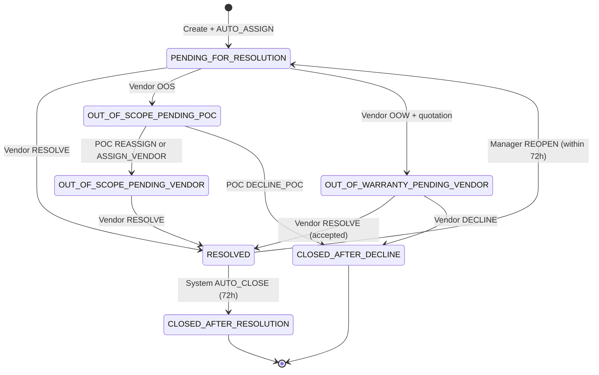

# Livelihood Platform — LLD: Workflow & SLA (De-duplicated)

**Purpose:** Define how Livelihood **support tickets** move through the system: states, role actions, SLAs, auto-assignment, escalations, and integration with `im-services`, `egov-workflow-v2`, and cron jobs.  
**Source:** `LIVELIHOOD_LLD_WORKFLOW_AND_SLA.md` (v0.10 draft).  
**Entity model / auth:** See `LIVELIHOOD_PLATFORM_CHANGES_CONCISE.md` §1 (facility under project, facility manager = PDF “end user”, asset-level vendor).  
**API contracts:** See `LIVELIHOOD_API_SPECS.md`.  
**Scope:** Issue/support track only (Phase 1). Installation workflow is out of scope. DB schema/DDL deferred.

---

## 1. Design decisions (workflow-specific)

| # | Decision | Value | Notes |
| --- | --- | --- | --- |
| W1 | Business service name | `LivelihoodIncident` | Alternative: priority variants like E4H — TBD |
| W2 | Initial state after create | `PENDING_FOR_RESOLUTION` | No CRM “pending assignment” queue |
| W3 | Auto-assign on create | Yes, synchronous in `_create` | Vendor from `assetId` → `vendorId`; then `AUTO_ASSIGN` |
| W4 | Complainant | Facility manager (`COMPLAINANT`) | Ticket carries `facilityId` + `assetId` |
| W5 | POC scope | State-scoped | Search and raise-on-behalf filtered by facility state |
| W6 | 72h auto-close | System transition after resolve | No reopen → `CLOSED_AFTER_RESOLUTION` |
| W7 | Pilot IVR/WhatsApp | POC manual create | Same workflow after `_create` |
| W8 | Manager binding | Option 1 (facility boundary + HRMS) | No `manager/_link` API |

**E4H roles not used for Livelihood:** CRM manual assign, Tech POC, RMS-specific states.

---

## 2. Actors and roles

| Actor | DIGIT user | Workflow role(s) | Key capabilities |
| --- | --- | --- | --- |
| **Facility manager** | HRMS `EMPLOYEE` | `COMPLAINANT` | Raise ticket for their facility’s assets; reopen within 72h; OTP/QR/credentials login |
| **Vendor** | Org user `EMPLOYEE` | `LIVELIHOOD_VENDOR` / `COMPLAINT_RESOLVER` | Resolve, OOS, OOW (+ quotation), Decline after OOW rejection |
| **Program POC** | HRMS `EMPLOYEE` | `LIVELIHOOD_POC` | State-scoped inbox; raise on behalf; OOS escalation; reassign / assign vendor / decline |
| **System** | Cron / `SYSTEM` | `AUTO_ESCALATE` | SLA breach escalation, 72h auto-close |

---

## 3. Ticket context and validations

Every incident is created with:

| Field                              | Source                      | Use                                                |
| ---------------------------------- | --------------------------- | -------------------------------------------------- |
| `tenantId`                         | Request                     | Tenant isolation                                   |
| `facilityId`                       | Request + Facility registry | Complainant context; POC state filter              |
| `assetId`                          | Request + Asset registry    | Issue types (MDMS), vendor resolution, auto-assign |
| `incidentType` / `incidentSubType` | User + MDMS                 | Issue classification                               |
| `assignedVendorUserId`             | Derived from asset          | Pre-filled assignee on create                      |
| `businessService`                  | Constant                    | `LivelihoodIncident`                               |

**Pre-workflow validations (`im-services`):**

1. Asset exists and `asset.facilityId` = incident `facilityId`.
2. Vendor mapping exists on asset.
3. Self-serve (facility manager): HRMS jurisdiction matches facility `boundaryCode` (1:1).
4. POC on-behalf: facility in POC’s **state** (and typically in their project).
5. Optional: reject if facility not linked to active Livelihood project (when enforcement enabled).

---

## 4. End-to-end flow

### 4.1 Login and entry channels

| Path / channel               | Behaviour                                                                             |
| ---------------------------- | ------------------------------------------------------------------------------------- |
| **Direct platform**          | Manager logs in → language (EN/Kannada) → select asset → issue type → create          |
| **QR + OTP**                 | `asset-registry` `qr/_resolve` → OTP to facility manager mobile → same reporting flow |
| **Credentials / mobile OTP** | `egov-user` + `egov-otp`; manager scoped to one facility                              |
| **IVR/WhatsApp (pilot)**     | Hand off to POC; POC creates ticket with `createdOnBehalf=true`                       |

**Asset selection:** `POST /asset-registry/v1/asset/_search` with `criteria.facilityID` — drives issue types and vendor mapping.

### 4.2 Create → auto-assign → SLA start

On `POST /im-services/v2/request/_create`:

1. Validate `facilityId`, `assetId`, issue type, user authorization.
2. Load asset; assert `asset.facilityId == facilityId`.
3. Resolve vendor from asset (optionally via vendor-registry).
4. Persist incident; workflow `AUTO_ASSIGN` → `PENDING_FOR_RESOLUTION`.
5. Start **7-day** vendor SLA.
6. Notify vendor (SMS) + POC (email/SMS).

**POC on-behalf:** Same flow. `requestInfo.userInfo` = POC; complainant on incident = facility manager (for SMS). Flag `createdOnBehalf=true`.

**SLA breach (vendor idle 7d):** Escalation email to POC via auto-escalate cron — **not** auto-close.

---

## 5. State machine

### 5.1 Statuses

| Status | Meaning | Assignee |
| --- | --- | --- |
| `PENDING_FOR_RESOLUTION` | Vendor auto-assigned; awaiting action | Vendor |
| `OUT_OF_SCOPE_PENDING_POC` | Vendor marked OOS; POC must act | Program POC |
| `OUT_OF_SCOPE_PENDING_VENDOR` | POC reassigned; vendor working | Vendor |
| `OUT_OF_WARRANTY_PENDING_VENDOR` | Quotation uploaded; off-platform decision | Vendor |
| `RESOLVED` | Resolved; 72h reopen window | — |
| `CLOSED_AFTER_RESOLUTION` | No reopen within 72h (terminal) | — |
| `CLOSED_AFTER_DECLINE` | POC decline or OOW rejection (terminal) | — |

### 5.2 State diagram

### 5.3 Workflow actions

| Action | Role | From state(s) | To state |
| --- | --- | --- | --- |
| `AUTO_ASSIGN` | System | (start) | `PENDING_FOR_RESOLUTION` |
| `RESOLVE` | Vendor | `PENDING_FOR_RESOLUTION`, `OUT_OF_SCOPE_PENDING_VENDOR`, `OUT_OF_WARRANTY_PENDING_VENDOR` | `RESOLVED` |
| `OUT_OF_SCOPE` | Vendor | `PENDING_FOR_RESOLUTION` | `OUT_OF_SCOPE_PENDING_POC` |
| `OUT_OF_WARRANTY` | Vendor | `PENDING_FOR_RESOLUTION` | `OUT_OF_WARRANTY_PENDING_VENDOR` |
| `DECLINE` | Vendor | `OUT_OF_WARRANTY_PENDING_VENDOR` | `CLOSED_AFTER_DECLINE` |
| `REASSIGN` | POC | `OUT_OF_SCOPE_PENDING_POC` | `OUT_OF_SCOPE_PENDING_VENDOR` |
| `ASSIGN_VENDOR` | POC | `OUT_OF_SCOPE_PENDING_POC` | `OUT_OF_SCOPE_PENDING_VENDOR` |
| `DECLINE_POC` | POC | `OUT_OF_SCOPE_PENDING_POC` | `CLOSED_AFTER_DECLINE` |
| `REOPEN` | Facility manager | `RESOLVED` (within 72h) | `PENDING_FOR_RESOLUTION` |
| `AUTO_CLOSE` | System | `RESOLVED` (after 72h) | `CLOSED_AFTER_RESOLUTION` |

All workflow actions go through **`POST /v2/request/_update`** (no separate reopen/quotation routes). Quotation: upload to filestore first, then `_update` with `OUT_OF_WARRANTY` + `verificationDocuments`.

`ASSIGN_VENDOR` vs `REASSIGN`: same target state; differs by whether assignee changes to a different vendor mapped to facility assets.

---

## 6. Vendor action branches

### 6.1 Resolve (happy path)

| Step | Detail |
| --- | --- |
| Precondition | `PENDING_FOR_RESOLUTION`, `OUT_OF_SCOPE_PENDING_VENDOR`, or post-OOW acceptance |
| Input | Mandatory comment; optional attachments |
| Post | `RESOLVED`; SMS to manager; 72h reopen window; schedule `AUTO_CLOSE` |

### 6.2 Out of Scope

| Step | Detail |
| --- | --- |
| Precondition | `PENDING_FOR_RESOLUTION` |
| Input | Mandatory OOS reason + comment |
| Post | `OUT_OF_SCOPE_PENDING_POC`; **3-day** POC SLA; email to POC |

POC then: `REASSIGN` / `ASSIGN_VENDOR` → `OUT_OF_SCOPE_PENDING_VENDOR` (new 7d vendor SLA), or `DECLINE_POC` → `CLOSED_AFTER_DECLINE`. **Original vendor is not notified** on POC reassignment.

### 6.3 Out of Warranty

| Step         | Detail                                                                               |
| ------------ | ------------------------------------------------------------------------------------ |
| Precondition | `PENDING_FOR_RESOLUTION`                                                             |
| Input        | Observation, solution, timeline, **mandatory quotation** (filestore)                 |
| Post         | `OUT_OF_WARRANTY_PENDING_VENDOR`; **14-day** SLA; SMS with quotation link to manager |

**Off-platform decision:** Manager accepts/rejects outside platform. Vendor records outcome:

| Manager decision | Vendor action | Result |
| --- | --- | --- |
| Accepted | `RESOLVE` | `RESOLVED` → 72h reopen window |
| Rejected | `DECLINE` (closureReason e.g. `OOW_REJECTED`) | `CLOSED_AFTER_DECLINE` |

**OOW reminders:** SMS to manager **and** vendor at day 7 and T-2 days (within 14-day window).

---

## 7. Program POC workflows

| Operation | Filter / rule |
| --- | --- |
| `_search` | Incidents where facility.state ∈ POC’s assigned state |
| Raise on behalf | Facility list limited to POC state |

**When `OUT_OF_SCOPE_PENDING_POC`:**

| UI action | Workflow | Effect |
| --- | --- | --- |
| Reassign (same vendor) | `REASSIGN` | `OUT_OF_SCOPE_PENDING_VENDOR`; new 7d vendor SLA |
| Assign another vendor | `ASSIGN_VENDOR` | Vendor must be mapped to an asset at same facility; new 7d SLA |
| Decline ticket | `DECLINE_POC` | `CLOSED_AFTER_DECLINE`; SMS to manager |

**POC email triggers:** new ticket (informational), vendor 7d breach, OOS escalation, quotation submitted, ticket closed without resolution.

---

## 8. Reopen and auto-close

### 8.1 Reopen (facility manager)

| Rule | Value |
| --- | --- |
| Eligibility | Only from `RESOLVED` |
| Window | **72 hours** from resolve timestamp |
| API | `POST /v2/request/_update` with `workflow.action: REOPEN` |
| Result | `PENDING_FOR_RESOLUTION`; new **7-day** vendor SLA; same assignee unless POC changed earlier |

### 8.2 Auto-close (system)

| Rule | Value |
| --- | --- |
| Trigger | `RESOLVED` + 72h elapsed + no reopen |
| Mechanism | MDMS AutoEscalation + cron `auto/LivelihoodIncident/_escalate` → Kafka `im-auto-escalation` → `im-services` consumer |
| Action | `AUTO_CLOSE` → `CLOSED_AFTER_RESOLUTION` |
| Notification | Optional SMS to manager |

---

## 9. SLA matrix and implementation

### 9.1 Timers

| Situation | Owner | Duration | Starts when |
| --- | --- | --- | --- |
| New ticket / reopen / POC reassign to vendor | Vendor | **7 days** | create / reopen / `REASSIGN` / `ASSIGN_VENDOR` |
| Vendor marked OOS | Program POC | **3 days** | `OUT_OF_SCOPE` |
| Quotation uploaded (OOW) | Vendor (+ reminders) | **14 days** | `OUT_OF_WARRANTY` with document |
| OOW reminder SMS | Manager + vendor | Day 7 and T-2d | while `OUT_OF_WARRANTY_PENDING_VENDOR` |
| Resolved → auto-close | System | **72 hours** | `RESOLVE` |
| Vendor SLA breach | Escalation to POC | — | 7-day vendor SLA expires |

### 9.2 Where SLA logic lives

| Concern | Owner | Mechanism |
| --- | --- | --- |
| Per-state SLA hours | MDMS + workflow BS | State-level `sla` on `LivelihoodIncident` definition |
| Remaining SLA on search | `im-services` `SLAService` | Extend status map for Livelihood |
| Breach detection | `egov-workflow-v2` | `POST /egov-wf/auto/LivelihoodIncident/_escalate` |
| Breach side-effect | `im-services` `NotificationConsumer` | **Livelihood branch** — escalate/notify/auto-close; do **not** blindly reuse E4H `CLOSE` |

### 9.3 MDMS AutoEscalation (example rows)

| status | Threshold | action |
| --- | --- | --- |
| `PENDING_FOR_RESOLUTION` | 7d | `ESCALATE_TO_POC` |
| `OUT_OF_SCOPE_PENDING_POC` | 3d | `REMIND_POC` |
| `OUT_OF_WARRANTY_PENDING_VENDOR` | 7d elapsed | `REMIND_END_USER_AND_VENDOR` |
| `OUT_OF_WARRANTY_PENDING_VENDOR` | 12d elapsed (T-2d) | `REMIND_END_USER_AND_VENDOR` |
| `OUT_OF_WARRANTY_PENDING_VENDOR` | 14d | `REMIND_VENDOR` |
| `RESOLVED` | 72h | `AUTO_CLOSE` |

Align MDMS JSON with existing E4H `EscalationService` / `NotificationConsumer` parsing pattern.

---

## 10. Notifications (workflow-triggered)

| Event                          | Facility manager       | Vendor                | Program POC        |
| ------------------------------ | ---------------------- | --------------------- | ------------------ |
| Ticket created (auto-assigned) | SMS (self / on-behalf) | SMS                   | Email              |
| Vendor SLA breached            | Optional               | —                     | Email (escalation) |
| OOS marked                     | Optional               | —                     | Email              |
| OOS reassigned                 | SMS                    | SMS (new vendor only) | —                  |
| Quotation uploaded             | SMS + link             | —                     | Email              |
| OOW reminder (day 7, T-2d)     | SMS                    | SMS                   | Optional           |
| Resolved                       | SMS                    | —                     | —                  |
| OOW reject / declined          | SMS                    | —                     | Email optional     |
| Closed after resolution        | Optional               | —                     | —                  |

Templates via `egov-localization` (EN / Kannada v1).

---

## 11. Service responsibilities

| Responsibility | Primary service | APIs / hooks |
| --- | --- | --- |
| Create / update / search incident | `im-services` | `/v2/request/_create`, `_update`, `_search` |
| Auto-assign vendor | `im-services` | Asset-registry client; enrich before workflow |
| Workflow transitions | `egov-workflow-v2` | `/egov-wf/process/_transition` |
| Business service + SLA config | workflow + MDMS | `LivelihoodIncident` definition, AutoEscalation rows |
| SLA display | `im-services` | `SLAService` |
| SLA breach / auto-close | workflow + cron + IM consumer | `/auto/LivelihoodIncident/_escalate`; `NotificationConsumer` |
| SMS / email | `egov-notification-sms` + IM `NotificationService` | Event-driven on transition |
| Asset / vendor lookup | `asset-registry`, `vendor-registry` | Called from im-services |

**Cron:** Extend `automation-cronjob` (`cronJobAPIConfig.py`) — add `LivelihoodIncident` to `business_services` list for Livelihood tenant.

**Key `im-services` touchpoints:** `IMService` (create + auto-assign), `EnrichmentService`, `WorkflowService`, `SLAService`, `NotificationService`, `NotificationConsumer` (Livelihood branch), validators for asset@facility and manager jurisdiction. Model: add `assetId`; optional `createdOnBehalf`, `entryChannel`.

Full class/package map: see original `LIVELIHOOD_LLD_WORKFLOW_AND_SLA.md` §13.

---

## 12. Delta Livelihood vs E4H incident workflow

| E4H (health IM) | Livelihood |
| --- | --- |
| Create → `PENDINGFORASSIGNMENT` | Create → auto-assign → `PENDING_FOR_RESOLUTION` |
| CRM assigns vendor | Vendor from **asset** |
| Facility-level vendor mapping | **Asset-level** vendor |
| Tech POC / RMS states | Removed |
| OOS / OOW flows | Explicit states + POC 3d / vendor 14d SLA |
| Resolve → rate/close | Resolve → 72h reopen → auto `CLOSED_AFTER_RESOLUTION` |
| Escalation consumer may `CLOSE` | Livelihood AutoEscalation rules (no blind CLOSE) |

---

## 13. Error and edge cases

| Case | Handling |
| --- | --- |
| Asset not at facility | 400 on create; no workflow started |
| No vendor on asset | 400 on create |
| Reopen after 72h | 403 |
| Vendor action on wrong assignee | 403 |
| POC action on other state | 403 |
| POC assigns vendor not mapped to facility assets | 400 on `ASSIGN_VENDOR` |
| Duplicate create (idempotency) | Optional client reference id — TBD |

---

## 14. Acceptance test scenarios

1. Manager creates ticket for asset A → vendor A assigned → `PENDING_FOR_RESOLUTION`.
2. Facility with assets from vendor 1 and vendor 2 → two tickets get different vendors.
3. Vendor resolves → manager SMS → reopen within 72h → back to vendor with new 7d SLA.
4. No reopen → after 72h cron → `CLOSED_AFTER_RESOLUTION`.
5. Vendor OOS → POC email → POC reassigns same vendor → vendor resolves.
6. Vendor OOS → POC assigns other vendor → only new vendor notified.
7. Vendor OOW with quotation → 14d path → decline → `CLOSED_AFTER_DECLINE`.
8. Vendor idle 7d → POC escalation email.
9. POC in state X cannot see/create for facility in state Y.
10. POC creates on behalf → manager receives SMS.

---

## 15. Open points

1. Single `LivelihoodIncident` vs priority-based business services. -> single livelihoodincident , refactor when priority comes in picture
2. Reuse E4H `IMConstants` vs new `LivelihoodIMConstants`. -> reuse
3. `ASSIGN_VENDOR` vs `REASSIGN` — workflow distinction vs assignee payload only. -> workflow distinction
4. Extend existing escalation consumer vs separate Kafka topic. -> extend
5. Quotation link in SMS: presigned URL vs static doc id. -> static link to filestore, supported by existing usecases
6. POC early close on resolved tickets without reopen window? -> no need to close early.
7. Separate “Vendor closes with reason” action vs generic `DECLINE`. -> decline reasons will be provided later
8. IVR/WhatsApp: who creates incident row and how facility/asset are bound.
9. POC state filter field in `IncidentSearchCriteria` (e.g. `facilityState` vs boundary prefix).