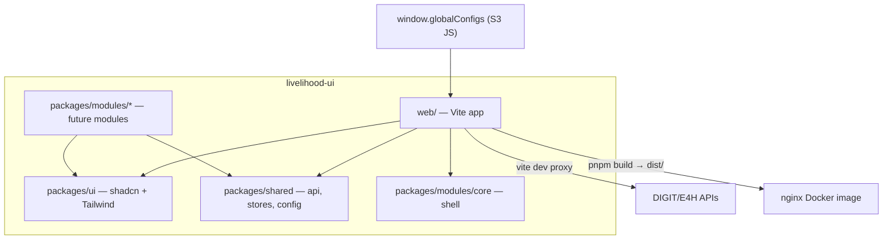

# Livelihood UI Monorepo Scaffold

## Goal

Create `[livelihood-ui/](livelihood-ui/)` at the frontend root as a third UI product alongside `[micro-ui/](micro-ui/)` and `[installation-ui/](installation-ui/)`. It uses a **fully custom stack** (no `@egovernments/digit-`* or `@selco/digit-*` packages) while preserving operational patterns: API proxying, `window.globalConfigs`, modular monorepo layout, and Docker deployment.

**Your choices:** base path `/livelihood-ui`, initial scope = **core shell only** + module template docs, **Node.js 24** (not Node 14 used by `micro-ui/` and `installation-ui/`).

---

## Node.js 24 requirement

Livelihood UI is a greenfield stack and will standardize on **Node.js 24** everywhere — local dev, CI, and Docker. The legacy UIs (`micro-ui/`, `installation-ui/`) remain on Node 14 via `alpine-node-builder-14`; livelihood-ui does **not** inherit that constraint.


| Surface             | Pin                                                                          |
| ------------------- | ---------------------------------------------------------------------------- |
| Local dev           | `.nvmrc` → `24` (or `24.x` latest LTS patch)                                 |
| Root `package.json` | `"engines": { "node": ">=24.0.0" }`                                          |
| pnpm                | `packageManager` field with a current pnpm 10.x release (Node 24–compatible) |
| Docker build stage  | `FROM node:24-alpine`                                                        |
| README              | Prerequisites section calling out Node 24 + pnpm                             |


Optional: add a root `preinstall` script (`engines-check` or `only-allow pnpm`) to fail fast when Node < 24.

---

## Recommended architecture: single `web/` app

The existing `example/` + `web/` split exists because CRA + `microbundle-crl` required a watch-built package graph and a separate production shell. With **Vite + pnpm workspaces**, workspace packages are imported as TypeScript source and get HMR directly — one app serves both local dev and production builds.




---

## Top-level folder structure

```
frontend/livelihood-ui/
├── package.json                 # private root, engines.node >=24, packageManager pnpm
├── .nvmrc                       # 24
├── pnpm-workspace.yaml
├── pnpm-lock.yaml
├── Jenkinsfile                  # same pattern as installation-ui
├── README.md
├── web/                         # SINGLE Vite app (dev + prod)
│   ├── package.json
│   ├── index.html
│   ├── vite.config.ts           # base, proxy, env
│   ├── tsconfig.json
│   ├── public/
│   ├── src/
│   │   ├── main.tsx
│   │   ├── App.tsx
│   │   ├── router.tsx           # TanStack Router root
│   │   └── vite-env.d.ts
│   └── docker/
│       ├── Dockerfile
│       ├── devDockerfile        # optional lower-memory variant
│       └── nginx.conf
└── packages/
    ├── ui/                      # shadcn components + Tailwind theme
    │   ├── package.json         # @livelihood/ui
    │   ├── components.json
    │   ├── tailwind.config.ts
    │   └── src/components/ui/
    ├── shared/                  # cross-cutting infra
    │   ├── package.json         # @livelihood/shared
    │   └── src/
    │       ├── api/             # axios instance + interceptors
    │       ├── query/           # QueryClient + provider
    │       ├── stores/          # zustand (auth, tenant, ui)
    │       ├── config/          # globalConfigs TS wrapper
    └── modules/
        ├── MODULE_TEMPLATE.md   # documents qc-style layout for new modules
        └── core/
            ├── package.json     # @livelihood/module-core
            └── src/
                ├── index.ts     # exports routes + navItems
                ├── layout/      # AppShell, Sidebar, Header
                ├── auth/        # login flow, session bootstrap
                └── pages/       # login, home/dashboard placeholder
```

**Module internal layout** (documented in `MODULE_TEMPLATE.md`, matching `[installation-ui/.../qc/src/](installation-ui/web/micro-ui-internals/packages/modules/qc/src)`):

```
packages/modules/<name>/src/
├── index.ts              # public API: routes, navItems, services
├── pages/employee/       # route page components
├── components/
├── hooks/
├── services/             # API calls (use shared axios)
├── constants/            # routes, labels
└── types/
```

Redux from the DIGIT modules is **not** carried over; use **zustand** for module-local or shared client state, **react-query** for server state.

---

## Tech stack wiring


| Concern      | Package / approach                                  | Location                                                 |
| ------------ | --------------------------------------------------- | -------------------------------------------------------- |
| Build        | Vite 6 + `@vitejs/plugin-react`                     | `[web/vite.config.ts](livelihood-ui/web/vite.config.ts)` |
| Routing      | `@tanstack/react-router`                            | `web/src/router.tsx` + module route exports              |
| API          | `axios` + `@tanstack/react-query` v5                | `packages/shared/src/api/`                               |
| Global state | `zustand`                                           | `packages/shared/src/stores/`                            |
| Forms        | `react-hook-form` + `zod` + shadcn `Form`           | modules + `packages/ui`                                  |
| Tables       | `@tanstack/react-table` + shadcn `Table`            | `packages/ui` data-table pattern                         |
| Styling      | Tailwind CSS v4 + shadcn                            | `packages/ui`                                            |
| Path aliases | `@/` in app, `@livelihood/ui`, `@livelihood/shared` | tsconfig paths + vite resolve                            |
| Runtime      | **Node.js 24**                                      | `.nvmrc`, `engines`, Docker `node:24-alpine`             |


**React version:** 19 (aligns with current TanStack + shadcn ecosystem).

---

## Retained operational patterns

### 1. DIGIT API proxy (localhost dev)

Port the proxy path list from `[installation-ui/web/micro-ui-internals/example/src/setupProxy.js](installation-ui/web/micro-ui-internals/example/src/setupProxy.js)` into Vite `server.proxy`:

```ts
// web/vite.config.ts (conceptual)
server: {
  proxy: Object.fromEntries(
    API_PATHS.map((path) => [path, {
      target: env.VITE_PROXY_API,
      changeOrigin: true,
      secure: false,
    }])
  ),
}
```

Optional `.env` overrides for local dev:

```
VITE_PROXY_API=https://e4h-dev.selcofoundation.org
VITE_STATE_LEVEL_TENANT_ID=in
VITE_CONTEXT_PATH=livelihood-ui
```

### 2. Global config loading

Mirror the existing `window.globalConfigs.getConfig("KEY")` contract from other DIGIT UIs:

- **Prod:** inject `globalConfigs.js` at deploy time (CDN / nginx)
- **Dev:** TypeScript helpers in `packages/shared/src/config/global-config.ts` use fallbacks when `window.globalConfigs` is absent

```ts
export function getConfig(key: string): string | undefined {
  return window.globalConfigs?.getConfig(key);
}
export const contextPath = () => getConfig("CONTEXT_PATH") ?? "livelihood-ui";
export const tenantId = () => getConfig("STATE_LEVEL_TENANT_ID") ?? import.meta.env.VITE_STATE_LEVEL_TENANT_ID;
```

### 3. Module composition (replaces Digit `ComponentRegistryService`)

Each module exports a small contract from `index.ts`:

```ts
export const moduleDefinition = {
  id: "core",
  routes: coreRouteTree,      // TanStack route objects
  navItems: coreNavItems,     // sidebar entries
};
```

The app router in `web/src/router.tsx` aggregates `moduleDefinition`s from enabled modules (initially just `core`). Future modules drop into `packages/modules/<name>/` and get registered in one array — no build-step publishing required.

---

## Core module (initial deliverable)

The `core` module replaces digit `DigitUI` shell responsibilities:

- **Auth:** login page, token storage, axios auth interceptor, protected route wrapper
- **Layout:** responsive sidebar + header using shadcn (`sidebar`, `button`, `avatar`, etc.)
- **Bootstrap:** read `contextPath` + `tenantId` from global config on app init
- **Placeholder home:** empty dashboard route at `/{contextPath}/employee`

No business-domain modules yet; `[packages/modules/MODULE_TEMPLATE.md](livelihood-ui/packages/modules/MODULE_TEMPLATE.md)` documents how to add one following the qc folder convention.

---

## Docker and CI

### Dockerfile (`[web/docker/Dockerfile](livelihood-ui/web/docker/Dockerfile)`)

Multi-stage, modernized from `[installation-ui/web/docker/Dockerfile](installation-ui/web/docker/Dockerfile)` but on **Node 24** (installation-ui uses `alpine-node-builder-14`):

1. **Build stage:** `FROM node:24-alpine`, install pnpm via corepack, `pnpm install --frozen-lockfile`, `pnpm --filter @livelihood/web build`
2. **Runtime stage:** `nginx:mainline-alpine`, copy `web/dist` → `/var/web/livelihood-ui`
3. Copy `[nginx.conf](livelihood-ui/web/docker/nginx.conf)` — same SPA `try_files` pattern as installation-ui but path `/var/web/livelihood-ui`

`devDockerfile` (if added) also uses `node:24-alpine`; no Node 14 builder image.

Vite build config: `base: '/livelihood-ui/'` so assets resolve correctly behind nginx context path.

### Jenkins / build pipeline

Add to `[build/build-config.yml](build/build-config.yml)`:

```yaml
- name: builds/Digit-Frontend/livelihood-ui
  build:
    - work-dir: livelihood-ui/
      dockerfile: livelihood-ui/web/docker/Dockerfile
      image-name: livelihood-ui
```

Add `[livelihood-ui/Jenkinsfile](livelihood-ui/Jenkinsfile)` identical to installation-ui's one-liner pointing at `build-config.yml`.

---

## Root scripts (`[livelihood-ui/package.json](livelihood-ui/package.json)`)

```json
{
  "scripts": {
    "dev": "pnpm --filter @livelihood/web dev",
    "build": "pnpm -r build",
    "build:web": "pnpm --filter @livelihood/web build",
    "lint": "pnpm -r lint",
    "typecheck": "pnpm -r typecheck"
  }
}
```

**Dev workflow:**

```bash
cd frontend/livelihood-ui
nvm use          # reads .nvmrc → Node 24
node -v          # should print v24.x.x
pnpm install
pnpm dev         # → http://localhost:5173/livelihood-ui/
```

---

## What we intentionally skip

- No `micro-ui-internals/`, `example/`, `microbundle-crl`, CRA, or webpack
- No `@egovernments/digit-ui-*` / Redux / `Digit.ComponentRegistryService`
- No pre-built module `dist/` outputs — Vite bundles workspace source directly
- No business modules in initial scaffold (per your choice)

---

## Implementation order

1. Scaffold pnpm workspace root (Node 24 pins: `.nvmrc`, `engines`, `packageManager`) + `packages/ui`, `packages/shared`, `packages/modules/core`
2. Initialize Vite app in `web/` with base path, aliases, proxy, env samples
3. Set up shadcn + Tailwind in `packages/ui`; wire into app
4. Implement shared layer: axios, react-query provider, zustand auth store, global config helpers
5. Build core module: layout, auth shell, route registration
6. Wire TanStack Router root aggregating core routes
7. Add `MODULE_TEMPLATE.md`, README
8. Add Docker + nginx + `build-config.yml` + Jenkinsfile entry

