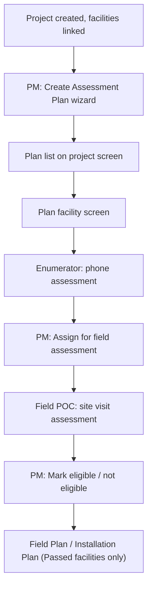
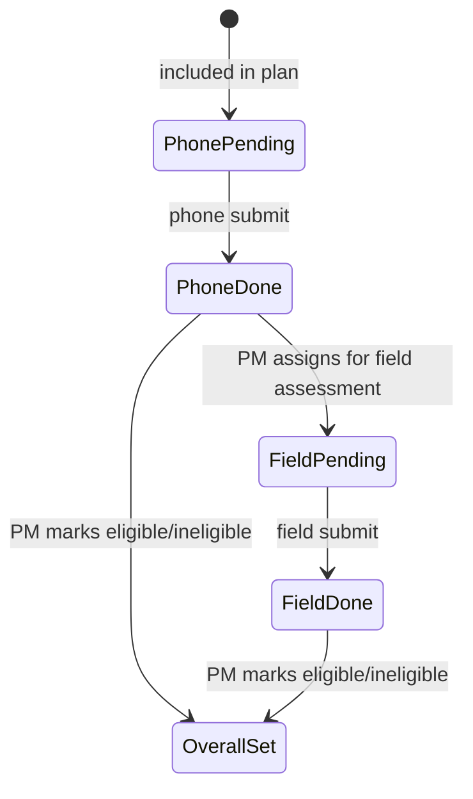

# Assessment module

The Assessment module screens candidate end-user sites before they enter an Installation Plan. A Project already has facilities attached to it (via the existing project → facility linking flow); Assessment groups a subset of those facilities into an **Assessment Plan**, runs them through a phone assessment and (optionally) a field site visit, and produces an eligibility decision per facility.

## Where it sits in the lifecycle

1. Facilities are already onboarded (Admin bulk-upload) and attached to a Project.
2. A Project Manager creates one or more **Assessment Plans** for that project — one project can have many plans, splitting its facilities across them.
3. Each facility in a plan goes through a **phone assessment** (Enumerator role) and, if assigned, a **field/site-visit assessment** (Field POC role).
4. The Project Manager reviews responses and marks each facility **Eligible** or **Ineligible** — this decision, not the raw assessment answers, is what gates whether the facility can proceed into an Installation Plan.

## Key terminology

| UI label | Backend field / action |
| --- | --- |
| Phone assessment status / result | `phone_status` / `phone_outcome` |
| Site visit status / result | `field_status` / `field_outcome` |
| Assessment decision | `overall_status` — **Eligible** = `PASSED`, **Ineligible** = `REVIEW` |
| Assign for field assessment | `field_status = PENDING` (set after phone assessment is submitted) |
| Mark eligible | `overall_status = PASSED` |
| Mark not eligible | `overall_status = REVIEW` + a required `ineligible_reason` |
| Enumerator | Plan's phone assessor — one per plan |
| Field POC | Plan's field assessor — may be assigned across multiple plans |

## Roles

- **Project Manager** — creates plans, includes/excludes facilities, assigns Enumerator/Field POC, makes the final eligibility decision (bulk or per-facility).
- **Enumerator** — submits the phone assessment form for assigned facilities.
- **Field POC** — submits the site-visit form for facilities that were assigned for field assessment.

## End-to-end flow

| Step | Owner | Action | Mechanism |
| --- | --- | --- | --- |
| 1–2 | Project Manager | Project creation + facility linking (existing, pre-assessment) | Existing project/facility ingestion flow |
| 3 | Project Manager | Create plan: info → include facilities via Excel → assign Enumerator + Field POC | Plan create, include-template apply, plan update |
| 4 | Project Manager | List assessment plans for a project | Plan search |
| 5 | Project Manager | Plan facility screen: filter, download export, bulk actions | Plan detail + facility search + export + bulk decision update |
| 6 | Enumerator | Submit phone assessment (mobile) | Phone submission create |
| 7 | Project Manager | Assign facility for field assessment (bulk or single) | Decision update — sets `field_status = PENDING` |
| 8 | Field POC | Submit site-visit assessment (mobile) | Field submission create |
| 9 | Project Manager | Mark eligible / not eligible (bulk or single); ineligible requires a reason | Decision update — sets `overall_status` |
| 10 | Project Manager | Proceed to Installation Plan setup — only `PASSED` facilities are eligible to be scoped in | Existing field-planner, filtered by assessment outcome |

## Status model

Each facility inside a plan tracks three independent statuses:

- `phone_status` / `phone_outcome` — set by the system on phone-form submit.
- `field_status` / `field_outcome` — `PENDING` set by the PM; `SUBMITTED`/outcome set by the system on field-form submit.
- `overall_status` — set only by the PM: `PASSED` (Eligible) or `REVIEW` (Ineligible, with a required reason).

A facility does not need a field assessment to become eligible — the PM can mark eligibility straight off a phone assessment if a site visit isn't required.

## Plan facility screen

The Project Manager's main workspace for a plan:

- **Metric cards**: phone assessments done, field assessments done, passed count, ineligible count.
- **Filters**: facility category, HF type, district, phone status, site visit status, assessment decision.
- **Table columns**: facility name, type, category, district, block, phone status/result, site visit status/result, assessment decision, last action.
- **Download**: a read-only Excel export (via the ingestion service) mirroring the grid plus full response summaries — not an editable round-trip.
- **Bulk actions** (row selection, all or individual): Assign for field assessment, Mark eligible, Mark not eligible — each gated on the facility already having a submitted phone assessment (and field assessment, where required).

## Facility detail screen

Selecting a single row opens a detail view with the facility summary and expandable phone/field assessment responses, offering the same three PM actions as the bulk toolbar, applied to that one facility.

## Handoff to Installation

Only facilities with `overall_status = PASSED` for a given assessment plan are eligible to be pulled into an Installation Plan's site-scoping step — the field-plan ingestion path filters on this value, so Assessment acts as a hard eligibility gate ahead of installation planning. See [LLDs → Installation](../installation/README.md).
