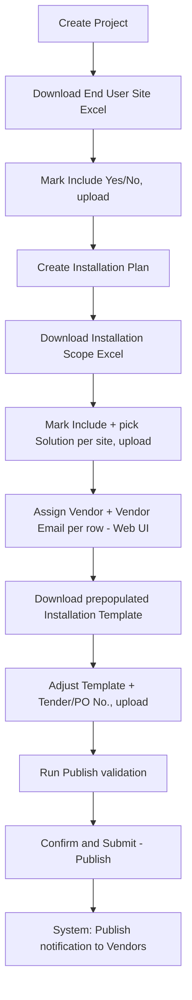
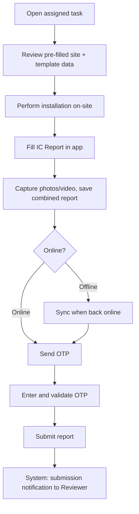
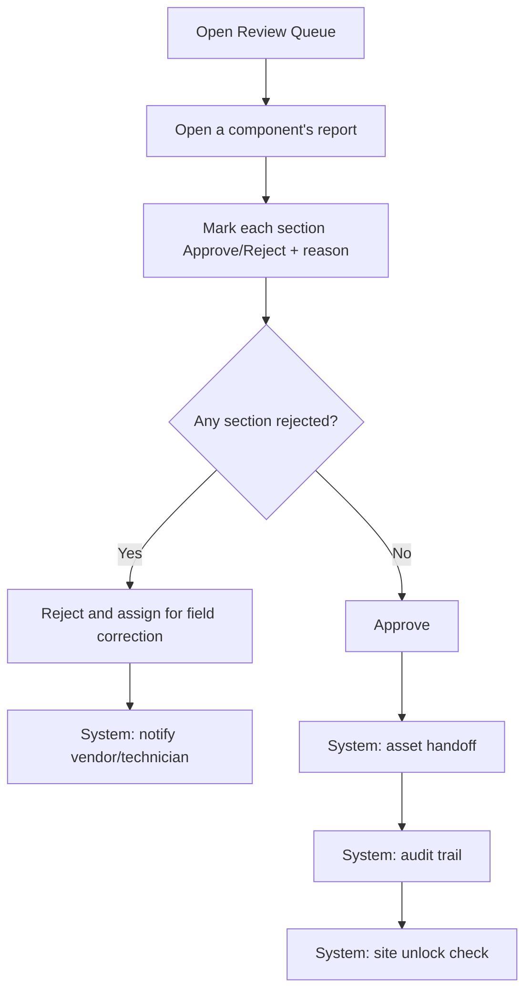

# End-to-End Flow

## Project Manager: Plan setup, scoping, and publish

1. **Create Project** — name, justification code, dates. The Project row is persisted immediately (an in-progress Project is simply one with no advanced status yet), so a Project Manager who leaves mid-wizard can resume rather than losing work.
2. **Download / mark / upload End User Site Excel** — scopes which of the project's already-ingested, already-eligible (post-Assessment) facilities are included.
3. **Create Installation Plan** — geography subset, sector, dates, and the assigned Installation Reviewer for the Plan (a Plan-level role assignment, not a per-site one).
4. **Download / mark / upload Installation Scope Excel (Sheet 1)** — per included site, assigns a Solution from the Repository and records inclusion.
5. **Assign Vendor** — a direct web-UI screen (not an Excel round-trip), where the Project Manager assigns a Vendor Organisation and vendor contact email independently for each site's Machine and Solar components.
6. **Download / adjust / upload Installation Template** — the expected bill-of-materials for each Solution at each site, including an optional tender number and a compulsory purchase-order number.
7. **Publish validation** — a checklist run before Publish is allowed: every included site has a Solution, every expanded row has a vendor and vendor email, every unique Solution in the Plan has a completed template.
8. **Publish** — an irreversible workflow transition (`DRAFT → PUBLISHED`). After Publish, no new sites can be added to the Plan; removing a site is still allowed unless installation work has already started there.
9. **System: notify vendors** — every distinct Vendor Organisation with at least one assigned component under the Plan receives an email once the Plan is published.

**Post-publish scope edits.** Once a Plan is published, editing `field_plan_facilities` is asymmetric: removing a site is allowed at any time unless installation work has already started there (in which case the edit is rejected); adding a new site to an already-published Plan is never allowed — a new Plan is required instead.

## Field Technician: on-site installation and IC Report submission

The Field Technician (the platform's designated Installation SPOC) works from a task list of assigned Machine/Solar components, pre-filled with the site's template data. After performing the physical installation, they fill in the IC Report — confirming or correcting the template's line items (quantity and make are the two fields most likely to need on-site correction, since actual installed quantity is often site-dependent), attach photo/video evidence, and capture the handover-letter sign-off. An OTP is sent to and validated against the site contact before the report can be submitted, as an on-site acknowledgment step. **Submission is a single action by a single actor** — the technician taps Submit and the report goes directly into the Reviewer's queue; there is no intermediate approval step on the submission side. Submission is additionally gated on a purchase/work-order number being present (from the template or a technician-entered override).

## Installation Reviewer: review queue and approval

The Installation Reviewer works a queue of submitted IC Reports, one per component (Machine or Solar), and marks each report **section** (specs, photos, video, handover letter) Approve or Reject with a reason. The report as a whole carries exactly one action: **Approve** while no section is rejected, or **Reject** the moment any section is — there is no third, partial outcome at the report level.

- **On Approve**: the approved component's equipment is handed off — Asset record(s) are created/activated in `asset-registry`, scoped to that specific component only. Once every sibling component at that site (both Machine and Solar) has reached a terminal approved state, the site's Plan-level lock is released.
- **On Reject**: the component returns to the Field Technician for correction and resubmission through the same single-action Submit flow.

Because Machine and Solar progress independently, one component at a site can be approved and handed off while the other is still being corrected.

## Scheduled notification jobs

Two jobs run independently of any workflow transition, both against `field_plans`/`bom` state rather than any state-machine action:

- **"Planned Installation breached"** — a weekly summary to program leadership for Plans that have passed their planned end date without reaching full completion.
- **"<40% complete near end date"** — a weekly summary flagging Plans that are under 40% complete with fewer than 10 days remaining before their planned end date.

Both notifications are deliberately idempotent per period (a last-notified timestamp on `field_plans`, not a one-shot flag), so they resend on a weekly cadence rather than firing once and going silent.
