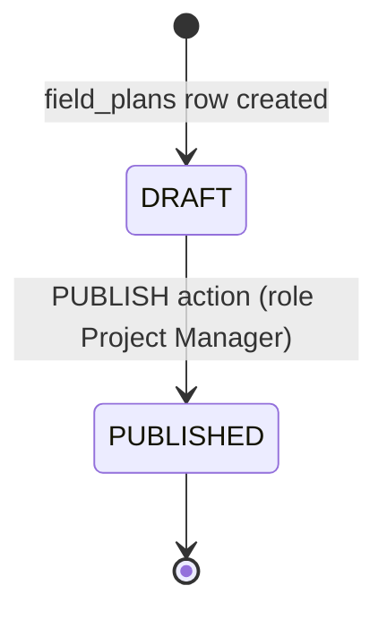
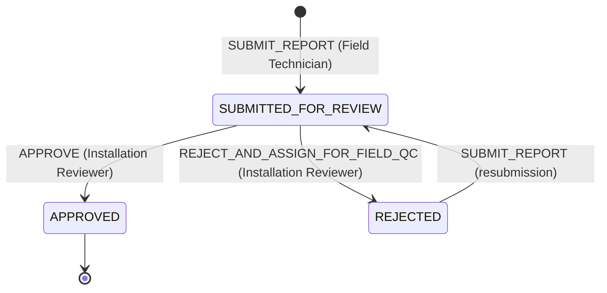

# Workflow & Roles

Installation uses the platform's generic workflow engine (`egov-workflow-v2`) for two distinct business services.

## `INSTALLATION_PLAN` — Plan publish

A deliberately minimal two-state machine. Every step before Publish (geography, scope, vendor assignment, template) is enforced by API-layer sequencing and the Publish-validation checklist, not by separate workflow states — none of those steps are handoffs between different actors, they're all still the same Project Manager working through one form.

| | Detail |
|---|---|
| Business ID | `field_plans.id` (the human-readable Plan ID) |
| Owning service | `field-planner` |
| SLA | None configured — the two breach-style notifications are separate scheduled jobs, not a workflow SLA, to avoid two competing breach-detection mechanisms. |

## `FACILITY_INSTALLATION` — IC Report review

This business service already existed in the platform for installation-report review before this module's design; it is reused rather than rebuilt. Its **review-side** actions (Approve, Reject, Flag) are the ones actively used in the shipped Reviewer screen today. Its **submission-side** action is this module's own addition — a single `SUBMIT_REPORT` action by the Field Technician role, collapsing whatever pre-review chain the platform's live registration may historically have carried into one action, to match the one-actor, one-action submission model described in [End-to-End Flow](flow.md).

| | Detail |
|---|---|
| Business ID | `facility_activities.id` — one process instance per component (Solar, Machine), so the two progress and are reviewed fully independently |
| Owning service | `field-planner-activity` |
| SLA | Unchanged from the platform's existing configuration |

## Role mapping

| Role | Platform role | Responsibility |
|---|---|---|
| Project Manager | `PROJECT_MANAGER` | Creates Projects and Installation Plans, assigns vendors and reviewers, configures templates, publishes the Plan. |
| Installation Reviewer | `INSTALLATION_REVIEWER` | Assigned per-Plan; reviews and approves/rejects submitted IC Reports, section by section. |
| Field Technician (Installation SPOC) | `FIELD_STAFF` / installation SPOC | Performs the installation, fills and submits the IC Report; assigned per-vendor-per-facility rather than at the Plan level. |
| Super Admin / Organisation POC / Vendor POC | platform-, organisation-, and vendor-org-scoped admin roles | Organisation, user, and role administration that the module depends on — see [Admin functionality](../admin-functionality/admin-functionality-lld.md). |

The Project Manager does not participate in the `FACILITY_INSTALLATION` business service at all — their role ends at Plan setup, vendor assignment, and template configuration; report submission and review are handled entirely by the Field Technician and Installation Reviewer roles respectively.

## Notification hooks

| Trigger | Notification | Recipient |
|---|---|---|
| Plan published | Email, once per distinct vendor | Every Vendor Organisation with at least one assigned component under the Plan |
| IC Report submitted for review | Email | The Installation Reviewer assigned to the Plan |
| IC Report approved | No new email — triggers asset handoff and (once every sibling component is approved) site unlock | — |
| Planned Installation breached (weekly) | Email | Program leadership |
| <40% complete near end date (weekly) | Email | Program POC |

See [Overview → Architecture → Notifications](../../overview/architecture.md#notifications) for how these are actually delivered (directly to the platform's shared email/SMS Kafka topics, not through a ticketing-domain service).
