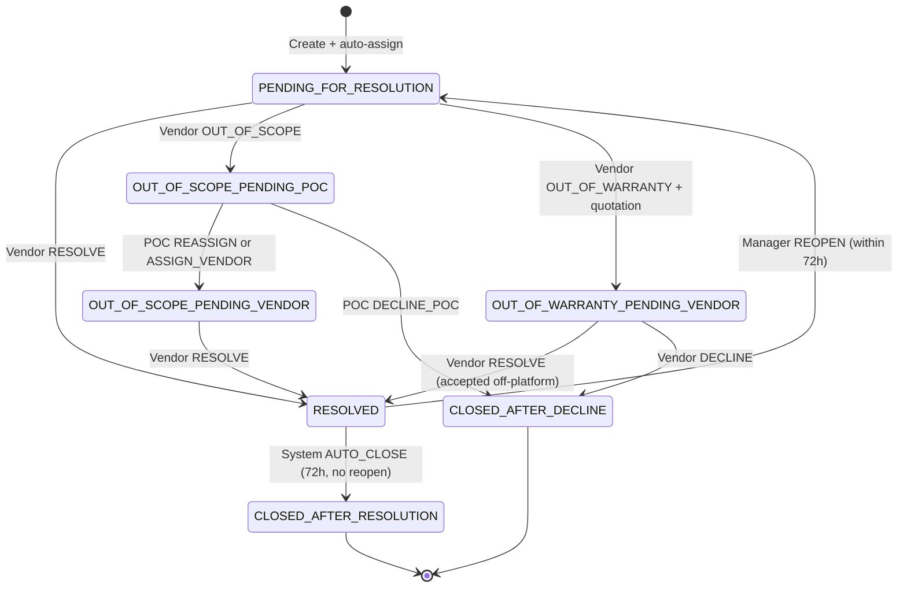

# Livelihood core (workflow & SLA)

Livelihood Core covers the platform's Phase 1 backbone: the support-ticket (incident) workflow that lets a facility manager raise an issue against a piece of equipment and get it routed to the right vendor, plus the entity-model decisions and data-pipeline configuration that everything else in the platform builds on.

## Entity model — the non-negotiable invariants

A few structural decisions constrain the whole platform and are treated as fixed:

- **There is no separate "end user" entity.** What a product spec calls the "end user" is, in platform terms, just the **facility manager** — a staff-style user (`COMPLAINANT` role) mapped 1:1 to a facility via jurisdiction. There is no `endUserId`, no project-to-user membership entity, and assets are never attached to users.
- **Facility is the program site, under a project.** Program membership flows Project → Project-Facility link → Facility. Oversight and scoping happen at the facility level, not by mapping users to a project.
- **Assets belong to facilities, not the other way around.** Each facility can have many assets; each asset independently belongs to one vendor. Support tickets always carry both a facility ID and an asset ID, and the platform validates that the asset actually belongs to the stated facility.
- **Ticket assignment is always derived from the asset**, never from a facility-default vendor and never from manual dispatcher assignment — different assets at the same facility can be serviced by different vendors, and the ticket goes to whichever vendor is mapped to the specific asset selected.

## Support-ticket lifecycle, in one paragraph

A facility manager (or a Program POC raising it on their behalf) selects an asset at their facility and creates a ticket. The vendor mapped to that asset is auto-assigned synchronously at creation — there is no manual dispatch step. The vendor can resolve the ticket, mark it out of scope (escalating to the state-scoped Program POC), or mark it out of warranty (attaching a mandatory quotation for an off-platform accept/reject decision). A resolved ticket has a 72-hour reopen window before it auto-closes. Every stage carries its own SLA, with automatic escalation on breach.

## Workflow & SLAs

The support-ticket workflow is registered in the platform's generic workflow engine as a single business service (`LivelihoodIncident`). It is owned by the incident-management service (`im-services`), with a state machine, per-state SLA timers, and role-gated actions.

### State machine

### Actors and roles

| Actor | Role | Key capabilities |
|---|---|---|
| Facility manager | `COMPLAINANT` | Raises a ticket for their facility's assets; reopens within 72 hours. |
| Vendor | `LIVELIHOOD_VENDOR` / `COMPLAINT_RESOLVER` | Resolves, marks out of scope, marks out of warranty (with quotation), declines after an out-of-warranty rejection. |
| Program POC | `LIVELIHOOD_POC` | State-scoped inbox; can raise a ticket on a manager's behalf; handles out-of-scope escalations by reassigning or declining. |
| System | scheduled job / system user | Auto-assigns on create, auto-closes after the reopen window, drives SLA-breach escalation. |

### Actions and SLA timers

| Action | Role | From → To | SLA on entry |
|---|---|---|---|
| Create + `AUTO_ASSIGN` | System (synchronous, in create) | start → `PENDING_FOR_RESOLUTION` | 7 days (vendor) |
| `RESOLVE` | Vendor | any vendor-working state → `RESOLVED` | 72 hours (reopen window) |
| `OUT_OF_SCOPE` | Vendor | `PENDING_FOR_RESOLUTION` → `OUT_OF_SCOPE_PENDING_POC` | 3 days (Program POC) |
| `OUT_OF_WARRANTY` | Vendor | `PENDING_FOR_RESOLUTION` → `OUT_OF_WARRANTY_PENDING_VENDOR` | 14 days, with reminders at day 7 and 2 days before expiry |
| `DECLINE` | Vendor | `OUT_OF_WARRANTY_PENDING_VENDOR` → `CLOSED_AFTER_DECLINE` | terminal |
| `REASSIGN` / `ASSIGN_VENDOR` | Program POC | `OUT_OF_SCOPE_PENDING_POC` → `OUT_OF_SCOPE_PENDING_VENDOR` | new 7-day vendor SLA |
| `DECLINE_POC` | Program POC | `OUT_OF_SCOPE_PENDING_POC` → `CLOSED_AFTER_DECLINE` | terminal |
| `REOPEN` | Facility manager | `RESOLVED` → `PENDING_FOR_RESOLUTION`, only within 72 hours | new 7-day vendor SLA |
| `AUTO_CLOSE` | System | `RESOLVED` → `CLOSED_AFTER_RESOLUTION`, after 72 hours with no reopen | terminal |

`ASSIGN_VENDOR` and `REASSIGN` transition to the same next state — the distinction is whether the Program POC is keeping the same vendor or switching to a different one mapped to an asset at that facility. All actions are submitted through a single ticket-update endpoint; there is no separate reopen or quotation-specific route.

### Auto-assignment and validation

On ticket creation, the incident-management service:

1. Validates the asset exists and belongs to the stated facility.
2. Confirms a vendor mapping exists on that asset.
3. For a self-serve facility manager, confirms their jurisdiction matches the facility's boundary.
4. For a Program-POC-raised ticket, confirms the facility falls within the POC's assigned state.
5. Resolves the assignee vendor from the asset, persists the ticket, and fires `AUTO_ASSIGN` in the same request — starting the 7-day vendor SLA immediately.

### SLA breach and auto-close

SLA breach detection runs through the workflow engine's own escalation mechanism (a periodic call against the business service), consumed by the incident-management service's notification pipeline to apply Livelihood-specific side effects — escalate, remind, or auto-close, depending on which state and threshold fired. This is a deliberate departure from the platform's original health-sector escalation consumer, which could blindly close a ticket on breach; Livelihood's escalation rules never do that.

| Status | Threshold | Action |
|---|---|---|
| `PENDING_FOR_RESOLUTION` | 7 days | Escalate to Program POC |
| `OUT_OF_SCOPE_PENDING_POC` | 3 days | Remind Program POC |
| `OUT_OF_WARRANTY_PENDING_VENDOR` | 7 days elapsed | Remind manager and vendor |
| `OUT_OF_WARRANTY_PENDING_VENDOR` | 12 days elapsed (2 days before expiry) | Remind manager and vendor |
| `OUT_OF_WARRANTY_PENDING_VENDOR` | 14 days | Remind vendor |
| `RESOLVED` | 72 hours | Auto-close |

### Notification matrix

| Event | Facility manager | Vendor | Program POC |
|---|---|---|---|
| Ticket created (auto-assigned) | SMS | SMS | Email |
| Vendor SLA breached | — | — | Email (escalation) |
| Marked out of scope | Optional | — | Email |
| Out-of-scope reassigned | SMS | SMS (new vendor only — the original vendor is not notified) | — |
| Quotation uploaded | SMS + link | — | Email |
| Out-of-warranty reminder (day 7, 2 days before expiry) | SMS | SMS | Optional |
| Resolved | SMS | — | — |
| Declined / out-of-warranty rejected | SMS | — | Optional |
| Closed after resolution | Optional | — | — |

See [Overview → Architecture → Notifications](../../overview/architecture.md#notifications) for the delivery mechanism behind this table.

## Platform changes vs. baseline

The platform Livelihood runs on started as a shared codebase used for a different program (public-health facility support). This section summarizes what changed structurally to fit Livelihood's program shape, and which services carry that change versus being reused with little or no modification.

### Support-ticket track (Phase 1)

| Topic | Baseline pattern | Livelihood |
|---|---|---|
| Complainant | Facility-level patterns | Facility manager, mapped 1:1 to a facility |
| Assignment | Facility/vendor mapping plus a manual dispatch step | Automatic vendor assignment on create, derived from the selected asset |
| Oversight role | Centralized dispatcher-style roles | Program POC, scoped to a state |
| Entry channels | Platform-only, plus health-specific integrations | Direct platform, plus a pilot IVR/WhatsApp channel handled by manual POC creation |
| Reopen / close | Baseline patterns | 72-hour reopen window, then automatic close |
| SLA | Baseline incident SLAs | 7-day vendor, 3-day Program POC (out of scope), 14-day out-of-warranty, 72-hour auto-close |
| Languages (v1) | As configured | English + Kannada |

### Installation track

| Topic | Baseline pattern | Livelihood |
|---|---|---|
| Project geography | Typically single-state | Multi-state projects under one justification code |
| Project driver | Manual setup | Justification code drives automatic facility-to-project mapping |
| Assets per site | Small count | Many assets per facility |
| Vendor importance | Secondary | Central — vendor assignment is per-asset-type, per-site |
| Field-plan unit | Facility | Facility × vendor |
| QC forms | Solar-focused | Solution/item-code driven (solar and non-solar equipment) |
| Letters | None | Acknowledgment (OTP) and Handover letters |
| AMC / RMS | Present | Not required for Livelihood Phase 1 (RMS is used only for its own telemetry-ticketing and CO₂-reporting purpose, not tied to the AMC track) |

### Service inventory (Phase 1)

**Required, with Livelihood-specific modification:** facility registry, `project`, `vendor-registry`, `asset-registry`, `ingestion-service`, `egov-hrms`, `im-services`, `egov-mdms-service-v2`, `egov-workflow-v2`, boundary service, ID generator, file storage, SMS notification.

**Required, shared platform backbone (used as-is):** user service, OTP service, localization, persister.

**Optional:** inbox module, video-processing pipeline, reporting email jobs.

**Excluded from Phase 1:** `rms-service` and its crons, `amc-scheduler-service`, `im-services-analytics` as originally built (Livelihood's own CO₂/telemetry use of these services, described in [LLDs → RMS](../rms/README.md), came later and is treated separately from this Phase 1 baseline).

### Key structural decisions this implies

- **Asset-level, not facility-level, vendor mapping.** Each asset independently maps to one vendor; a facility with several assets can have several different vendors. Ticket routing is always derived from the selected asset, never a facility default.
- **No new authentication stack.** Login, OTP, and tenancy are inherited unchanged from the shared platform backbone.
- **AMC and RMS crons never close tickets.** Automation for Livelihood tickets is deliberately confined to the workflow engine plus the incident-management service's own escalation consumer — a boundary kept intentionally narrow so unrelated automation can't silently close a ticket.

## Search, indexing & persistence

Support tickets (and most other domain entities in the platform) follow the same general write path: an API call publishes an event to Kafka, and two independent consumers pick it up — one durably persists it to PostgreSQL, the other indexes it into Elasticsearch for search and inbox screens. See [Overview → Architecture](../../overview/architecture.md) for the diagram shared across the whole platform, and [Data and integrations → Ingestion](../../data-and-integrations/ingestion.md) for the same worked example in more depth.

Incident-management publishes ticket create/update events onto `save-im-request` / `update-im-request`; the persister service writes them into the incident table, extended with Livelihood-specific columns:

| Column | Purpose |
|---|---|
| `asset_id` | Ties the ticket to the specific asset the manager selected — the field the auto-assignment and eligibility checks are built on. |
| `created_on_behalf` | Set when a Program POC raised the ticket for a manager rather than the manager raising it themselves. |
| `entry_channel` | `DIRECT`, `POC_MANUAL`, or `IVR_WHATSAPP` — which channel the ticket originated from. |

Asset and vendor data follow the same additive pattern: the asset table gains a `vendor_id` and an `item_code` column so vendor mapping and issue-type classification can be queried directly rather than only living inside a freeform JSON blob. The general principle followed throughout is **additive migration on existing tables**, not new parallel schemas — new tables are introduced only where no existing table's shape can reasonably be stretched to fit (for example, Installation's `installation_template` table, described in [LLDs → Installation → Data model](../installation/data-model.md)).

Every incident create/update also publishes an enriched view (vendor name, boundary, localized labels, SLA-remaining helpers) that the indexer writes into a ticket search index, and a separate index for full audit/transition history. This is what powers the vendor inbox, the facility manager's own tickets view, the Program POC's state-scoped inbox, and SLA dashboards.

Because persistence and indexing are two independent Kafka consumers off the same event, a schema or model change on the ticket entity (or asset, or any other indexed entity) needs to be applied in three places to actually take effect end to end: the Java model the API layer serializes, the persister mapping that binds it to a database column, and the indexer mapping that surfaces it as a searchable/filterable field. Adding a field to only one of the three is a common source of a field being "in the API" but not actually filterable or persisted.
