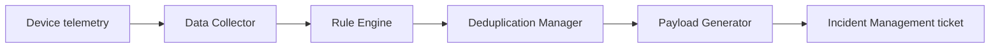

# Remote Monitoring (RMS)

The RMS module gives the platform two capabilities for sites with solar remote-monitoring hardware installed: automatically raising support tickets from anomalous telemetry, and computing CO₂-emissions-avoided figures for a dashboard.

## Automatic ticket creation from telemetry

`rms-service` polls telemetry for connected devices (solar panel, inverter, battery, grid) on a schedule, applies a set of anomaly-detection rules, de-duplicates against tickets already raised, and — when a genuine new issue is detected — creates a support ticket directly in the incident-management service.

**Active rules** (examples): panel solar consumption under 10% for 7 consecutive days; inverter no-signal for 2+ days or voltage above 250V; battery voltage at zero or an abnormal charge/discharge pattern; grid voltage outside a 200–250V band. Deduplication maintains a suppression window (24 hours by default) so a persistent issue doesn't spam duplicate tickets.

Because RMS device IDs and the platform's facility IDs are different identifier spaces, `rms-service` maintains its own mapping table between them, synced weekly and validated weekly against the facility registry so stale mappings for decommissioned facilities are marked inactive.

## District-level gating

Automatic ticket creation can be restricted to an allowlist of districts, configured in master data rather than hard-coded. RMS syncs the allowed district list, resolves it to a set of eligible facility IDs via a facility search, and checks every candidate alert against that set — by exact ID match only, never by facility name — before creating a ticket. An empty allowlist is treated as "district gating disabled for this scope," not as "nothing is eligible."

## Ticket pause

Operations staff (CRM role) can temporarily suspend automatic ticket creation for a single facility — for example, during planned maintenance — from a dedicated screen inside the incident-management app. The user selects a facility, sets a pause-until date/time (with an optional reason), and can resume early or extend the pause. When a pause expires, automatic creation resumes on its own — no manual resume is required — and there is deliberately **no backlog**: issues that would have raised a ticket during the pause window are not retroactively raised once the pause ends, only genuinely new situations after that point can.

## CO₂-emissions-avoided calculation

A monthly batch job (`im-services-analytics`, `carbon-emission-calculate` topic) computes, for every visibility-flagged facility, how many tonnes of CO₂ its solar generation avoided each calendar month across its full 20-year lifecycle — split into an "actual" figure for months up to the batch month, and a "projection" figure for months beyond it. See [CO₂ Calculation Flow](co2-calculation.md) for the full formula and worked examples.

## Pages in this section

- **[CO₂ Calculation](co2-calculation.md)** — the archetype-vs-RMS-metered calculation flow, timeline rules, and worked examples.
- **[District Gating & Ticket Pause](gating-and-pause.md)** — configuration contract and detailed flows for the two operational controls above.
