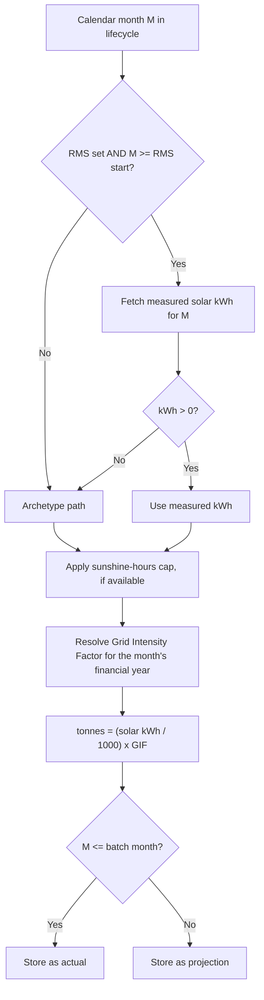

# CO₂ Calculation

## How a facility is classified

There is no separate "RMS flag" in master data — whether a facility is treated as "with RMS" or "without RMS" is inferred purely from whether it has an `rmsInstallationDate` set on its facility record.

| Status | Condition | Meaning |
|---|---|---|
| **Without RMS** | `rmsInstallationDate` is null | Every month of the facility's lifecycle uses an archetype estimate. |
| **With RMS** | `rmsInstallationDate` is set | From the RMS start month onward, measured solar generation is used when available; the archetype estimate is a fallback for any month with missing or zero meter data. |

## Timeline rules

- **Lifecycle start**: derived from `solarInstallationDate` — an install day before the 15th counts from that calendar month; on or after the 15th, it counts from the following month.
- **Lifecycle end**: lifecycle start + 20 years (a configurable constant).
- **RMS data start**: the month after `rmsInstallationDate`, if set — the first month measured data may be used.
- **Batch "as-of" month**: the monthly cron supplies a batch month/year (typically the last fully completed calendar month). Months at or before the batch month are stored as **actual**; months after it are stored as **projection**, using the same formula.

## Per-month decision



## Without-RMS flow

Every month in the 20-year lifecycle uses an archetype-based estimate:

```
growth = 1.05 ^ (calendar year of month M − solar-install year)
solarKwh = archetype_alpha × (archetype_CY1 / 12) × growth
```

If the facility's capacity (kWp) and its state's sunshine-hours reference are both available, a cap is applied: `maxSolarKwh = kWp × sunshine_hours_per_day × days_in_month`; the estimate is capped at this value.

## With-RMS flow

The lifecycle splits into three bands:

| Band | Months | Solar kWh source |
|---|---|---|
| Pre-RMS | Lifecycle start → month before RMS start | Archetype (same formula as without-RMS) |
| RMS actuals | RMS start → batch month | Measured, when > 0; archetype fallback otherwise |
| Future projection | Month after batch → lifecycle end | Archetype (no future meter data exists yet) |

## Grid Intensity Factor (GIF)

CO₂ tonnes uses the Grid Intensity Factor for the Indian financial year containing the month being calculated (April–December maps to that calendar year's FY; January–March maps to the previous year's FY). A published GIF value is used when available; otherwise a projected GIF (seeded from the last published value, adjusted -1.5%/year per program guidance) is used as a fallback.

```
CO2 avoided (tonnes) = (solar kWh / 1000) x GIF
```

## Worked example

Facility with solar install March 2023, no RMS, archetype A6 (α ≈ 0.793, CY₁ ≈ 1,378 kWh), batch month May 2026:

1. Lifecycle starts February 2026 (a late-month install day pushes it to the next month).
2. February 2026 solar kWh ≈ `0.793 × (1378.25 / 12) × 1.05^0 ≈ 91.1 kWh`.
3. Sunshine cap (2.3 kWp × 5.0 hrs/day × 28 days = 322 kWh) does not bind.
4. February 2026 falls in FY 2025–26, GIF 0.947.
5. Tonnes = `(91.1 / 1000) × 0.947 ≈ 0.0862` tonnes, stored as an actual month (it's before the May 2026 batch month).

All months for this facility use the archetype path throughout its lifecycle, since it has no RMS connection.
