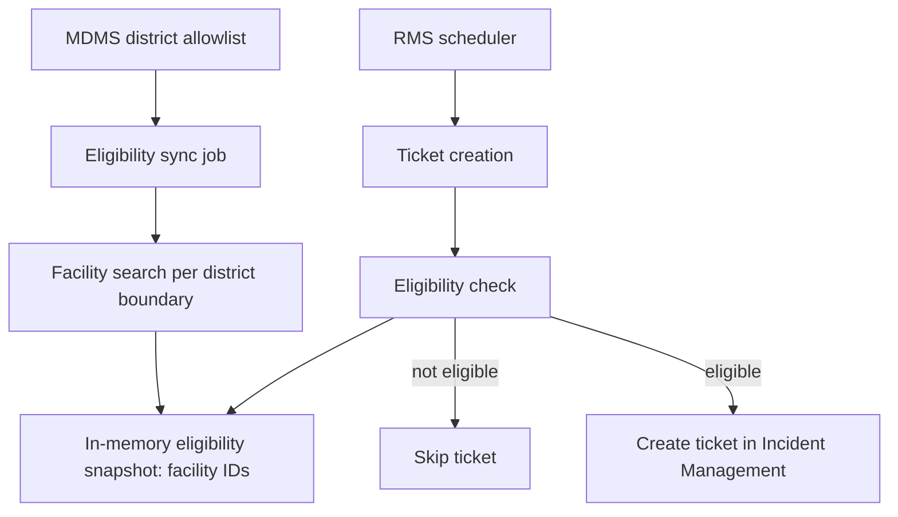
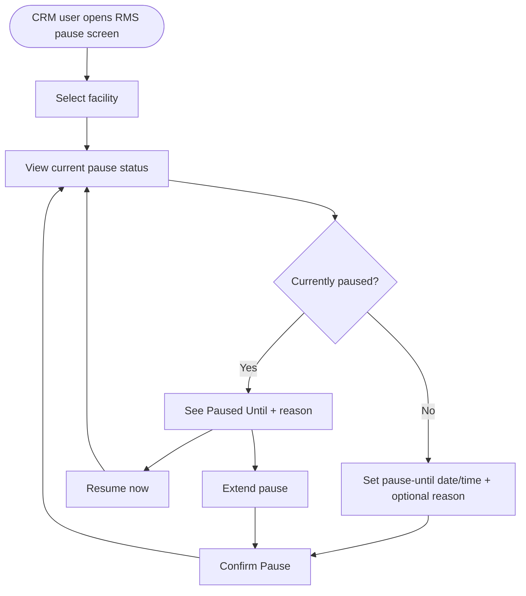

# District Gating & Ticket Pause

## District-level ticket-creation gating

**Purpose:** restrict automatic RMS ticket creation to an allowlist of districts, configured in master data rather than code.

**Flow:**

**Master data contract** (module `rms-service`, master `DistrictTicketCreationAllowlist`): each row carries a state code, a district boundary code, a district name, and an active flag. If the configured list is empty, the service treats district gating as disabled and allows all districts in scope — an empty list is not "nothing is eligible."

**Matching rule:** eligibility is decided by exact identifier equality, never by facility name. If the alert carries a health-facility-registry ID, that ID is checked first; the platform facility ID is only checked as a fallback when the registry ID is absent. A facility is excluded from the eligible set if its status is `UNINSTALLED` or if it's separately flagged `rms_inactive`.

## RMS auto-ticket pause

**Purpose:** let operations staff temporarily stop automatic ticket creation for one facility (e.g., planned maintenance), with automatic resumption and no retroactive backlog.

**Who sees it:** only the CRM role, from a dedicated screen inside the employee-facing Incident Management app — not a per-row button on the existing ticket inbox.

**Business rules:**

- A pause applies to one facility at a time and covers **all** RMS-driven automatic ticket types for that facility — not per issue category.
- The user sets an exact pause-until date and time; the same action ("Pause") is used to extend an already-active pause with a new end time.
- When the pause window ends, automatic ticket creation resumes on its own — no manual step is required.
- A user can resume early; automatic creation then applies from that moment onward.
- **No backlog:** issues RMS would have flagged during the pause are not created retroactively once the pause ends — only new situations after that point can raise a ticket.

**Flow:**

The same screen also offers a **Paused Facilities List** view (active pauses only, filterable by boundary, sortable by soonest-expiring) so operations staff can manage multiple facilities without switching context.
