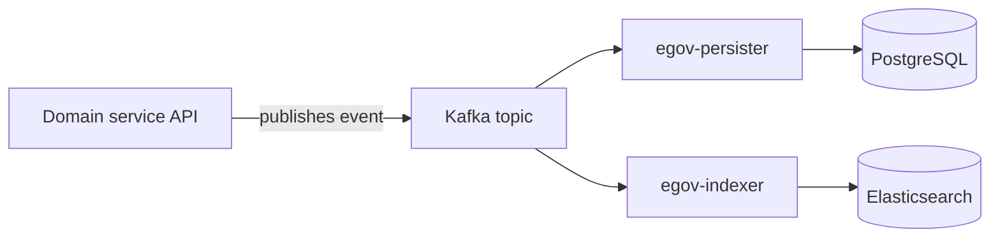

# Ingestion

Two distinct things fall under "ingestion" in this platform: bulk Excel-based data loading (`ingestion-service`), and the general persister/indexer pipeline every domain entity's writes flow through. This page covers both.

## Bulk Excel ingestion (`ingestion-service`)

The platform's only Python service (`uv`-managed) handles every Excel round-trip: facility onboarding, asset/vendor/staff bulk loads, boundary data, Installation's site-scoping and template Excel flows, and Assessment's read-only exports. See [Backend → Platform services → Ingestion Service](../backend/platform-services/ingestion-service.md). Most flows follow a download-template → mark/fill → upload → validate-then-create pattern (see [LLDs → Installation → Flow](../LLDs/installation/flow.md) for a concrete example), rather than a single one-shot upload.

## The persister/indexer write pipeline

Nearly every domain entity (tickets, facilities, assets, projects, installation plans) follows the same write path: an API call publishes an event to Kafka rather than writing to the database directly, and two independent consumers pick it up.

- **`egov-persister`** applies a configured SQL mapping to write the event durably into PostgreSQL — the system of record.
- **`egov-indexer`** applies a separate configured mapping to write an enriched, denormalized view into Elasticsearch, which is what search screens, inboxes, and dashboards actually query against.

Because these are two independent consumers of the same event, a schema or model change generally needs to be reflected in **three** places to take full effect: the API-layer model, the persister mapping, and the indexer mapping. Adding a field to only one of the three is a common source of a field being "in the API" but not actually persisted or filterable.

### Worked example: support tickets

`im-services` publishes ticket create/update events onto `save-im-request` / `update-im-request` (persister) and `save-im-request-indexer` / `update-im-request-indexer` (indexer) — two separate topic families for the same underlying event, per `Z_docs/Z-Livelihood/LIVELIHOOD_INDEXER.md` and `LIVELIHOOD_PERSISTER.md`. The persister writes into the incident table (`eg_incident_v2`), extended with Livelihood-specific columns: `asset_id` (ties the ticket to the asset the manager selected), `created_on_behalf` (set when a Program POC raised the ticket for a manager), and `entry_channel` (`DIRECT`, `POC_MANUAL`, or `IVR_WHATSAPP`). The indexer writes an enriched view (vendor name, boundary, localized labels, SLA-remaining helpers) into a ticket search index and a separate audit/transition-history index — this is what powers the vendor inbox, the facility manager's own-tickets view, the Program POC's state-scoped inbox, and SLA dashboards.

The general principle followed throughout the platform is **additive migration on existing tables**, not new parallel schemas — see [Schemas](schemas.md).

## Where to look

- `backend/e4h-services/ingestion-service/README.md`
- `Z_docs/Z-Livelihood/LIVELIHOOD_INDEXER.md`, `LIVELIHOOD_PERSISTER.md`
- `docs/ui-sequence-diagrams/` for concrete request/response sequences on a few flows (asset submit, facility search, login, forgot password).
