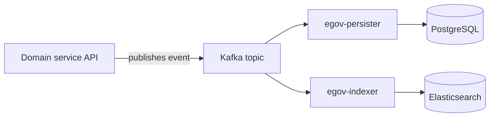

# Architecture

Selco Livelihood is built as a set of independently deployable backend services (Java/Spring, plus one Python service) fronted by role-specific web applications, all sharing a common platform backbone.

## Frontend applications

| App | Audience |
| --- | --- |
| `livelihood-ui` | Facility managers, Program POCs, vendors — support-ticket and day-to-day Livelihood workflows |
| `installation-ui` | Project Managers, Installation Reviewers, Field Technicians — installation planning, execution, and review |
| `micro-ui` | Shared component/module framework the other frontends are built from (admin, org, and workbench screens) |

## Backend domain services

| Service | Owns | Notes |
|---|---|---|
| Facility registry (`health-facility-registry`) | Facility (end-user site) master data | Every other service references facilities by ID only. |
| `asset-registry` | Assets, per-asset vendor mapping, warranty, per-asset O&M eligibility | The unit that support tickets and installation handoff both key off. |
| `vendor-registry` | Vendor and platform organisations, org users, jurisdiction | |
| `project` | Projects, project↔facility links, justification code | |
| `field-planner` | Installation Plans (`field_plans`), plan-facility scope and locking | See [LLDs → Installation](../LLDs/installation/README.md). |
| `field-planner-activity` | Installation execution — installable components, IC Reports/BOM, review workflow, templates | |
| `im-services` | Support tickets (incidents), auto-assignment, ticket workflow, SLAs | See [LLDs → Livelihood core](../LLDs/livelihood-core/README.md). |
| `im-services-analytics` | Batch CO₂-emissions-avoided computation | See [LLDs → RMS](../LLDs/rms/README.md). |
| `rms-service` | Remote-monitoring telemetry ingestion, anomaly rules, auto-ticket creation, district gating, ticket pause | |
| `egov-hrms` | Employees/staff records, role assignment | Every employee-style user (facility manager, POC, vendor staff, reviewer) is provisioned here. |
| `ingestion-service` | Bulk Excel-based data loading and export (facilities, assets, vendors, boundaries, installation templates, assessment exports) | The platform's only Python service (uv-managed); every Excel round-trip goes through it. |
| `amc-scheduler-service` | Scheduled/cron jobs, including the OTP client pattern reused by Installation | |
| `inbox` | Generic aggregation service for workflow + domain-service search results, powering inbox-style screens | Optional per module. |

## Shared platform backbone

These are generic, DIGIT-derived services used with little or no Livelihood-specific modification — they provide capabilities every domain service above depends on, rather than owning Livelihood-specific data themselves.

| Service | Provides |
|---|---|
| `egov-user` / `egov-otp` | Login, tokens, user CRUD; OTP generation/validation for site acknowledgment and manager login |
| `egov-localization` | English/Kannada message catalogs |
| `egov-mdms-service-v2` | Tenant-scoped master data (issue types, SLA/escalation rules, Solution Repository, district allowlists) |
| `egov-workflow-v2` | Generic, config-driven workflow state machine — see [Workflow and crons](../backend/workflows-and-crons.md) |
| `egov-idgen` | Human-readable ID generation (Project number, Plan ID, IC Report number, ticket ID) |
| `egov-filestore` | Evidence photos/videos, quotations, generated letters |
| `egov-notification-sms` | SMS transport |
| `boundary-service` | Geography master (state/district/block), consumed by facility, vendor, asset, and RMS services alike |
| `egov-persister` / `egov-indexer` | Kafka → PostgreSQL asynchronous writes, and Elasticsearch indexing for search/inbox screens |
| `zuul` | API gateway fronting the backend services |

## How to read this map

A useful mental model: the **shared backbone** is infrastructure the whole platform gets for free; the **domain services** are where Livelihood's actual business logic and schema live, generally as an existing generic table plus Livelihood-specific columns rather than a wholesale rewrite; and the **frontend apps** are role-specific views onto that same backend, not separate systems with their own logic.

## The write path: API → Kafka → persist + index

Nearly every domain entity in the platform (tickets, facilities, assets, projects, installation plans) follows the same shape:

A create or update call to a domain service's API validates the request, enriches it (resolving related IDs, applying defaults, running workflow transitions where relevant), and publishes the result onto a Kafka topic — it does not write to the database directly. Two independent consumers read that same topic: `egov-persister` applies a configured SQL mapping to write the event durably into PostgreSQL (the system of record), and `egov-indexer` applies a separate configured mapping to write an enriched, denormalized view into Elasticsearch, which is what search screens, inboxes, and dashboards actually query against. Because these are two independent consumers of the same event, a schema or model change generally needs to be reflected in three places to take full effect: the API-layer model, the persister mapping, and the indexer mapping. See [Data and integrations → Ingestion](../data-and-integrations/ingestion.md) for a worked example on the support-ticket entity.

## Cross-service reads and the batch path

Beyond the write path above, services also call each other synchronously for reads that need to happen inline with a request — for example, ticket creation calling the asset registry to resolve an asset's vendor mapping, or RMS's district-gating sync calling the facility registry's search endpoint. A smaller number of flows are driven by a cron trigger instead of a user action: the monthly CO₂-emissions-avoided calculation, RMS's anomaly-detection rule engine (every 15 minutes by default), and Installation's weekly notification summaries and the support-ticket SLA-escalation check. See [Workflows and crons](../backend/workflows-and-crons.md).

## Workflow engine

Nearly every stateful process in the platform — support tickets, Installation Plan publishing, IC Report review — is implemented as a **Business Service** registered in the platform's generic, config-driven workflow engine (`egov-workflow-v2`), rather than as hand-rolled status fields and if/else transition logic inside each service. See [Workflows and crons](../backend/workflows-and-crons.md) for the business services registered today.

## Notifications

Email and SMS notifications are published **directly** onto the platform's shared, generic Kafka topics — `egov.core.notification.email` and `egov.core.notification.sms` — by whichever service triggers the notification. There is no central "notification service" that every other service calls into: each service (`im-services`, `field-planner-activity`, `amc-scheduler-service`, and others) is its own publisher onto the same two shared topics, and two generic backbone services (`egov-notification-sms`, and its mail equivalent) consume those topics and hand off to the actual SMS/email gateway.

An earlier design draft for the Installation module described email notifications as being sent by calling into the incident-management service. That does not match how the code actually works — the incident-management service is coupled to the ticket/incident domain and does not expose a callable endpoint for arbitrary email sending. The corrected, accurate design — the one this documentation describes throughout — is direct-publish onto the shared topics, following the same pattern already proven for ticket notifications.
